

## 0.15.15

Install app build 165 over the existing app, then update the included firmware to 0.15.15. Settings, pairing, maps and ride records are retained; do not clear app data.

- Compass labels use N, NE, E, SE, S, SW, W and NW in every edition except Japanese and Taiwan Traditional Chinese, which retain their existing translated labels. Mainland Chinese and Hong Kong editions use the English initials.
- The first/upper strip in HOME two-strip mode skips TRIP during automatic and both directions of manual cycling. A retained one-strip TRIP selection displays sunrise/sunset in the upper dual strip; returning to one-strip mode restores that selection unless the user scrolls. The lower trip strip and one-strip/MAP trip options remain.
- Music, notification, call and navigation priorities, timing, buttons, navigation/background fixes and memory reservations are preserved.

Software validation only; no new phone/vehicle test. The previously accepted legacy stock-return power-interruption limitation remains. Gate and the resident bootloader are unchanged.

# NewDoe illustrated user guide

**App and device firmware 0.15.14 · 15 November 2026**  
[한국어](Guide.md) · [Downloads](https://github.com/SerialSniffyHeck3r/noodoe_cfw/releases/latest)

## 0.15.14 — Guidance notifications and offline map recovery

Install app build 164 over the existing app, then use **Device → Check current status → Update** to install the included 0.15.14 firmware. Both parts are needed for these fixes. Existing settings, pairing, maps and ride records are retained; do not clear app data or re-import working maps as a first step.

- Guidance no longer expires because the notification text has not changed for 30 seconds while stopped. The app checks the current ongoing notification; ending it or losing notification access stops external guidance. No background reconciliation timer runs when external guidance is inactive, apart from one pending event check.
- At an intersection, Maps may replace a distance such as `50 公尺` with a maneuver instruction. NewDoe keeps the supplied arrow, road and trip summary. Only an unavailable next-turn distance becomes `--`; it is not replaced by zero or the destination distance.
- Destination distance, duration and arrival are read independently. Localized metadata labels and parentheses/slashes are accepted. Rounded copies in expanded notifications no longer invalidate the standard summary. An omitted field retains its last received value only within the same ongoing guidance session; NewDoe does not calculate external values.
- Standard and promoted/ProgressStyle notifications use the supplied title, expanded title, road and summary fields. Generic Android progress numbers and notification timestamps are not treated as navigation distance or ETA.
- If Google Maps guidance still does not appear on Android 16 or later, open **Navigate → Google Maps notification settings**. Try turning off **Live Updates** or **Show live info**, while leaving navigation notifications enabled. The labels vary by phone. This is a compatibility workaround reported by a user, not a requirement to turn off all notifications or install Wear.
- Offline MAP rendering now reads the page from the correct part of its packed status. Leaving and returning to MAP no longer cancels raster work because the transfer-generation counter changed.

The app retains the 0.15.13-hotfix1 reconnect, background cleanup and restart protections. Software tests reproduce these conditions with synthetic notifications and production ARM drawing code. The original reports did not include raw notification payloads; actual Google Maps/One UI versions and physical vehicle rendering still need confirmation. The previously accepted legacy stock-return power-interruption limitation remains; Gate and the resident bootloader are unchanged.

## 0.15.13-hotfix1 — Parked app stability and power use

App build 163 installs over the existing app without clearing data. The bundled firmware remains the verified **0.15.13**. A headunit already running 0.15.13 does not need another firmware installation.

- Bluetooth events caused by the app's own connection attempts and duplicate presence callbacks no longer replenish the retry budget. After three failures, the app waits for a fresh peer event or for the user to open the app.
- Sleeping parked standby stops location-check timers and media subscriptions. Ignition or using the headunit display resumes them. Leaving the phone screen also stops its UI updates.
- Disconnect and shutdown release all independent location, media and socket resources. Bluetooth-reader and media-provider exceptions are handled at their callback boundaries.
- Three unexpected connection-service recreations within ten minutes temporarily block automatic restarts for ten minutes. No restart alarm is scheduled. Opening the app allows an immediate retry. Pairing and user data are retained.
- Diagnostic ZIPs also include the latest exception classes/call locations and Android process-exit reason and memory counters. New records omit exception messages, contacts, coordinates, notification content and keys.

This does not identify the exact cause of the reported Galaxy S26 Ultra crash. Reproducible software paths are fixed; physical One UI 9 parking and battery validation is still required.

## 0.15.13 — Multilingual Google Maps and Bluetooth power saving

Use app build 162 with included firmware 0.15.13. Install over the existing app without clearing its data.

- Reads the next-turn distance and road name, plus destination distance, remaining duration and arrival time from Google Maps notifications. Taiwanese `公里 → 公尺` transitions retain active guidance. Road text is checked in the title, body and expanded notification.
- During Google Maps guidance, MAP/full TBT alternate **distance / remaining duration** and **distance / arrival time** every ten seconds. Only duration separators blink; arrival time stays steady. Enable notification access and start actual guidance in Google Maps.
- Unit words, local digits and AM/PM forms are handled across languages. Missing or ambiguous notification values stay as dashes. NewDoe does not invent an ETA or street name. Switching the app to English is unnecessary. This is not a claim that every live Google Maps version in every country was tested.
- After three unsuccessful connections, the phone pauses timed retries. A vehicle Bluetooth connection event, Bluetooth being enabled or reopening the app resumes attempts. Vehicle-absent waiting has no reconnect alarm or retry CPU wake lock. Connected parked status polling is reduced too.
- Hold **O** in the analog/digital clock or full TBT to cycle the bottom distance field through **ODO → TRIP 1 → TRIP 2 → OIL → BELT → service → ODO**. These are the existing stored distances. Fuel RESERVE takes priority and returns to ODO when cleared. The navigation ETA strip and the TRIP page reset button retain their behavior.
- The vehicle uses saved pairings for Classic Bluetooth connection attempts every three seconds in screen standby and five seconds in Bluetooth standby. Attempts never overlap an existing connection. While connected and parked, it requests the corresponding Sniff interval; only controller-confirmed Sniff is reported as confirmed. No BLE is used. Full power off stops proximity detection.

**Welcome-light test:** Open **Device → Device connection · app theme → Proximity welcome light · Bluetooth test**. Connect first, turn IGN OFF and wait for screen/Bluetooth standby. After the start acknowledgement, the app closes its connection once and reconnects to test a real connection edge. Walk away and return during the five-minute test. Dismissing the window keeps the test running. **Stop test** ends observation only; normal welcome-light operation continues. The dialog shows the interval, actual controller mode and light state.

Software tests cover connection transitions and multilingual notification parsing. Actual proximity response and battery consumption depend on radio conditions and phone background restrictions and still need physical validation. Gate, saved data, NOR layout and existing recovery paths are unchanged.

## 0.15.12 — MAP transitions, music loading and information priority

Use app build 161 with the matching included firmware. Install over the existing app without clearing its data.

- Leaving MAP invalidates its display and device map cache, then waits for the display swap before entering the next view. Map tiles and native route coordinates are sent only while MAP is open. TBT guidance continues elsewhere.
- In Music, TBT is followed by artwork and music text. In MAP, TBT and map transfers have priority. Accepted transfers and control/GPS messages retain their ownership and processing guarantees.
- Track handoffs show loading. Returning to the same track reuses cached artwork/text. If the playback session disappears, a short handoff grace period precedes Media Off.
- One-line AUTO prioritizes **notification → call → music → ETA**. With none active, ordinary information rotates every ten seconds. Long UP/DOWN temporarily browses; active priority information returns after twenty seconds.
- Two-line HOME keeps music while playing. Otherwise the lower row shows the selected TRIP and the upper row uses one-line AUTO priority, excluding TRIP from its choices in 0.15.15. Manual selections and the navigation-only ETA rotation in MAP/full TBT are retained.
- TRIP km/mi now align with the bottom of the distance digits.
- Hold O in Weather for three hourly columns per screen. UP/DOWN cycles **+1–3 / +4–6 / +7–9 / +10–12 hours**; O returns. This uses the already received forecast without an extra API query. Basic API data retains its actual three-hour source times.

- Fixed malformed language-status requests that repeatedly produced “Device rejected the request” in Settings. Read-only query failures are separate from setting changes; uncertain writes are never automatically resent.
- The device screen compares the observed firmware hash with the selected installation package. It shows already installed for a match, Update for a difference, and a status check when unknown. Unfinished installation/recovery notices take precedence.
- The top-right app area is a connection indicator, with no start/stop button. The notification area uses a static NewDoe icon instead of the animated upload arrow.
- The notification-app chooser now has **Select all / Deselect all**. Individual choices remain available. **Save** applies the draft; **Cancel** keeps the previous selection. Apps installed later must be selected separately.
- From 0.15.15, compass directions retain their translations only in Japanese and Taiwan Traditional Chinese; all other editions use N/E/S/W and diagonal initials. Taiwanese TRIP A/B labels use **行程 A/B**.

Bluetooth reconnection and proximity detection changes are excluded from this release. The repeated connection attempts reported away from the vehicle are not claimed fixed. Gate, NOR file layout, saved user data and installation/recovery paths are unchanged.

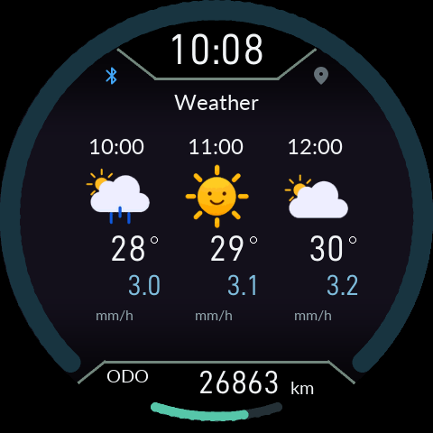

Instrument images are software renders of the actual ARM/LVGL/EVE code. Physical LCD/radio/power validation remains separate.

## 0.15.11 — Information strips, phone weather and map

Use app build 160 with instrument firmware 0.15.11. Install over the existing app; clearing app data is not required.

- MAP follows the HOME manual/AUTO setting and selected information. During guidance, MAP/full TBT keep alternating destination distance + remaining duration / destination distance + arrival time every ten seconds.
- The new **TRIP** item follows the TRIP page selection: **A / B / F (since refuel) / T (today)**. Distance and moving time use the existing numeric font. Time is hours:minutes; missing or out-of-range values show dashes.
- A connected call takes priority in the one-line strip, with a green background and `00:00'00"`. Only separators blink. In **manual**, hold UP/DOWN to select another item and keep it. In **AUTO**, a temporary override returns to the call after twenty seconds. Normal information returns after the call; navigation ETA remains in MAP/full TBT.
- Two-line HOME keeps music information while playback is active. Song/metadata changes update without a page animation. Both manual and AUTO selections have a confirmation toast.
- Long instrument toasts scroll horizontally instead of ending in `...`, with time to read the final words. Frequent long messages are shorter.
- Tap the phone HOME weather row to open weather. It shares the approved smiling sun/Meteocons artwork and smooth forecast colors with the instrument: weather status above, precipitation below, now through +12 hours. Forecast cards show actual provider instants.
- The phone Navigate tab includes the map, current guidance and My location / Entire route / Map files controls. The existing full-screen map remains available. A map file and location permission are needed; leaving the tab does not stop active guidance.
- **Refresh weather now** works without a motorcycle connection. It requires an API key, real recent location and internet access; manual requests have a sixty-second cooldown. Opening a screen does not query the API. Automatic weather queries run once after a verified instrument connection, then only on the instrument Weather page after one hour or thirty kilometres. There are no automatic queries while disconnected.
- An instrument without weather shows a slashed cloud and larger waiting message. Weather stays in RAM, with no forecast writes to NOR.

| Call priority | Two-line TRIP | Waiting for weather |
|---|---|---|
| 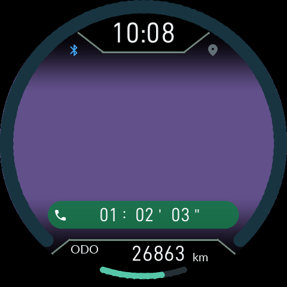 | 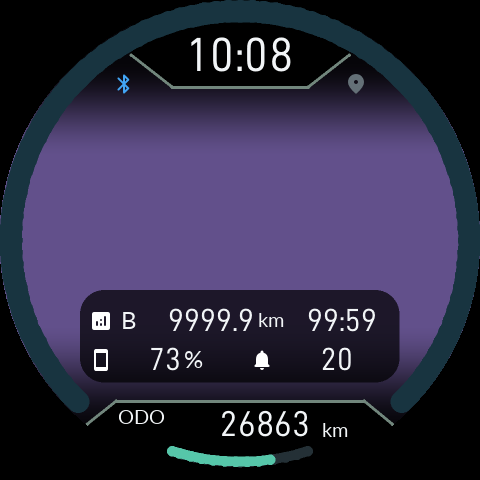 | 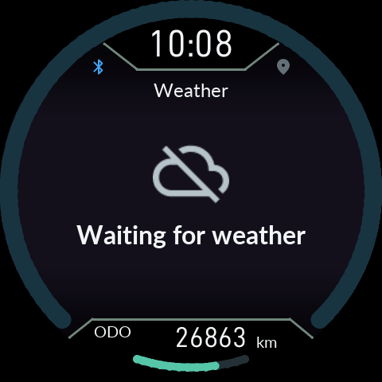 |

These instrument examples are software renders of actual ARM/LVGL/EVE code, not physical LCD/radio qualification. Gate, NOR file layout and recovery are unchanged. The legacy stock-return power-interruption limitation remains.

## 0.15.10 hotfix1 — App buttons and weather on connection

Install app build 159 over the existing app. Embedded firmware and resources remain exactly 0.15.10; no dashboard firmware update is required. This fixes weather/map/photo controls ignoring taps during automatic connection or becoming disabled when returning to the app.

With weather enabled, a verified NewDoe connection triggers one query as soon as a recent location and API key are available, then sends the result to instrument RAM. Later automatic queries require the instrument Weather view and one hour or 30 km since the last query. Without a connection, automatic weather queries stop; explicit manual refresh remains available. Missing location waits rather than querying an invented position.

## 0.15.10 — Connection, display and controls

Update the app and instrument together. Install the APK over the existing app to retain its data. Selecting the instrument and granting permissions enables automatic connection; there is no separate riding-link play/pause switch. Settings, photos and updates can start while connected. After confirmation the app serializes the connection handoff; an unfinished write or unconfirmed installation is not bypassed.

- **HOME:** short UP/DOWN selects one line → two lines → speed → selected clock → TBT → weather. On ordinary views with an information strip, **hold O** to switch manual/AUTO and **hold UP/DOWN** to change information. AUTO resumes after a 20-second override. Selections save at key OFF. Weather's hold-O forecast controls are unchanged.
- **Map:** the HOME map view is removed. Dedicated MAP now has the information strip. During guidance, MAP/full TBT alternate distance + duration / distance + arrival every 10 seconds. MAP without guidance follows the HOME manual/AUTO setting and information selection. Map buttons are unchanged.
- **TBT:** the second maneuver is removed. One rounded card places the arrow left, fixed-width distance right, and the external app's road name underneath. BRouter does not invent road names. Within 500 m, **only the mini-panel digits** blink yellow; the outline, glow and full-TBT text no longer blink. Full TBT does not repeat mini guidance.
- **Zoom:** guidance allows a view as wide as the 500 m scale, narrowing to at most 50 m while approaching a turn within 500 m. Existing speed-based AUTO and the saved user zoom remain. Page changes do not overwrite graphics still being displayed.
- **Weather:** With weather enabled, a verified NewDoe connection triggers one query as soon as a recent location and API key are available, then sends the result to instrument RAM. Later automatic queries require the instrument Weather view and one hour or 30 km since the last query. Without a connection, automatic weather queries stop; explicit manual refresh remains available. Missing location waits rather than querying an invented position. Loading, update age and smooth forecast bands remain.
- **Music/calls:** returning to the same track reuses its album image. Loading and Media Off have distinct screens. Language settings offer separate device/phone rendering preferences for music and notifications. During a call, the first phone page shows elapsed call time instead of missed-call count. Only duration separators blink; numerals stay fixed. Minute/second marks sit near the digit tops, while colons remain centered.
- **Fuel/ODO:** the bottom footer contains only ODO and reserve distance. Other trip records remain on their own pages. A stable rise from zero to at least one fuel bar for five seconds resets reserve and returns to ODO. Low-fuel warnings require fresh valid UART data after key ON. Warning text and icon stay in place; only the icon blinks.
- **Ignition/settings:** speed no longer forces page changes or blocks settings/phone pages. Make adjustments while stopped. The separate key-OFF photo, key-OFF badge and rider greeting are removed. Ignition-off use is indicated by the gray ring and does not add STOP time. Setup completion clears old editor text and displays a restart message.
- **Brightness:** short O + DOWN adjusts the automatic level when brightness is AUTO, or the percentage when it is manual.
- **Diagnostics:** normal firmware no longer provides a complete NOR-backup command. File reading and existing recovery remain. Full backups are available only in the separate diagnostic firmware, which ordinary updates do not require.
- **Phone map:** current position appears before guidance starts. Use the large map and current guidance together; routing-file management is a separate action.

These images are software renders of actual ARM/LVGL/EVE code, not physical LCD or radio validation. Older release sections and captures describe their dated versions; use this section and the current controls below.

| TBT | Weather | Call duration |
|---|---|---|
| 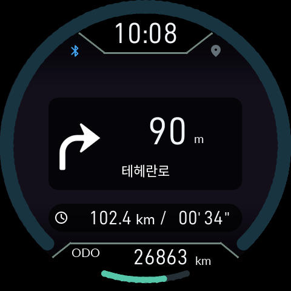 | 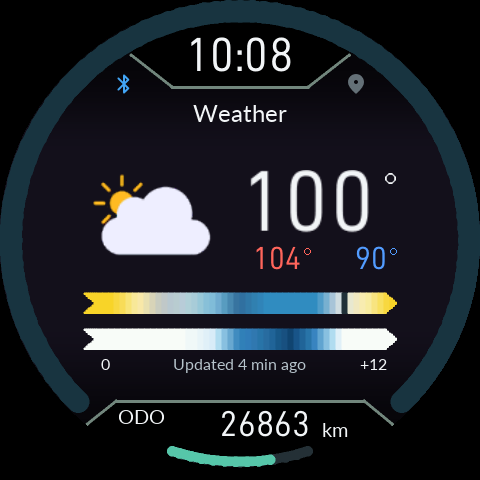 | 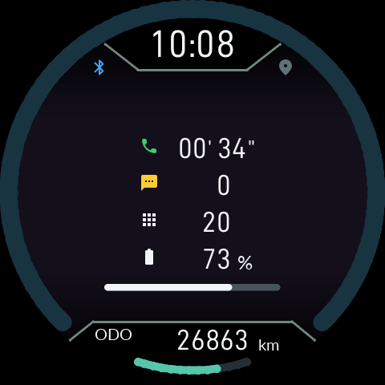 |

| Media off | Setup complete | Installation |
|---|---|---|
| 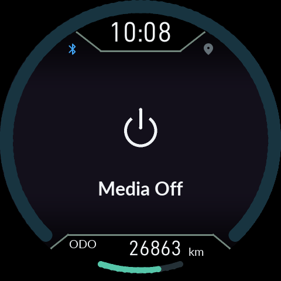 |  | 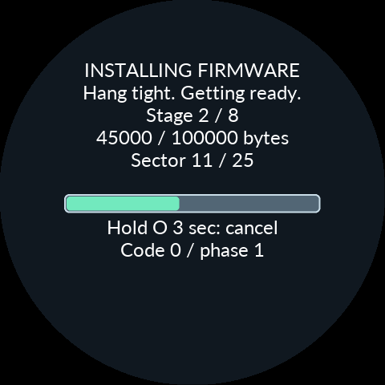 |

Gate, recovery, NOR layout and memory reservations are unchanged. The accepted legacy stock-return power-interruption limitation remains.

### Diagnostic mode and return to normal firmware

After a normal installation is confirmed, the app prepares Diagnostic in the existing inactive firmware slot. That initial preparation needs the app. Once ready, use **Settings → System → Diagnostic mode** on Noodoe without a phone, or enter Diagnostic from the app. No extra NOR file or Gate replacement is involved.

**Return to normal firmware** is selected by default. After verification, **short O** reinstalls the exact normal firmware saved before Diagnostic and restarts. Settings, trips, photos, supplemental fonts and pairing are preserved. The app button with the same name performs the same return. This is a restart: transient RAM display content is recreated, and the phone resends weather, media and guidance after reconnection.

- **NOR backup to phone:** select it with ignition OFF and press O. Keep NewDoe open on the paired phone to save the full 128MiB read-only snapshot. Both devices show progress. Hold O for three seconds or turn ignition ON to cancel; the partial file is retained and the existing restart procedure follows.
- **Send diagnostic log:** press O to save the diagnostic log on the connected phone. Without a phone connection, the screen waits for the app.
- Other items start Bluetooth, open pairing, inspect the controller, and test the ambient sensor reading, ID and addresses. Results and error codes distinguish request acceptance from completed tests.
- **Back to stock** is a separate original KYMCO recovery action. To resume ordinary NewDoe, use **Return to normal firmware**.

Switching uses the existing Gate validation and internal-flash copy; it is not instantaneous execution from NOR. A normal update temporarily uses the inactive slot for candidate/rollback duties. Diagnostic is staged again only after the new normal image is confirmed. An unverified return image cannot be installed. A power cut early in Diagnostic boot, before its durable return intent exists, can still leave the existing Gate recovery screen. Automatic normal return is not claimed for that interval.

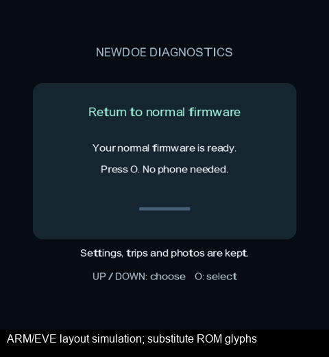
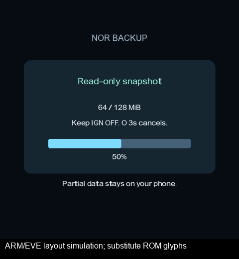

Diagnostic images are software layout previews of actual ARM/EVE commands. EVE ROM glyph outlines are substituted, with placement based on captured ROM metrics.

## 0.15.9 — Trip information in the lower strip and call indicator

Full TBT keeps the current maneuver and distance in its upper card, with the road name supplied by Google Maps/OsmAnd below the distance. Built-in BRouter route files do not contain road names, so that line remains empty. The former second-maneuver area stays empty. Trip information appears in the existing HOME information strip.

- During guidance, **full TBT / MAP** cycle only **remaining distance + remaining time** and **remaining distance + arrival time**, every 10 seconds. Holding O does not select unrelated information in these views. Other HOME views and guidance OFF preserve the existing information selection.
- Remaining time reads `102.4 km / 00'34"` (minutes/seconds), or `102.4 km / 3:52'` (hours/minutes). **Only the separators blink at half-second intervals; digits stay fixed.** Arrival time, such as `102.4 km / 15:42`, remains steady. The existing information-strip number font and size are retained.
- Built-in BRouter guidance uses the route engine's expected travel time and current matched route progress. Arrival time uses the phone's local clock and remains an estimate.
- Google Maps supplies only values actually present in the current navigation notification. Availability varies by notification version/language; missing values show `--.- km / --:--`, or `--.- mi` with miles selected. Installing Wear is not required. This change does not add OsmAnd time extraction.
- Recalculation, disconnection and stale guidance clear the displayed time values. During a call the top telephone icon blinks at **1 Hz: 0.5 seconds visible, 0.5 seconds hidden**. Normal Bluetooth indication returns when the call ends.

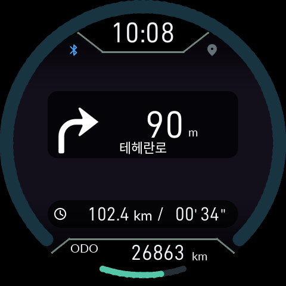

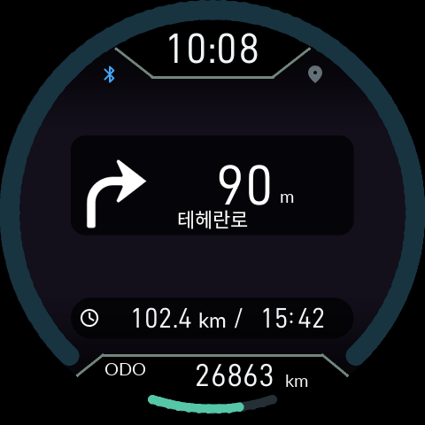

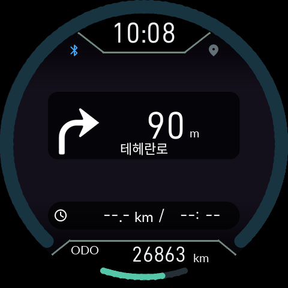

These are software renders of the actual ARM/LVGL/EVE code. Vehicle and live Google Maps notification validation remain separate. Gate, NOR file names/sizes and the settings storage format are unchanged.

## 0.15.8 — Navigation zoom limit, following turn and quick reply

This section's second-TBT-card description and figures record the 0.15.8 layout. Use the 0.15.10 section above for the current layout.

- During guidance the dashboard map zooms out no further than **50 m**. A wider saved setting displays 50 m and **NAV**; ending guidance restores the saved scale. The 20 m view remains available. Minor-road detail is reduced when needed, with main roads and the purple route prioritized. The large phone map retains its zoom controls.
- The **upper rounded card** shows the current maneuver. The **smaller lower card** shows the following maneuver; its distance is **from the current maneuver to the following one**. It disappears when no following maneuver exists. The generic navigation-mode road caption is removed; roundabout exit numbers remain.
- Recalculation uses a centered **circular-arrow icon**, hiding the previous arrow and dimming the old route. When the five menu icons hide after five seconds, mini TBT appears on **riding pages other than full TBT**, including TRIP, music, notifications and MAP. Existing priority overlays still take precedence.
- Map orientation cycles between **North up / Heading up**. The separate large compass is removed. HOME TBT shows **Navigation inactive** when guidance is off; the small compass in the information strip remains.
- On a reply-capable notification, choose **Share destination / ETA**. The phone composes the current destination, remaining distance, estimated duration and arrival time for the existing reply action. Stale location or unavailable guidance prevents sending. This action currently uses built-in guidance; it does not invent a destination or ETA from Google Maps/OsmAnd. Nothing is sent automatically.
- Google Maps/OsmAnd currently supply no reliable following-turn direction through this notification integration, so only the current maneuver is displayed. OsmAnd's additional distance alone is not treated as a following arrow.

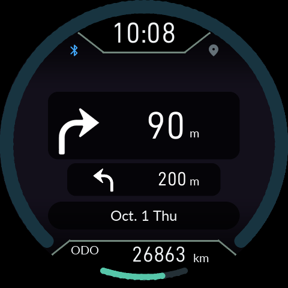

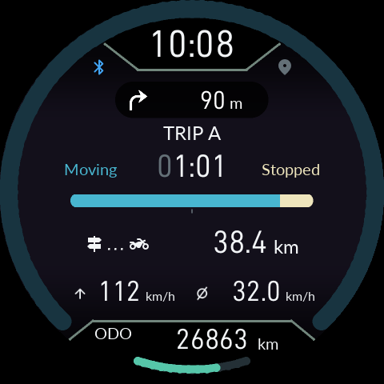

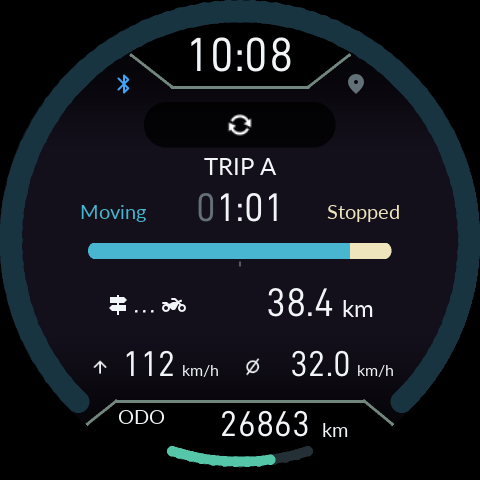

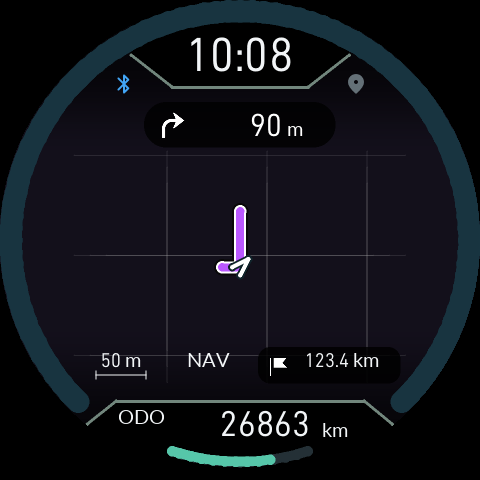

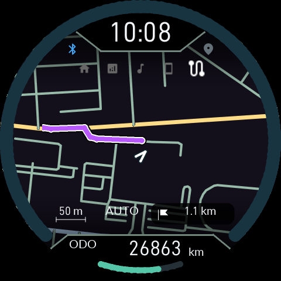

Gate, Bluetooth transport and the existing NOR file layout are unchanged. Software checks use map and route data near Incheon City Hall; elimination of the reported physical display tearing still needs vehicle confirmation.

## 0.15.7 — Phone guidance map, recalculation and weather layout

- Open **Navigate → Navigation map** for a large map, current position, full purple route, next turn and remaining distance. Starting built-in guidance opens it automatically. Panning pauses position following; **My location** resumes it. **Entire route** fits the route. Leaving this screen does not stop the riding connection or Noodoe guidance. Confirm **Stop guidance** to stop navigation only.
- The dashboard label is now **Built-in navigation active**. During off-route recalculation, the phone and dashboard TBT area show the recalculation state. The previous arrow is hidden and the old route is dimmed. Stale GPS or a disconnected phone must not present the last distance as current guidance.
- Dense regional maps may omit lower-priority detail. Route calculation retains the original route; only the nearby path sent to Noodoe is simplified. The phone retains the full route.
- HOME modes containing **only one/two information strips** show the bright photo. Central speed, map, TBT, clock and weather modes retain their strong shade.
- **Hold O** on HOME Weather and use **UP/DOWN** for **+1–3 / +4–6 / +7–9 / +10–12 hours**. Each page shows three hourly columns, without highs/lows or a page caption. Temperature and degree signs are separated from icons; precipitation stays blue. **O** returns to the overview. [Weather controls](User/38-Solar-Weather.en.md).

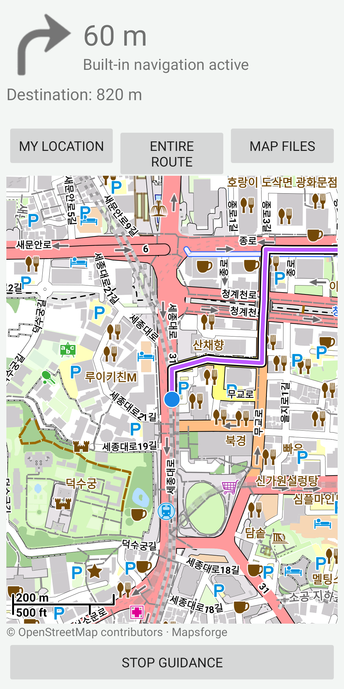

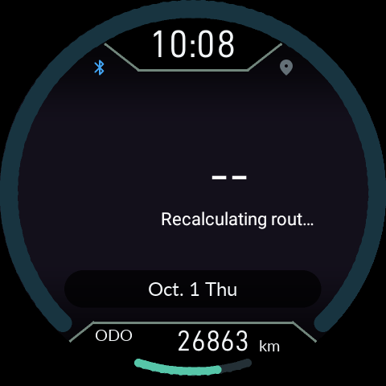

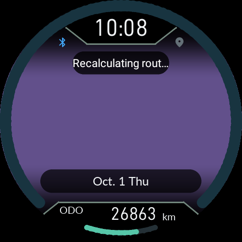

Dense maps and page transitions were checked in software. The reported graphics corruption still needs confirmation on the affected vehicle.

Display maps use **Mapsforge .map** files; routing uses **BRouter .rd5** files. Missing display maps do not automatically stop existing TBT guidance. This feature currently shares GPS and connectivity with the existing vehicle riding session.

## 0.15.6 — Arc hue and six-hour forecast

[Theme selection and hold-O controls](User/38-Solar-Weather.en.md). The existing color remains the default; solar hue is optional. HOME information numbers now share the same size.

## 0.15.5 — Display stability, initial setup, TBT and weather fixes (build 150)

Install the APK over the existing app, then use **Device → Check current status → Continue installation / check language**. The app includes its matching firmware. Review the language and planned update before starting. Reconcile any unfinished operation first.

- Both stock resource list spellings observed in real backups, `files` and `allFiles`, are accepted by the app and dashboard. Legacy discovery reads the root, FAT and resource prefix without walking photo subdirectories. Discovery remains read-only; full storage checks before writing, Gate checks and data preservation remain in place.
- **Unknown stock font profile** never becomes an assumed B profile. Unsupported IDs, damage, conflicts and failed reads stop writes. Numeric identity fields and failure reasons enter diagnostics. The affected rider’s actual header was absent from their old log, so this is not a claim that every cause on that vehicle is resolved.
- In **Device → Weather → Weather API**, select **Basic API 2.5** to use current weather and 3-hour forecasts without One Call. Selection alone does not fetch; tap **Check key / get weather**. Existing One Call selections are preserved.
- Basic does not provide today’s high/low: the phone shows `—`, and the dashboard shows `--`. Forecast bands approximate 3-hour intervals; precipitation is the interval average in mm/h. Use One Call for actual hourly forecasts. Changing the API clears old data and authentication results for a fresh check.

- Fixed EVE cache paths that could corrupt or omit digits after navigation/weather page changes. Two-digit turn distances align to the right of their fixed cells. Destination distance and sunrise/sunset use the numeric typeface. HOME AUTO updates its content without restarting a page transition.
- HOME photo shading now matches the speed view, including clocks and weather. The rectangular weather card is removed. Standby retains the last confirmed ODO, and the ride summary uses retained ODO for maintenance calculations. Unknown readings are not fabricated.
- Every initial setup step uses a black background without the previous HOME, ordinary toast or button hints. Time zones display as `UTC+09:00`. UP/DOWN changes the offset by 15 minutes; O confirms. Fractional offsets such as `UTC-03:30` and `UTC+05:45` are supported.
- Yellow TBT emphasis starts within **500 m**, using actual distance before display rounding. Optional native turn-distance rounding now rounds up in **10 m steps**: 91 m → 100 m, 101 m → 110 m. Disconnected or stale guidance is not highlighted.

Do not disclose your API key. Validation uses software tests and rendered screens; physical Bluetooth and authenticated provider queries remain unverified. Gate binaries, recovery logic and NOR file layout are unchanged. The existing stock-return power-interruption limitation remains.

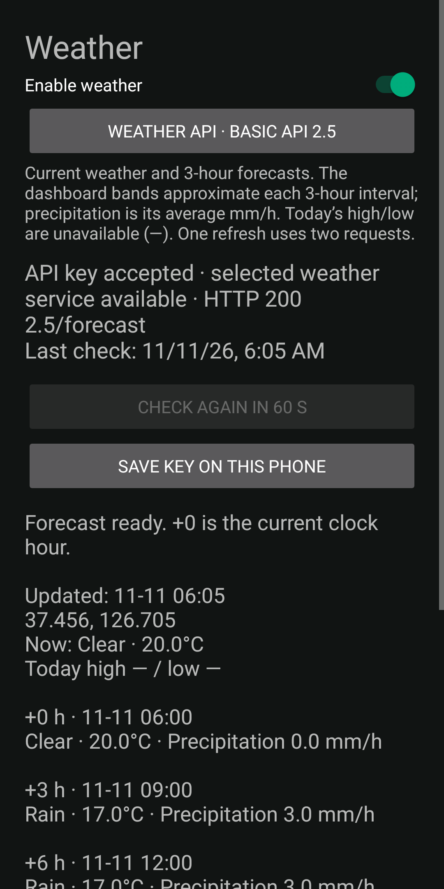

Rendered from the actual Android screen code: Basic API selection, endpoint-specific HTTP result and weather display. This uses simulated responses, not a real account authentication result.

<!-- 0.15.5 EVE examples -->

Software renders of EVE commands produced by the actual Product ARM/LVGL code. A bright white photo tests shading and the initial setup background mask. These are not photographs of a physical dashboard.

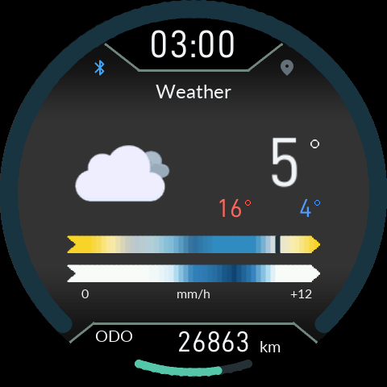

Weather: the speed view’s photo shading, without a rectangular card

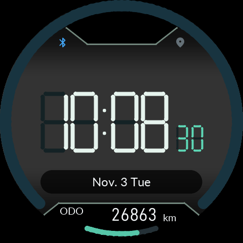

The digital clock uses the same photo shading

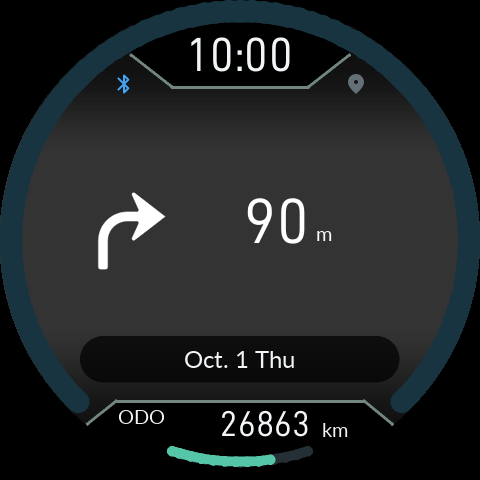

90 m: right-aligned within the fixed digit cells

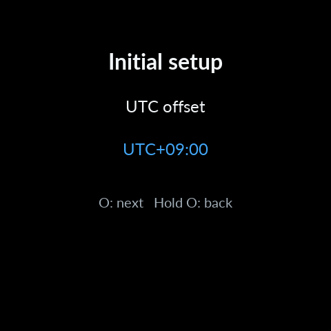

Initial setup: black background and UTC+09:00 display

## 0.15.4 Hotfix 5 — navigation connection, destination picker and weather checks (build 149)

If your dashboard already runs 0.15.4, **install only the APK over the existing app**. Firmware, Gate and NOR files are unchanged; earlier hotfixes are included.

- **Navigate → Select a point on the map** opens a large map immediately. Pan or zoom until the center marker is on the destination, then choose **Use this point → Start offline guidance**. My location and Map files are directly available. The picker remembers the previous area; a fresh riding GPS fix centers the map on your location on entry. Selection returns to the original navigation screen.
- Guidance now uses the same selected vehicle as the riding connection. It no longer rejects that connection because of a retired screen’s saved selection. Pairing alone is not an active riding connection: use ▶ first. Other vehicles, disconnected sessions and unsupported firmware remain blocked.
- **Device → Weather** shows whether the API key is missing, saved, accepted, rejected or unverified, with the last check time and actual HTTP code. The key itself is never displayed or included in diagnostics.
- **Check key / get weather** makes one explicit request at the current phone location, only while connected to the dashboard. Location permission and location services are required. Current conditions, temperature, today’s high/low and +0 to +12 hour forecasts are shown as text. A saved key is not claimed to be accepted. For HTTP 401/403 check the key and One Call access; for 429 check the provider quota. Network failure does not prove the key is wrong.
- With weather enabled, a verified NewDoe connection triggers one query as soon as a recent location and API key are available, then sends the result to instrument RAM. Later automatic queries require the instrument Weather view and one hour or 30 km since the last query. Without a connection, automatic weather queries stop; explicit manual refresh remains available. Missing location waits rather than querying an invented position. Explicit retries remain limited to once per 60 seconds. Forecasts stay in RAM.

Verification uses automated tests and Android software rendering. Physical phone/vehicle Bluetooth, perceived scrolling smoothness and a live OpenWeather request with the user’s key remain to be checked.

## 0.15.4 Hotfix 4 — weather transfer connection fix (build 148)

For **content / 0x9D / IllegalArgumentException / VisualTransfer**, install Hotfix 4 over the existing app and reconnect. Current weather packets contain 256 bytes, but the app still checked an obsolete size before transmission. Even the clear-display packet sent when weather is disabled or no API key is configured could trigger this exception. The 0x9D shown on screen is the preceding wire command; the Java exception came from weather packet size admission.

If the dashboard boots 0.15.4 normally, **update only the APK**. Registering an API key, clearing app data, re-pairing or returning to stock is unnecessary to fix this error. Weather fetching still requires its API key; fetch intervals and display behavior are unchanged. Any earlier unfinished installation must still have its outcome checked separately. All previous hotfixes are included.

## 0.15.4 Hotfix 3 — update preparation and connection status (build 147)

Install Hotfix 3 over the existing app, then tap **Check current device status**. After connecting, the app distinguishes recovery/font checks, original NOR resource reads and saved language reads. Each validated response refreshes the response timer. A failed read-only check is not reported as a failed firmware installation. Any earlier unfinished installation still needs its result checked.

If only a completed old installer selection remains, **Continue installation / check language** leads to preparation of the current package. An unfinished installation keeps its original files and records. Review the language and update after preparation, then start installation yourself. An older dashboard must be updated to the firmware included in the APK before riding sync can start.

If the dashboard already runs 0.15.4, update only the APK. Hotfixes 1 and 2 are included; firmware, Gate and NOR layout are unchanged. If checking still fails, save diagnostics without resetting the device. New diagnostics include the app build, second inspection stage and unanswered command number. Physical Bluetooth retesting has not been performed.

## 0.15.4 Hotfix 2 — legacy stock-font identification

If an older Product such as 0.12.1 reports “The stock font profile is unknown; no write was started”, install Hotfix 2 APK (build 146) over the existing app, then start with **Check current device status** again. When the legacy Product cannot supply its cached A/B identity, the app reads the actual stock resource using the existing read-only NOR command. It does not modify stock files or FAT, or require a language-pack installation first. Damaged resources, missing replies and active NOR backups still stop the operation.

Riding sync requires the firmware included in this app. If the dashboard still runs 0.12.1, complete the normal update offered after inspection. If it already runs 0.15.4, only the APK needs updating. Do not clear app data, re-pair or return to stock as the first response to this error. Existing Gate compatibility checks remain; follow the separate guidance if an actual Gate mismatch is detected.

## 0.15.4 Hotfix 1 — notification processing patch (build 145)

This app patch addresses the reported **CONTENT / 0x74 / IllegalArgumentException** after updating from 0.15.3 to 0.15.4 while the dashboard appears normal. An unreadable notification icon falls back to a default icon without terminating notification delivery or the riding connection. Other local failures now include a code location without private notification text.

**If your dashboard already boots 0.15.4 normally, install the Hotfix 1 APK over the existing app and reconnect.** App-data deletion, re-pairing, stock recovery and another firmware installation are unnecessary for this patch. Android build 145 contains the same firmware bytes and installer ZIPs as 0.15.4. If the dashboard still runs 0.15.3, use the normal update flow in the patched app to install 0.15.4. Unconfirmed installation results are not silently marked successful.

## 0.15.4 — Clock contrast and initial setup improvements

Update the app and dashboard firmware together. Choose **Use the package included in the app**, then review the detected device and installation language. Gate and existing NOR file layouts are unchanged; healthy devices use the normal Product update. Existing users are not reset or forced through setup again.

### After a fresh installation

1. When initial setup is scheduled, the dashboard opens it directly, without the ordinary ignition arc animation. At **WELCOME! / NEWDOE** and the blinking **Press Any Key To Continue** message, press UP, DOWN or O. The next screen says **Please stop your vehicle / Press O to continue**. Stop, then press O to begin. This screen does not advance automatically.
2. Follow **language → sunrise/sunset region → actual fuel bars → fuel recognition ON/OFF → units → timezone → speed-arc maximum**. UP/DOWN changes the value and O saves it. Select English or the language installed with your Product.
3. Enter the zero-to-five bars on the original gauge. With ignition ON, NewDoe compares stable UART samples. Matching bars recommend ON; a mismatch or unsupported value recommends OFF. You may change the recommendation with UP/DOWN; only O saves it. Wait or choose **Skip** if samples are absent or unsettled. Missing data alone does not establish incompatibility.
4. The dashboard restarts after durable completion. A failed save does not advance; review the message and retry. While connected, the phone automatically explains the current dashboard step and controls. This guide cannot be dismissed during setup; reconnecting restores the current step.
5. To repeat later, choose **Settings → System → Initial setup (restart)**. Unrelated preferences are preserved. **Reset system settings** is a separate confirmed action. Trips, maintenance records, photos and pairing are retained.

| Welcome | Fuel check |
|---|---|
|  |  |

The initial setup wizard has no movement lock or automatic timeout. Its first screen and current step remain present and its buttons remain usable while moving. Follow the instruction to stop before continuing. Ordinary settings retain their existing movement lock and timeout.

The settings category arc and light mode have been removed. Ordinary settings retain their side row indicator; setup has no position arcs.

### Using weather

Weather is OFF by default. In the phone app's **Weather** screen, save your own **key enabled for the selected OpenWeather API**, then enable weather. Provider registration, terms and charges may apply; NewDoe does not supply a shared key. Other features remain usable without a weather key.

#### Register OpenWeather and show the first forecast

1. [Create an OpenWeather account](https://home.openweathermap.org/users/sign_up), verify your email and find your personal key under [API keys](https://home.openweathermap.org/api_keys). A new key can take time to activate. [Official account/key help](https://openweathermap.org/faq)
2. Select **Weather API**. **Basic API 2.5** uses current weather and the 5-day/3-hour forecast for the next 12 hours, without a One Call subscription. Each refresh makes two requests. Today’s high/low are unavailable. **One Call 3.0** provides hourly and daily information and needs its own access entitlement. Check current account limits and pricing. A valid key can return 401 when it lacks access to the selected product. [Basic forecast API](https://openweathermap.org/forecast5) · [One Call documentation](https://openweathermap.org/api/one-call-3)
3. Open **Weather** in NewDoe, tap **Save key on this phone**, paste your key into the dialog, then save. The key is masked and the input clears after saving. Keep it out of Discord messages and screenshots. NewDoe does not supply a shared key.
4. Enable **Weather**. Allow location, enable the phone’s location service and connect to the internet. Weather uses the phone’s current GPS location, independently of the city selected for sunrise/sunset in initial setup.
5. Connect the phone to the dashboard to trigger the initial query under the conditions above. Open **HOME → UP/DOWN → Weather** to view the result. **Check key / get weather** also requires a dashboard connection. Opening the phone screen alone does not fetch.
6. When the phone reports **Forecast ready**, check its update time and the dashboard’s current temperature and two bars (plus today’s high/low with One Call). Temperature follows the dashboard’s unit setting; only a degree mark is shown. The clock and ODO retain their usual positions outside the weather view.

#### Refresh timing and errors

After the initial connection attempt, automatic fetching requires the dashboard Weather page to be visible and either **one hour since the last attempt or 30km from its location**. The 30km threshold is displacement, not accumulated odometer distance. Later periodic requests do not fetch on other pages; returning to Weather does not reset the limit. Transmitted failed requests also count for automatic fetching. The manual check button can retry separately, and saving a replacement key clears the previous key’s waiting state.

| Phone status | What to check |
|---|---|
| Key required / key storage error | Check and save the complete key. Do not share it. |
| HTTP 401/403 | Check the displayed API, key activation/spelling and account access. If only One Call is rejected, you can select Basic API 2.5 yourself. The app does not switch automatically. |
| Waiting for location | Enable location and permissions; wait for a fresh fix. |
| Rate limit | Check provider usage and limits. Repeated button presses do not bypass it. |
| Network / invalid data | Check connectivity. Use the explicit manual check to retry; automatic attempts follow page/time/distance conditions. |
| Stale forecast / no dashboard data | Check the update time and wait on the dashboard Weather page for the next allowed request. |

Forecasts remain in phone/dashboard RAM. A reboot or app-process restart requires fresh data; forecasts are not repeatedly written to dashboard NOR. Turning Weather off stops automatic requests; an explicit manual key check is still available while connected. Weather is optional; other features work without an account.

On the connected dashboard, use UP/DOWN in HOME to select **Weather**. The smiling sun or Meteocons condition icon sits beside the large current temperature. Daily high uses vivid red; low uses blue. Current temperature has three fixed-width slots without leading zeros.

The two chevron bars run from the **current clock hour through +12 hours**, left to right.

- **Upper — condition:** clear is yellow, partly cloudy pale yellow, cloudy muted white. Drizzle/rain/heavy rain progress through deeper blue tones. Fog has dark stripes on a light background; showers, thunderstorms and snow use blue. Probability never overrides this bar.
- **Lower — precipitation amount(mm/h):** white means no precipitation; larger rain/snow amounts become darker blue. This is not probability(%). Colors blend between hours; an unavailable amount is dark gray.
- Weather hides the ordinary HOME information strip. After the top menu hides, a localized Weather title appears when no TBT is present. The clock, speed arc and ODO remain.
- Missing or expired data is not shown as current; unavailable temperatures show `--`.

| Clear and two forecast bars | 100°F example |
|---|---|
| 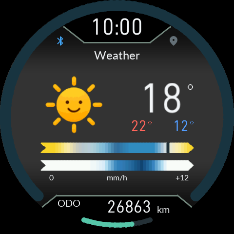 | 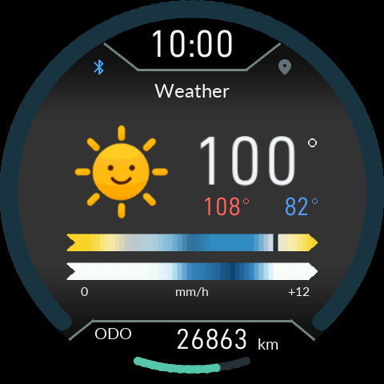 |

With weather enabled, a verified NewDoe connection triggers one query as soon as a recent location and API key are available, then sends the result to instrument RAM. Later automatic queries require the instrument Weather view and one hour or 30 km since the last query. Without a connection, automatic weather queries stop; explicit manual refresh remains available. Missing location waits rather than querying an invented position. The initial connection query survives page changes. Later page-triggered periodic work is cancelled when leaving Weather; disconnecting cancels all pending work. The sunrise/sunset reference city remains independent.

### Fuel measurement error

A sustained measurement error replaces GPS with a steady **red crossed-fuel icon**. The blinking Fuel Measurement Error text and full-screen error animation are removed. A valid fuel frame or fuel recognition OFF restores GPS. Existing low/critical-fuel warnings retain their behavior.

Weather artwork uses [Meteocons Fill](https://github.com/basmilius/meteocons) under MIT. The sun is separate generated artwork selected for the project. Attribution and license text are available in the phone Weather screen.

Weather artwork retained in earlier guide images derives from [Twemoji](https://github.com/jdecked/twemoji), [CC BY4.0](https://creativecommons.org/licenses/by/4.0/), with resized/palette-converted graphics and modified rain variants.

These are ARM/LVGL/EVE software renders with synthetic weather, not live forecasts or physical LCD photographs. Authenticated OpenWeather requests, physical LCD/radio and power consumption remain unverified. The existing stock-return power-interruption limitation remains.

## 0.15.1 — Fuel recognition and paired updates

The app includes matching A/B and language firmware/resources. An older device receives an update notice after connection. Choose **Use packages included in this app** in the notice, then review the detected device, language and operation before updating. **Check current device status** remains separately available. Riding sync starts after the firmware included in this app is confirmed. Installation, stock return and reset are never automatic. An interrupted installation retains its original device/file records; a newer APK never silently replaces its files.

<!-- FUEL_PAIR_0151_BEGIN -->
| Update notice for older firmware | Fuel recognition setting |
|---|---|
|  |  |

Emulated 0.15.1 app screens, shown in Korean. An existing fuel-alert OFF preference becomes fuel recognition OFF after updating.
<!-- FUEL_PAIR_0151_END -->

You need an Android phone and your vehicle's buttons. Normal installation does not require opening Noodoe or connecting a programmer. **[PHONE] means the Android app; [NOODOE] means the round vehicle display.** Distances and progress values in the screen examples will differ on your device.

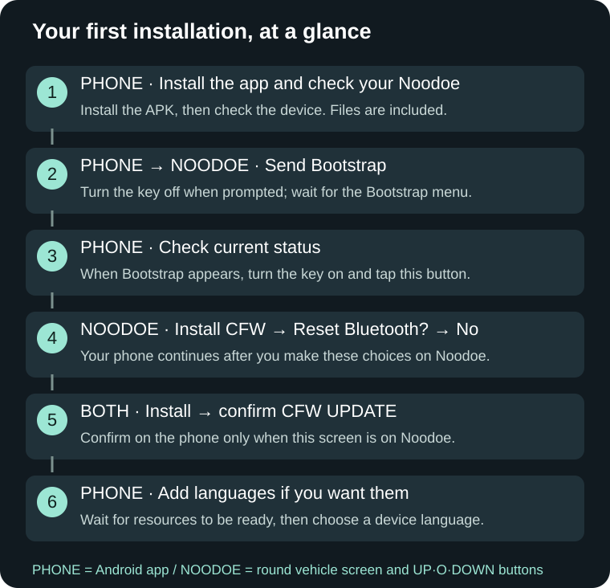

**Jump to what you need.**

| What do you want to do? | Start here |
|---|---|
| Install for the first time | [Prepare](#prepare) → [Follow the screens](#first-install) |
| Update an existing installation | [Updating NewDoe](#update) |
| Change the menu language | [Language resources and settings](#language) |
| Fix a connection or interrupted installation | [Connection help](#connection) · [Screen-by-screen help](#troubleshooting) |
| Return to stock without a phone | [Device recovery menu](#recovery) |
| Use NewDoe | [Buttons](#controls) · [Trips and maintenance](#vehicle) · [Media](#media) · [Maps](#map) |
| Set up the app or parking | [App pages](#dashboard) · [Parking](#parking) · [Get help](#report) |

## 1. Can I install it?

| Item | Supported |
|---|---|
| Phone | Android 6.0 or later. There is no iPhone app. |
| Noodoe unit | F4-family KYMCO Noodoe. Other vehicle models besides the AK550 can use the app's device check. |
| First installation from stock | Stock firmware **5.14 or 5.16** |
| Already running CFW | Follow [Updating NewDoe](#update). |
| Device menu languages | Nine choices on B units; English, Japanese and Simplified/Traditional Chinese choices on A units |

You do not need to open the unit to identify it. Tap **Check current device** in the app. If it reports an unsupported device, save the message and [ask for help](#report). Returning to stock installs **stock 5.16**.

## 2. Buttons and the ignition key

- **O** is the centre confirmation button, not the number zero.
- A **short press** means press and release. A **hold** means keep it pressed; follow the displayed duration when a screen says two or three seconds.
- **IGN ON** means turn the vehicle key/power switch on. **It does not mean start the engine.**
- **IGN OFF** means turn the key/power switch off. **Do not disconnect the battery or Noodoe wiring.**
- If your vehicle has a switch that assigns the buttons to Noodoe or the normal dashboard, select **Noodoe**.

**Bootstrap** is the temporary installer used for first installation. **CFW** is the NewDoe firmware you normally use. **Recovery/Gate** is the device's startup and recovery menu.

## 3. Get ready

### Download just the APK

Get **NewDoe-0.15.0.apk** from [Downloads](https://github.com/SerialSniffyHeck3r/noodoe_cfw/releases/latest). Language-specific firmware and required fonts are included. Normal installation does not need a separate ZIP download or file selection.

**App and device firmware are 0.15.0.** Choose a system language in the app; it prepares matching firmware and resources. Installing the APK alone does not change the device firmware.

### Park before you begin

1. Park safely and stop the engine. Make sure the vehicle and phone batteries have enough charge.
2. Open the new APK and install it. If NewDoe is already installed, **update the existing app**. Do not uninstall it or clear its data.
3. If Android asks to allow installation from this source, check that you downloaded the APK yourself and allow it. Open NewDoe afterward.
4. Enable Bluetooth and keep the phone close to the vehicle. Leave NewDoe in the foreground during installation.
5. Disconnect any other Noodoe app that is using the device.

**Keep the battery and Noodoe wiring connected during installation and stock recovery.** Do not operate the starter. Charge or service a heavily discharged vehicle before updating it.

### Confirm the five safety screens

When you press an install button, read each picture and tap **Got it**. **Cancel** stops before installation starts. The same installation can continue through Bootstrap without repeating these confirmations. A different device, file or new installation requires them again.

1. Do not disconnect the battery or Noodoe wiring.
2. With the key OFF, do not press **UP + O** together.
3. Do not press the starter button.
4. Check that the battery voltage is **at least 11.5V**. This is your confirmation; the app does not measure it.
5. Keep the key OFF when the step allows it. **The first transfer from stock needs the key ON.** Then follow the screen instructions.

All five signs stay under the installation status while it runs. They are reminders, not extra buttons.

### Choose guidance when installing from stock

On first launch, answer whether you have used NewDoe before and read the button guide if needed. Open **Device/status → Check current status**. Once the actual device is identified as stock, choose **Install** or **Install with step-by-step guidance**. Use the guide if you are unfamiliar with installation.

The optional guide starts only from stock firmware. Existing CFW uses the normal update screen. After a transfer or verification starts, wait for that operation to finish. Reopening a guide does not start installation.

## 4. First installation from stock

### ① Select your Noodoe on the phone

1. **[NOODOE]** Turn the key ON without starting the engine.
2. **[PHONE]** Open the **Device** page. Swipe sideways or use its bottom button.
3. For a first connection, tap **Pair Noodoe** to open Android Bluetooth settings. Put stock Noodoe into pairing mode and select your unit. Do not pair again if it is already registered.
4. Return to NewDoe and select your device. Refresh the device list if it is missing.
5. Open **Permissions & integration** and allow Bluetooth/Nearby devices access. Music, calling and location permissions can be set up [after installation](#phone).
6. Tap **Check current device**. Confirm that the app identifies **stock Noodoe**.

### ② Send the installer using included files

1. **[PHONE]** After checking the device, review the app, included firmware and prepared firmware versions. The app prepares the files automatically.
2. Choose **Install**, or **Install with step-by-step guidance** for help.
3. Read and acknowledge each safety screen. Cancel sends no installation command.
4. Wait for the first transfer and check to finish. Do not turn the key OFF early during the stock transfer.

### ③ Wait for Bootstrap, then tap Check current status

1. **[PHONE]** When this message appears, follow the stock display's instruction to turn the **key OFF**. Leave the battery connected.
2. **[NOODOE]** Wait until the **NewDoe Bootstrap menu** below appears. The intermediate **NOODOE INSTALLER** screen is not that menu.
3. When Bootstrap is visible, turn the **key ON**.
4. **[PHONE]** Tap **Check current status**. This step needs your tap. Do not resend Bootstrap.

| A brief file check comes first | Then the Bootstrap menu appears |
|---|---|
|  |  |

The first three seconds show only the NEWDOE wordmark. Checks continue in the background. If still running afterwards, the current check and a horizontal bar appear around the wordmark; otherwise the menu opens.

### ④ Choose Install CFW on Noodoe

1. **[NOODOE]** Use UP/DOWN to select **Install CFW**, then press **O**.
2. At **Reset Bluetooth?**, keep the default **No** and press **O** if your connection is working.
3. The phone continues the installation. You do not need to find another installation-start button on the phone.

**Yes erases saved pairings.** Use it only when you need to reset a failed connection. For “Couldn't pair,” follow [the pairing recovery steps](#connection). This question has no automatic countdown.

If the app finds data from a previous CFW installation, choose **Restore retained data** to keep your settings, trips and photos. Choose **Start fresh** only if you want a new setup. You may not see this choice on a first installation.

### ⑤ Wait while the two bars fill

- **Upper, lighter bar:** overall installation progress.
- **Lower, darker bar:** the current operation. It can start again when the next operation begins.
- The text identifies the file or operation. Your numbers may differ from the example.

Keep power and the phone connection available. Do not force a restart just because progress is slow. To cancel, follow the displayed **hold O for three seconds** instruction, then wait for the stopped message.

### ⑥ Everything is ready: install

The files are ready.

- Install now: select **Install CFW → O**.
- Leave it alone: installation begins **after 30 seconds**.
- Go back: press UP/DOWN to stop the countdown, then choose **Back → O**.

Noodoe restarts during installation. Leave the app open even if the connection briefly drops or you see a startup screen.

### ⑦ Look at CFW UPDATE on Noodoe, then confirm on the phone

| Look for this on Noodoe | Then confirm on the phone |
|---|---|
|  |  |

1. **[NOODOE]** Check that it shows **CFW UPDATE** and **Checking the new version** or **Confirm on your phone**.
2. **[PHONE]** Tap the button confirming that **CFW UPDATE is visible**. If Noodoe still shows Bootstrap, NOODOE INSTALLER or a black screen, choose the “not that screen yet” option and wait.
3. Wait for the phone to report **installation complete** and for Noodoe HOME to open.

**Confirm before the phone's countdown expires.** Otherwise the device may return to the previous version or recovery menu. Dismissing the popup does not confirm the installation.

### ⑧ Check the selected language

The app prepares your selected system language and any required fonts. Wait for completion, then check the device menu. If it opens in English, see [language status](#language).

## 5. Update an existing NewDoe

**Existing users: check the device, choose a system language and update to 0.15.5.** Compatible Gate firmware and healthy existing B fonts are retained.

1. Install the latest `NewDoe-0.15.5.apk` (hotfix1, build 151) over your existing app. Keep its data and pairing.
2. You can select **Check current device** while riding sync is enabled. The app closes that connection and switches to a status-check connection. This check does not install firmware.
3. If needed, choose **Language settings → Install another language**, then tap **Update**. Read each of the five warnings for at least three seconds and confirm it. Installation starts only after the final confirmation; cancelling a warning leaves an ongoing riding connection intact. After the final confirmation, the app automatically ends riding sync and switches to the installer. No separate stop action is required.
4. Keep power connected and let transfer, verification and restart finish.
5. Confirm the device's **CFW UPDATE** screen in the app. If additional fonts are being prepared, wait until the final installation completes.

**Hotfix1 changes the app connection handoff. If your device already runs 0.15.5, update only the APK.** Embedded firmware and installer ZIPs are identical to 0.15.5. Let any ongoing installation, recovery or NOR backup finish first. Existing device installation checks, including stationary requirements, remain in effect.

### When a 0.14.1 settings error blocks an update

HOME can work while settings restoration remains incomplete. **Check current device** only reads status. It does not retry settings restoration or installation.

1. Install the new APK over the existing app. Keep app data and export diagnostics.
2. Read **Product boot confirmed** separately from **Settings restoration incomplete**. **Continue installation** can retry the same operation. If 0.14.1 keeps rejecting settings, use the following route.
3. Open **Data-preserving reinstallation** in the app. If Bluetooth cannot connect, [open recovery with the device buttons](#recovery) and choose **Back to stock**. Use **Keep CFW data**, never complete removal.
4. Wait for the stock screen, then tap **I have returned to stock · check** in the app. After reading the actual stock state, the app archives the old operation and prepares reinstallation.
5. Select your language and follow [first installation](#first-install). Choose **Restore retained data** in Bootstrap. This route retains settings, TRIP, maintenance, photos and pairing.
6. Check the device and final app result. A missing or damaged required data file is not automatically initialized. Save diagnostics and stop if this is reported.

**Healthy devices that save settings and prepare an update normally do not need a stock return.** Treat data marked unverified as unverified. Cancelling does not undo completed steps.

### If the app requires the newer recovery system

From 0.11.x or another older Gate, follow **Return to stock → Keep CFW data** first. Once the stock screen appears, tap **I have returned to stock · check**, then follow [first installation](#first-install) using the included package. Choose **Restore retained data**. Do not select complete removal.

Settings, trips, maintenance records and photos are retained. **Do not disconnect power during stock return or installation. An interruption in older stock-return code can require external repair.**

## 6. Choose or change the system language

**Choose the language in the app before installing.** Install English only, or English plus one selected language. Required files are included in the APK.

### First selection or a different language

1. Park the vehicle and tap **Check current device**. The app identifies the actual A/B resources.
2. Choose **Language settings → Install another language**. Only languages for that resource profile are offered.
3. Tap **Install / Update** and acknowledge the safety instructions.
4. Let transfer, verification, restart and **CFW UPDATE** confirmation finish. If additional fonts are being prepared, wait for the app to report completion.
5. Check the device menu. The app shows **installed language** and **display language** separately.

**Changing language normally does not require returning to stock.** The app updates firmware and its matching base resources together. Healthy additional fonts are reused without another transfer.

| Japanese menus on an A unit | Korean menus on a B unit |
|---|---|
|  | 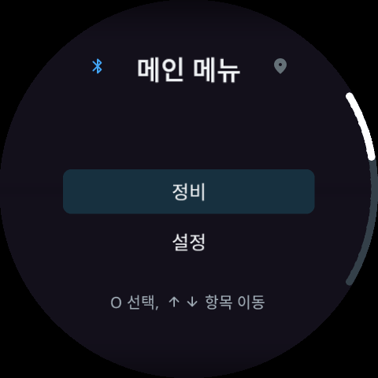 |

### Switch between English and the installed language

Open **Language settings** in the app to see the app language, installed menu language, actual display language, English selection, text rendering and supplemental font status. To install another language, choose it under **System language** and confirm. After the device check finishes, use **Continue installation / Check language** to update Product and its matching base resources. Changing only the app language does not change the device menu.

On Noodoe, open **Settings → System → Language**. **Firmware** shows the installed language; **Language** chooses the display language. Select English or the installed language, save and restart while parked. An English-only Product offers only English.

English-only firmware still displays foreign-language music and notifications. It does not require making room for additional fonts just to use English menus.

### Available languages

| Device resources | System language choices |
|---|---|
| A | English · 日本語 · 简体中文 · 繁體中文（台灣）· 繁體中文（香港） |
| B | English · Deutsch · Español · Français · Italiano · Ελληνικά · 한국어 · Tiếng Việt · 日本語 |

**App language** changes the phone UI. Choose and install the device language separately; changing the phone language afterward does not change it. An old “Follow app language” selection is resolved to one installed language during the update.

### When additional fonts need preparation

Healthy existing B packs remain usable as font resources. Stock files and existing photos are not deleted for cleanup. If the font file is missing or too small, the app explains **why a preparation Product is needed and how it returns to the selected final Product** before asking you to continue. Bluetooth, pairing and settings remain available in the preparation Product.

The preparation Product displays **FONT PREPARATION** and does not provide HOME, music or map pages. Stay parked and continue installation in the app. `Font preparation complete` means that the fonts are ready; **the selected final firmware must still be installed before riding screens return.** For connection help, briefly press UP on the idle preparation screen to open the existing pairing help. Pairings are not deleted automatically.

| Waiting for the phone in the preparation Product | Not enough font space |
|---|---|
|  |  |

While idle with the ignition OFF, the display turns off under the existing power policy. Font installation or final firmware transfer wakes the installation display. Existing photos, trips, maintenance records, settings and pairings remain stored.

| 1. Transfer preparation Product | 2. Inspect storage | 3. Receive fonts |
|---|---|---|
|  |  |  |

| 4. Verify fonts | 5. Complete storage | 6. Install the selected final Product |
|---|---|---|
|  |  |  |

**Insufficient CJ space pauses installation until you choose.** Read the required size and the available capacity reported by the device. If exact free capacity is unavailable, it is labelled unknown.

- If the chosen menu works without CJ, choose **Continue without CJ / Cancel**. Unsupported music and notification text then needs phone rendering. Without phone rendering, those characters may not display.
- If mandatory menu fonts are missing, choose **Select another available language / Cancel**. The app does not silently choose English or mark that language installation complete.
- If you cancel while the preparation Product is running, **it remains installed**. Cancelling does not undo finished steps. Keep app data and the operation record to resume or select another language later.
- If you skip CJ, the result and language settings retain **Installation complete — CJ not installed**. Installing it later requires a fresh space check and confirmation.

Optional CJ / required menu font unavailable

 

Lost connections, timeouts and damaged storage are distinct from insufficient space. Read the failed stage and error code and save diagnostics. After an interruption, keep the same app data and use **Check current device → Continue installation**. Checking status alone does not write again. Ordinary startup does not hash or retransmit the entire font file.

| Music and notification text setting | Behavior |
|---|---|
| **Render on phone** | Uses the phone fonts and colour emoji. |
| **Use device fonts** | Uses the device only when it can display the entire field. If any character is unsupported, the whole title or body is rendered on the phone. |

If menus remain English, check **installed language → English only → restart confirmation → font status and fallback reason in the app**.

## Expert settings and interrupted installations

For normal use, choose **Check current status → Install / Update**. Manual ZIP installation, diagnostics, recovery and backups remain in **Device/status → Expert settings**. Manual ZIP selection shows a caution screen; installing the selected ZIP shows it again. Selecting a file does not install it. Choose **Use packages included in this app** to return to the default source.

After an app update or lost connection, check the device first. An unfinished installation continues with its original files and records, even if the new app contains a newer package. If an original file is missing or damaged, import that exact original ZIP through Expert settings. Do not substitute another version.

Files and records live in app-private storage. **Uninstalling the app or clearing its data removes them.** Export **Backup and operation records** from Expert settings first. If storage is full, free other unnecessary files and retry. The app does not automatically delete recovery evidence or ongoing packages. An uncertain operation is checked on the device before further work.

## 7. When the phone cannot connect

### “Couldn't pair” in Bootstrap

If files are being written, let that finish first. Follow these steps at the Bootstrap menu or connection screen.

1. **[PHONE]** Open **Can't connect? / Bootstrap connection help**.
2. Tap **Open Bluetooth settings**, then **forget only your Noodoe** in Android. Keep the NewDoe app's data.
3. **[NOODOE]** If you already chose **Reset Bluetooth? → Yes**, follow that screen. Otherwise, use **UP** on the connection screen to open the pairing menu and choose the phone. Release O, then **hold O again for two seconds** to delete it. ALL deletes every phone.
4. At **PAIR YOUR PHONE**, search for Noodoe again in Android and pair it.
5. Return to NewDoe, select the same device, and tap **Check current status**.
6. Choose **Install CFW** on Noodoe. If the recovery workflow appears, follow **Check last operation → Check and resume installation**.

### Disconnection during normal use

**0.14.1 saves a rotated Bluetooth bond key for the next connection.** Install the new APK over the existing app, then use **Check current device → Update** to update Noodoe too. Updating only the APK does not install the device fix.

Check that the app's riding connection is not paused and Bluetooth/Nearby devices access is allowed. Allow NewDoe to run in the background in Android's app battery settings. After force-stopping the app, open it again and start the connection. If another app, such as the camera, interrupted it, return to NewDoe and check the connection.

If re-pairing has already restored your connection, use that connection to update Noodoe. If reconnection still fails afterward, export the diagnostic ZIP and note both app and firmware versions before restarting or re-pairing. Keep app data. If a settings save/restore error blocks updating, follow the [0.14.1 reinstallation route above](#update).

**The recovery menu has no Bluetooth connection.** Use [the device buttons](#recovery) when the skull or Recovery menu is showing.

## 8. What should I do on this screen?

| Screen or message | What to do |
|---|---|
| **NOODOE INSTALLER** | Wait for Bootstrap or the next screen. Do not confirm CFW UPDATE yet. |
| **100% / Verifying and saving** | Keep power connected and wait for saving. See [the remaining stages](#language). |
| **CFW UPDATE** | Tap the phone button confirming that this screen is visible. |
| **Firmware installed / Language resources are incomplete** | Firmware is installed. Reconnect to the same device and choose **Continue installation / check language status**. Do not immediately return to stock or reinstall firmware. |
| **opcode 0xAA / socket closed / read -1** | Check whether Noodoe restarted, reconnect, and check resource status again. Save the error and diagnostics if it repeats. |
| **Installation success or cancellation not confirmed** | Keep the same device and ZIP; use **Check current device → Check last operation**. |
| **Paused / Stage 6/8 / Code 6 / Phase 4** | Look for an explicit manual-reset instruction. If shown, follow the steps below. |
| **English after a language change** | Follow [the four language checks](#language). |
| **ODO ------ / no speed** | Check that the ignition is ON. If it persists, send your vehicle model and a screen photo. |

### When the device says “Please manually reset”

1. Photograph the message and code.
2. Release all buttons, then **hold UP + O together for three seconds** and release.
3. With the key OFF, the screen may stay dark. Release the buttons and **turn the key ON**.
4. Check the same device and ZIP again. Confirm CFW UPDATE if shown, or follow the recovery menu below.

Use this reset **when the device asks for it**. Do not interrupt writing just because progress is slow.

## 9. Recover or return to stock without a phone

### Open the recovery menu

- When the device starts from power-off and shows the NewDoe logo, **hold DOWN for about one second**.
- If CFW is running: **key OFF → hold O → keep holding while turning key ON → hold for at least two more seconds → release at recovery**.
- If UP+O with ignition OFF left the screen dark, release the buttons and turn the key ON to start again.

| An error shows this first | Press a button, or wait 30 seconds, for the menu |
|---|---|
|  |  |

Manual entry may go straight to the menu. Use **UP/DOWN to move and O to select**. Grey items are unavailable right now. The reason and code at the top depend on how you entered recovery.

| Menu item | What it does |
|---|---|
| **Start NewDoe** | Start the current firmware |
| **Check again** | Look for recovery options again |
| **Reinstall firmware** | Reinstall using the stored installation image |
| **Restore previous** | Recover the previous firmware |
| **Return to stock** | Restore stock firmware |
| **Try recovery anyway** | Look for another recovery copy when normal recovery failed |
| **Details** | Show error and status details |
| **More** | Help, dashboard values and a simple game |
| **Restart** | Restart the device |

### Return to stock

1. Select **Return to stock → O**.
2. Read the confirmation, **release O and hold it again for two seconds**.
3. On the new Gate, read the battery, UP + O and starter warnings in order. **Release O, then press it again** for each screen. UP or DOWN goes back. These screens also appear for a manually chosen forced stock recovery.
4. Keep power connected until the stock screen appears. **No phone connection is needed.** Older recovery menus may not show the three new pictures.

| Example recovery confirmation | Stock recovery in progress |
|---|---|
|  |  |

If recovery fails, use **Check again** and, if available, **Try recovery anyway**. Press **O** to leave an unsuccessful-recovery message. If it keeps failing, send the code and a photo through [Get help](#report). If no recovery copy can be used, servicing or recovery after opening the unit may be needed.

**Use recovery scratch** means giving up an unfinished language/font repair so its workspace can be used for recovery. Approve it only if you want to abandon that unfinished job.

### Return to stock using the phone

Stop the riding connection, then choose **Return to stock → Keep CFW data**. Confirm on the phone after the actual stock screen appears. Choose **Restore retained data** during a later reinstall to keep your environment. Choose **Remove CFW data completely** only when you intend to erase those records.

## 10. Phone connection and permissions

Select your Noodoe and use the app's top **play** button to start the riding connection. The top **pause** button pauses the connection; it is separate from your music player's pause button.

| Permission or setting | Used for |
|---|---|
| Bluetooth / Nearby devices | Connection and installation |
| Notification access | Music information and chosen app notifications |
| Precise/background location | GPS and maps, including with the phone screen off |
| Contacts, phone and recent calls | Caller names and calling features |
| App notifications/background operation | Connection status and reconnection |

Open **Permissions & integration** and enable the features you want. Calls that do not provide a number may show **Unknown caller**.

## 11. Everyday device controls

| In a normal screen | Action |
|---|---|
| **Short O** | Cycle HOME → trips → music → phone → map |
| **Short O + DOWN** | Open quick brightness settings |
| **UP / DOWN** in quick settings | Adjust brightness |
| **Short / long O** in quick settings | Close / open the main menu |
| **Long UP** in quick settings | Restart the display output |
| **Long DOWN** in quick settings | Super Nite low brightness |

Follow the on-screen hints while a call, notification or menu is open. Park before changing full settings.

The five top icons hide after a while on HOME and stay visible on other normal pages. **Grey GPS** means waiting for a location; fresh positions cause a short grey pulse. **Yellow/red Bluetooth** indicates low phone battery; **green** indicates charging.

## 12. Odometer, trips and maintenance

From 0.15.1, **oil intervals use odometer distance only**. Key-ON duration is no longer measured or applied to any maintenance item. Existing distances since service are kept; historical hours are never converted into kilometres. If you previously configured only an hour interval, set a distance interval in Maintenance. Belt/service calendar criteria and riding-time/average-speed statistics remain available.

**ODO is the current odometer value received from the vehicle's instrument cluster.** Missing data shows `------`. There is no separate Noodoe odometer correction or saved-ODO selection.

Trip A/B, today, this ride, oil, belt and service records are retained separately. In **Maintenance**, check or change the replacement interval and distance since replacement. Reset or adjust these to match actual maintenance. This does not change the vehicle's original odometer.

Oil remaining changes to **yellow at 30% → red at 15% → flashing red at 5%**. This ride's maximum and average speed markers appear once their values exceed 5 km/h.

Use **short UP/DOWN** in HOME for **one line → two lines → speed → clock → TBT → weather**. On ordinary information-strip views, **hold O** for manual/AUTO and **hold UP/DOWN** to change the item. AUTO resumes after 20 seconds. Active TBT/MAP alternate only the two destination summaries every 10 seconds. Choices stay in RAM and save **at key OFF**. Weather detail controls are unchanged.

Choose **Settings → Display → Clock style → Analog / Digital**. Only the selected clock appears in the HOME carousel. Digital hides the small top clock. Photo shading, hand lengths, speed arc, ODO and the lower information position are preserved.

The lower cycle includes **sunrise / sunset**. Choose a nearby city under **Settings → Display → Sunrise / sunset** on Noodoe, or **Device settings → Sunrise / sunset reference city** on the phone. Noodoe calculates approximate times from the date, device UTC offset and selected city, rounded to minutes. Live GPS does not change this reference. Change the city and UTC offset when travelling, including daylight-saving changes. An existing stored location remains available as **Previously saved position**. New installations without a saved position must select a city; missing date/location shows `--:-- / --:--`. Terrain, buildings, elevation and weather are not considered.

| Analogue clock | Digital clock |
|---|---|
|  |  |

With the key OFF, the last ODO received during this boot stays on the device and phone dashboard. Turning the key ON requires a fresh vehicle reading. A restart clears this temporary ODO; it never restores an old saved reading. Trips and maintenance counters are preserved separately.

In 0.12.1, the last ODO also stays visible in **10-minute use after key OFF**. A brief receive error no longer clears a valid reading immediately. If communication remains lost with the key ON, the value becomes unknown. Trips and maintenance records are kept; the retained ODO never adds trip distance.

**SINCE REFUEL:** with fuel recognition ON, a fuel level at least two bars above the earlier level for three seconds starts a new record. A 2-bar tank refilled to alternating 4/5-bar readings is accepted. Missing or unknown readings wait for valid data. TRIP A/B and maintenance history are kept.

After refuelling, turn the key ON and allow several normal fuel readings to arrive. A rise of at least two bars is recorded once it stays stable; a missing reading does not count as a change. Ride Summary uses this boot’s last received ODO for the oil percentage after key OFF.

Set **Settings → Vehicle → Fuel recognition** to OFF if your dashboard does not provide usable fuel data. This stops fuel warnings, automatic refuel detection and reserve mode. **Hold O on SINCE REFUEL** after refuelling to start the counter manually from zero, including when it shows `--`. Other trips and maintenance records are kept. Turning recognition on establishes a new baseline; it does not infer a refuel from the pre-OFF level.

When reporting a fuel issue, photograph **diagnostic settings → Fuel RAW P2 / P3** and **UART RX first 16 bytes**. These show the values received from the vehicle dashboard. They remain available with fuel recognition turned off.

## 13. Music, calls and notifications

- **Music:** start playback on your phone and allow notification access. On the music page, short UP plays/pauses, short DOWN skips forward, and long UP goes to the previous track.
- **Volume:** hold O on the music page to open the volume popup. UP raises media volume by one step, DOWN lowers it, and a short O closes the popup. Calls and warnings take priority. The phone must be connected.

- **Phone page:** UP opens recent calls; DOWN opens the latest notification. Follow the hints in detailed screens. Closing a call popup and ending the actual call are different actions.
- **New notifications:** the top icon flashes for about two seconds. Rapid messages update to the latest content; Updating... may appear while it is prepared.
- **Quick replies:** slots 1–7 are saved text; 8 shares location, this ride and music; 9 shares location; 10 shares music. Slots 8–10 include a signature. Check the recipient and content before sending.
- **Dashboard blink alerts:** warnings and notifications briefly change the instrument cluster brightness. Disable **Settings → Display → Dash blink alerts** if unwanted.

## 14. Maps and zoom

Import your region's **.map file** in the app's map menu. Enable location permissions and select the device to connect automatically. Without a map file, Noodoe shows a moving grid and track line.

| On the map page | Action |
|---|---|
| **Long UP** | Switch AUTO / MANUAL |
| **UP/DOWN in AUTO** | Adjust preference from −2 closer to +2 wider |
| **UP/DOWN in MANUAL** | Change zoom directly |
| **Long O** | Switch north-up / heading-up |

New areas take some time to prepare. With guidance OFF, the map shows position and travelled track.

No destination setup is needed for ordinary map viewing. Trip counters and ODO remain available.

### HOME, map and music during guidance

The app has four bottom tabs: **Device / Home / Custom / Navigate**. This build uses **BRouter only** for offline guidance. The phone calculates routes; Noodoe shows TBT and the route on the map.

Open **Navigate → BRouter routing files → Download**, obtain official `.rd5` files, then use **Import .rd5 files**. Seoul uses `E125_N35.rd5`; obtain neighboring grids as needed. Download the separate Mapsforge `.map` display map through the existing map screen. Move the map to place its center marker on the destination and tap **Use this point**, or choose a favorite/recent destination. Address/POI search and Valhalla country-pack installation are not included in this build.

Existing downloaded maps, country-pack files and saved destinations are kept. Starting a saved destination explicitly calculates a new BRouter route. The road-name line is blank, with roundabout exit numbers retained. Google Maps/OsmAnd external TBT still uses the road name supplied by that app.

MAP shows a **purple route with black and white outlines**, remaining destination distance, and the current position above the route. Destination distance also joins the lower information cycle. Stopping guidance removes these items and restores the existing map/track behavior.

After the menu hides, ordinary pages except full TBT show a compact **left arrow / right distance** pill. Full TBT has one current-maneuver card, the external app road name below the distance, and destination information in the lower strip. The second maneuver is removed. Starting guidance does not change the selected page; inactive HOME TBT shows Navigation inactive.

**Round native turn distances up to 10 m** in Navigate is OFF by default. It rounds native metric turn distances up in 10 m steps: 91 m becomes 100 m and 101 m becomes 110 m. Destination remaining distance, mi/ft and Google Maps/OsmAnd external TBT are unchanged. An existing rounding preference is preserved. External TBT remains experimental and retains its existing priority. Stale GPS/disconnection shows `--` and dims the last route.

During guidance, menu icons fade after 5 seconds on every riding page, then the mini panel appears. Menu input reverses this transition. Without guidance the existing menu policy stays unchanged. Within **500 m** of the turn, only the mini-panel digits alternate yellow/white at 2 Hz. Its outline and full-TBT text remain steady. This uses the actual remaining distance before display rounding. Missing or stale guidance disables the highlight.

| Mini guidance | Full TBT | Seoul route example |
|---|---|---|
|  |  |  |

The large TBT distance uses fixed `000 m / 00.0 km / 000 km` fields. Leading zeroes are omitted; shorter numbers align to the right so 90 m occupies the tens and ones cells. The unit stays in its fixed position.

These are PC renders of the actual LVGL/EVE code, not photographs of a vehicle LCD.

The app **Wallpaper** theme uses a transparent window over the Android system wallpaper. Background shade and vignette are adjustable within the minimum contrast bounds for readable text.

### Change trail colors

Open **Settings → Display → Trail color** on Noodoe, or **All device settings → Trail color** in the app. Choose red, orange, yellow, green, cyan, blue, white, or **By speed**. The default remains red. Changes apply without restarting.

By speed remembers the dashboard speed recorded on each leg. Low speeds start blue, then pass through cyan, green, yellow and orange to red. **Settings → Vehicle → Ring maximum** sets the red endpoint. With a 200 km/h maximum, 100 km/h is green, 150 km/h is yellow, and 200 km/h or more is red. Changing units to mph does not change the color for the same physical speed. Legs with no valid speed are gray.

The color setting is saved; the trail remains a record of the current session as before.

## 15. The app's Home, Customise and Device pages

Swipe sideways or use the bottom buttons for **Device · Home · Customise**.

- **Home:** map, speed, ODO, trips and three maintenance rings showing oil/belt kilometres remaining and service percentage remaining. **Tap the trip readout itself** to cycle information. With stock Noodoe, the lower area shows stock information instead.
- **Customise:** background pictures, notification apps, popups, quick replies and favourite callers.
- **Device:** installation, updates, current status, system language and the manual.

**UI test mode** lets you preview chosen speed, ODO and CFW/stock screens while disconnected. It does not change actual vehicle values. Turn test mode off before returning to a real connection.

**Bluetooth is off:** connection buttons stop and HOME asks you to enable Bluetooth. Open Bluetooth settings to turn it on. Connection resumes automatically for the selected device. Unfinished installation records must be reconciled with the actual device state. Installation does not start again by itself.

A fresh installation puts a black 480 × 480 picture with the centered NEWDOE wordmark in Background 1. Replace it with any photo to remove the wordmark completely. Keep-data reinstalls and normal updates retain your existing photos; Backgrounds 2 and 3 are unchanged.

## 16. Ignition-off and long parking

After key-off, **Ride Summary** appears before the existing background and sleep sequence. There is no separate key-OFF photo. Holding O while turning the key off, then releasing it, allows up to ten minutes of ignition-off use.

Open **Settings → System → Power sequence → Long parking power off** and choose **Off / 2 days / 3 days / 7 days**. Two days is the default; an earlier user selection remains after updates.

After the chosen time shuts the unit down, phone-approach reconnection and welcome lights also stop. Turning the key on starts it from the startup screen again. Check this setting before extended parking. If the battery is already discharged or its voltage has dropped sharply, have the battery and vehicle checked first.

### Choose NewDoe or stock photos

On Noodoe, open **Settings → Display → Photo source**. On the phone, connect and open **Device settings → Photo source**.

1. Choose **NewDoe** for your three editable CFW slots, or **KYMCO** for photographs already in the stock album.
2. Open **Photo** and select **1, 2 or 3**, then Apply. The number identifies the slot in the selected source. There is no separate key-OFF photo selection.
3. The selection is saved on Noodoe. Both the phone and device settings change the same saved values.

NewDoe reads the stock album without replacing, deleting or repairing it. Uploading a new photo always changes a **NewDoe** slot, even when KYMCO is selected. Switch back to NewDoe to use that upload. A fresh install still puts the NEWDOE wordmark in NewDoe slot 1; updates and keep-data reinstalls retain your existing slots.

**Empty** means the selected stock slot has no JPEG. **Unreadable** means the file or folder cannot be read, the JPEG is damaged, or its format/size is unsupported. The slot number is shown in the error. That failed slot selection is not saved; choose another slot or switch back to NewDoe. No stock file is changed. If the photos are still loading, wait briefly and try selecting again.

If first installation stopped with **0x00050005 / CFWPIC.DAT** after photo transfer, use **Check current device** first. The included firmware package 0.12.2 fixes this issue. If it repeats in an older Bootstrap, inspect the result, return to stock, then reinstall with the included files. Do not erase the stock album or clear app data.

## 17. Still stuck? Send this information

Open **Having trouble? / Recovery and diagnostics → Save and share diagnostics**. Include the following in a [project support request](https://github.com/SerialSniffyHeck3r/noodoe_cfw/issues):

- Vehicle model/year, phone model and Android version.
- App version, device firmware version and the prepared firmware version shown in the app. Include the ZIP filename if you selected one manually.
- A photo of Noodoe's current screen and the exact error/code.
- Your last button press and what happened afterward.
- For languages: device language, English-only setting and resource status.

Do not clear app data before saving diagnostics. Keep another copy of any backups you already have.

[Back to top](#top) · [Downloads](https://github.com/SerialSniffyHeck3r/noodoe_cfw/releases/latest) · [한국어](Guide.md)

## Offline navigation — BRouter

This build includes BRouter only. The Valhalla native engine, country-pack installer and vehicle-class selector are excluded. Existing downloaded data is kept.

1. Open **BRouter routing files → Download** for the [official routing files](https://brouter.de/brouter/segments4/). Each file covers a 5° × 5° grid. Seoul uses `E125_N35.rd5`; obtain neighboring files for routes crossing grids. Keep original filenames and preferably use data from the same date.
2. Use **Import .rd5 files**. A verified new file replaces the same grid; failure keeps its previous version. Select files again after interruption.
3. Obtain the separate Mapsforge `.map` through the existing map screen. `.rd5` files contain neither the display map nor an address-search database.
4. Move the map to the destination and tap **Use this point**, or select a favorite/recent destination. Connect to Noodoe and receive a GPS location to start guidance.
5. Noodoe shows turn arrows, next-turn and remaining destination distances, and a purple route. The road-name line is blank; roundabout exit numbers remain. The phone recalculates after an off-route event.
6. Resume never starts automatically. Confirm the saved destination and start to calculate a new BRouter route. Existing Google Maps/OsmAnd external TBT priority and road names are preserved.

Guidance requires Android 8.0+. The basic motorcycle profile uses OSM access, one-way and turn restrictions. Country/displacement special rules have not been separately qualified; follow road signs. Voice, cameras and lane guidance are not included. Device Bluetooth, NDCP, Gate and NOR structures are unchanged.

### First BRouter setup — map and routing files are separate

1. With internet access, open **Navigation → BRouter routing files → Download**. Get the needed `.rd5` files from the linked [official BRouter distribution](https://brouter.de/brouter/segments4/). No NewDoe country ZIP or API key is required. Short routes in Seoul use `E125_N35.rd5`; routes crossing tile boundaries also need neighboring files.
2. Keep the original names. Choose **Import .rd5 files**, select the downloaded files, review names/sizes and confirm. Wait for the import/verification result. Leaving files in Downloads alone does not register them: navigation uses the verified app-private copies.
3. Prepare the **display map** separately in the existing map screen using the region’s Mapsforge `.map`. A `.map` draws roads, while `.rd5` calculates routes; neither replaces the other. [Official BRouter offline guide](https://brouter.de/brouter/offline.html)
4. While stopped, open **Navigation → Choose destination on map**, center the marker on a point near a road, tap **Use this point**, review the location and choose **Start guidance**. Favorites and recent destinations also work. Address/POI search is not included in this build.
5. The phone calculates after obtaining a real GPS fix. For a first short test, choose road-connected points within one `.rd5` tile. Imported data works without internet, but GPS reception and the dashboard Bluetooth link are still needed.
6. **MAP** shows the purple route with black/white outlines. **HOME TBT** shows an arrow on the left, distance to the next turn on the right, and Google Maps/OsmAnd road names below the distance. There is no second maneuver. Destination distance is a separate destination-icon indicator and HOME-strip item. Starting guidance does not force a page change.
7. Mini TBT appears on riding pages including TRIP, but not on full TBT. During guidance, the upper menu hides after five seconds and mini TBT appears. Priority overlays keep their existing covering behavior. The phone recalculates after departure from the route; stale location/connection is not presented as fresh guidance.
8. Use **Stop guidance** to end. After app restart, use **Resume guidance**, confirm the saved destination and start again. A destination saved for another vehicle is not silently applied. Stop guidance before importing updated `.rd5` files. Failed imports preserve the prior file; check partial-success results before selecting missing files again.

**Google Maps / OsmAnd external TBT (experimental):** Enable external TBT in Navigation and grant NewDoe **Notification access**. Start actual guidance in the supported app and verify that its navigation notification appears. Simply opening the app or searching a destination is not guidance. Recognized external TBT takes priority over BRouter; internal guidance cannot start while external TBT owns navigation. It can show the source app’s road name, but does not import its complete route line. Parsing depends on app version, language and notification format. If the source app does not offer guidance in a region, NewDoe cannot supply it on its behalf.

| Problem | Action |
|---|---|
| Missing routing file/tile | Import tiles covering the start, destination and intervening route. |
| Map works, routing does not | Check `.map` and `.rd5` separately. |
| Waiting for GPS | Check phone location permissions/service and wait for a real fix. |
| No route | Pick a point closer to a connected road and check tile coverage. |
| External TBT waiting | Check actual Google Maps/OsmAnd guidance notifications and NewDoe notification access. |
| Dashboard waiting/disconnected | Reconnect using the existing connection flow and check phone guidance. Do not automatically reset or re-pair. |

The basic motorcycle profile uses OSM access, one-way and turn restrictions. Country/displacement-specific rules are not comprehensively validated; follow road signs. Voice, speed-camera, lane guidance and Valhalla country packs are not part of this build.

### First-boot presentation, installation buttons and clocks

A pending initial-setup marker opens the setup welcome directly after boot, without the normal key-ON arc sweep. Existing users without that marker keep normal startup. The wizard stays available while moving and its stop instruction waits for O. Ordinary settings retain their movement lock.

Each of the five installation cards enables **Next** after three seconds; none advances automatically. On the CFW UPDATE confirmation, **I can see CFW UPDATE** is immediately available; **Not yet** becomes available after ten seconds and is not approval. Once CFW installation has started, key OFF is permitted; keep the key ON during the first installer transfer from stock. This never means disconnecting the battery/main power, and the existing legacy stock-return interruption limitation remains.

Both analog and digital clocks dim the photo behind them, while hands/digits, speed arc, ODO and the information strip retain their colors. With key OFF, the digital speed field shows `--- km/h` or `--- mph` instead of retaining the last speed. Weather no longer shows time-of-day triangles beside temperature.

| Welcome | O 확인 / Confirm with O | 키 OFF / Key OFF |
| --- | --- | --- |
|  |  |  |

