# First installation from stock · 0.9.62 / manual revision 2

**Revised 7 October 2026** · [Installation index](README.en.md) · [한국어](08-First-Install.md) · [Compatible models](07-Compatibility.en.md)

## Preparation

Use the matching **0.9.62 APK and installation ZIP**. Install the APK over the existing app to retain its records. Keep the ZIP intact; do not choose an individual BIN from a dump. Select the correct Noodoe and stop riding integration. If CFW is already running, use [CFW update](09-Update.en.md).

First installation admits F4/HW 0, stock 5.16 and bootloader 0.10–0.19 without model/PCBA whitelists. Read the compatibility page for the difference between admission and vehicle testing, and between the installation backup and a full NOR backup.

Keep the stationary vehicle and phone adequately powered. Keep the installer and Bluetooth service running. Do not operate the starter during installation/writing. IGN is a signal separate from permanent 12V: IGN OFF may leave installation running. Follow the app's ignition instructions at each step. The following captures illustrate stages; they are not a measured transfer timetable.

## 1. Send Bootstrap through stock firmware

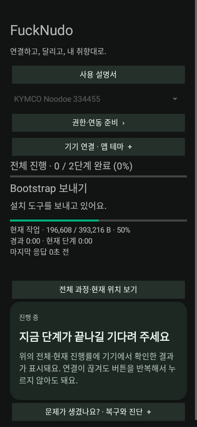

The app identifies the actual stock device/address and sends the installation tool through its stock update protocol. This is different from updating an existing CFW.

## 2. Finish the stock handoff and boot Bootstrap

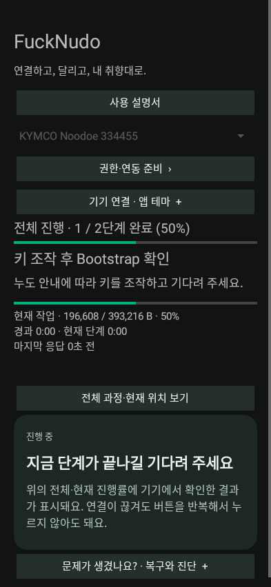

After the app confirms transfer verification and asks for the ignition action, **keep permanent power connected, turn IGN OFF, wait for the Bootstrap screen, then turn IGN ON**. Do not perform this step before verification. `NOODOE INSTALLER` means the stock writer is still working. Bluetooth may disconnect during restart; the app reconnects and identifies the new role.

## 3. Identify Bootstrap

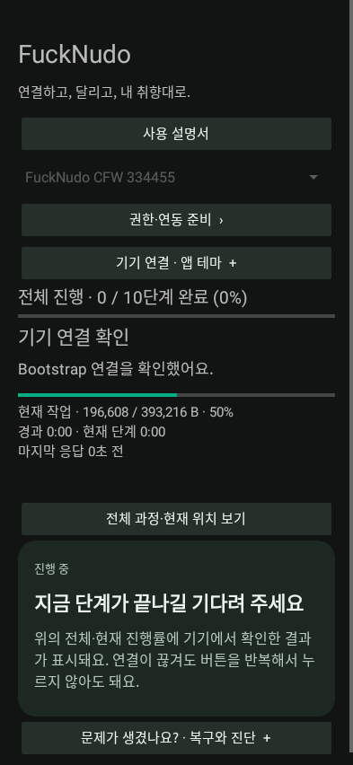
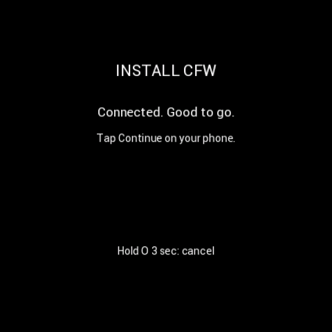
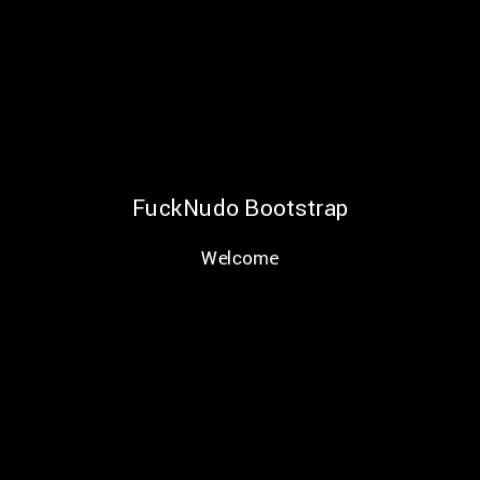

Look for `FuckNudo Bootstrap / Welcome`. Approve Android's pairing prompt if shown. The app checks the actual role, image and device ID. Connection alone does not complete installation; the Bluetooth test menu is a diagnostic tool.

## 4. Audit storage

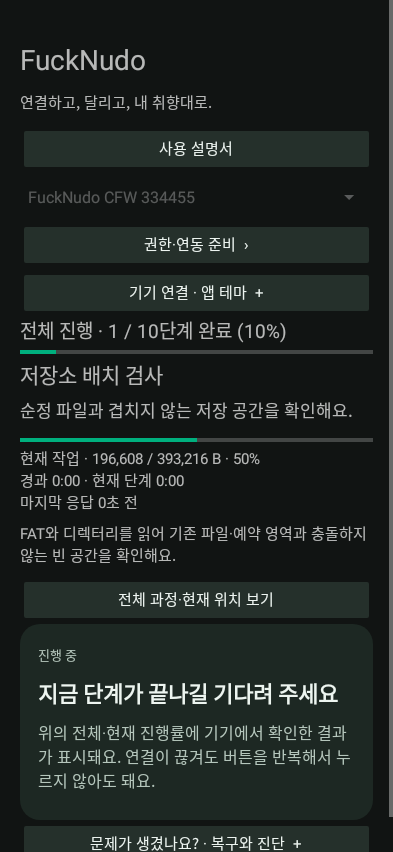
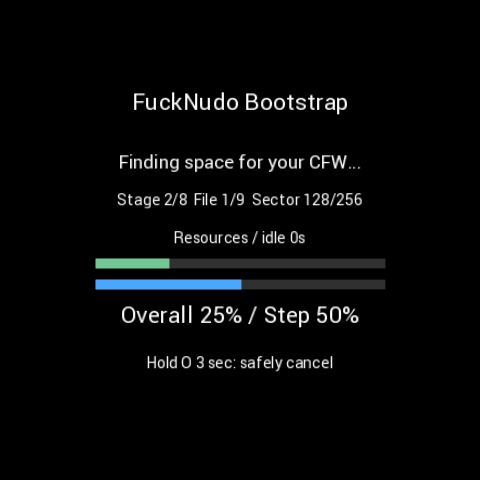

Bootstrap can continue with IGN OFF; this neither cancels installation nor disconnects permanent power. Follow the ignition state requested for the current step. The app checks FAT/allocation data and reserved areas rather than overwriting damaged, cross-linked or unknown files.

## 5. Preserve original metadata

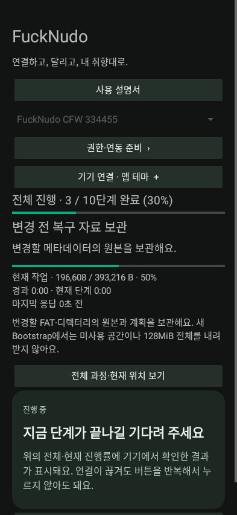

The phone keeps the original FAT/directory metadata to be changed and the allocation plan. Device-specific lower-flash/bootloader capture is retained and verified. Normal installation does not download the entire 128MiB NOR image; that is a separate backup operation.

## 6. Prepare, write and verify CFW files

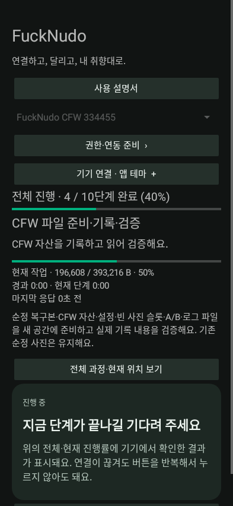

The package's stock recovery APP, fonts/Bluetooth resources, settings/photos/logs and A/B update slots are prepared and read back for verification. Existing stock photos are preserved. An ordinary fresh installation initializes new CFW settings/photo slots.

**A/B means firmware candidates and a known-good fallback, not two photo slots.** A prior good CFW is retained until the new candidate is confirmed.

## 7. Compare the final layout

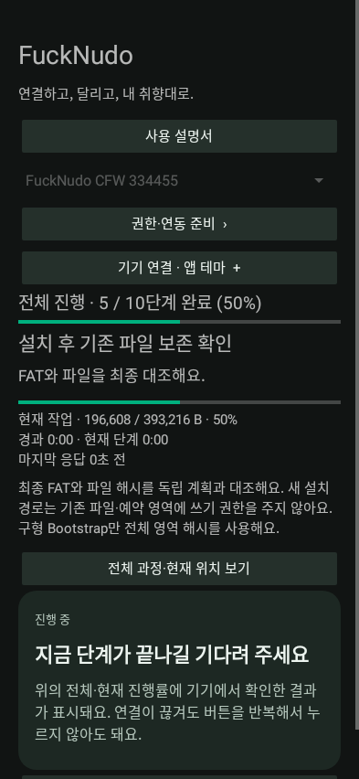
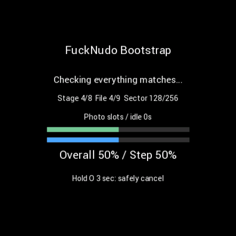

The app rechecks FAT, file ranges, required images and resources. A verification failure is not simply slow transfer. Preserve the app error and the device's Help code.

## 8. Stage the installation image

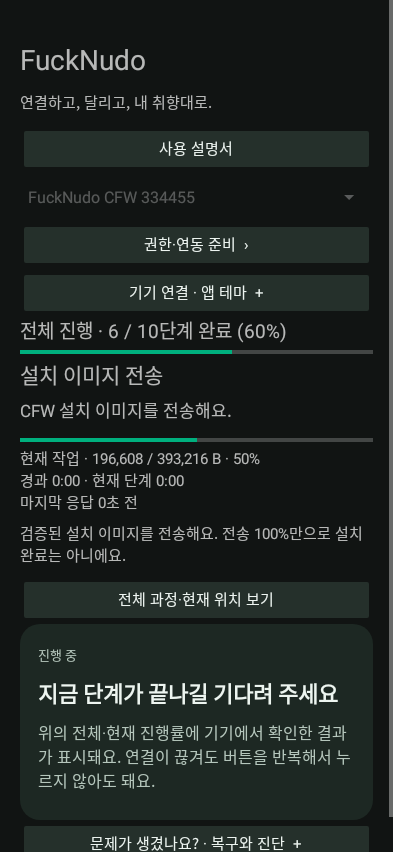
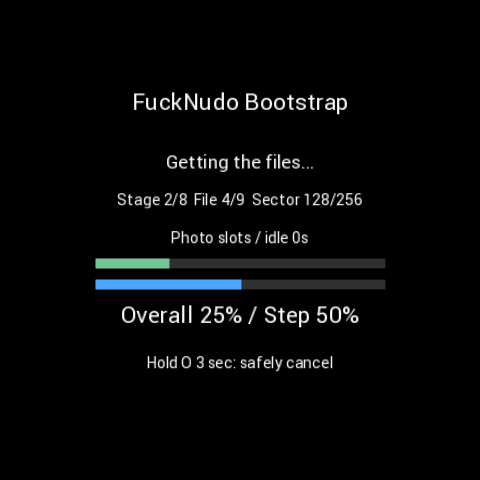

Byte progress belongs to the current operation. Overall stages are not a remaining-time estimate. Record file, sector and verification offsets if a failure occurs.

## 9. Approve Install CFW? on Noodoe

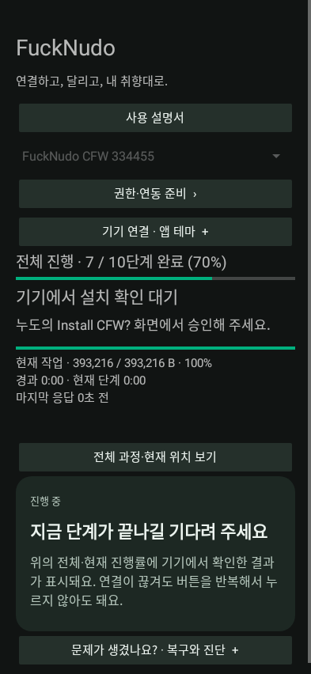
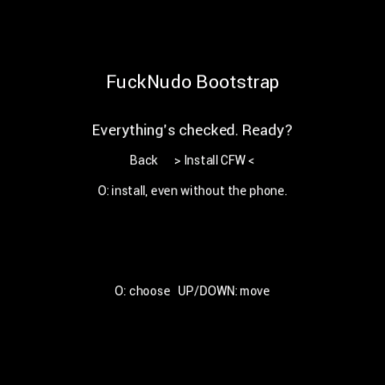

Release held keys first. Select `Install CFW` with UP/DOWN, then confirm with O as instructed on screen. Committed installation can continue without the phone. A phone error popup does not mean the whole image should immediately be sent again.

## 10. Install and restart

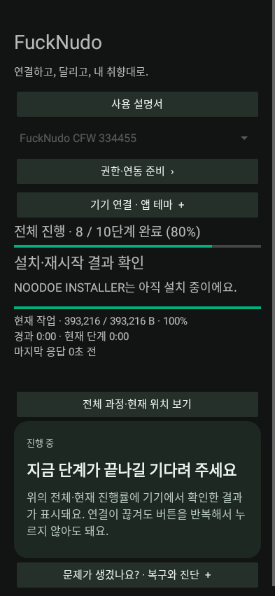
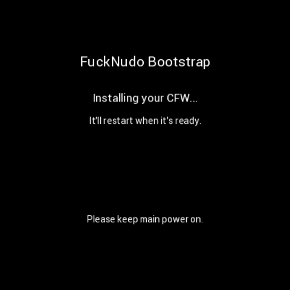

The stock writer may appear and Bluetooth may disconnect/reconnect. The app shows its last confirmed state. Do not confirm the new CFW while `NOODOE INSTALLER` is still displayed.

## 11. Confirm the actual new CFW screen

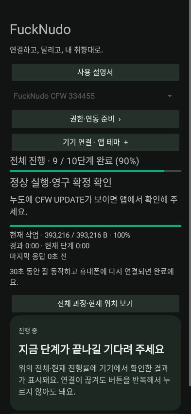
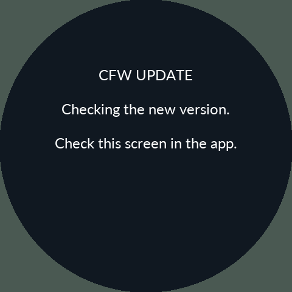

Only after the new CFW's `CFW UPDATE` screen actually appears, use the screen-confirmation button in the app. The app rechecks the device/candidate and Bluetooth. At least **5 seconds of healthy execution**, Bluetooth initialization and app reconnection are required.

The current candidate has a device-owned window of up to **5 minutes**; follow any different deadline reported by older running firmware. Screen approval does not extend it indefinitely. A failed candidate uses a known-good rollback when available. A first installation without a previous CFW may enter independent recovery instead.

## 12. Wait for completion

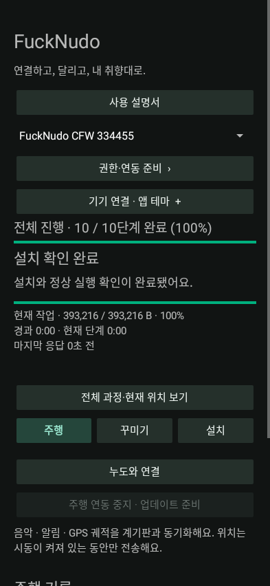

Completion requires the app to verify permanent candidate confirmation. First installation or an explicit fresh start prepares new CFW data. A compatible keep-data reinstall can restore retained records. Ordinary CFW updates preserve settings, photos, trips and maintenance baselines.

## Cancellation or a paused restart

During a cancellable Bootstrap session, release O and hold it freshly for **3 seconds** to request safe cancellation. An active write may need to reach a safe boundary. Committed work is not forcibly undone; IGN OFF alone does not cancel it.

If 0.9.62 shows `INSTALLATION PAUSED` with the manual-reset instruction, follow [paused-installation recovery](10-Recovery.en.md). Record Stage and Code/phase, hold UP+O together for 3 seconds, release the buttons, and inspect the same device/package's state. Older running firmware can still show its older wording. Do not apply this action merely because a transfer is still running.

## Other Bootstrap menus

| Main menu | Help |
|---|---|
| 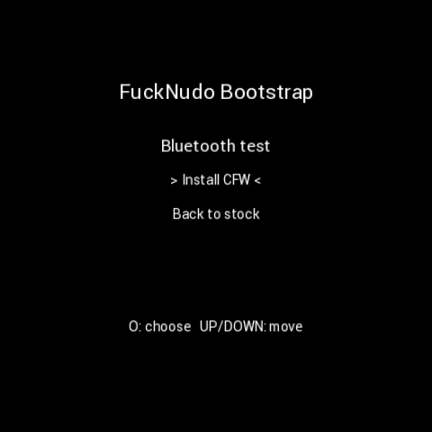 | 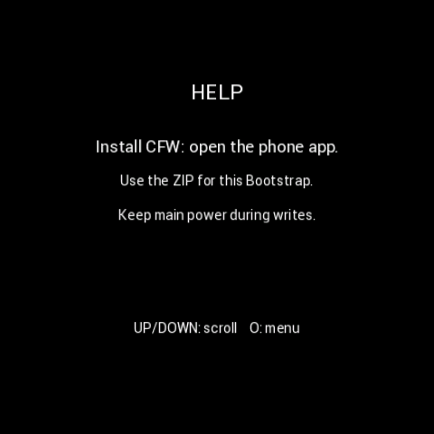 |

Use UP/DOWN to choose and O to enter. Ambient-light diagnostics show raw/lux/brightness values; Bluetooth test shows initialization, connection and request/reply state. Injected example values are not proof of a particular device's sensor or radio working.

| Ambient light | Bluetooth diagnostics |
|---|---|
| 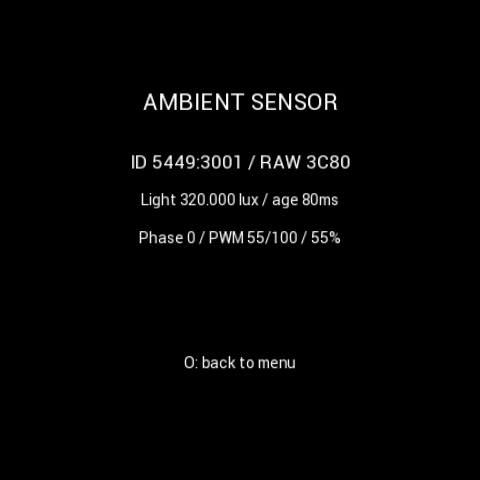 | 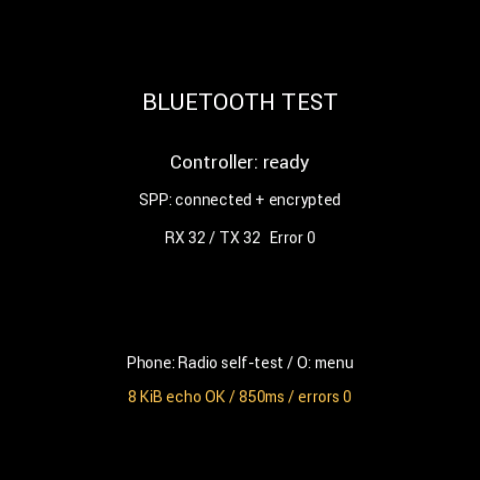 |

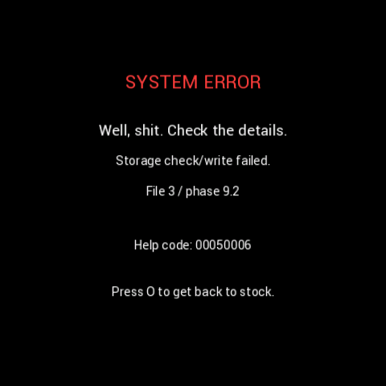

Keep Help codes together with phone logs. Closing a screen or resetting the app's connection state does not confirm an unknown device operation.
