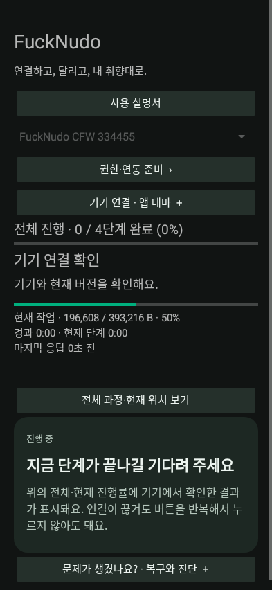
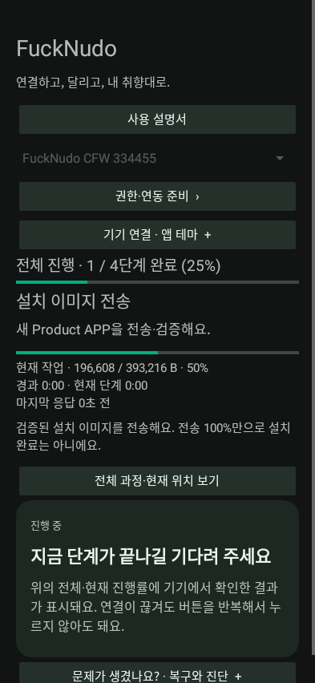
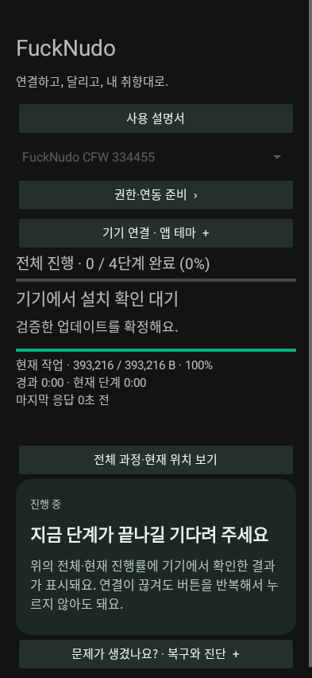
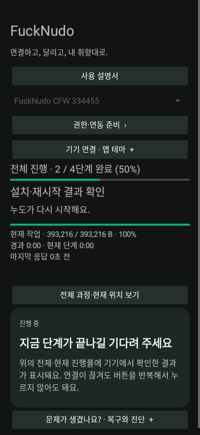
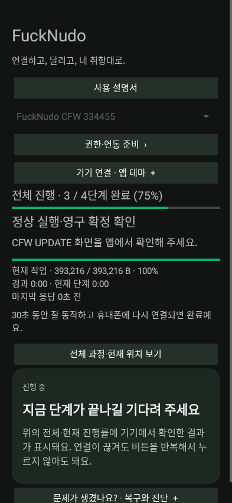
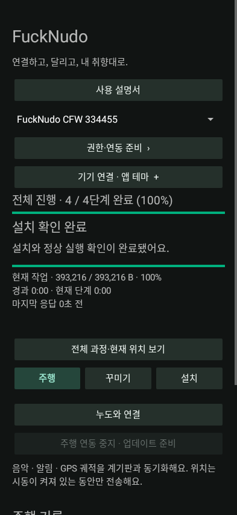

# Update an existing CFW

**APK / Product 0.9.65 · Manual revision 2 · 2026-10-07**

[Installation index](README.en.md) · [한국어](09-Update.md)

## Ordinary update

1. **Install APK 0.9.65 over the existing app**, retaining app data, logs and backups.
2. Select the correct Noodoe and **stop riding integration**.
3. Select the matching **0.9.65 ZIP** and start an ordinary CFW/Product update. The stock 5.14/5.16 requirement does not apply to the older CFW currently running.
4. Follow transfer, verification, local approval and restart instructions. When Gate and resources already match, the ordinary payload is the 384KiB Product APP.
5. Confirm the actual new `CFW UPDATE` screen in the app. Reconnect to the same device/candidate and wait for at least 5 seconds of healthy execution and permanent confirmation. The current candidate's maximum window is 5 minutes; follow the device-reported deadline for older firmware.

| Connection | Transfer and verification | Approval |
|---|---|---|
|  |  |  |
| Restart | New screen confirmation | Complete |
|  |  |  |

Update APK and ZIP as a pair. Gate, stock recovery, resources, Uninstall and Diagnostic are unchanged from 0.9.62. This ZIP includes the unchanged Bootstrap for first installation/reinstallation; normal Product updates do not replace an existing Bootstrap. A compatible Gate does not need reinstalling. If the app requires migration, follow **keep-data stock return → Bootstrap from the new ZIP → Gate+CFW → confirmed normal startup**.

## Resume after interruption

Use the same device and ZIP and follow **Identify device → Inspect last operation → Continue**. A complete staged image may be reused after integrity checks. A lost COMMIT/RESET reply does not justify repeating the request or bypassing unresolved records by changing ZIPs or clearing app data.

If 0.9.65 displays the manual-reset instruction, follow [recovery](10-Recovery.en.md). **The previously installed firmware performs the first restart, so older wording such as `Paused. See phone help.` may still appear during that handoff.** The new wording is not a fix for every underlying installation failure.

## Rollback and retained data

Ordinary updates and failed-candidate rollback retain settings, rider name, photos, trips and maintenance baselines. Explicit fresh start, reset and full removal are separate actions. A normal update does not repeatedly back up the entire NOR or recreate every file.

A candidate that fails execution or confirmation attempts a known-good rollback. If none exists or rollback fails, use Gate recovery. **100% transfer is different from permanent candidate confirmation.** See [troubleshooting](11-Troubleshooting.en.md).
