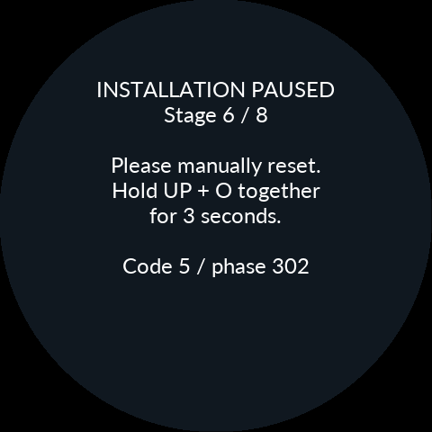
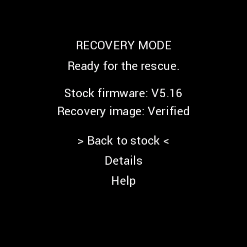
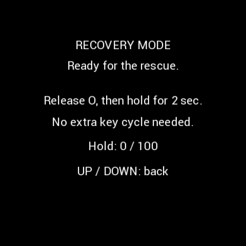
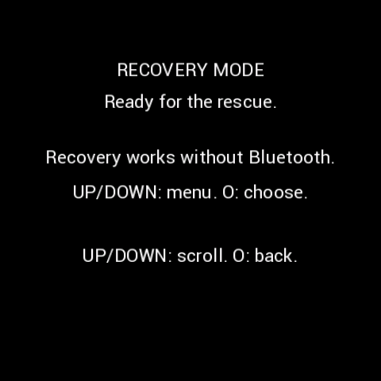

# 설치 정지·순정 복귀·표시부 복구

**APK / Product 0.9.61 · Manual revision 2 · 2026-10-07**

[설치 목차](README.md) · [English](10-Recovery.en.md)

## 먼저 화면에 맞는 경로 선택

| 현재 상태 | 사용할 경로 |
|---|---|
| `INSTALLATION PAUSED`와 수동 재시작 안내 | 아래의 UP+O 재시작 후 같은 작업 확인 |
| 앱만 ‘성공 또는 취소가 확인되지 않음’ 표시 | 먼저 같은 기기·ZIP의 마지막 작업 조회. 본체가 계속 기록 중인지 확인 |
| CFW는 살아 있으나 LCD 표시만 이상 | 빠른 설정의 표시부 재초기화 |
| CFW 부팅/업데이트 복구 필요, 폰 연결 불가 | 버튼으로 독립 Gate 진입 |
| 정상 CFW에서 순정으로 돌아가려 함 | 앱의 순정 복귀, 기본은 데이터 유지 |
| 페어링 승인 후에도 연결 실패 | [연결 복구](12-Connection-Recovery.md) |

## 1. 설치 오류 화면의 수동 재시작

0.9.61 Product의 기존 `Paused. See phone help.` 조건은 다음 안내를 표시합니다. Stage와 Code/phase도 남습니다.

```text
Please manually reset.
Hold UP + O together
for 3 seconds.
```

1. 화면·Stage·Code/phase를 기록하고, 가능하면 앱 진단 자료를 보관합니다.
2. 눌린 버튼을 모두 놓고 **UP(위)와 O(가운데)를 동시에 3초 유지**합니다.
3. 재시작하면 두 버튼을 놓습니다. IGN OFF였다면 새 화면/앱 안내에 맞춰 IGN ON으로 진행합니다.
4. 같은 기기·같은 ZIP으로 다시 연결해 마지막 작업을 조회합니다. 새 CFW가 실제 실행됐다면 화면 확인과 영구 확정을 마칩니다. Gate가 보이면 그 메뉴를 따릅니다.

이 조작은 MCU 재시작이며 설치 성공 선언이 아닙니다. 오류가 반복되면 Code/phase와 진단 ZIP을 보관하고 다음 복구 경로로 판단합니다. 정상 전송·소거·검증이 진행 중인 상태를 시간만 보고 강제 재시작하지 않습니다. 구버전에서 시작한 업데이트의 첫 재시작은 구버전 코드와 문구를 사용합니다.



그림의 Code 5 / phase 302는 시험 예시이며, 실제 Code 6 / phase 4 등과 동일 원인이라는 뜻이 아닙니다.

## 2. 폰 없이 Gate 메뉴로 진입

현재 호환 Product/Gate에서 **IGN OFF → O를 누르고 유지 → 누른 채 IGN ON → ON 후 2초 유지**합니다. 복구 화면이 나오면 놓습니다. UP/DOWN은 누르지 않습니다. 구버전의 대기 시간은 다를 수 있습니다.

`RECOVERY MODE / Ready for the rescue.`에서 UP/DOWN으로 항목을 선택합니다. `Back to stock`을 선택한 뒤 요청받으면 **O를 놓았다가 새로 2초 유지**해 승인합니다. 메뉴 진입 자체는 순정 복원을 승인하지 않습니다. Gate는 순정 이미지 검사 → NOR 준비 → 기록 검증 → 순정 설치기 실행 순서로 복원합니다.

| Gate 메뉴 | 순정 복귀 승인 | 도움말 |
|---|---|---|
|  |  |  |

**Gate에는 Bluetooth가 없습니다.** 폰 연결을 기다리지 말고 본체 메뉴를 사용합니다. 버튼 순정 복구는 데이터 유지 경로이며 완전 삭제를 자동 실행하지 않습니다.

## 3. 순정 복귀와 완전 삭제의 차이

| 앱에서 선택 | 동작과 남는 데이터 |
|---|---|
| 순정으로 돌아가기 · CFW 데이터 유지 | Gate가 순정 APP을 복원. CFW 설정·사진·데이터 파일은 이후 호환 재설치를 위해 유지 |
| CFW 데이터까지 완전 삭제 | 삭제 전용 이미지에서 로컬 승인 후 소유권이 확인된 CFW 내용·할당을 제거하고 순정으로 복귀 |

순정 사진·공장 정보·순정 파일은 보존합니다. 데이터 유지 복귀는 NOR 전체를 공장 출하 바이트로 돌리는 기능이 아닙니다. 삭제 이미지는 Bluetooth가 없는 로컬 작업이므로 폰 진행률이 안 바뀐다는 이유만으로 중단했다고 판단하지 않습니다.

순정 화면이 실제로 나타나면 앱에서 **본체에서 순정으로 돌아왔어요 · 확인**을 실행합니다. 새 순정 응답을 읽어 저널을 대조한 뒤 복귀 완료입니다. 재설치 시 **보관 데이터 복원 / 새로 시작**을 구분하세요. 순정과 CFW의 인증키가 다르면 재페어링이 필요할 수 있습니다.

## 4. LCD/EVE만 다시 초기화

일반 CFW에서 **O+DOWN(아래)으로 빠른 설정 → 버튼 놓기 → UP 0.8초 유지**입니다. 실행 중인 세션을 유지하면서 표시부만 재초기화합니다. MCU 재부팅·순정 복구·펌웨어 재설치와 다릅니다. 표시부 요청이 거절되면 안내를 확인합니다.

## 전원과 복구 범위

IGN OFF는 상시 12V 분리와 다릅니다. 차량 배터리/모듈 전원 분리는 외장 분해가 필요할 수 있습니다. 차량 로커는 위와 아래를 동시에 누를 수 없으므로 그런 조합을 요구하지 않습니다. CPU/저장소/복구 이미지 손상까지 모든 경우에 버튼 복구가 성공한다고 보장하지 않습니다. Diagnostic은 별도 조사용 이미지이며 정상 설치 확인을 대신하지 않습니다. [로그와 오류 해석](11-Troubleshooting.md).
