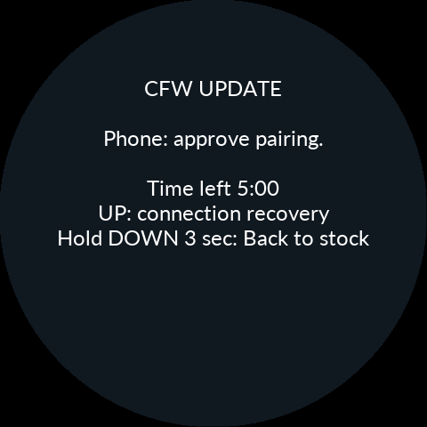
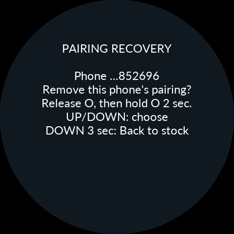
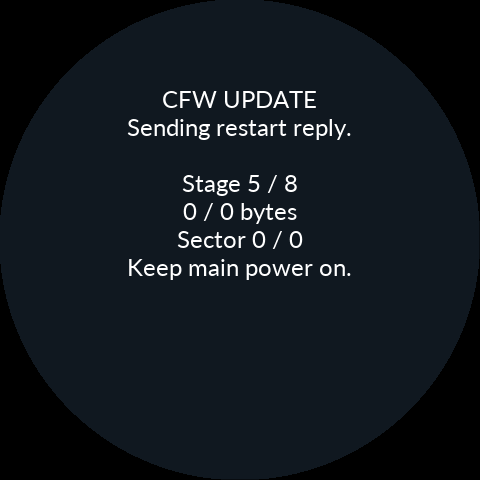

# 설치 연결 복구 — 0.9.34

## 0.9.34: 연결이 끊겨도 같은 설치 이어가기

**APK와 설치 ZIP을 함께 0.9.34로 사용하세요.** 전송 중 일시 단절은 앱이 자동으로
재접속한 뒤 기기·패키지·저장 위치를 확인해 이어갑니다. 키 불일치까지 자동으로
지우지는 않습니다. 이미 COMMIT된 작업은 취소/처음부터 설치보다 결과 확인이 먼저입니다.

### Couldn't Pair가 반복될 때

1. 앱의 **연결 복구 → 페어링 다시 설정 → Bluetooth 설정 열기**로 들어갑니다.
2. Android 설정에서 해당 Noodoe만 등록 해제합니다. 앱 데이터는 지우지 않습니다.
3. 누도 설치·새 버전 대기·롤백 화면에서 **UP**으로 연결 복구에 들어갑니다.
   UP/DOWN으로 내 폰 또는 **ALL**을 고르고 O를 놓았다가 새로 2초 눌러 승인합니다.
   ALL은 누도에 저장된 모든 폰의 키를 지웁니다.
4. 정상 CFW 메뉴를 사용할 수 있다면 **Main menu → Settings → Connections →
   Re-pair phone**으로 누도의 모든 폰 키를 지울 수도 있습니다.
5. 본체가 **Ready to pair**가 되면 앱으로 돌아와 **다시 연결하고 확인**을 누르고
   Android 페어링을 승인합니다. 파일을 재전송하기 전에 실제 설치 상태를 확인합니다.

폰과 본체 **양쪽**을 맞춰야 합니다. 롤백으로 코드가 돌아가도 저장 키가 폰과 함께
과거로 돌아가는 것은 아닙니다. 사진·설정·정비 기록·설치 로그는 이 조작으로 지우지 않습니다.

### 이전 CFW가 재부팅되지 않고 그대로 응답할 때

앱은 Bluetooth 연결 실패와 이전 CFW의 재부팅 인계 정지를 구분합니다. 먼저 결과
확인을 실행하고, 앱이 안전한 재개를 허용할 때 같은 설치를 이어가세요. 기존 본체의
고장 난 재부팅 코드는 새 APK만으로 교체되지 않습니다. 계속 막히면 기존 데이터 유지
순정 복귀를 사용한 뒤 새 패키지의 Bootstrap 경로로 설치합니다. [순정 복귀 설명](10-Recovery.md)을
참조하세요.

지원하는 설치 화면에서는 **DOWN을 놓고 새로 3초** 눌러 데이터 유지 순정 복귀를
요청할 수 있습니다. 시험 부팅 5분은 재연결·키 삭제로 초기화되지 않습니다.

### 메뉴도 반응하지 않을 때 — 새 Product 전용

**CFW 0.9.34 이상, IGN ON:** 모든 버튼을 놓고 **UP+DOWN을 함께 10초 유지한 뒤
모두 놓으세요.** 화면 메뉴와 별도로 MCU를 강제 재시작합니다. 저장 전 상태는 잃을
수 있으며 페어링을 지우지는 않습니다. CPU/I/O 태스크가 멎었다면 실행되지 않습니다.
기존 ↑+O 3초의 표시부 복구와는 다른 조작입니다. APK만 업데이트한 구 CFW에는 없습니다.

### NOODOE INSTALLER와 속도 안내

`NOODOE INSTALLER`는 기존 Gate가 시작·복구 검사를 할 때 쓰는 제목입니다. 일반
재부팅에서도 잠깐 보일 수 있으며, 그 제목만으로 파일을 설치 중이라는 뜻은 아닙니다.
이번 일반 CFW 업데이트는 Gate를 교체하지 않습니다.

Bootstrap은 표준 속도, Product만 고속을 시도합니다. 연결 진단에는 실제 UART
baud와 키 저장 세대가 기록됩니다. 고속 실패 화면에서는 O로 표준 속도를 재시도하고
DOWN 3초로 순정 복귀할 수 있습니다. 이 속도는 무선 실측 처리량과는 다릅니다.

[수정 근거·검사 보고서](../Validation/update-lifecycle-0.9.34.md)

## 이전 버전 변경 기록

## 0.9.33: 설치 완료 후에도 결과 확인 안내가 남는 경우

기기 설치와 정상 부팅 확정이 끝났는데 앱이 다시 결과 확인을 요청한다면 **새 APK에서 기존 결과 확인을 한 번 실행하세요.** 확인·이어하기·연결 복구 경로에서 남던 업데이트 작업 상태를 수정했습니다. 앱 데이터 삭제나 처음부터 파일 재전송은 필요 없습니다. Bluetooth 연결만으로 완료 처리하지 않고 같은 기기의 설치 패키지와 확정 상태를 대조합니다.

0.9.32의 설치·연결 성공은 사용자가 확인했습니다. 0.9.33은 해당 Bluetooth 초기화·인증 경로를 변경하지 않습니다. 렌더링 읽기 경로와 연료 경고 암전도 수정했습니다. [빌드·시뮬레이션 검증 기록](../Validation/render-performance-0.9.33.md)을 참고하세요.

## 0.9.32: 고속 실패 선택과 인증 복구

**APK와 설치 ZIP을 함께 0.9.32로 사용하세요.** 앱만 바꿔서는 실행 중인 이전 펌웨어의 인증 처리가 수정되지 않습니다. 정상 연결되는 CFW는 일반 업데이트이며 Gate 교체는 필요 없습니다. 이전 시험 부팅에서 연결되지 않으면 본체 DOWN을 놓고 새로 3초 유지해 데이터를 보존한 순정 복귀 후 새 패키지를 설치합니다.

고속 Bluetooth 검증이 실제로 실패하면 본체에 선택 화면이 나옵니다. **O를 놓고 새로 짧게 누르면 표준 속도 921,600으로 재시도**, **DOWN을 새로 3초 유지하면 데이터 유지 순정 복귀**입니다. Bootstrap은 표준 속도만 사용합니다. Product의 원래 5분 시험 부팅 기한은 선택이나 재연결로 연장되지 않습니다.

페어링 승인 직후 실패하는 0x05는 인증 오류입니다. 속도 실패와 별도로 처리합니다. 이전 인증 상태가 Bluetooth 재시작 뒤 남는 경로를 수정했으며 본체는 이제 `Pairing failed 3605`처럼 최초 이벤트와 상태를 함께 표시합니다. `3318`은 본체 정책 거절, `3605`는 SSP 인증 실패, `0605`는 인증 완료 오류입니다. 실패 화면의 전체 코드를 보관하세요. 이 단계에서의 실제 갤럭시 연결 성공은 아직 실기 검증 전입니다.

키가 맞지 않는 경우 기존 연결 복구를 이용합니다. 본체 UP → O를 놓고 새로 2초 유지해 대상 폰의 키 제거 승인 → Android 설정에서 해당 Noodoe만 페어링 제거 → 앱에서 다시 연결합니다. 앱 데이터와 설치 기록은 지우지 않아도 됩니다.

## 0.9.31: 새 CFW에서 페어링 승인 후 실패할 때

고속 Bluetooth가 표준 속도로 복귀할 때 남은 페어링 허용 시간이 사라지는 경로와, 고속 검증 완료 전에 연결을 허용하던 시점을 수정했습니다. 순정의 속도 전환 후 대기와 UART 변경 실패 처리도 반영했습니다.

**APK와 설치 ZIP을 함께 0.9.31로 맞추세요.** APK만으로 이미 실행 중인 구 Product를 수정할 수 없습니다. 정상 CFW이면 일반 업데이트를 사용하며 Gate 교체는 필요 없습니다. 구 시험 부팅에서 연결되지 않으면 본체 DOWN을 놓고 새로 3초 유지해 데이터 유지 순정 복귀 후 새 패키지로 설치합니다.

페어링 키가 이미 맞지 않으면 앱의 연결 복구 안내를 사용합니다. 본체 UP → O를 놓고 새로 2초 유지하여 대상 폰의 키 제거를 승인하고, 폰 Bluetooth 설정에서 해당 Noodoe만 페어링 제거 후 연결합니다. 앱 데이터를 지우지 않아도 됩니다. 본체의 `Pairing failed (0xXX)` 코드를 보관하면 실제 인증 오류와 통신 오류를 구분할 수 있습니다.

## 0.9.30: Bootstrap의 00050002

`262144 / 262144`는 마지막 파일 작업의 진행량이며 최종 성공 코드가 아닙니다. 준비 확인 요청의 일시적인 거부가 본체의 영구 오류가 되는 문제와, Back / Install CFW 화면의 UP을 페어링 복구가 가로채는 문제를 수정했습니다.

옛 Bootstrap에서 이미 멈췄다면:

1. 본체에서 DOWN을 놓았다가 새로 3초 유지하여 **데이터 유지 순정 복귀**를 합니다. 또는 O로 Back to stock에 들어가 O를 놓은 뒤 새로 2초 유지합니다.
2. 앱에서 순정으로 돌아왔음을 확인하여 기존 작업 결과를 정리합니다. 설치 기록이나 앱 데이터를 지우지 않습니다.
3. 0.9.30 APK와 ZIP을 선택하여 **새 Bootstrap부터** 설치합니다. 기존 데이터 복원을 선택합니다.

APK만 바꾸거나 실행 중인 옛 Bootstrap에서 이어하기만 눌러서는 수정이 적용되지 않습니다. 이미 잘 동작하는 주행용 Product는 재설치할 필요가 없습니다. 이번 Product는 0.9.29와 동일하며, 실제 저장 오류를 무시하거나 쓰기 검증을 끈 수정이 아닙니다.

다시 거부되면 코드와 함께 `File / phase` 또는 앱의 `command / state`를 보관해 주세요. 이 코드에는 여러 거부 원인이 포함됩니다.

앱과 설치 ZIP을 함께 0.9.30으로 맞춘다. 주행용 Product는 0.9.29와 동일하다. 일반 CFW 업데이트는 사진·설정·정비 기록을 유지한다. 정상 동작 중인 기존 PC13 표시부의 Product 업데이트에 Gate 교체는 필요하지 않다.

## 설치하다 연결이 끊겼을 때

재부팅 중 연결이 끊기는 것은 정상이다. 앱이 2초, 5초, 이후 10초 간격으로 최대 8회 재접속한다. 이 구간에서는 기기 버튼으로 다시 연결을 시작할 필요가 없다. 앱을 다시 열어도 같은 기기와 ZIP을 선택하여 이전 작업을 확인한다. 전송 완료 여부가 불명확한 COMMIT·RESET을 처음부터 반복하지 않는다.

순정에서 Bootstrap으로 넘어온 뒤에는 실제 기기 역할을 확인하고 설치 마법사를 이어간다. 보관 데이터 복원 또는 새로 시작 선택은 그대로 남는다. 순정의 NOODOE INSTALLER 화면은 아직 설치 중이며 Product의 부팅 완료 화면이 아니다.

## 대기 시간 두 가지

- **Time left 5:00**: 새 Product가 폰 연결과 설치 확인을 기다리는 전체 기한이다. 페어링을 다시 하거나 앱을 닫았다 열어도 늘어나지 않는다. 앱에서 기기 남은 시간을 받기 전에는 앱 자체의 연결 대기라고 구분해서 표시한다.
- **Checking CFW (5 sec)**: 폰의 화면 확인 후 정상 실행을 점검하는 시간이다. 단순히 Bluetooth가 연결됐다는 것만으로 설치를 확정하지 않는다.

앱의 확인 안내가 나타나면 실제 본체가 새 CFW 화면까지 왔는지 확인하고 진행한다. 0:00이 됐다고 임의로 실패나 성공으로 단정하지 않고 실제 확정·롤백 결과를 확인한다. 구버전의 3분 기한은 새 5분 기한으로 바꿔 표시하지 않는다.

Bootstrap의 최초 연결 대기도 5분이다. 작업 시작 후에는 전체 설치를 5분으로 자르지 않는다. 설치 도중 끊기면 그 시점부터 재연결 대기를 계산하고, 시간이 지나면 안전한 경계에서 멈춘다. 자료는 보존되며 본체 안내에 따라 다시 연결을 선택할 수 있다.

## Couldn't pair 또는 반복 연결 실패

앱의 **연결 복구**를 연다. 먼저 **다시 연결하고 확인**을 사용한다. 일시적인 무선 충돌은 제한된 횟수만 재시도한다. 거절·취소·인증 실패가 계속되면 요청 창을 무한히 띄우지 않는다.

페어링을 다시 만들기로 선택한 경우:

1. Android Bluetooth 설정에서 **해당 Noodoe만** 페어링 해제한다.
2. 본체의 Bootstrap 또는 새 버전 연결 대기 화면에서 **UP**을 누른다.
3. 저장된 폰이 여러 개면 UP/DOWN으로 대상 폰을 선택한다. 마지막 주소 6자리가 표시된다. O를 놓았다가 **새로 2초 유지**하여 확인한다.
4. `Pair again on your phone` 안내를 기다린 뒤 앱으로 돌아가 다시 연결한다. Android의 페어링 요청을 승인한다.

본체는 선택된 폰의 키만 지우고, 변경 내용을 저장한 뒤 다시 페어링을 연다. 사진·설정·설치 자료와 다른 폰의 키는 삭제하지 않는다. 저장 오류가 있으면 성공했다고 넘기지 않는다. 저장된 폰이 없으면 키 삭제 없이 페어링을 다시 시작한다. 새 Product의 5분 기한은 이 과정에서도 계속 흐른다.

## 폰 없이 순정으로 돌아가기

이 버전의 Bootstrap·시험 부팅 화면에서 **DOWN을 놓았다가 새로 3초 유지**한다. 데이터 유지 순정 복귀를 요청한다. 기록 중이면 안전한 경계를 기다린다. PH9 스위치나 폰 연결에 의존하지 않는다. 기존 키 OFF + O → 키 ON 긴급 복구도 유지된다. 구버전에는 새 DOWN 동작이 없으므로 기존 Back to stock 안내를 따른다.

## 5/8 Restarting에 머무를 때

새 본체 화면은 이미지 확정, 폰 페어링 저장, 재시작 응답 전송을 구분한다. 이미 재시작 응답을 보낸 작업은 뒤이은 Bluetooth 단절로 취소되지 않는다. 저장·응답 오류는 계속 Restarting이라고만 표시하지 않고 기록한다.

**새 펌웨어를 실행하기 전의 재부팅은 기존 펌웨어가 수행한다.** 기존 버전에서 이 경계가 멈춘 경우에는 새 이미지 전송만으로 그 실행 중인 코드를 바꿀 수 없다. 앱에서 작업 상태를 확인하고, 필요하면 데이터 유지 순정 복귀 → 새 Bootstrap 설치 → 보관 데이터 복원을 사용한다. 무작정 RESET이나 파일 전송을 반복하지 않는다.

## Bluetooth 속도와 하드웨어

Bootstrap은 921,600baud 경로만 사용한다. Product는 3,686,400baud를 시도하고 실패하면 921,600baud로 복귀한다. 정상 저속 복귀도 설치를 계속할 수 있다.

순정 어셈블리에서 확인한 GPIO strap 0~2의 EVE GPIO7 표시부와 3~15의 PC13 표시부를 구분한다. 패널 선택값 3/4와 기존 BL·복구 호환 조건을 함께 검사한다. PCBA 문자열의 숫자를 GPIO strap으로 추정하지 않는다. 구형 GPIO7 표시부의 신규 설치에는 이 버전의 Gate가 포함된 ZIP을 사용한다. 리비전 번호를 무작정 무시하는 방식은 사용하지 않는다.

## 화면 예시와 시험 범위

아래 그림은 실제 Product ARM/LVGL/EVE 명령과 RAM_G를 사용하는 **소프트웨어 시뮬레이션 캡처**다. 실제 LCD 사진이 아니다. 무선 연결·Galaxy S24 Ultra의 페어링·실차 전원 중단은 별도 실기 시험 대상이다.

