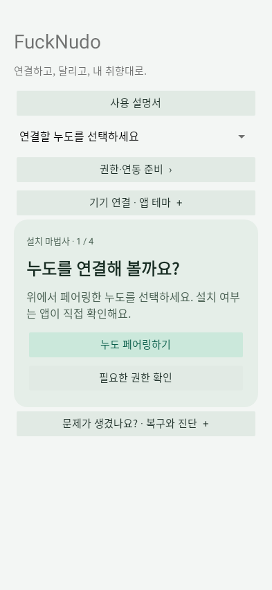

# 2. Android 앱 준비와 연결

[목차](README.md) · [주행 화면](03-Home-Trip.md)

## 기기 선택과 권한

앱 설치와 펌웨어 설치 과정은 [설치·복구 설명서](../Installation/README.md)에 따로 정리했습니다. 여기서는 이미 앱이 준비된 뒤의 연결과 사용을 다룹니다.

홈에서 연결할 Noodoe를 고릅니다. 순정은 `KYMCO Noodoe ...`, CFW는 **`FuckNudo CFW XXXXXX`** 형식이며 뒤 6자리는 Bluetooth 주소 끝 세 바이트입니다. 다른 기기의 작업 기록을 현재 기기에 재사용하지 않습니다.

`권한·연동 준비`에서 필요한 항목을 켭니다. 권한 창은 Android가 제공하므로 앱이 사용자를 대신해 자동 승인하지 않습니다.

| 항목 | 필요한 기능 |
|---|---|
| Bluetooth/주변 기기 | 페어링, SPP 연결, 업데이트 |
| 알림 접근 | 휴대전화 알림과 활성 미디어 세션 확인 |
| 정밀 위치, 필요한 백그라운드 위치 | 화면 꺼짐 상태의 폰 GPS 전송 |
| 동반 기기 등록 | 등록된 기기의 자동 연결과 백그라운드 연동 |
| 연락처 | 전화 즐겨찾기와 이름 표시 |
| 최근 통화 기록 | 최근 통화 10개 |
| 발신·전화 상태·동반 통화 제어 | 발신, 수신 상태, 받기·종료 |
| 앱 알림 허용 | 서비스 상태 알림과 테스트 알림 |

권한을 거절하면 해당 기능만 사용할 수 없거나 `Permission Denied!`로 표시됩니다. Android 버전과 제조사에 따라 통화 제어 승인 경로가 다릅니다. 기존 기본 전화 앱과 헤드셋을 그대로 사용합니다.

## 자동 주행과 수동 중지

Product CFW로 확인된 등록 기기에 연결하면 기본적으로 **주행 연동**을 시작합니다. GPS·음악·알림 전송은 주행 기록 파일 저장 여부와 독립적입니다. 업데이트하려면 먼저 주행 연동을 수동으로 중지합니다. 업데이트 도중 자동 주행 연결로 끼어들지 않습니다.

휴대전화 화면이 꺼져도 서비스가 실행 중이고 권한이 유지되면 GPS와 음악 정보를 전송합니다. 앱을 최근 앱에서 숨기는 것과 Android 설정의 **강제 종료**는 다릅니다. 강제 종료·권한 철회·OS 중단 뒤에는 앱을 다시 열고 안내에 따라 재개해야 할 수 있습니다. Galaxy에서는 앱의 배터리 제한 및 절전 예외도 확인하세요.

## 앱 설정과 기록

- 앱 테마: 시스템 / 라이트 / 다크. 누도 본체 테마와 별개입니다.
- 앱 언어: 시스템, 영어, 한국어, 일본어, 중국어 간체, **대만용 중국어 번체**, 스페인어. 본체 고정 UI는 영어입니다.
- 주행 기록 저장: **기본 OFF**. 필요할 때 `주행 기록 시작`, 끝나면 종료합니다. 기존 기록 조회·내보내기는 유지됩니다.
- `사용 설명서`: 이 GitHub 설명서를 브라우저로 엽니다. 설치·연결 상태를 초기화하지 않습니다.
- 설정/사진 작업과 업데이트는 서로 다릅니다. 폰에서 선택만 했다고 기기에 영구 저장된 것이 아니므로 결과를 확인하세요.

## 휴대전화 화면을 끈 채 사용하기

여기서 ‘화면 OFF’는 **휴대전화의 잠금·화면 꺼짐**입니다. 누도 화면을 끌 필요는 없습니다. 연결된 주행 연동 또는 사용자가 켠 키 OFF 사용 모드에서 음악·GPS 전송을 계속합니다. 폰의 주행 기록 저장을 켜는 것과도 별개입니다.

1. 등록 기기를 선택하고 `권한·연동 준비`에서 Bluetooth, 알림 접근, 위치와 동반 기기 등록 상태를 확인합니다.
2. 정상 Product에 연결되어 주행 연동이 시작되는지 확인합니다. 음악 앱에서 재생을 시작한 뒤 폰을 잠급니다.
3. 화면을 다시 켜야만 갱신된다면 앱의 백그라운드 실행·배터리 제한과 음악 앱의 미디어 알림을 확인합니다. 강제 종료했다면 앱을 다시 실행합니다.

0.9.17부터 미디어 감시는 화면(Activity)이 아닌 서비스가 담당합니다. 작은 곡 상태를 먼저 보내고, 글자 렌더링·앨범아트 읽기와 압축은 별도 작업에서 처리합니다. 활성 주행 중에는 만료 시간이 있는 CPU wake lock을 갱신하지만 폰 화면은 켜지 않습니다. 주행 비활성·연결 해제 시 해제합니다. 실제 Galaxy S24 Ultra의 화면 OFF 지연과 소비전력은 아직 실측하지 않았습니다.
