# 3. 홈, 거리, 트립 컴퓨터와 정비

[목차](README.md)

## 홈의 세 가지 보기

UP/DOWN으로 아래 세 화면을 순환합니다.

| 배경만 | 날짜 | 큰 속도와 날짜 |
|---|---|---|
| 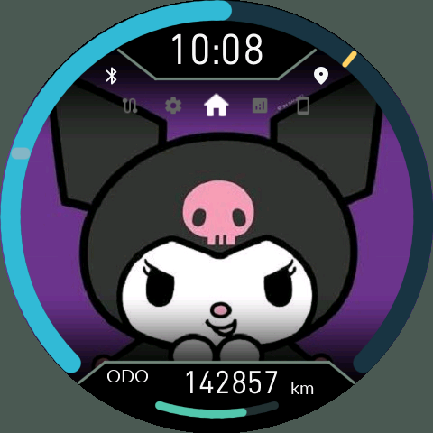 | 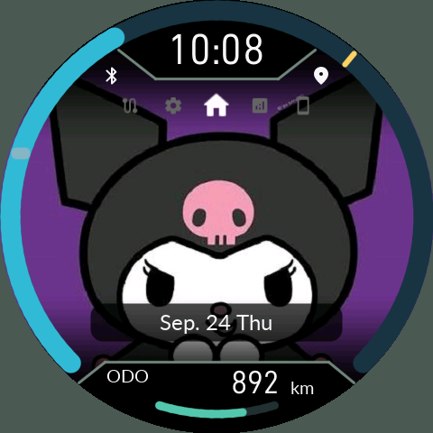 | 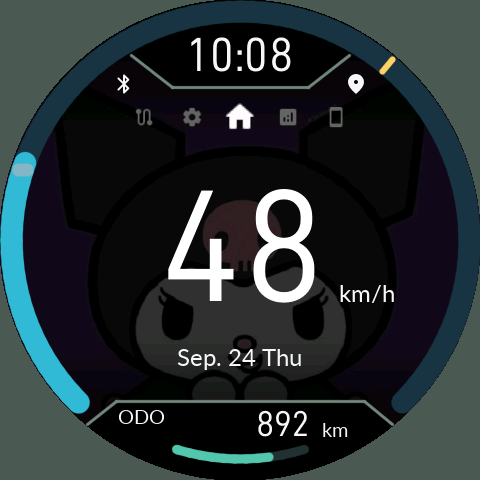 |

배경 보기는 가운데 정보를 비웁니다. 날짜 보기에는 날짜 뒤에 둥근 반투명 바가 붙습니다. 큰 속도는 최대 세 자리 고정 위치로 표시하며 리딩 제로를 붙이지 않습니다. 멈춰 있으면 `0`입니다. 단위는 km/h 또는 mph입니다.

## 속도 링의 시동 세션 마커

6.11.1부터 평균속도는 최고속도와 같은 방사형 막대로 표시합니다. 평균 막대는 12px, 최고 막대는 6px이며 둘 다 링 안에 들어갑니다.

최고 마커는 원시 속도값으로 먼저 뛰지 않고 **보간된 링이 화면에서 도달한 가장 먼 위치**에 남습니다. 색도 그 위치에서 링이 보였던 색입니다. 짧은 순간의 원시 최고속도 기록은 별도로 유지하므로, 트립의 숫자 기록과 부드럽게 움직인 링의 최대 위치는 다를 수 있습니다. 시동 직후 링 테스트는 최고 기록에 포함되지 않습니다. 확정된 새 시동 세션에서 초기화되며 1초 OFF 유예 중 다시 ON으로 돌린 경우에는 유지됩니다.

## 하단 거리 모드

홈에서 O를 길게 누르면 하단 모드가 다음으로 바뀝니다. 트립 화면에서는 UP/DOWN 길게 누르기도 사용할 수 있습니다. Reserve 잠금 중에는 일반 모드로 바꿀 수 없습니다.

| 모드 | 의미 |
|---|---|
| ODO | 계기판에서 받은 총 주행거리. CFW가 GPS로 만들어내는 값이 아닙니다. |
| TRIP 1 / TRIP 2 | 각각 TRIP A / TRIP B와 연결된 사용자 트립 거리 |
| 주유소 아이콘 / TRIP F | 저연료 Reserve 진입 **후 주행한 거리** |
| OIL | 오일 정비 기준점 이후 거리 |
| BELT | 벨트 정비 기준점 이후 거리 |
| 스패너 아이콘 / SERV | 일반 정비 기준점 이후 거리 |

| TRIP 1 | TRIP 2 | OIL |
|---|---|---|
| 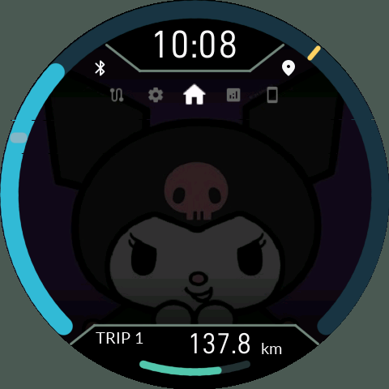 | 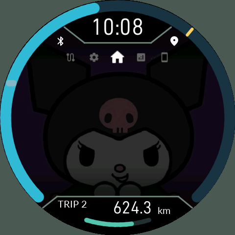 | 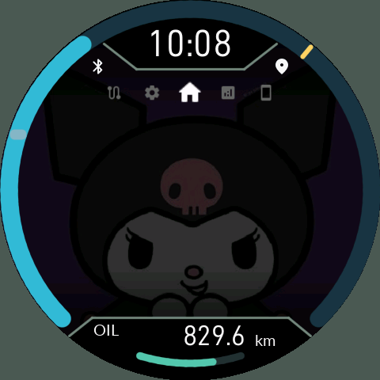 |
| BELT | SERV | |
| 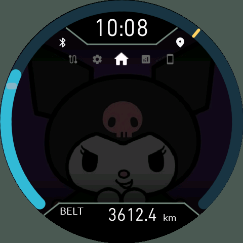 | 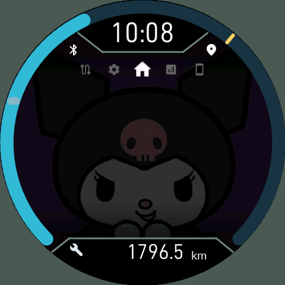 | |

숫자와 km/mi는 자리수가 바뀌어도 위치가 고정됩니다. 불필요한 앞자리 0은 붙지 않습니다. OIL/BELT/SERV는 정비 설정의 `Service completed`를 확정해 기준점을 갱신합니다. 현재 화면에는 과거 버전의 HOURS/DAYS 보조 줄이 없습니다. 시간과 날짜 기준은 내부 수명 계산에 계속 사용합니다.

## 상세 트립 컴퓨터

| TRIP A | TRIP B |
|---|---|
| 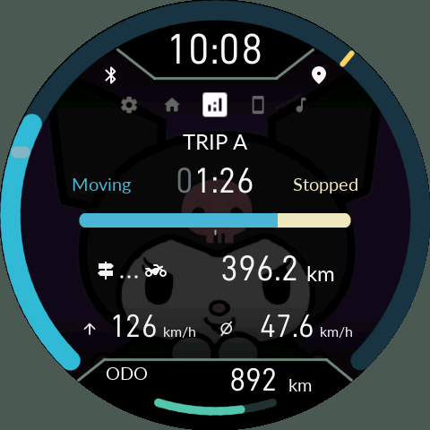 | 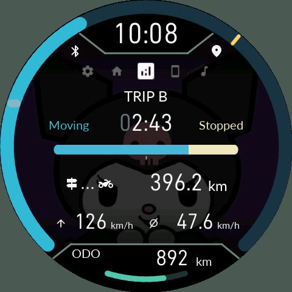 |
| TODAY | SINCE REFUEL |
| 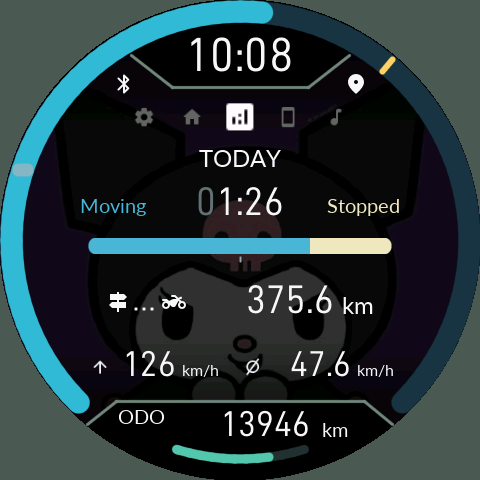 | 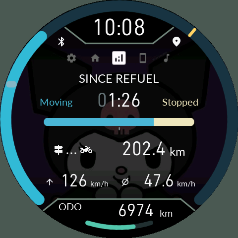 |

UP/DOWN으로 네 항목을 고릅니다. 가운데 큰 시간은 이동 시간 `H:MM`이고, 고정 폭 맞춤용 앞자리 0은 회색입니다. Moving은 푸른색, Stopped는 밝은 노란색이며 막대가 비율을 나타냅니다. 아래는 주행거리, 최고속도, 평균속도입니다.

- TRIP A/B: O를 길게 누르면 **별도 확인창 없이 즉시 초기화**합니다. `Hold O to reset` 안내가 처음 3초 표시됩니다.
- TODAY: 해당 날짜의 기록입니다. 날짜 설정을 바꾸면 분류에도 영향을 줍니다.
- SINCE REFUEL: 안정된 연료량이 두 칸 이상 증가한 주유 이벤트를 기준으로 합니다. 임의의 순간 표본 하나를 주유로 보지 않습니다.
- `Stop threshold` 기본 5km/h, 설정 가능 0~10km/h. 기본값에서는 5km/h 미만을 정차 시간으로 분류합니다.
- 미수신 시간은 별도로 관리합니다. 계기판 TRIP과 동일한 계측원이 아니므로 완전히 같은 값을 보장하지 않습니다.

## Reserve: 잔여 주행 가능 거리가 아닙니다

| 1.1km | 24.8km |
|---|---|
| 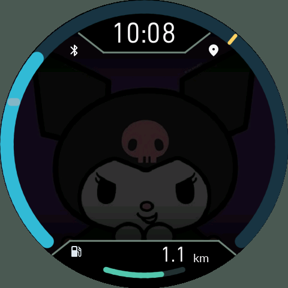 | 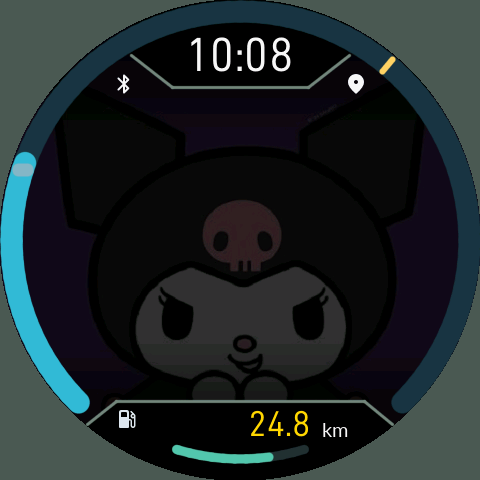 |

**24.8처럼 Reserve 주행거리가 20km를 초과하면 숫자가 노란색**으로 바뀝니다. 연료가 앞으로 몇 km 갈 수 있다는 뜻이 아닙니다. mi 표시에서도 물리적 20km 기준이 적용됩니다. 0칸 연료의 안정된 표본이 Reserve를 시작하고, 2칸 이상이 3초간 확인되면 해제·초기화합니다. 연료 원시값 오류를 0칸으로 오인하지 않습니다.

## ODO 보호

특정 KYMCO 차종에서 ODO가 그대로 증발하여 0으로 리셋되는 기괴한 문제가 보고되었으며, 이 점에 대한 솔루션으로써 제공되는 기능입니다. 평소에는 볼 일이 없으며, 계기판이나 누도 중 하나를 수리할 때나 계기판이 오류를 일으켜 ODO를 초기화했을 때 유용한 옵션입니다.

유효한 ODO를 별도 기록에 보관합니다. 새로운 값이 역행하거나 시간에 비해 크게 뛰면 여러 새 표본을 확인한 뒤 경고합니다. 정차·IGN ON·저장소 준비 조건에서 다음 중 선택합니다.

- **저장된 거리 유지**: 기존 표시 기준을 유지하고 이후 새 계기판 값의 증가량을 더합니다. 화면의 `ODO*`는 이 보정 표시입니다.
- **계기판 값 사용**: 현재 계기판 값으로 새 기준을 정합니다.
- **나중에**: 바로 확정하지 않고 확인을 미룹니다.

차량 계기판 메모리를 쓰거나 실제 차량 ODO를 변경하는 기능은 아닙니다. 최초 기준이 저장되기 전에 이미 잃어버린 과거 거리는 복구할 수 없습니다. 키 OFF 때 잠깐 통신이 없어져도 마지막 유효 ODO를 유지합니다. 폰의 기기 설정에서도 상태와 선택 결과를 볼 수 있습니다.

## 정비 잔량

아래의 짧은 호는 설정된 오일 정비 수명 잔량입니다. 거리·키 ON 시간·날짜 중 켜 둔 기준을 함께 평가하며, 가장 먼저 도래하는 기준이 잔량을 제한합니다. `Key ON hours`는 실제 엔진 회전 시간이 아니라 **키 ON 시간**입니다. 정비를 실제로 수행한 뒤 해당 항목의 `Service completed`를 확정하세요. 한 정비 기준 초기화가 다른 정비나 총 ODO를 지우지 않습니다.
