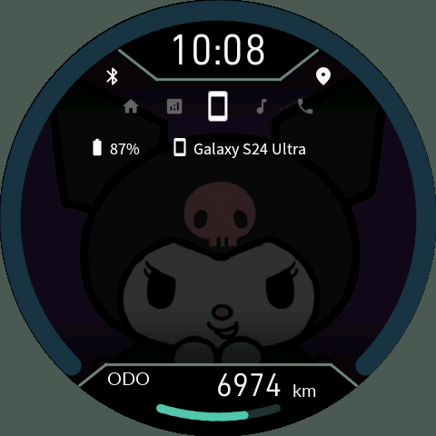
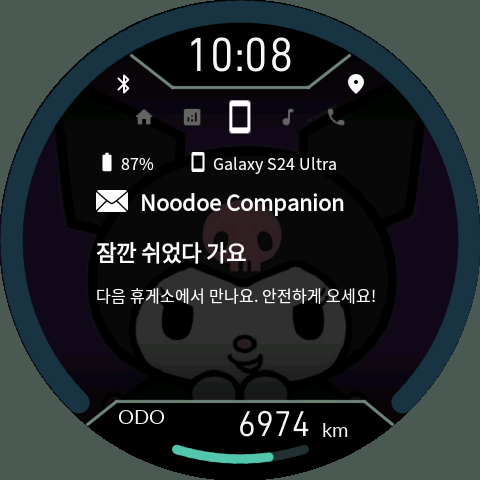
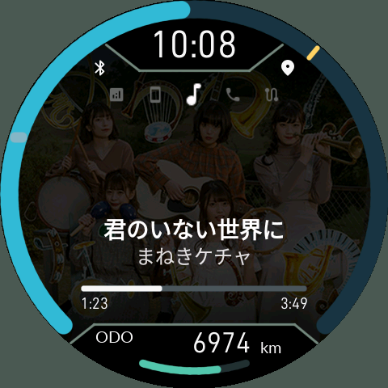
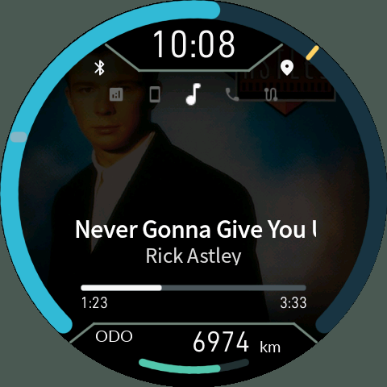
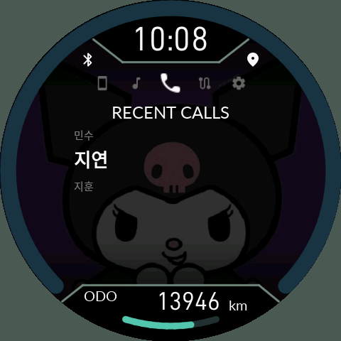
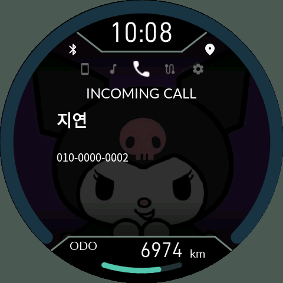

# 4. 휴대전화 알림, 음악과 전화

> **0.9.20 변경:** [다섯 메뉴·최신 알림 팝업·답장 10개·지도 설명](14-Map-Popup.md)을 함께 확인하세요. 자동 알림 페이지 이동은 팝업으로 대체되었습니다.

[목차](README.md)

## 휴대전화 페이지

| 대기 | 알림 열기 |
|---|---|
|  |  |

스마트폰 메뉴는 가운데 **상태 요약**, 위쪽 **최근 전화 최대 5개**, 아래쪽 **최근 알림 최대 9개**로 구성합니다. O로 다른 주 메뉴에서 들어오면 항상 상태 요약에서 시작합니다. UP은 전화 쪽, DOWN은 알림 쪽으로 이동하며 실제로 존재하는 항목만 표시합니다.

요약은 전화·문자·앱 미확인 알림 수와 배터리를 아이콘으로 표시합니다. 개수는 최대 999이며, 미수신·권한 없음은 정상 0으로 위장하지 않습니다. 상세 알림에는 앱 아이콘·앱 이름·도착 시각·제목·본문이 표시됩니다. 상세 카드의 기기명·배터리 헤더와 하단 페이지 번호는 없습니다. 위 사진은 이전 배치의 예시입니다.

폰 앱에서 전달할 앱을 허용하고 Android의 알림 접근을 켜야 합니다. 삭제된 알림은 읽을 수 있어도 답장은 불가능할 수 있습니다. **50km/h 초과에서는 상태 요약으로 돌아가 상세 조작을 제한**합니다. 속도 미확인도 조작 제한에 영향을 줍니다.

### 알림 활성화와 연속 수신

알림 접근이나 해당 앱의 전달을 켠 **이후 새로 도착한 알림만** 받습니다. 알림창에 이미 쌓여 있던 메시지는 가져오지 않습니다. 같은 내용의 반복 갱신이나 묶음 요약·상시 서비스 알림을 새 메시지로 계속 세지 않습니다.

글자·앱 아이콘 전송과 기기의 검증이 끝난 내용부터 표시합니다. 그동안 이전 완성 화면을 유지하며, 요약의 미확인 수는 상세 카드 9개와 별도로 관리합니다. 카드를 실제로 읽거나 폰에서 알림이 제거되면 줄어들며, 오래된 카드가 목록에서 밀려났다는 이유로 줄어들지는 않습니다. 연속 수신 중에는 대기 중인 같은 알림의 수정을 합치고, 이미 전송 중인 한 건은 완료합니다. 최대 9건을 넘는 폭주에서는 중간 알림이 생략될 수 있습니다. 폰 배터리 갱신 때문에 알림 전체를 다시 전송하지 않습니다.

알림의 CJK 글자는 폰에서 렌더링해 전송합니다. 현재 확보된 순정 NOR 자료에는 재사용을 검증한 정상 글꼴 파일이 없어 순정 글꼴을 사용하는 방식으로 바꾸지 않았습니다.

### 새 알림 잠깐 보기

누도의 Connections 설정이나 폰의 기기 설정에서 **Notification preview**를 켤 수 있습니다. 기본값은 OFF입니다. **Preview seconds**는 기본 5초, 3~30초 범위입니다. 새 알림이 수신되면 잠시 휴대전화 페이지를 보여주고 이전 페이지와 선택 항목으로 돌아갑니다. 연속 알림은 마지막 알림부터 시간을 다시 셉니다.

자동 표시는 현재 페이지 위의 팝업입니다. 최신 적격 알림 하나만 도착 후 10초 동안 표시합니다. UP/DOWN 또는 O 짧게 닫고, O 길게 빠른 답장을 엽니다. 메뉴·하위 선택은 바꾸지 않습니다. 팝업과 빠른 답장은 60km/h 미만에서만 허용하며, IGN ON에서 속도 미확인은 차단합니다. 통화·경고·설치·전원 화면이 우선합니다. 활성화 전 알림과 재연결 기록을 새 팝업으로 재생하지 않습니다.

폰에서 전달 앱을 고르는 목록은 실제 앱 아이콘·앱 이름·패키지명을 함께 표시합니다. **중요한 알림만 자동 표시** 옵션을 켜면 Android의 중요 알림 또는 사용자가 지정한 중요 앱의 알림만 자동 미리보기를 띄웁니다. 다른 허용 알림의 카드·미확인 집계·답장은 유지됩니다. 옵션 변경으로 과거 알림을 새 팝업처럼 다시 띄우지 않습니다.

### 빠른 답장과 테스트

답장 가능한 알림에서 O를 길게 눌러 답장 목록을 엽니다. UP/DOWN으로 선택하고 O 짧게 보내기를 확정합니다. 폰에서 문구를 **최대 10개** 설정하며 다섯 개씩 표시합니다. O 길게는 선택 취소입니다. 기본 서명은 `Sent from my Noodoe dashboard.`이며 수정하거나 비울 수 있습니다. 일반 알림 또는 웨어러블 확장의 자유 입력 답장 액션을 지원합니다. 폰에서 빠른 답장 문구를 먼저 등록해야 합니다. `No reply action from app`은 해당 알림이 직접 답장을 제공하지 않는 경우, `Set quick replies in phone app`은 문구 미등록, `Replies loading`은 목록 전송 대기입니다. 삭제되거나 내용·대상이 바뀐 오래된 알림에는 전송하지 않습니다. Android 알림이 직접 답장 액션을 제공해야 하며, 성공 결과는 해당 메시지 앱에 인계했다는 뜻입니다. 상대방 수신 확인은 아닙니다.

앱의 알림 테스트를 사용하면 허용·전송·표시 경로를 점검할 수 있습니다. 테스트 알림에도 시스템 알림 권한과 연결이 필요합니다.

## 음악 페이지

| 일본어·컬러 표시 | 영어 표시 |
|---|---|
|  |  |

제목은 굵게, 아티스트는 그 아래에 표시됩니다. 긴 제목은 글자를 계속 줄이지 않고 잠시 대기한 뒤 스크롤합니다. 영문·숫자·CJK를 포함한 모든 가변 음악 글자는 폰에서 렌더링해 보냅니다. `No Media Playing Now` 같은 고정 안내는 내장 글꼴입니다. 누도 내부에 전체 CJK 글꼴을 설치할 필요가 없습니다. 음악 정보는 Android MediaSession을 제공하는 플레이어가 기준입니다.

- UP 짧게: 재생/일시정지.
- UP 길게: 이전 곡.
- DOWN 짧게: 다음 곡.
- O 짧게: 다음 주 메뉴.
- 아래 재생바와 좌우 시간: 현재 위치 / 전체 길이.

앨범아트가 있으면 **음악 페이지에서만** 일반 사진보다 우선합니다. 다른 페이지로 이동하면 지정 배경으로 돌아옵니다. 앨범아트는 폰에서 480×480으로 축소·압축하고 메모리에서 사용합니다. 사진 슬롯을 덮어쓰지 않습니다. 곡명·아티스트와 제어 응답은 큰 그림 전송보다 우선하지만, 플레이어가 늦게 메타데이터를 제공하면 즉시 표시할 수는 없습니다.

예시 곡은 **まねきケチャ — 君のいない世界に**와 **Rick Astley — Never Gonna Give You Up**입니다. 첫 곡은 한자·가나와 다섯 멤버가 나온 컬러 앨범아트, 두 번째는 영어 제목 표시의 예시입니다. 긴 영어 제목은 한 프레임에 전부 들어가지 않고 스크롤합니다. 재생 위치는 설명서용 시험값입니다. [출처](12-Capture-Notes.md)

### 곡 전환, 미리 준비와 앨범아트

0.9.17은 현재 곡의 오디오 페이지·HOME 한 줄·HOME 두 줄 글자를 미리 준비합니다. 페이지를 나갔다가 돌아오거나 재생 위치·일시정지만 바뀌었다는 이유로 같은 글자를 다시 만들지 않습니다. HOME 두 줄의 제목과 아티스트는 따로 스크롤하므로 짧은 아티스트까지 함께 밀려나지 않습니다. 첫 그림이 준비되는 동안 아이콘은 제자리에 두고 점 애니메이션으로 대기를 알립니다.

새 곡이 오면 이전 앨범아트는 최대 10초 유지합니다. 아트 없음이 확정되면 일반 배경으로 돌아가고, 아트 읽기·전송이 진행 중이면 기한 안에서 기다립니다. 기한 이후라도 현재 곡의 아트가 완성되면 표시합니다. 이전 곡의 늦은 완료는 새 곡에 표시하지 않습니다.

앨범아트는 최종 480×480 이미지 한 번을 전송합니다. 작은 미리보기와 큰 그림을 이중 전송하지 않습니다. 글자 캐시는 최대 128KiB/6타일, JPEG 캐시는 최대 256KiB/6개로 제한합니다. 0.9.17.1 APK는 같은 아트의 인코딩 실패가 즉시 반복되지 않도록 재시도에 5초 간격을 둡니다. 새 아트는 이 대기를 공유하지 않습니다.

이 처리는 **휴대전화 화면이 꺼져 있을 때도** 서비스에서 수행합니다. 누도는 켜진 채 사용하면 됩니다. 플레이어가 아직 제공하지 않은 정보까지 미리 만들어낼 수는 없으므로, 지연이 계속되면 [진단 자료](../Installation/11-Troubleshooting.md)를 남겨 주세요.

## 전화 페이지

| 연락처 선택 | 수신 전화 |
|---|---|
|  |  |

전화 기록은 별도 주 메뉴가 아니라 **스마트폰 요약에서 UP으로 올라가는 영역**에 있습니다. 최신 기록 최대 5개를 한 화면에 한 건씩 표시합니다. 이름·전화번호·통화 시각과 수신/발신/부재중 표시를 확인한 뒤 O를 길게 눌러 발신합니다. 위 사진은 예전 목록 배치이며 현재는 항목 한 건씩 이동합니다.

수신하면 현재 메뉴 위에 전화 팝업을 표시합니다. **O 짧게는 팝업만 닫기 / 아래 짧게는 받기 / 위 0.8초 길게는 거절·종료**입니다. 원래 페이지와 선택은 바뀌지 않으며, 설치·복구·연료 경고·시동 종료 화면의 우선순위를 유지합니다. [수신 감지 권한과 Android 버전별 안내](21-Calls-Backlight.md)를 확인하세요.

전화 권한은 연락처, 최근 기록, 발신, 통화 제어가 별개입니다. 목록이 보인다고 받기·종료 권한까지 확보된 것은 아닙니다. 통화 제어 권한이 없다는 이유로 조회 가능한 목록 전체를 가리지 않습니다. 실제로 필요한 권한이 없어 `Permission Denied!`가 남으면 앱의 권한 센터에서 해당 동작의 승인을 확인하고 다시 연결합니다. 계기판 조작 스위치가 차단 상태이면 전화 버튼도 작동하지 않습니다. 음성은 기존 폰/헤드셋으로 연결되며 누도는 통화 스피커가 아닙니다.
