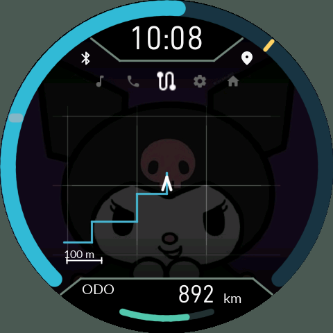
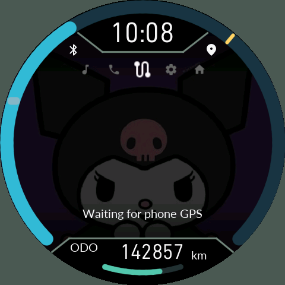

# 5. 휴대전화 GPS 궤적

[목차](README.md)

| 위치 수신 중 | 위치 대기 |
|---|---|
|  |  |

현재 위치의 화살표를 가운데 두고 최근 이동 궤적을 그립니다. 지도 타일, 길 안내, 목적지 경로 탐색 기능은 아닙니다. 외장 Bluetooth GPS와 OBD 연결은 현재 제품 범위에 없습니다.

- **UP**: 확대, **DOWN**: 축소. 6단계 범위에서 변경합니다.
- **O 길게**: 북쪽을 위로 고정 / 진행 방향을 위로 고정.
- 아래 축척은 실제 거리입니다. 격자는 장식이 아니라 궤적과 같은 거리 좌표에 묶여 함께 이동·회전합니다.
- 격자는 반투명 실선이며 가장자리로 갈수록 옅어집니다.
- 위치와 방향은 부드럽게 보간합니다. 정차 중 방향 흔들림과 오래되거나 갑자기 튄 표본은 제한합니다.
- 유효한 위치가 없으면 `Waiting for phone GPS`. 정상 수신 중에는 이 문구가 사라집니다.

**새 IGN 주행 세션마다 본체 궤적을 초기화**합니다. 1초 이내의 짧은 키 OFF→ON처럼 종료가 확정되지 않은 조작을 새 세션으로 보지 않습니다. 폰 GPS는 표시용이며 차량 UART 속도나 차량 ODO를 덮어쓰지 않습니다.

화면이 꺼져도 폰 서비스·정밀 위치 권한·위치 서비스가 살아 있으면 전송됩니다. IGN OFF와 실제 연결 단절 시 위치 수집을 멈추고, 다시 연결되면 IGN 상태를 새로 확인합니다. 폰 앱 강제 종료, 위치 권한 철회, 실내·터널에서의 수신 불량은 `Waiting`의 원인이 될 수 있습니다. 폰 주행 기록 저장을 켜는 것은 GPS 전송의 필수 조건이 아닙니다.
