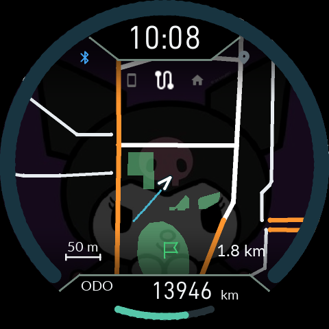

# 5. 오프라인 지도, GPS 궤적과 목적지

[목차](README.md) · [휴대전화 준비](02-Phone-Setup.md)

## 지도 넣기

1. 폰 앱의 **오프라인 지도 → 대한민국 지도 다운로드**를 엽니다. 다른 나라에서는 `다른 지역 지도 다운로드`를 사용합니다.
2. 브라우저에서 Mapsforge **`.map`** 파일을 다운로드합니다. 한국 파일은 `south-korea.map`입니다.
3. 앱으로 돌아와 **지도 가져오기 (.map) → 다운로드 → 해당 파일**을 선택합니다.
4. **지도 준비 완료**를 기다린 뒤 `누도에 지도 표시`를 켭니다. 기기 설정의 `Offline map`도 켭니다.
5. 위치 권한을 허용하고 주행 연동으로 연결합니다. 지도 범위 안의 최신 GPS 위치가 들어오면 주변 도로와 지형이 표시됩니다.

PC에서 받은 `.map`도 폰의 다운로드 폴더로 복사해 가져올 수 있습니다. 지도 원본은 **휴대전화**에 남습니다. 펌웨어 ZIP이나 사진이 아니며 누도 NOR·사진 슬롯에 넣지 않습니다. 앱은 지역 지도 한 개를 별도로 복사하므로 다운로드 원본과 앱 사본을 보관할 공간이 필요합니다.

## 화면과 조작

- 현재 위치와 궤적 위에 **벡터 도로·지형**을 표시합니다. 글자·장소 아이콘으로 가득한 지도를 이미지로 계속 보내는 방식이 아닙니다.
- 주요 도로는 주황색, 일반 도로는 흰색 계열, 물은 하늘색, 녹지는 초록색 계열입니다. 배경 음영과 위아래 그라데이션은 주행 UI와 함께 적용됩니다.
- **UP 확대 / DOWN 축소**, 최대 **12km 축척**입니다.
- **O 길게**로 북쪽 위 → 진행 방향 위 → 나침반 보기를 순환합니다. 나침반 보기에서는 확대·축소하지 않습니다.
- HOME의 지도+정보 보기에서도 지도를 볼 수 있습니다. 축척 조작은 전용 지도/궤적 메뉴에서 합니다.
- 유효한 위치가 없으면 `Waiting for phone GPS`를 표시합니다. 위치가 있어도 가져온 지도 지역 밖이면 도로는 나오지 않을 수 있습니다.

폰 지도에서 지점을 길게 누르거나 좌표로 목적지를 지정하면 깃발 옆에 **직선거리**를 표시하고 나침반에 방향을 표시합니다. 도로를 따라가는 경로 탐색이나 회전 안내는 아닙니다.

## 12km에서 보이는 도로

0.9.17은 가까운 짧은 조각만 뽑는 대신 실제 연결된 도로와 화면 전체의 분포를 함께 고려합니다. 축소할수록 주요 도로를 골라 보내므로 골목까지 모두 표시되는 것은 아닙니다. 패킷은 최대 1,536바이트이며 MCU가 벡터를 그립니다.

| 50m | 12km |
|---|---|
|  |  |

**EVE 소프트웨어 시뮬레이션**: 대한민국 지도에서 만든 실제 Android 벡터 패킷을 펌웨어 디코더와 LVGL/EVE 경로에 넣은 캡처입니다. 실기 LCD 사진이나 Bluetooth 속도 측정은 아닙니다. OpenStreetMap 기여자 데이터 · Mapsforge.

## 화면 OFF, 키 OFF와 GPS 테스트

휴대전화 화면을 잠가도 앱 서비스·위치 권한·주행 연동이 유지되면 위치를 보냅니다. 일반 IGN OFF에서는 수집을 멈추지만, **O를 누른 채 키를 꺼 명시적으로 누도를 계속 사용하는 모드**에서는 해당 사용 기간에 연동을 유지합니다. 실제 연결 해제·권한 철회·앱 강제 종료는 별도입니다.

새 주행 세션마다 본체 궤적을 초기화합니다. 종료가 확정되기 전의 짧은 OFF→ON은 새 세션으로 보지 않습니다. GPS 속도는 차량 UART 속도나 ODO를 대체하지 않습니다. 폰 주행 기록 저장은 GPS 전송과 별도이며 기본 OFF입니다.

앱의 **GPS 테스트 위치**에서 위도·경도를 입력하고 시작/적용하면 초당 한 번 해당 좌표를 보냅니다. 누도는 일반 GPS 입력으로 받으며 차량 속도나 IGN은 가짜로 만들지 않습니다. 정지 상태에서도 다른 지역의 지도 표시를 시험할 수 있습니다. **테스트 중지**로 실제 GPS에 돌아가며 앱 프로세스가 끝나면 테스트도 끝납니다. 저장한 좌표는 폰에만 남습니다.
