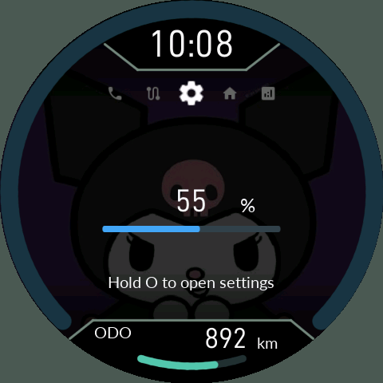
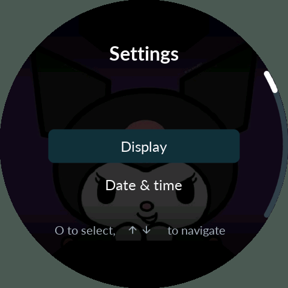
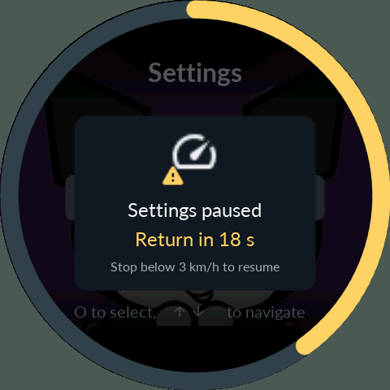

# 6. 퀵 세팅과 모든 설정 항목

> **0.9.20 변경:** [다섯 메뉴·최신 알림 팝업·답장 10개·지도 설명](14-Map-Popup.md)을 함께 확인하세요. 자동 알림 페이지 이동은 팝업으로 대체되었습니다.

[목차](README.md)

| 퀵 세팅 | 전체 설정 | 이동 감지 |
|---|---|---|
|  |  |  |

주행 화면에서 **O+DOWN을 함께 짧게 눌러 퀵 세팅 팝업**을 엽니다. UP/DOWN으로 밝기를 빠르게 조절합니다. 수동이면 밝기 %, 자동이면 −2~+2 보정값입니다. O 길게 누르면 **ENTER MAIN MENU → MAINTENANCE / SETTINGS**에 들어갑니다. IGN ON에서는 **유효한 UART 속도가 3km/h 이하로 5초 유지**되어야 합니다. 명시적 키 OFF 사용 중에는 UART 미수신을 주행 오류로 보지 않습니다.

전체 설정에서 UP/DOWN은 항목 이동, O는 선택입니다. 숫자/날짜/시간은 편집할 칸을 선택하고 값을 바꾼 뒤 `Apply`로 적용합니다. `Back`은 이전 단계입니다. 선택만 하거나 편집 중인 값을 적용하지 않고 나가면 확정하지 않습니다.

차량 이동 또는 속도 미확인으로 설정이 잠기면 화면을 회색 처리하고 30초 카운트가 진행됩니다. 다시 **3km/h 미만으로 3초 유지**하면 재개할 수 있습니다. 제한 시간이 끝나면 주행 화면으로 돌아가며 미확정 값은 버립니다. 반복 이동으로 제한 시간이 계속 연장되지는 않습니다.

## Display

| 표시 이름 | 조절 범위·의미 |
|---|---|
| Brightness mode | Manual / Auto. Auto에는 정상 조도 센서와 공장 보정값 필요 |
| Brightness | 5~100%, 5% 간격. 수동 백라이트 밝기 |
| Auto offset | −2~+2. 본체 자동 밝기 보정 |
| Dashboard light offset | **−5~+5**, 기본 0. 누도→차량 계기판 UART 조도 단계에 더하는 값 |
| Wallpaper | 사진 배경 켜기/끄기 |
| Photo | 일반 배경 슬롯 0/1/2 |
| Key OFF photo | Same as riding / Photo 0 / Photo 1 / Photo 2 |
| Center brightness | 가운데 배경 밝기 0~100%, 5 간격. 백라이트 PWM과 별개 |
| Theme | 기본 배포 빌드는 Dark 고정. `This build has no light mode setting`이면 변경 불가 |
| Auto theme source | 시간 또는 조도 기준 선택 |
| Light starts / Dark starts | 시간 기준 테마 전환 시각, 15분 간격 |
| Dark threshold / Light threshold | 조도 기준 전환 임계값. 두 경계를 두어 반복 전환을 줄임 |
| Ambient sensor | 실제 센서 상태/lux 또는 오류, 읽기 전용 |
| Retry ambient sensor | 센서를 다시 확인하는 동작 |

Light 지원 빌드에서만 Auto theme source와 테마 전환 시각·임계값이 적용됩니다. 앱 테마는 이 본체 빌드 옵션과 별개입니다.

`Dashboard light offset`은 송신 단계 0~9 범위에서 제한됩니다. 누도 자체 화면의 자동 밝기 보정과는 별개로, 어두운 곳에 갔을 때 계기판이 어두워지는 threshould를 조절합니다. +값이 특정 차량에서 광학적으로 몇 % 밝아진다는 뜻은 아닙니다. 공장 보정 영역은 읽기만 합니다.

## Date & time

| 항목 | 의미 |
|---|---|
| Date | 2000~2099년의 실제 존재하는 날짜 |
| Time | 현지 시각, 시/분. 날짜와 요일은 달력 규칙에 따라 처리 |
| UTC offset | UTC−12:00~UTC+14:00, 15분 간격 |

화면은 현지 시각이고 내부 RTC는 UTC를 사용합니다. 날짜를 되돌리면 날짜 기준 정비 경과와 TODAY 분류에도 영향을 줍니다. 잘못된 날짜나 범위를 벗어난 변환은 거부됩니다.

## Vehicle

| 항목 | 의미 |
|---|---|
| Distance units | km / mi. 속도 단위도 km/h / mph로 전환 |
| Ring maximum | 20~400km/h, 10 간격의 속도 링 기준 |
| Stop threshold | 0~10km/h, 기본 5. 트립 이동/정차 분류 |
| Vehicle | 계기판에서 받은 차량 정보, 읽기 전용 |

## Maintenance → Oil / Belt / Service

각 정비에 아래 항목이 있습니다.

| 항목 | 범위·의미 |
|---|---|
| Distance interval | 0~100,000km, 100 간격 |
| Key ON hours | 0~10,000시간 |
| Day interval | 0~3,650일 |
| Service completed | 현재 ODO·키 ON 누계·날짜를 이 정비의 새 기준점으로 확정 |

주기 0은 그 기준을 사용하지 않는다는 뜻입니다. 활성 기준 중 하나가 도래하면 정비가 필요합니다. 엔진을 실제로 돌렸는지는 측정하지 않으므로 Key ON hours를 엔진 운전 시간이라고 해석하지 마세요. 기준값이 없거나 시간을 되돌려 계산할 수 없는 항목은 미확인으로 취급합니다.

## Connections

| 항목 | 동작 |
|---|---|
| Phone / Bluetooth | 실제 연결/드라이버 상태 읽기 |
| Pair phone | 페어링 창 열기 |
| Close pairing | 페어링 창 닫기 |
| Disconnect phone | 현재 폰 연결 종료 |
| Re-pair phone | 확인 후 저장된 폰 인증정보 삭제·저장·재시작·페어링 |
| Restart Bluetooth | Bluetooth 서비스를 재시작 |

`Re-pair phone`을 사용했다면 Android 쪽의 이전 Noodoe 등록도 지우고 다시 페어링해야 합니다. 단순 연결 지연마다 양쪽 기록을 지우는 것은 권장 동작이 아닙니다. 연결 재시작과 페어링 정보 삭제는 서로 다른 작업입니다.

## System / Power sequence

Firmware와 Language는 본체 버전/고정 UI 언어를 표시하는 읽기 항목입니다. 폰 앱의 언어 선택과 혼동하지 마세요. `Reset display`는 화면 환경설정을 기본값으로 되돌리는 확인 동작입니다.

Power sequence에는 **Screen hold, Screen duration, BT only, BT-only duration, All off (STOP), Wake condition**이 있습니다. 두 유지 시간은 각각 0~1440분입니다. 각 단계와 마지막 단계 유지 조건은 [절전 설명](07-Power-Warnings.md)을 참고하세요.

`Restart Noodoe`는 확인 후 설정과 주행 기록의 저장이 완료되면 본체를 재부팅합니다. 업데이트 시험 부팅 중이거나 저장에 실패하면 재부팅하지 않고 상태를 표시합니다. 순정 복구나 데이터 삭제가 아닙니다.

System 메뉴 안에서 UP을 짧게 20번 눌렀다 놓으면 `See dev message`가 나타납니다. 선택하면 `this is easter egg!`가 표시되고 O로 돌아갑니다. 길게 누른 반복은 횟수에 포함하지 않습니다. 잠금 해제는 재부팅하면 사라집니다.

## Debug

읽기 전용 상태로 Bluetooth/HCI·연결, 조도 센서, 보정/송신 밝기, 입력 스위치, UART 및 관련 런타임 상태를 확인합니다. 값이 보인다는 이유만으로 실제 무선 연결·배선·광학 밝기가 정상인 것은 아닙니다. 심층 진단은 별도 Diagnostic 펌웨어 경로입니다.

## 폰에서 모든 기기 설정 변경하기

주행 연동으로 연결한 뒤 꾸미기/기기 설정을 엽니다. 앱은 기기에서 실제 설정 목록을 읽고 숫자·선택·날짜·시간·동작에 맞는 입력을 제공합니다. 라이더 이름, ODO 보호 선택도 여기서 다룹니다.

**접수 → 적용 → 영구 저장**은 다른 상태입니다. 저장 완료를 확인하기 전에는 전원을 끄지 않는 편이 좋습니다. 설정은 기기가 기준이며 재연결했다고 폰의 예전 값으로 덮어쓰지 않습니다. 움직이거나 IGN OFF/설치 중이면 변경을 거부할 수 있습니다. 연결이 끊긴 오래된 창의 동작은 새 기기에 적용되지 않습니다.

## 사진 3슬롯

앱에서 슬롯을 고르고 사진을 전송한 뒤 저장 완료를 기다립니다. 본체 지원 형식은 480×480 이하, 최대 128KiB JPEG이며 앱이 맞춰 준비합니다. 일반 사진은 CFW 사진 저장소에 유지되고 음악 앨범아트는 별도 RAM 표시입니다. 빈 슬롯은 지정해도 그림을 만들어내지 않습니다. 순정 앨범 파일을 직접 편집하지 않습니다.

## 저장 상태와 실패한 저장 재시도

폰의 **기기 설정**에는 설정(Settings)과 누적 기록(Ride records)의 저장 상태가 각각 표시됩니다.

| 표시 | 뜻 |
|---|---|
| Loading | 저장 상태를 읽는 중 |
| Pending save | 현재 변경 사항이 아직 영구 저장되지 않음 |
| Saved | 해당 항목에 저장 대기 변경이 없음 |
| ERROR — automatic writes paused | 저장 실패가 반복되어 자동 쓰기를 중지함 |
| Storage unavailable | 저장소를 사용할 수 없음. 오류 코드를 함께 확인 |

`last saved at uptime …s`는 **이번 부팅 후 경과 시간 기준**의 마지막 저장 성공 시점입니다. 실제 시각이나 ‘몇 초 전’이라는 뜻이 아닙니다.

자동 쓰기가 중지되면 **실패한 저장 다시 시도**를 한 번 눌러 요청하고 결과를 기다립니다. 기기는 10초 재시도 제한을 적용합니다. 버튼 접수만으로 저장 성공이 아니며 `Pending save`나 오류가 남아 있는지 확인하세요. 연결이 끊겨 응답을 못 받았다면 재연결해 상태부터 확인합니다. 반복해서 누르거나 포맷·초기화로 해결하려 하지 말고 오류가 지속되면 진단 ZIP을 남깁니다.

실패 중에도 RAM의 변경값은 남지만 전원이 완전히 끊기면 마지막 성공 기록 이후 변경은 잃을 수 있습니다. 구 펌웨어에서 이 기능을 지원하지 않으면 대응 펌웨어로 업데이트합니다.

## 무엇을 어디에 저장하나

| 데이터 | 저장 위치와 방식 |
|---|---|
| 환경설정·라이더 이름 | 외장 NOR의 검증된 `CFWCFG.DAT`, 4KiB 섹터 32개 순환 저널 |
| 트립·정비 기준점·누적 기록 | `CFWRIDE.DAT`, 4KiB 섹터 64개 순환 저널 |
| 사진 0~2 | `CFWPIC.DAT`, 사진별 A/B 사본 |
| 기기 진단 로그 | `CFWLOG.DAT`, 순환 기록 |
| 전체 오프라인 지도·설치 증거·폰 로그 | 휴대전화 저장소 |
| 현재 곡의 글자·앨범아트·주변 지도 벡터 | 실행 중 RAM/GPU 자료. 사진 슬롯에 매번 기록하지 않음 |

저널은 최신 완료 기록을 남긴 채 다음 섹터를 쓰고, 실제 NOR 읽기 검증 후 완료 표식을 기록합니다. 같은 값은 다시 쓰지 않습니다. 같은 JPEG를 다시 보내도 디코드 검증과 기존 사진의 실제 NOR 바이트 대조가 끝나 동일하면 소거·프로그램을 생략합니다. 다른 사진은 비활성 사본을 검증한 뒤 전환합니다.

일반 로그는 모아서 쓰고 반복 오류는 횟수로 합칩니다. 부팅·폴트·업데이트·롤백 기록은 우선 처리합니다. 실패한 쓰기를 무한 반복하지 않으며 정상 저장에서는 FAT와 디렉터리를 매번 고치지 않습니다. 이 방식은 불필요한 쓰기와 특정 섹터 집중을 줄이는 것이며, 확인되지 않은 플래시 수명을 연수로 보장하는 의미는 아닙니다.

일반 **CFW 업데이트는 설정·사진·트립·정비 기준점을 보존**합니다. `새로 시작`, 개별 초기화, CFW 완전 삭제는 사용자가 고르는 별도 작업입니다.
