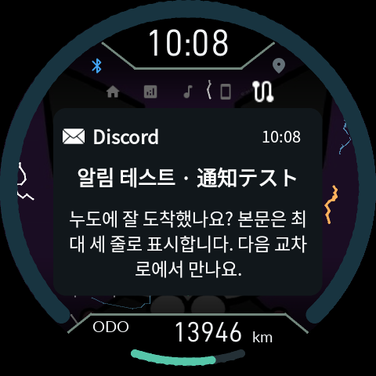
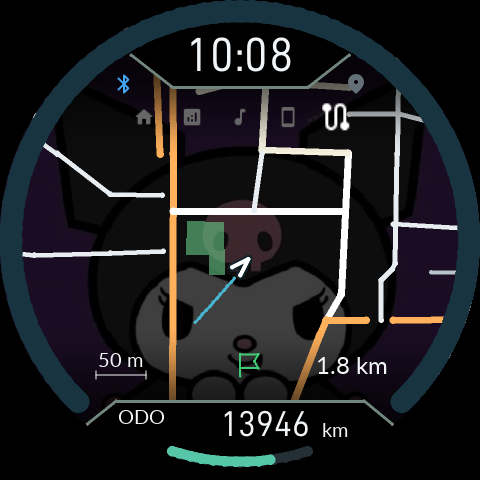
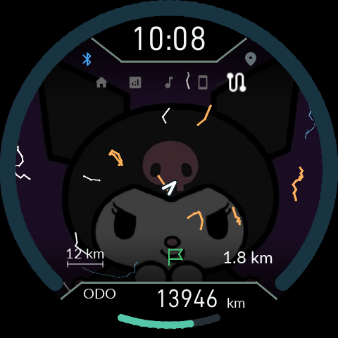

# 0.9.20: 지도, 메뉴와 알림 팝업

> **0.9.22:** 최대 축척과 음영 정책은 [최신 변경](16-Display-Transitions.md)을 따릅니다. 아래는 해당 버전의 변경 기록입니다.

[English](14-Map-Popup.en.md) · [사용 설명서](README.md) · [최신 다운로드](https://github.com/SerialSniffyHeck3r/noodoe_cfw/releases/latest)

APK와 CFW를 함께 업데이트하세요. 기존 Gate를 교체하거나 순정으로 돌아갈 필요는 없습니다. 설정·사진·정비 기록은 유지됩니다.

## 다섯 메뉴

O를 짧게 눌러 **홈 → 트립 → 음악 → 폰 → 지도 → 홈**으로 이동합니다. 다섯 아이콘의 위치는 고정이며, 현재 메뉴만 커집니다. 마지막 조작 후 10초가 지나면 스트립이 숨겨집니다. 트립의 하위 선택은 유지하고, 폰은 들어갈 때 요약으로 돌아옵니다. 전화와 알림은 여전히 폰 메뉴 안에 있습니다.

음악 재생 중에는 음표가 초록색입니다. 새 알림·미확인 알림 상태는 이제 폰 메뉴 아이콘에 표시합니다. Bluetooth 아이콘은 연결 상태를 표시하며 알림 때문에 깜빡이지 않습니다.

## 알림 팝업과 빠른 답장

앱의 알림 허용 목록과 중요 알림 필터는 그대로 사용합니다. 자동 표시를 켜면 원래 메뉴 위에 **마지막으로 도착한 적격 알림 하나**가 나타납니다. 기존 알림 페이지 자동 이동을 대체하며, 원래 페이지·하위 선택은 바꾸지 않습니다.

- 마지막 도착 시각부터 10초 동안 표시합니다. 이미지가 늦게 준비되어 이미 10초가 지났다면 뒤늦게 띄우지 않습니다.
- UP/DOWN은 팝업을 닫습니다. O는 짧게 놓으면 닫고, 0.8초 유지하면 빠른 답장을 엽니다.
- 답장에서는 UP/DOWN으로 선택하고 O 짧게 전송, O 길게 취소합니다. 최대 10개를 설정하며 다섯 개씩 표시합니다. 기존 답장과 서명은 보존합니다.
- 답장을 고르는 동안에는 만료를 멈추고 대상 알림을 고정합니다. 새 알림이 와도 답장 대상이 바뀌지 않습니다. 원본 알림이 삭제·수정되거나 답장 권한이 사라지면 선택을 종료합니다.
- 팝업과 빠른 답장은 **60km/h 미만**에서 동작합니다. IGN ON에서 속도를 모르면 허용하지 않습니다. 명시적인 IGN OFF 사용 모드는 기존 정책을 따릅니다.
- PH9 입력 차단과 통화·경고·설치·복구·전원 화면의 우선순위는 유지합니다. 팝업을 닫은 버튼이 뒤쪽 메뉴까지 움직이지 않습니다.

아래 그림은 실제 펌웨어의 LVGL/EVE 명령과 Android 알림 이미지를 사용한 **EVE 소프트웨어 시뮬레이션**입니다. LCD 사진이 아닙니다. 팝업 안의 이미지는 8px 위로 조정했습니다.

## 지도와 배경

오프라인 Mapsforge `.map` 파일을 앱에서 가져오는 방법은 [GPS 설명서](05-GPS.md)를 참조하세요. 지도가 켜진 상태에서 누도의 UP/DOWN으로 축척을 바꿉니다. 최대 12km이며, 위치가 이동하면 필요한 타일만 추가로 받습니다.

주요 도로는 주황 계열, 일반 도로는 흰색·회색으로 구분합니다. 물은 하늘색, 녹지는 초록색입니다. 넓은 축척의 큰 도로·지형과 상세 일반 도로를 서로 다른 원본 단계에서 추출하므로 일반 도로 등급 전체를 일괄 삭제하지 않습니다. 밀집 지역에서는 화면 명령량에 맞춰 선을 단순화하고 일부 도형을 생략합니다.

오디오·알림·지도에서 배경 사진은 동일하게 25% 밝기를 사용합니다. 지도의 선까지 25%로 낮추는 것은 아닙니다. 지도는 시계·ODO 영역에 들어가지 않으며 위아래 공통 그라데이션을 따릅니다. 이 설정은 LCD 백라이트 밝기를 바꾸지 않습니다.

STOP 복귀 중에는 시계·ODO의 글자, 구분선, 배경 가림 영역이 함께 움직입니다. 화면 명령 초과·그리기 상태 누출·이미지 버퍼 수명은 소프트웨어 반복 시험으로 검사했습니다. 실제 차량에서 보고된 하단 가로 찢어짐의 재발 여부는 실기 확인이 필요합니다.
