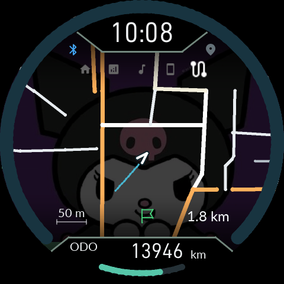
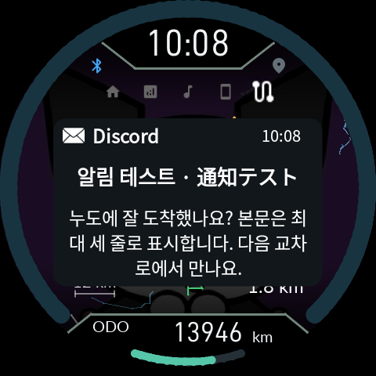
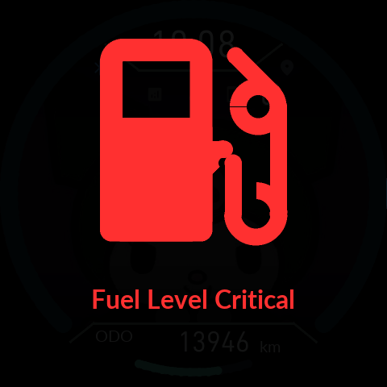

# 0.9.21: 지도 표시와 화면 전환 수정

> **0.9.22:** 최대 축척과 음영 정책은 [최신 변경](16-Display-Transitions.md)을 따릅니다. 아래는 해당 버전의 변경 기록입니다.

[English](15-Map-Stability.en.md) · [사용 설명서](README.md) · [최신 다운로드](https://github.com/SerialSniffyHeck3r/noodoe_cfw/releases/latest)

APK와 Product ZIP을 함께 업데이트하세요. 기존 CFW에서 바로 업데이트할 수 있으며 Gate 교체나 순정 복귀가 필요하지 않습니다. 설정·사진·정비 기록은 유지됩니다.

## HOME에서 O 길게 누르기

| 보고 있는 HOME 화면 | O 길게 누르기 |
|---|---|
| 오토 / 속도+오토 / HOME 지도 | 다음 정보로 넘어가고 순환 시간을 다시 계산 |
| 날짜 / 나침반 / 폰 / 음악 / 두 줄 | 하단 ODO/TRIP 표시를 설정한 순서로 변경 |

RESERVE 강제 표시 중에는 하단 선택을 바꾸지 않습니다. O를 짧게 누르면 기존처럼 다음 주메뉴로 이동합니다. 팝업·답장·경고·설정이 열린 동안에는 해당 화면의 조작이 우선합니다.

## 지도와 음영

지도 대기와 실제 표시가 같은 25% 배경 사진 음영을 사용합니다. 도로는 밝게 남고, 공통 위아래 그라데이션과 시계·ODO 제외 영역을 따릅니다. 새 타일을 받는 동안 완성된 이전 지도를 유지하며, 음악·알림 이미지 수신으로 지도를 다시 비우지 않습니다. 가까운 타일을 우선 유지하고 화면 밖 타일을 교체합니다.

## 경고와 팝업

키 ON 직후 연료 경고가 겹칠 때도 경고의 어두운 배경이 맨 앞에 남도록 수정했습니다. 알림 팝업은 압축 이미지 버퍼 높이 대신 실제 글자가 표시되는 높이를 기준으로 가운데에 배치합니다. 글자 크기와 줄간격은 유지합니다.

화면 버퍼 재사용과 swap 대기를 보완했습니다. 캡처와 반복 시험은 실제 펌웨어 명령을 사용한 **소프트웨어 시뮬레이션**입니다. 실제 LCD의 간헐적인 가로 찢어짐이 완전히 없어졌는지는 차량에서 확인해야 합니다.
