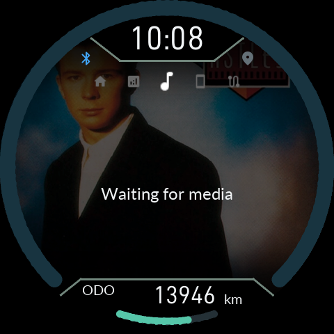
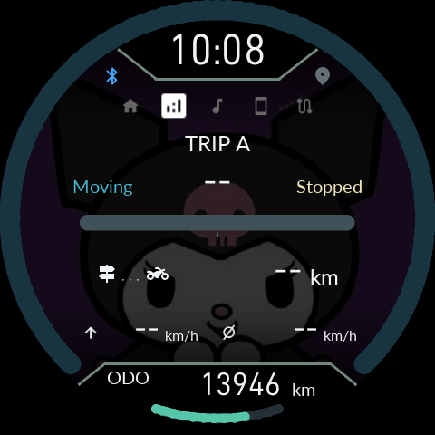
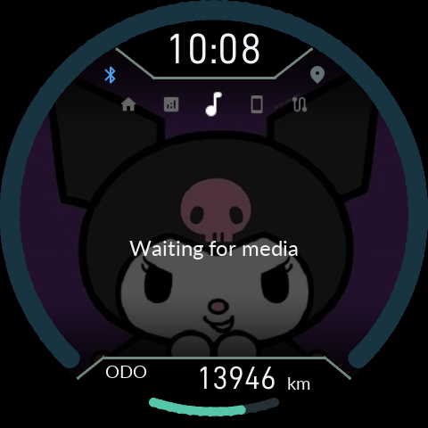
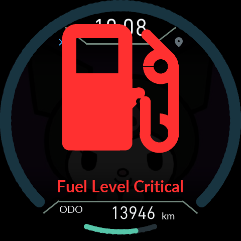

# 0.9.26: 화면 음영·Bluetooth 검증

[English](16-Display-Transitions.en.md) · [사용 설명서](README.md) · [최신 다운로드](https://github.com/SerialSniffyHeck3r/noodoe_cfw/releases/latest)

APK와 Product ZIP을 함께 업데이트하세요. 기존 Gate를 그대로 사용하며 설정·사진·정비 기록은 유지합니다.

**0.9.26은 지도 도입 전 0.9.5의 배경 밝기 계산을 복원합니다.** TRIP·지도·전화/알림과 그 밖의 비 HOME 화면은 사용자 배경 밝기 × 20%, 음악·앨범아트는 × 32%입니다. 예를 들어 배경 설정이 50%라면 각각 10%와 16%로 계산됩니다. 25% 고정 방식이 아닙니다.

HOME 여덟 모드와 백라이트 밝기는 그대로입니다. 연료 경고의 추가 감광, 지도 도로와 글자의 밝기, GPU 교체 완료 대기는 유지합니다.

지도 최대 축척은 **3km**입니다. 받은 타일의 도로를 이동 중 다시 순위 매겨 빼지 않고, 타일 전체를 유지한 채 움직입니다. 도로 종류와 폭은 유지하고, 가는 도로에도 최소 표시 폭을 적용합니다. 더 많은 도로가 고르게 남도록 곡선 정점 수와 화면 분포를 함께 고려합니다. 지도 원본과 확대 수준에 따라 단순화는 적용됩니다.

0.9.22의 도형 상태 복원·프레임 완료 대기 수정은 유지합니다. 지연된 화면 교체·경고·팝업·전환을 겹친 소프트웨어 시험은 통과했지만, 실차에서 보고된 애니메이션 중 가로 찢어짐은 여전히 원인과 해결 여부를 확인하지 못했습니다.

이 캡처는 실제 펌웨어/LVGL/EVE 명령을 사용한 **소프트웨어 시뮬레이션**입니다. 이전 경고도 시뮬레이션에서는 어두웠으므로, 새 처리만으로 실차의 경고 음영 문제까지 해결됐다고 단정하지 않습니다.

고속 Bluetooth는 패치 적용 후 버전·주소를 세 차례 대조합니다. ROM 식별값과 패치 후 버전을 그대로 비교하던 경로를 바로잡았습니다. `High-speed Bluetooth didn't start`가 나오면 921,600baud로 복귀한 것입니다. 전송 대기 감소·청크 연속 전송 덕분에 이 속도에서도 이전보다 빠를 수 있습니다. 실제 칩에서 3,686,400baud 검증 통과와 장시간 안정성은 아직 미확인입니다.

업데이트 후 재시작 전에 새 페어링 키가 실제 저장됐는지 기다립니다. 저장 실패 시 강제로 재시작하지 않습니다. 이번 버전으로 처음 올라오는 과정의 재시작은 구 펌웨어가 수행하므로, 이 보완이 소급 적용되지는 않습니다.
