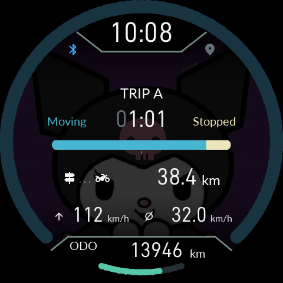
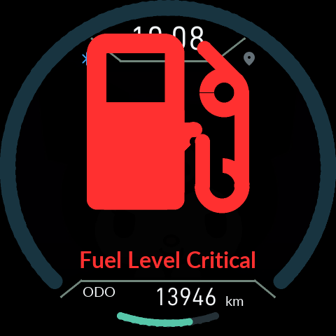

# 0.9.22: 화면 전환·지도·음영

[English](16-Display-Transitions.en.md) · [사용 설명서](README.md) · [최신 다운로드](https://github.com/SerialSniffyHeck3r/noodoe_cfw/releases/latest)

APK와 Product ZIP을 함께 업데이트하세요. 기존 Gate를 그대로 사용하며 설정·사진·정비 기록은 유지합니다.

홈을 제외한 화면은 이전 TRIP과 같은 배경 음영을 사용합니다. 기본 배경 설정에서는 20% 밝기이며, 사용자 배경 밝기를 낮췄다면 그 비율도 적용됩니다. 백라이트 밝기는 바꾸지 않습니다. 연료 LOW/CRITICAL 경고에는 별도의 어두운 배경 처리가 추가됩니다.

지도 최대 축척은 **3km**입니다. 받은 타일의 도로를 이동 중 다시 순위 매겨 빼지 않고, 타일 전체를 유지한 채 움직입니다. 도로 종류와 폭은 유지하고, 가는 도로에도 최소 표시 폭을 적용합니다. 더 많은 도로가 고르게 남도록 곡선 정점 수와 화면 분포를 함께 고려합니다. 지도 원본과 확대 수준에 따라 단순화는 적용됩니다.

TRIP/지도 전환을 위해 렌더러의 도형 상태 복원과 프레임 완료 대기를 수정했습니다. 그리기 명령 전송이 끝난 시점과 실제 화면 교체 완료를 구분합니다. 정지 그림만 비교하지 않고 지연된 화면 교체·경고·팝업·전환을 겹쳐 시험했습니다.

이 캡처는 실제 펌웨어/LVGL/EVE 명령을 사용한 **소프트웨어 시뮬레이션**입니다. 실차 LCD에서 보였던 간헐적 가로 찢어짐의 완전 해소 여부는 아직 실기 확인 전입니다.
