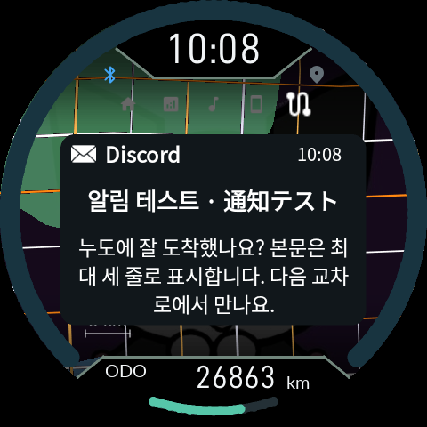
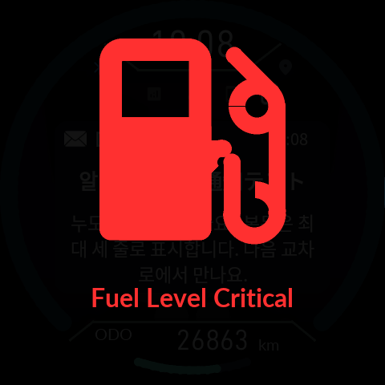

# 0.9.28 display rendering and Bluetooth diagnostics

Maps still travel as vector tiles. Product prepares a transparent raster locally and lets EVE composite one completed map image during menu and popup animations. Wallpaper, clock/ODO cutouts, gradients and existing shade settings are preserved.

Open quick settings with O+DOWN, hold O, then choose **Settings → Debug**:

- **BT speed / probe:** `3686400 / probe 6/6` means high-speed initialization and response checks completed. `921600 / fallback ...` means standard speed after a failed high-speed attempt; the suffix is the cause code. `Not ready / phase ...` is not a successful probe.
- **SPP measured KiB/s:** observed RX/TX payload rates from Noodoe's perspective, updated over roughly one-second intervals while the item is polled. Zero when idle is normal. UART baud is not artwork latency; phone preparation and queues also contribute.

Fuel warnings now dim the entire ordinary UI, including clock, ODO and ring. The three TRIP dots are restored. An unsupported notification reply says `No Reply Action`.

The healthy-run check after installation takes5seconds. Candidate identity, visual approval, BT/app confirmation and rollback checks remain. Install both the matching APK and ZIP using the ordinary CFW update path; no new Gate is required.

The dense roads above are synthetic stress geometry.1,203 simulated frames stayed within4,756/8,192display-list bytes with no writes to displayed image storage. Physical LCD tearing, radio performance and FPS have not been tested on hardware.
