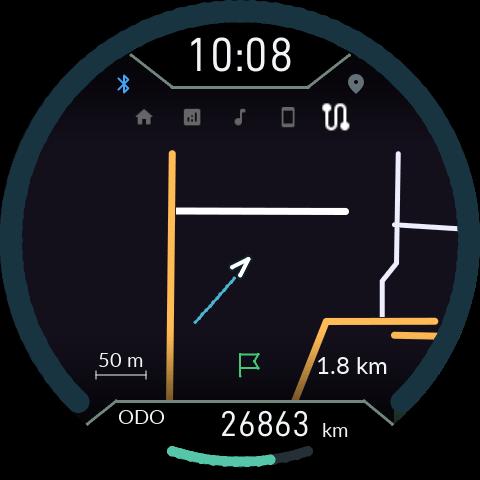

# 0.9.42 GPS 테스트·주차 조작·화면 처리

같은 릴리스의 APK와 Product ZIP을 함께 설치하세요. 0.9.40 이후 호환 Gate에서는 일반 CFW 업데이트를 사용합니다. 이 수정 때문에 Gate를 다시 설치할 필요는 없습니다.

## GPS 테스트로 지도를 확인하기

1. 앱에서 오프라인 Mapsforge `.map` 파일을 가져오고 **지도 준비 완료**를 확인합니다.
2. 앱과 누도의 지도 표시를 켜고 주행 연동에 연결합니다. 정차 중 IGN ON이나 명시적인 키 OFF 사용 모드에서 가능합니다.
3. **GPS 테스트 위치**에서 가져온 지도 안에 있는 위도·경도를 입력하고 시작/적용합니다. 대한민국 지도라면 서울시청 부근 `37.5665, 126.9780`으로 확인할 수 있습니다.
4. 누도의 지도 메뉴를 엽니다. 테스트 좌표는 실제 GPS 위치 권한이나 위치 서비스 없이도 전송됩니다. Bluetooth 권한과 연결은 필요합니다.
5. **테스트 중지**를 누르면 실제 위치로 돌아갑니다. 실제 GPS에는 위치 권한·서비스가 필요합니다.

지도 파일 문제는 테스트 실행 문구와 함께 앱에 표시됩니다. 다른 지역의 지도 파일, 꺼진 지도 설정, 연동 단절은 테스트 좌표만으로 해결되지 않습니다. 테스트는 차량 속도나 IGN을 조작하지 않습니다.

폰 위치 표본의 유효 시간은 앱과 기기 모두 5초로 맞췄습니다. 4초 간격으로 위치가 들어오는데 3초 만에 미수신으로 바뀌던 조건을 수정했습니다. 5초 넘게 새 위치가 없으면 여전히 수신 대기로 전환됩니다.

## 키 OFF 사용과 버튼 표시

키 OFF 상태에서 O를 누르고 사용 중이면 O 짧게로 평소처럼 메뉴를 넘길 수 있습니다. 이 상태에서 O를 누른 채 키 ON으로 전환하고 2초 유지하면 기존 Gate 복구 조작으로 처리됩니다. OFF에서 O를 누른 것만으로 일반 입력을 차단하지 않습니다.

O+아래를 함께 눌러 퀵 세팅을 열면 우측에 두 버튼의 눌림이 표시됩니다. 기능 실행을 위한 입력 소비와 실제 버튼 눌림 표시는 별개입니다. **위+O 3초 시스템 재부팅**, 퀵 세팅의 **위 길게 LCD 복구 / 아래 길게 Super Nite**는 같습니다.

## 화면 속도

EVE SPI 송수신의 CPU 비용을 줄이고 지도 계산을 작은 단위로 나눴습니다. 완성된 프레임과 실제 swap 완료를 기다리는 규칙은 유지합니다. 목표는 30fps이며, 이번의 명령 실행·연속 프레임 시험은 실기 LCD에서 30fps를 측정한 결과가 아닙니다.

[검증과 메모리 보고서](../../documentations/validation/0.9.42-render-cadence.md)
