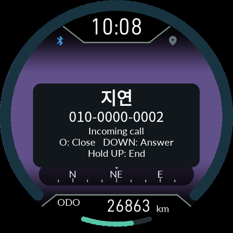

# 0.9.43 수신 전화 팝업과 자동 밝기

[0.9.73: 발신자 표시와 주행 자동 재연결](34-Call-Reconnect.md)

[사용 설명서](README.md) · [English](21-Calls-Backlight.en.md)

앱의 **권한·연동 준비**에서 **전화 수신 감지**, **전화 받기·끊기** 권한을 허용하세요.
일반 주행 연동 중 전화가 오면 현재 메뉴 위에 수신 팝업이 뜹니다.
이름·번호 그림을 기다리는 동안에도 `Incoming call`과 조작 안내가 먼저 나옵니다.

| 조작 | 동작 |
|---|---|
| O 짧게 | 팝업만 닫기. 전화를 거절하지 않음 |
| 아래 짧게 | 받기 |
| 위 0.8초 길게 | 수신 거절 또는 통화 종료 |

통화가 끝나거나 팝업을 닫아도 원래 메뉴와 하위 선택은 그대로입니다.
소리는 기존 휴대전화·헤드셋을 사용합니다. Android 8에서는 수신 감지와
받기가 가능하며, 끊기 API를 사용할 수 없으면 화면 안내대로 폰에서 종료하세요.
Android 12 이상은 기존 동반 기기 등록도 함께 사용하는 것이 좋습니다.
이 내용은 앱의 사용 설명서 첫 항목에서도 볼 수 있습니다.

자동 밝기의 방향을 수정했습니다. 기본 보정에서 밝은 곳은 밝게, 어두운 곳은
어둡게 조절하며, 수동 밝기·SUPER NITE·웰컴 라이트 정책은 유지합니다.

위 그림과 회귀시험은 소프트웨어 결과입니다. 실제 통신사 전화·헤드셋과 LCD에서의
수신·조작·프레임률은 아직 확인하지 못했습니다.
