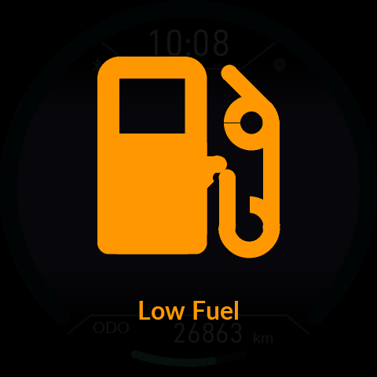

# 화면과 상태 아이콘 · 0.9.60

[사용 설명서](README.md) · [English](22-Status-Display.en.md)

상단 가운데의 HOME·트립·음악·스마트폰·지도 아이콘은 위치가 고정되어 있고 선택한 메뉴가 크게 표시됩니다. **HOME에서만 마지막 메뉴 조작 후 5초가 지나면 숨습니다.** 다른 주행 페이지에서는 계속 보입니다. 설정·경고·설치·전원 화면은 해당 화면 배치를 사용합니다.

## GPS 수신 표시

GPS 아이콘은 휴대전화 위치 전송이 활성화되면 켜집니다. 새롭고 유효한 위치를 받으면 **120ms 동안 완전히 꺼졌다가 켜집니다.** 평소 켜진 시간이 길며, 단순 화면 갱신이나 같은 표본은 펄스를 다시 시작하지 않습니다. 빠른 연속 수신은 묶어 최소 480ms 켜진 시간을 확보합니다. 전송 비활성·연결 해제·활성 상태 만료는 회색입니다. 점등만으로 위치의 정확도나 지도 로딩 완료를 의미하지 않습니다.

## Bluetooth 아이콘으로 보는 휴대전화 배터리

이 표시는 누도나 차량 배터리가 아닌 **연결된 휴대전화 배터리**입니다. 충전 상태가 저전압 표시보다 우선합니다.

| 상태 | 표시 |
|---|---|
| 충전하지 않음, 20% 이상 | 일반 연결 색상 |
| 충전하지 않음, 15% 이상 20% 미만 | 노랑 |
| 충전하지 않음, 5% 이상 15% 미만 | 빨강 |
| 충전하지 않음, 5% 미만 | 빨강/흰색 교대 |
| 충전 중, 75% 미만 | 초록/흰색 교대 |
| 충전 중 또는 충전 완료, 75% 이상 | 초록 고정 |
| 배터리 정보 없음 | 일반 연결 색상 |
| 폰 연결 없음 | 회색 |

교대 표시는 각 색을 0.5초씩 보여줍니다. 통화 중에는 기존 초록 전화 아이콘이 우선합니다. 알림의 읽음/미확인 색상은 가운데 스마트폰 메뉴 아이콘에 표시되며, 배터리 표시와 별개입니다. 충전 상태를 보내는 **0.9.60 APK와 Product를 함께** 사용하세요.

## 연료 경고

큰 아이콘의 점멸 뒤 아이콘이 줄어들고 문구가 나올 때, 두 요소의 묶음을 화면 중앙에 맞췄습니다. 아이콘 모양·크기·표시 시간·전체 음영은 0.9.59와 같습니다. Low Fuel, Fuel Level Critical, 센서 오류를 같은 배치로 표시합니다.

사용자는 0.9.59에서 순정→CFW 설치가 바로 완료되었고 기존 6/4 현상과 시동 중 연료 음영 문제가 나타나지 않았다고 보고했습니다. 이는 해당 사용자 기기의 결과이며 모든 리비전이나 CFW→CFW 업데이트를 검증한 결과는 아닙니다. 0.9.60 위치·아이콘 변화는 소프트웨어 검증 결과입니다.

