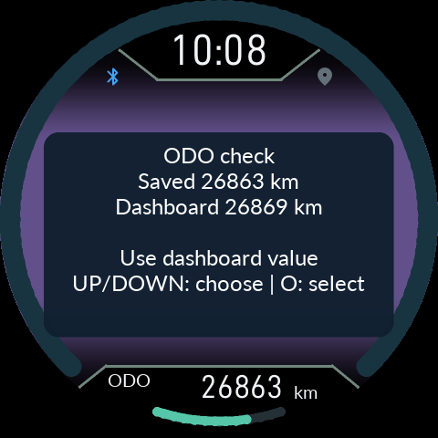

# 화면과 상태 아이콘 · 0.9.61

[사용 설명서](README.md) · [English](23-Controls-Recovery.en.md)

상단 가운데의 HOME·트립·음악·스마트폰·지도 아이콘은 위치가 고정되어 있고 선택한 메뉴가 크게 표시됩니다. **HOME에서만 마지막 메뉴 조작 후 5초가 지나면 숨습니다.** 다른 주행 페이지에서는 계속 보입니다. 설정·경고·설치·전원 화면은 해당 화면 배치를 사용합니다.

## GPS 수신 표시

GPS 아이콘은 휴대전화 위치 전송이 활성화되면 켜집니다. 새롭고 유효한 위치를 받으면 **120ms 동안 회색으로 어두워졌다가 켜집니다.** 평소 켜진 시간이 길며, 단순 화면 갱신이나 같은 표본은 펄스를 다시 시작하지 않습니다. 빠른 연속 수신은 묶어 최소 480ms 켜진 시간을 확보합니다. 전송 비활성·연결 해제·활성 상태 만료는 회색입니다. 점등만으로 위치의 정확도나 지도 로딩 완료를 의미하지 않습니다.

## Bluetooth 아이콘으로 보는 휴대전화 배터리

이 표시는 누도나 차량 배터리가 아닌 **연결된 휴대전화 배터리**입니다. 충전 상태가 저전압 표시보다 우선합니다.

| 상태 | 표시 |
|---|---|
| 충전하지 않음, 20% 이상 | 일반 연결 색상 |
| 충전하지 않음, 15% 이상 20% 미만 | 노랑 |
| 충전하지 않음, 5% 이상 15% 미만 | 빨강 |
| 충전하지 않음, 5% 미만 | 빨강/회색 교대 |
| 충전 중, 75% 미만 | 초록/회색 교대 |
| 충전 중 또는 충전 완료, 75% 이상 | 초록 고정 |
| 배터리 정보 없음 | 일반 연결 색상 |
| 폰 연결 없음 | 회색 |

교대 표시는 각 색을 0.5초씩 보여줍니다. 통화 중에는 기존 초록 전화 아이콘이 우선합니다. 알림의 읽음/미확인 색상은 가운데 스마트폰 메뉴 아이콘에 표시되며, 배터리 표시와 별개입니다. 충전 상태를 보내는 **0.9.61 APK와 Product를 함께** 사용하세요.

## 연료 경고

큰 아이콘의 점멸 뒤 아이콘이 줄어들고 문구가 나올 때, 두 요소의 묶음을 화면 중앙에 맞췄습니다. 아이콘 모양·크기·표시 시간·전체 음영은 0.9.59와 같습니다. Low Fuel, Fuel Level Critical, 센서 오류를 같은 배치로 표시합니다.

사용자는 0.9.59에서 순정→CFW 설치가 바로 완료되었고 기존 6/4 현상과 시동 중 연료 음영 문제가 나타나지 않았다고 보고했습니다. 이는 해당 사용자 기기의 결과이며 모든 리비전이나 CFW→CFW 업데이트를 검증한 결과는 아닙니다. 위치는0.9.60과 같으며0.9.61 조작·아이콘 변화는 소프트웨어로 검증했습니다.


## 환경설정에서 ODO 확인

ODO 확인은 자동으로 팝업을 띄우지 않습니다. 본체 **SETTINGS → Vehicle → ODO check**, 또는 폰의 기기 설정 ODO 항목에서 확인합니다. Keep saved distance와 Use dashboard value는 IGN ON 및 유효한 정차 속도 5초 확인이 필요합니다. 이전 자동 팝업은 약 3초 뒤 열려 적용이 허용되기 전 Ask me later만 동작할 수 있었습니다. 이 시간차는 소프트웨어로 재현했으며 당시 실차 상태를 기록한 로그는 없습니다.

위/아래 짧게로 선택하고 O 짧게로 적용합니다. **Back이나 O 길게는 값 변경 없이 돌아갑니다.** 적용 실패·속도 미확인 상태에서도 닫을 수 있습니다. 적용 뒤 No change to confirm이 보이면 O로 돌아갑니다. 알 수 없거나 범위를 벗어난 거리 값을 정상값으로 강제 승인하지 않으며, 저장 형식·보정 방식·영구 저장 검사는 유지합니다.

## 설치 정지 안내

기존 Paused. See phone help. 오류 화면은 아래 안내로 바뀝니다.

```text
Please manually reset.
Hold UP + O together
for 3 seconds.
```

Stage와 Code/phase는 유지합니다. 재시작 후 버튼을 놓고 같은 기기·작업에 앱이 재연결하도록 합니다. 이 안내는 수동 복구 조작이며 설치 성공 판정이나 모든 저장·재시작 오류의 원인 해결을 뜻하지 않습니다. 반복되면 진단 로그를 보존하세요. 구버전에서 업데이트하는 첫 단계는 기존 펌웨어가 실행하므로 새 Product가 뜨기 전까지 문구도 구버전 것입니다.



