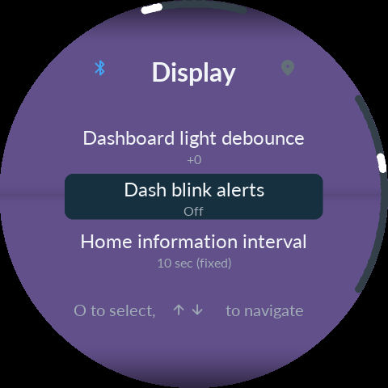

# Dashboard blink alerts · 0.9.62

[한국어](24-Dashboard-Alerts.md) · [User manual](README.en.md)

The default is **ON**. Select **SETTINGS → Display → Dash blink alerts** on Noodoe, or **Device settings → Dashboard blink alerts** in the phone app. OFF cancels an active pattern and returns to normal ambient/offset brightness. The saved choice survives reboot and ordinary updates. Older settings files with no entry default to ON.

| Situation | Dashboard brightness |
|---|---|
| Incoming call, phone notification or ordinary warning popup | High → low → high → low,0.5s each,2s total |
| Low-fuel popup | Eight high/low steps,0.5s each,4s total |
| Update handled by running CFW | Low/high, changing every1s |
| Error in that update | Low/high, changing every0.5s |
| New Bootstrap waiting at Install CFW? | Low/high every0.5s; approval/cancellation restores normal |
| Short toast such as AUTO | No blink |

This controls the **vehicle dashboard through UART**. It does not blink the Noodoe LCD backlight or change the fuel icon animation/veil. Dismissing a popup lets its2s/4s sequence finish; turning the setting OFF cancels it. Redrawing the same popup does not restart a sequence. An ordinary alert cannot shorten a fuel alert already in progress.

The new Product must be running. **The first update from old firmware to0.9.62 is still handled by the old firmware**, so the new pattern cannot affect it retroactively. The ZIP includes a new first-install Bootstrap, but a normal CFW update does not replace an existing Bootstrap/Gate. First installation from stock has no saved CFW preference and defaults ON.

Software tests cover ON/OFF, timing boundaries, UART bytes and saved-preference restoration. Actual optical brightness, radio installation and vehicle blink timing have not been physically tested.

