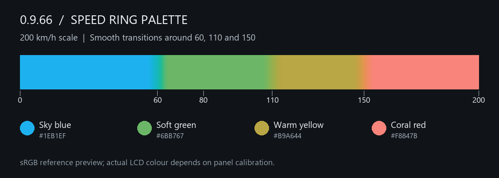

# 0.9.66 · 속도 링 색상 조정

기존 UI의 선명한 느낌을 유지하면서 하늘색·부드러운 초록·따뜻한 노랑·코럴 계열 붉은색으로 조절했습니다. 원색 빨강·노랑을 쓰지 않습니다. 최대 200km/h 스케일에서 80km/h는 초록색입니다.

| 최대 200km/h 기준 구간 | 색상 |
|---|---|
| 0–60km/h | 하늘색 |
| 60–110km/h | 부드러운 초록 |
| 110–150km/h | 따뜻한 노랑 |
| 150km/h 이후 | 코럴 계열 붉은색 |

경계는 설정된 링 최대속도의 30%·55%·75%입니다. 최대 100km/h면 30·55·75km/h, 최대 300km/h면 90·165·225km/h로 함께 바뀝니다. 표시 색상 구간이며 안전속도 판단이나 제한속도 경고가 아닙니다. km/mile 글자 설정은 실제 속도 기준을 바꾸지 않습니다.

각 경계 앞뒤 최대속도의 2.5% 구간에서 부드럽게 색을 잇습니다. 200km/h 스케일에서는 55–65·105–115·145–155km/h이며 그 사이에서는 색이 일정합니다. 따라서 150km/h를 중심으로 붉은색으로 넘어가고 155km/h부터 완전한 붉은색 구간입니다.

색과 중간색은 CIELCh 기준 명도 L*=68로 계산했습니다. 적당한 선명도를 유지하되 화면 색역을 벗어나는 부분만 부드럽게 채도를 낮춰 색상 잘림을 피합니다. 실제 출력하는 8비트 RGB의 계산상 명도는 67.76–68.20 범위입니다. 색 전환 중 밝기 차이를 줄인 것이며 실물 LCD의 측정·보정 결과는 아닙니다. 패널 감마·시야각·주변 밝기에 따른 차이는 있을 수 있습니다.

링 색상 선택만 바꿨습니다. 모양·150ms 이동 보간·투명도·주변광 밝기 감응·백라이트·경고 그래픽은 그대로입니다. IGN OFF는 완전 회색이며 차량 데이터가 유효하지 않을 때의 기존 비활성 색도 유지합니다. 최고속도 마커는 실제 표시됐던 링 색을 기억합니다. 기기는 585바이트 색상표를 정수 연산으로 읽으므로 실행 중 색공간 변환이나 추가 프레임버퍼가 필요하지 않습니다.

**같은 0.9.66 APK와 ZIP**을 사용합니다. 앱 데이터를 지우지 않고 APK를 업데이트한 뒤 앱의 CFW 업데이트에서 해당 ZIP을 사용합니다. 일반 업데이트는 설정·사진·주행 및 정비 기록을 보존합니다. 최초 설치는 순정 **5.14·5.16**을 허용하며 HW·부트로더 버전·모델·PCBA 화이트리스트는 없습니다. 모든 차량의 전기적 호환성을 검증했다는 의미는 아닙니다. Bootstrap 수동 재페어링과 Gate·Bootstrap 바이너리는 그대로입니다.

Stage 6/4에서 수동 재시작을 요청하면 **UP + O를 함께 3초** 누르고 놓은 뒤 휴대전화의 결과 확인을 기다립니다. 해당 근본 문제는 이번 변경 대상이 아닙니다. 결과가 확정되지 않으면 설치·복구 설명서를 따릅니다.

실제 ARM 속도·시동 모델, 정규화 속도 10,001개 색상, Debug/Release 빌드, APK/Product 해시 일치와 Android ZIP 가져오기를 검증했습니다. LCD·차량 실기 테스트는 하지 않았습니다.

[이 문서의 색상 구간·답장 슬롯은 0.9.68에서 변경되었습니다.](30-Sharing-Settings.md)
