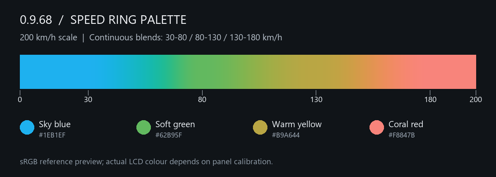

# 0.9.68 · 연속 색상·정보 전송·설정 보존

**앱 데이터를 지우지 말고 0.9.68 APK를 덮어 설치**한 뒤, 같은 **0.9.68 ZIP**으로 CFW를 업데이트하세요. 이번 버전은 앱과 본체 Product가 모두 바뀝니다.

## 속도 링

200km/h 스케일에서 하늘색→초록 **30–80**, 초록→노랑 **80–130**, 노랑→코랄 **130–180km/h**로 전환 구간이 연속해서 이어집니다. 각 전환 폭은 이전의 5배입니다. 최대 스케일을 바꾸면 비율대로 함께 변합니다. 초록은 조금 더 진하게, 나머지 기준 색은 유지했습니다. CIELCh 기준 명도 L*=68을 유지하며 링의 움직임·투명도·조도/백라이트 제어는 그대로입니다. IGN OFF는 회색입니다. 실제 LCD를 측정한 보정값은 아닙니다.

## 퀵리플라이

**1–7번**은 수정 가능한 문구, **8번**은 위치·이번 시동 세션의 주행 정보·음악 전체 전송, **9번**은 위치 부분만, **10번**은 음악 부분만 전송합니다. 답장 가능한 알림을 열고 O 길게 → 항목 선택 → O로 전송하세요. 기존 주행 상태와 수신 대상 확인은 유지됩니다.

8번 한국어 예시:

```text
37.566500 126.978000 / https://www.google.com/maps/search/?api=1&query=37.566500%2C126.978000

평균 62.5 km/h 최고 123 km/h / 거리 12.35 km

음악: 제목 - 아티스트

Noodoe 계기판에서 보냈습니다.
```

문구와 숫자는 앱에서 선택한 한국어·영어·일본어·스페인어·중국어 간체/번체를 따릅니다. 좌표와 지도 바로가기는 공통 소수점 형식이며, 속도·거리 단위는 본체 설정을 따릅니다. 주행 정보는 Trip A/B나 휴대폰 추정값이 아닌 **본체의 이번 시동 세션**입니다. 세션이 종료됐거나 정보가 없거나 오래됐으면 —로 표시합니다. 8·9번은 최근의 정확한 실제 GPS 위치가 필요하며 테스트 좌표는 전송하지 않습니다.

**8·9·10번에는 서명이 항상 붙습니다.** 저장한 서명을 사용하고, 비웠다면 해당 언어의 기본 서명을 붙입니다. 음악이 정지·일시정지됐거나 정보가 없으면 ‘재생 정보 없음’을 표시합니다. 이전 8–10번 문구는 저장된 채로 남지만 사용하지 않습니다. 알림 내용·좌표·곡·사용자 이름을 진단 로그에 추가하지 않습니다.

## CFW 업데이트 설정 보존

리소스·펌웨어 전송 전에 현재 숫자/선택형 설정과 사용자 이름을 휴대폰 내부에 검증해 저장합니다. 본체 UID와 설치할 Product에 묶어 보관하며, 완료 전에는 앱 데이터를 지우지 마세요. 같은 본체에서 정확한 새 CFW의 정상 부팅이 확정되면 설정을 다시 읽고, 다른 값만 복원한 뒤 본체 저장 완료와 재조회까지 확인합니다. 기존 NOR 설정이 이미 같으면 다시 쓰지 않습니다.

앱이나 Bluetooth 연결이 끊겨도 사본은 남습니다. 복원 중 중단되면 정차 상태에서 같은 ZIP으로 재연결해 **현재 CFW / 설치 결과 확인**을 실행하세요. 복원을 마치지 못한 상태를 설치 완료로 표시하지 않습니다. 현재값을 확인한 뒤 설정값 대입을 재개하며 초기화·페어링·시계 변경·정비 리셋 명령은 재실행하지 않습니다. 다른 본체나 롤백된 펌웨어에 적용하지 않습니다. 사진·주행 기록·정비 기준점은 기존 NOR 보존 방식으로 유지되며, 이 사본은 NOR 전체 백업이 아닙니다. 순정 첫 설치 절차는 그대로입니다.

## 설치·복구

F4 순정 **5.14·5.16**을 허용하며 HW·부트로더 버전·차종·PCBA 화이트리스트는 없습니다. 모든 차량의 전기적·실기 호환성을 검증했다는 뜻은 아닙니다. Bootstrap에서는 안내된 수동 등록 삭제·본체 페어링 초기화·재페어링을 진행합니다. Gate·Bootstrap·순정 복구·리소스·Diagnostic·Uninstall 이미지는 그대로입니다.

Stage 6/4에서 요구하면 **UP + O를 함께 3초** 누르고 놓은 뒤 앱의 재연결·결과 확인을 기다리세요. 수동 리셋이 필요한 기존 문제를 해결한 버전은 아닙니다. 첫 재시작은 기존 펌웨어가 처리하므로 예전 문구가 표시될 수 있습니다. 첫 설치와 복구는 [설치 설명서](../Installation/README.md)를 따르세요.

검증은 ARM 색상·세션 코드, Android 형식·프로토콜·설정 중단/재개 시험, Debug/Release/APK 빌드와 서명·ZIP/Product 일치 확인입니다. 휴대폰·무선·LCD·차량 실기 시험은 하지 않았습니다.


