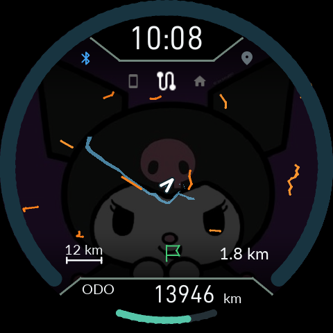

# Using FuckNudo

[0.9.21: HOME / map / display fixes](15-Map-Stability.en.md)

[0.9.20: maps, fixed menus, notification popups and ten replies](14-Map-Popup.en.md)

[한국어 전체 설명서](README.md) · [Installation and recovery](../Installation/README.en.md) · [Downloads](https://github.com/SerialSniffyHeck3r/noodoe_cfw/releases/tag/cfw-v0.9.20-ui-map-popup)

**Companion 0.9.21 / Product 0.9.21 — 3 October 2026.**

## Connect and ride

Select your registered Noodoe, then use the permissions/setup page to enable Bluetooth, notification access, location and companion-device support. A compatible Product connects to riding sync automatically. Trip recording on the phone is optional and off by default; music, notifications and GPS do not require it.

**Screen off means the phone screen.** Lock the phone and keep Noodoe on as usual. Media callbacks, text rendering and artwork preparation belong to the service. Small track state goes first; image work runs outside the radio loop. An expiring CPU wake lock is renewed only during active riding or explicit parked use, without lighting the phone screen. Disconnecting or ending active use releases it. Force-stop and revoked permissions require attention in the app. Actual S24 Ultra screen-off latency and power consumption have not yet been measured.

## Buttons and pages

O cycles **HOME → Trip → Audio → Smartphone → Map/trail**. Most pages remember their selection; Smartphone opens at its central summary. General long presses take 0.8 seconds. Installation/recovery confirmations keep their separate timing.

- **HOME:** UP/DOWN cycle date, compass, phone, music, auto, dual-row, speed+auto and map+auto. Hold O to advance information in automatic modes.
- **Audio:** UP play/pause, hold UP previous track, DOWN next track. Track titles and artists are rendered on the phone in every language. Long text scrolls; HOME's dual rows scroll independently.
- **Smartphone:** summary in the middle, up to five recent calls above, up to nine notification cards below. Hold O to call or reply where supported. During a call, hold O to answer and hold DOWN to reject/end. Phone audio stays on the phone/headset.
- **Map:** UP zoom in, DOWN zoom out, up to 12km scale. Hold O to cycle north-up, heading-up and compass.
- **Quick settings:** tap O+DOWN together. UP/DOWN adjust brightness, hold DOWN for SUPER NITE, hold O for the main menu. MAINTENANCE contains service intervals and completion actions; SETTINGS contains other preferences.
- **Dark display:** with IGN ON, hold UP+O together for three seconds to restart the display only. The app also offers display recovery. It preserves riding and connection state.

## Music without the extra wait

Current-track text is prepared for Audio and both HOME layouts. Changing pages or pausing a track does not discard unchanged text. Artwork is one final 480×480 transfer, held in RAM rather than written into photo slots. After a track change the old artwork stays for at most ten seconds; confirmed absence returns to the wallpaper immediately. Late completion from an older track is discarded.

Text cache is limited to 128KiB/six tiles; JPEG cache to 256KiB/six images. APK 0.9.17.1 also spaces retries of the same failed artwork encode by five seconds. Playback callbacks cannot provide information before the music player publishes it.

## Import an offline map

1. Open **Offline map**, download South Korea or another region, and save its Mapsforge `.map` file.
2. Return to the app and choose **Import map (.map)**, then the downloaded file.
3. Wait for **Map ready**, enable map display in the app and `Offline map` on Noodoe.
4. Connect riding sync with location permission and a fresh fix inside that region.

The map stays on the phone. A PC download can be copied to the phone and imported; it is neither a firmware ZIP nor a photo-slot upload. Import creates an app-private copy of one region and leaves the original download alone.

Noodoe receives compact road/terrain vectors. At 12km the compiler favours connected roads spread across the viewport, selecting major roads within the same 1,536-byte packet budget. Street labels and turn-by-turn navigation are not included. Select a destination on the phone map or enter coordinates for a straight-line distance and direction marker.

**EVE software simulation**, using an Android packet from the South Korea map through the firmware decoder/LVGL/EVE path. This is not an LCD photograph or radio-performance measurement. Map data © OpenStreetMap contributors · Mapsforge.

**GPS test location** sends entered coordinates once per second over the normal GPS link. It does not simulate vehicle speed or ignition. Stop the test to return to real GPS; it also ends when the app process stops.

## Saves, photos and errors

Ordinary firmware updates preserve settings, photos, trips and service baselines. Explicit reset, start-fresh and full uninstall are separate actions.

Device settings shows **Settings / Ride records** storage status. `Pending save` is not durable yet. `ERROR — automatic writes paused` means repeated failure stopped automatic writes; use **Retry failed saves** once and check the outcome. The device applies a ten-second retry cooldown. An uncertain reply requires a status check, not repeated button presses. `last saved at uptime` is time since this boot, not a wall-clock timestamp.

Settings and ride data rotate through 32/64 sectors in fixed NOR files. The latest completed record is preserved until its successor is physically verified and committed. An identical JPEG is validated and compared against physical NOR before skipping erase/program. Ordinary logs are batched and repeated errors coalesced; boot/fault/update/rollback events have priority. Unsaved RAM changes can still be lost on total power loss.

For persistent trouble, export diagnostic logs from the app. Internal originals remain; ordinary logs omit message bodies, track titles, precise coordinates and pairing secrets.

## Read-only NOR backup

[Open the NOR backup and file browser guide](13-NOR-Backup.en.md). Copy selected files in the background, including their FAT/cluster evidence, or start a dedicated full 128MiB backup with IGN OFF. Install both APK and Product 0.9.20 for this feature.
