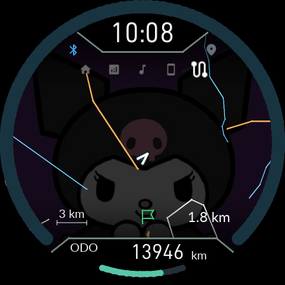
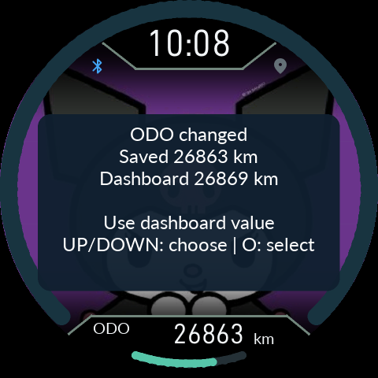

# Using FuckNudo

[0.9.73: caller identity and automatic riding reconnect](34-Call-Reconnect.en.md)

[0.9.66 manual revision 1: installation and recovery](../Installation/README.en.md) · [Compatible models](../Installation/07-Compatibility.en.md)

**Base display guide (see the 0.9.66 update below for revised GPS behavior):** [menu persistence, GPS pulses, phone battery and centered fuel warnings](23-Controls-Recovery.en.md). Versioned links below are historical change notes.

[0.9.43 incoming calls and automatic brightness](21-Calls-Backlight.en.md)

[0.9.42 GPS testing, parked controls and rendering](20-Render-GPS.en.md)

[0.9.41 installation state and work diagnostics](../Installation/19-State-Ownership.en.md)

[0.9.40 controls, recovery and rollback updates](../User/18-Input-Recovery.en.md)

[0.9.28: map rendering, fuel warnings and Bluetooth diagnostics](17-Map-Rendering.en.md)

[0.9.21: HOME / map / display fixes](15-Map-Stability.en.md)

[0.9.20: maps, fixed menus, notification popups and ten replies](14-Map-Popup.en.md)

[한국어 전체 설명서](README.md) · [Installation and recovery](../Installation/README.en.md) · [Downloads](https://github.com/SerialSniffyHeck3r/noodoe_cfw/releases/latest)

**Companion / Product 0.9.66 — 9 October 2026.**

## Connect and ride

Select your registered Noodoe, then use the permissions/setup page to enable Bluetooth, notification access, location and companion-device support. A compatible Product connects to riding sync automatically. Trip recording on the phone is optional and off by default; music, notifications and GPS do not require it.

**Screen off means the phone screen.** Lock the phone and keep Noodoe on as usual. Media callbacks, text rendering and artwork preparation belong to the service. Small track state goes first; image work runs outside the radio loop. An expiring CPU wake lock is renewed only during active riding or explicit parked use, without lighting the phone screen. Disconnecting or ending active use releases it. Force-stop and revoked permissions require attention in the app. Actual S24 Ultra screen-off latency and power consumption have not yet been measured.

## Buttons and pages

The menu strip stays visible on non-HOME riding pages. Only HOME hides it after five seconds. The Bluetooth icon now reports phone battery/charging; GPS gives a short OFF pulse for each fresh position. [Exact thresholds and timing](23-Controls-Recovery.en.md).

O cycles **HOME → Trip → Audio → Smartphone → Map/trail**. Most pages remember their selection; Smartphone opens at its central summary. General long presses take 0.8 seconds. Installation/recovery confirmations keep their separate timing.

- **HOME:** UP/DOWN cycle date, compass, phone, music, auto, dual-row, speed+auto and map+auto. Automatic modes show new notifications for 20 seconds, then hold playing music; otherwise information cycles. Hold O to select information; automatic priority resumes after 20 seconds.
- **Audio:** UP play/pause, hold UP previous track, DOWN next track. Track titles and artists are rendered on the phone in every language. Long text scrolls; HOME's dual rows scroll independently.
- **Smartphone:** summary in the middle, up to five recent calls above, up to nine notification cards below. Hold O to call or reply where supported. Incoming calls use a popup: short O dismisses, short DOWN answers, hold UP rejects/ends. Phone audio stays on the phone/headset.
- **Map:** hold UP to toggle automatic/manual range. In automatic mode, UP/DOWN adjust preference from−2 (closer) to+2 (wider); the preference survives mode changes. In manual mode, UP zooms in and DOWN zooms out, up to3km scale. Automatic mode starts a600ms transition when the target map is ready. Manual changes apply immediately without animation, transforming the retained map while any missing tiles arrive. Hold O to cycle north-up, heading-up and compass.
- **Quick settings:** tap O+DOWN together. UP/DOWN adjust brightness, hold DOWN for SUPER NITE, hold O for the main menu. MAINTENANCE contains service intervals and completion actions; SETTINGS contains other preferences.
- **Restart:** hold UP+O together for3seconds for an immediate MCU reset. For display-only recovery, open quick settings with DOWN+O, then hold UP0.8seconds. Release all keys after reset.

## Music without the extra wait

Current-track text is prepared for Audio and both HOME layouts. Changing pages or pausing a track does not discard unchanged text. Artwork is one final 480×480 transfer, held in RAM rather than written into photo slots. After a track change the old artwork stays for at most ten seconds; confirmed absence returns to the wallpaper immediately. Late completion from an older track is discarded.

Text cache is limited to 128KiB/six tiles; JPEG cache to 256KiB/six images. The app spaces retries of the same failed artwork encode by five seconds. Playback callbacks cannot provide information before the music player publishes it.

## Import an offline map

1. Open **Offline map**, download South Korea or another region, and save its Mapsforge `.map` file.
2. Return to the app and choose **Import map (.map)**, then the downloaded file.
3. Wait for **Map ready**, enable map display in the app and `Offline map` on Noodoe.
4. Connect riding sync with location permission and a fresh fix inside that region.

The map stays on the phone. A PC download can be copied to the phone and imported; it is neither a firmware ZIP nor a photo-slot upload. Import creates an app-private copy of one region and leaves the original download alone.

Noodoe receives compact, cached road and terrain vectors. The maximum scale is 3km. Whole width-selected roads retain their geometry during movement. The device caches eight complete tiles; the phone prepares visible tiles first, then predicts upcoming tiles from direction and speed. Map calculation and transfer stop when the map is hidden. Returning to the page reuses a valid GPU texture or complete RAM raster; missing or changed content still needs preparation. Select a destination on the phone map or enter coordinates for a straight-line distance and direction marker.

## Saves, photos and errors

### ODO confirmation

ODO checks no longer open automatically. Use **SETTINGS → Vehicle → ODO check** on Noodoe or the app Device settings ODO page. Short UP/DOWN chooses Keep saved distance, Use dashboard value or Back. Applying requires IGN ON and five seconds of valid stationary speed. Back or holding O always leaves without changing the value. Applied values remain visible for confirmation; short O returns. PH9 must allow Noodoe operation. [Current controls and error handling](23-Controls-Recovery.en.md).

The feature only changes Noodoe's saved display baseline. It does not write the vehicle dashboard's odometer. Anomaly detection and the stored record format are unchanged.

Ordinary firmware updates preserve settings, photos, trips and service baselines. Explicit reset, start-fresh and full uninstall are separate actions.

Device settings shows **Settings / Ride records** storage status. `Pending save` is not durable yet. `ERROR — automatic writes paused` means repeated failure stopped automatic writes; use **Retry failed saves** once and check the outcome. The device applies a ten-second retry cooldown. An uncertain reply requires a status check, not repeated button presses. `last saved at uptime` is time since this boot, not a wall-clock timestamp.

Settings and ride data rotate through 32/64 sectors in fixed NOR files. The latest completed record is preserved until its successor is physically verified and committed. An identical JPEG is validated and compared against physical NOR before skipping erase/program. Ordinary logs are batched and repeated errors coalesced; boot/fault/update/rollback events have priority. Unsaved RAM changes can still be lost on total power loss.

For persistent trouble, export diagnostic logs from the app. Internal originals remain; ordinary logs omit message bodies, track titles, precise coordinates and pairing secrets.

## Read-only NOR backup

[Open the NOR backup and file browser guide](13-NOR-Backup.en.md). Copy selected files in the background, including their FAT/cluster evidence, or start a dedicated full 128MiB backup with IGN OFF. Use the current matching APK and Product; this feature is included.

[0.9.22 display transitions, maps and shading](16-Display-Transitions.en.md)

[0.9.62 · Dashboard blink alerts](24-Dashboard-Alerts.en.md)

[0.9.63 · Indicators and reconnection](25-Connection-Indicators.en.md)

[0.9.64 · HOME AUTO · manual pairing · background return](26-Home-Auto.en.md)

[0.9.65 · Latest messages · location/music replies](27-Latest-Messages.en.md)

[0.9.66 · Balanced speed ring colours](28-Speed-Ring.en.md)

[0.9.67 · Actual stock mode](../Installation/29-Stock-Mode.en.md)

[0.9.68 · Sharing, settings and smooth ring](30-Sharing-Settings.en.md)

[0.9.69 · Settings catalog update fix](31-Settings-Catalog.en.md)

[0.9.70 · Ignition-off photo without shading](32-Off-Photo.en.md)

[0.9.71 · Summary contrast, retained settings and oil arc](33-Ride-Preservation.en.md)
