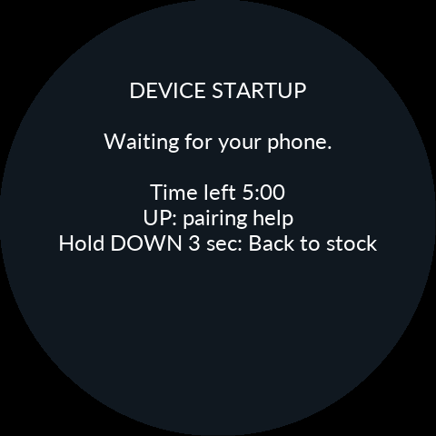
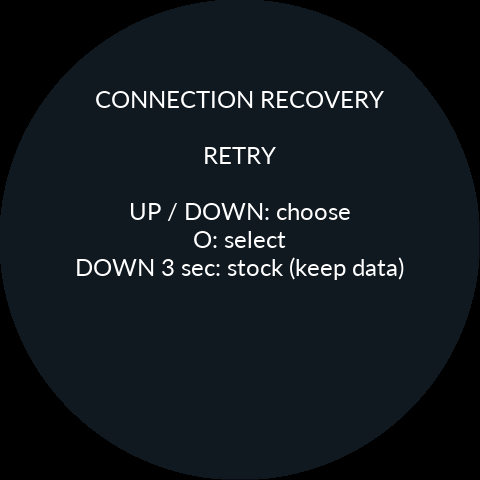
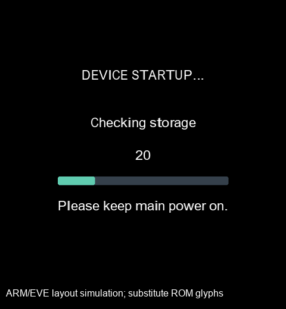
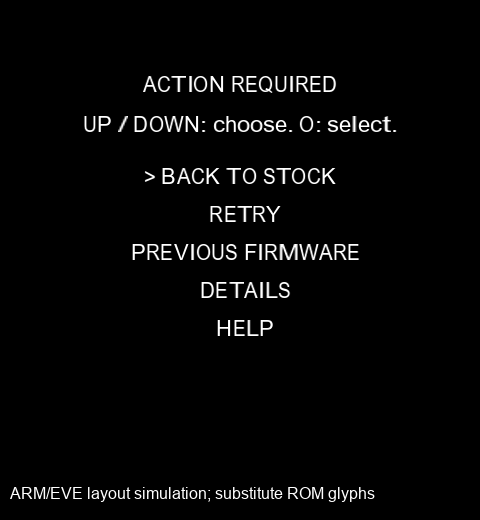
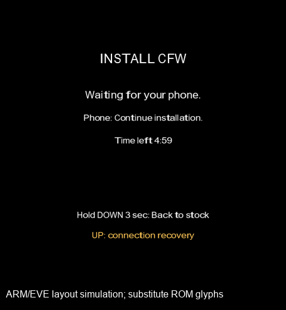
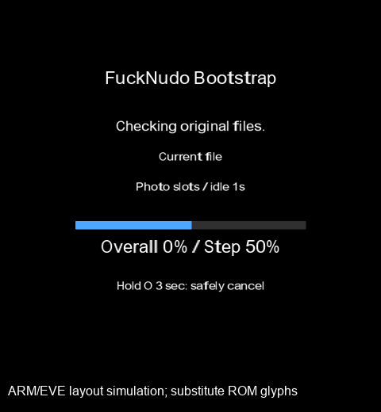

# 0.9.35 — Bluetooth 역할 전환과 페어링 복구

## 무엇을 바꿨나

Product와 Bootstrap의 초기화·페어링·업데이트 인계를 분리했다. Bootstrap은
115,200→921,600만 사용하고, Product는 3,686,400을 먼저 검증한다. Gate는
Bluetooth를 사용하지 않는다. 고속 실패 시 현재 속도 RETRY와 표준 속도 재시도를
선택할 수 있으며, RETRY만으로 저장 키를 지우지 않는다.

고속 도입 전 코드, 0.9.33/0.9.34 및 순정 V5.16을 대조했다. 순정의 FF36
호스트 baud 전환과 100ms 대기, TI B/C 서비스팩 선택, PA8/PI1 제어, RTS/CTS,
RX 준비 순서는 유지했다. 이번에 확인한 결함은 다음과 같다.

- 초기 칩 식별과 패치 이후의 버전 응답을 같은 정책에 쓰지 않도록 첫 식별을
  고정했다. 종료한 초기화 시도의 명령·DMA 완료를 새 시도에 적용하지 않는다.
- connectable/discoverable 요청은 컨트롤러 명령 완료가 아니다. 실제 BTstack은
  scan enable 값을 2, 3으로 순차 반영할 수 있었다. 첫 응답만으로 READY를
  게시하지 않고 READ_SCAN_ENABLE(0x0C19)로 접속 허용 비트를 확인한다.
  중간 값은 전체 초기화 기한 안에서 다시 확인한다.
- 정상 업데이트 RESET은 응답 송신과 최신 키 영구 저장 뒤 신규 접속을 막고,
  기존 링크와 radio/DMA를 정리한 다음 재부팅한다. 종료에는 최대 5초만 기다린다.
  시간 초과는 retained 증거로 남기며, 승인된 재부팅을 영원히 막지 않는다.
- Android의 페어링·SDP·소켓 대기는 하나의 남은 기한을 공유한다. 주소가 같아도
  매 연결에서 실제 순정/Bootstrap/Product 역할·UID·이미지를 확인한다.
  BONDING 중에는 중복 페어링이나 SPP 접속을 시작하지 않는다.

상세한 코드 비교에 사용한 순정 이미지 SHA-256은
`38207bed741a8fef9e6d2ed24b86c8cb8b376ba5e4c957163f5edd83fbeb8037`이다.
FF36은 0x08050648, 호스트 baud 변경은 0x0805067E, 대기는
0x08050690/92, B 서비스팩 경로는 0x080506A8에서 대조했다.

[TI 서비스팩 안내](https://www.ti.com/tool/CC256XB-BT-SP)는 전원 재인가 뒤 칩에
맞는 패치를 다시 적용하도록 설명한다. [TI의 재연결 사례](https://e2e.ti.com/support/wireless-connectivity/bluetooth-group/bluetooth/f/bluetooth-forum/743779/cc2564-unexpected-hci-error-creating-outgoing-connection-after-power-cycle)는
갑작스러운 radio 종료 뒤 상대 링크 상태가 남는 경우를 다룬다. 그 사례의 오류는
이번 신고의 0x05와 같지 않으며, 이를 모든 인증 실패의 확정 원인으로 삼지 않았다.
SDP 캐시는 새 펌웨어가 준비됐다는 증거가 아니다.
[Android API 계약](https://developer.android.com/reference/android/bluetooth/BluetoothDevice#fetchUuidsWithSdp())도 함께 확인했다.

## 양쪽 키를 맞추는 복구

앱의 ‘이 Noodoe 연결 완전히 다시 설정’은 자동 연결을 멈추고 설치 기록을 유지한다.
Android 설정에서 해당 Noodoe의 등록을 해제한 사실을 확인한 뒤, 본체에서 선택한
폰 또는 ALL을 O 새 누름 2초로 승인한다. 본체는 radio 종료 → 키 삭제 → NOR 저장과
읽기 검증 → 컨트롤러/호스트 초기화 → 서비스팩 → 새 페어링 순서로 처리한다.

일반 Product에서는 IGN ON, 모든 버튼을 놓고 UP+DOWN+O를 함께 3초 유지하면
연결 복구에 들어간다. PH9 상태와 무관하다. 설치/시험 부팅에서는 UP으로 진입한다.
메뉴의 Re-pair phone도 같은 경로를 사용한다. 일반 DOWN 길게 누름을 순정 복구로
오인하지 않도록 복구 입력 소유 조건도 수정했다.

앱은 단순 BOND_BONDED 대신 실제 보안 SPP 연결, 기기 역할·UID, 삭제 뒤 새 키의
세대 증가와 영구 저장을 확인한다. 결과 확인 전에 설치 파일을 쓰지 않는다.
Android 설정 왕복·Activity 재생성 후에도 복구 단계를 유지한다. 권한 철회는 안내하며
다른 Bluetooth 장치·공장 데이터·설정·사진·정비 기록을 삭제하지 않는다.

## Gate와 시험 부팅

새 Gate는 일반 검사에 DEVICE STARTUP, 설치에 INSTALLING FIRMWARE, 재부팅
인계에 RESTARTING DEVICE, 복원에 RESTORING PREVIOUS/STOCK FIRMWARE를 표시한다.
진행 막대는 실제 작업량을 반영한다. 독립 Gate는 매 MCU 부팅에서 검사하므로 일반
재부팅에도 잠깐 나타날 수 있다. 그 자체가 재설치를 뜻하지 않는다.

시험 부팅 실패/만료는 영구 WAIT 선택 상태로 남는다. RETRY는 대상 이미지·자원을
재검증한 뒤 명시적으로 새 시험을 시작한다. PREVIOUS FIRMWARE와 BACK TO STOCK은
별도 선택이며 자동으로 키를 지우지 않는다. 실패 대상·이유·이전 이미지와 복구 자료는
보존한다. 재연결·radio RETRY는 이미 시작한 시험의 5분을 늘리지 않는다.

새 Gate의 동작을 적용하려면 기존 Gate 장치는 앱의 데이터 유지 순정 복귀 → 새
Bootstrap → Gate/Product 설치를 한 번 거친다. 이미 새 Gate면 보통의 Product 업데이트다.
순정 BL과 공장 영역은 수정하지 않는다. 지원하는 기존 하드웨어 프로필과 핀 순서도 유지했다.

## 글꼴과 메모리

사용자 승인 범위는 **치수표 저장 위치 변경만**이다. 16/20/24/32px 글꼴의 96개씩
총 3,072바이트 치수표를 기존 외장 리소스의 ID21로 옮겼다. ARM 컴파일러가 만든
원래 구조체와 바이트 단위로 동일하며 압축하지 않았다. 글리프 픽셀·폰트·크기·기준선·
줄 간격·기존 자산 ID1~20은 바뀌지 않았다. 기존 SDRAM 리소스 영역에서 참조한다.
외장 컨테이너는 기존 1MiB 그대로다. Bootstrap은 정수 전용 서식 함수를 사용해
사용하지 않는 부동소수점 출력 코드를 제외했다. 컴파일 최적화·힙·스택은 유지했다.

| 빌드 | 사용량 | 플래시 여유 |
|---|---:|---:|
| Product Debug | 390,252B | 2,964B |
| Product Release | 357,036B | 36,180B |
| Bootstrap | 445,172B | 13,580B |
| Gate | 23,756B | 41,780B |

Product SRAM 여유는 Debug45,784B / Release44,800B, CCM은 둘 다16,320B다.
Debug2KiB/Release4KiB 기준과 기존 실행 자원 예약을 통과했다.

## 검증 범위

실제 ARM 코드를 O0/Os로 실행해 고속/표준 역할 정책, scan 허용 명령 순서,
지연 응답·DMA 세대, 선택 키/전체 키 삭제와 저장, RESET 응답 후 단절·종료 지연,
Gate RETRY·이전 복원·저널 전원 중단을 검사했다. Android의 역할 확인·공유 기한·
페어링 복구·재실행 시험, APK 서명과 새/구 ZIP 가져오기를 검사했다.

Product 6장은 실제 LVGL/EVE 명령과 자산을 사용하는 소프트웨어 캡처다.
Gate/Bootstrap 캡처는 실제 ARM 명령·ROM 치수표를 사용했지만 원래 ROM 글리프
픽셀 덤프가 없어 대체 윤곽을 사용했다. 이미지에 이를 명시했다. 도형·배치·버퍼 한도
검사이며 실제 ROM 글꼴의 픽셀 일치 검사나 LCD 사진으로 주장하지 않는다.

Galaxy S24 Ultra와 다른 신고 폰의 실제 페어링·반복 설치·무선 속도·LCD/FPS는
이번 실행에서 측정하지 못했다. 고속 프로빙 통과는 UART/HCI 상태이며 무선 안정성의
실측 증거가 아니다. 신고된 모든 0x05가 실기에서 없어졌다는 판정은 남아 있다.

## 화면 시뮬레이션

