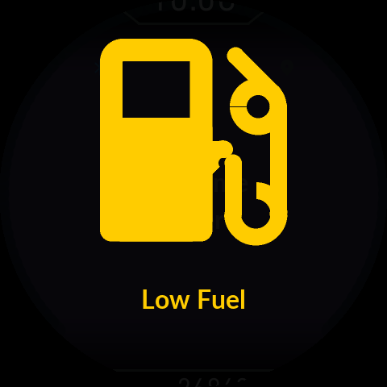

# 0.9.33 — 화면 처리 성능·설치 완료 상태·연료 경고

## 신고와 확인 범위

사용자가 0.9.32의 설치와 연결 성공을 확인했다. 이번 신고는 설치 완료 후 앱에
남는 “업데이트 결과를 확인해 주세요”, 애니메이션을 포함한 전 화면의 약 10fps
체감, 키 ON 직후 연료 경고의 암전 누락이다. 이 버전은 Bluetooth 초기화·인증·
속도 선택·페어링 키 처리를 변경하지 않는다. 고속 선택 화면이 나오지 않았다는
관찰은 사용자의 보고이며, 실제 UART 속도와 무선 처리량을 새로 측정한 것은 아니다.

## 앱의 완료 상태

기존 자동 주행 복귀는 정확히 `update-cfw` 작업이 성공한 경우에만 UPDATE 상태를
해제했다. 이미 설치된 Product를 확인하거나 설치를 이어가기·연결 복구로 확인하는
경로는 기기의 확정 상태와 별개로 이 로컬 상태를 남길 수 있었다.

이제 UID·트랜잭션·패키지 SHA·Product의 영구 확정을 확인하고 CFW_CONFIRMED를
기록한 뒤에만 별도의 완료 이벤트를 전달한다. 현재 연결 세대의 이벤트가 저장된
업데이트 상태와 복구 안내를 해제하고 자동 주행으로 인계한다. 단순 연결·역할
조회·RESET 접수·화면의 done 문구로 완료를 추측하지 않는다. 오래된 연결의
이벤트나 다른 기기는 적용하지 않으며, 폰 저장 실패도 성공으로 숨기지 않는다.

이미 이전 앱에 UPDATE 상태가 남아 있다면 새 APK에서 기존 결과 확인을 한 번
진행한다. 완료된 펌웨어를 처음부터 재전송하거나 앱 데이터를 지울 필요는 없다.

## 전 화면 렌더링 병목

완성된 EVE 명령 목록을 검사하기 위한 RAM_DL 읽기가 vendor 함수의 바이트별
SPI 수신 경로를 사용했다. 모든 제출 프레임에 적용되므로 지도 화면 밖에서도
수천 번의 HAL 호출이 발생하는 명확한 공통 비용이다. 기존 BSP의 256B 묶음 읽기로
바꿔 8KiB 목록의 읽기 호출을 데이터 8,192회+헤더에서 총 33회로 줄였다.

전송 실패 시 부분 목록을 게시하지 않는다. 기존 명령 정리·8KiB 상한·완성 프레임
검증·실제 swap 확인·GPU bank 수명은 유지한다. 30fps 목표와 애니메이션 시간,
지도 raster 방식과 타일 전송, 사진·오디오 화질은 바꾸지 않았다. 호출 수 감소는
모의 HAL에서 측정했다. 실제 기기에서 10fps가 몇 fps로 회복되는지는 미측정이다.

## 연료 경고 암전

Low/Critical 경고가 일반 LVGL 배경 fill에 의존하던 경로를 전 화면 전용 veil로
바꿨다. 시계·ODO·속도 링·사진 위에 alpha235의 검정 레이어를 그리고 그 위에
연료 아이콘과 문구를 표시한다. 사진 밝기나 지도 마스크와 별개이며, scissor·
stencil·alpha test·blend·좌표 상태를 명시한 후 원래 상태를 복원한다.

이전 코드도 독립된 정상 상태의 소프트웨어 캡처에서는 암전이 보였다. 따라서
실차 누락의 정확한 선행 상태를 재현했다고 주장하지 않는다. 이번에는 인위적으로
주입한 잘못된 선행 그래픽 상태에도 암전 영역이 빠지지 않는 것을 검증했다.
실제 차량에서 키 ON 직후 경고가 항상 암전되는지는 별도 확인이 필요하다.

## 검사 결과

- Android: 463 tests 중 6 skipped, 실패/오류 0. lint Error/Fatal 0, 기존 warning 121.
- 실제 ZIP importer: 322검사. APK 기존 서명 유지, APK와 ZIP의 Product SHA 일치.
- 명령 게시/BSP SPI: O0·Os 각각 88 assertions. 최대 읽기의 33개 HAL 실패
  위치 전부에서 게시 거절·CS 해제 확인. 전송: 각각 20 assertions.
- 실제 ARM/LVGL/EVE 연속 전환 1,203프레임: 최대 DL 4,756B, 정리 전 5,000B,
  표시 중 GPU 이미지·음영 덮어쓰기 0, 18프레임의 정리 전후 픽셀 일치.
- 연료: 주행·Welcome·주차 사용에서 ON 복귀 × Low/Critical의 6캡처,
  선행 상태 오염 18건. 경고 아래 시계·ODO·링·사진의 밝기는 veil이 없을 때의
  약 6.7~7.6%였다. 경고 종료 후 veil 제거도 검사했다.
- 테마/연료 124, 전원 UI 1,180, FPS pacer/CPU 계측 4,033 assertions를
  O0·Os 각각 통과했다. 이것은 실측 LCD FPS 시험이 아니다.
- LGPL 교체용 객체 묶음: D8 재링크·zipalign·별도 시험 키 서명 검증 통과.

## 최종 ELF 자원

| Product | 0.9.32 사용 / 여유 | 0.9.33 사용 / 여유 | 증가 |
|---|---:|---:|---:|
| Release | 357,904 / 35,312B | 357,952 / 35,264B | 48B |
| Debug | 391,152 / 2,064B | 391,168 / 2,048B | 16B |

Debug 최소 2,048B와 Release 최소 4,096B 기준을 통과한다. Debug는 하한과
정확히 같다. 파티션·최적화 옵션·버퍼·힙·스택 예약을 줄이지 않았다. SRAM 여유는
Debug 45,960B / Release 44,976B, CCM 여유 16,320B로 이전과 같다.

Bootstrap·Gate·순정 복구본·리소스·삭제·진단 이미지는 0.9.32와 바이트가 같다.
설정·사진·정비 기록 초기화나 Gate 교체는 필요 없다. APK와 Product ZIP은 함께
0.9.33으로 배포한다. 소스는 비공개 저장소에만 갱신한다.

이 결과는 소프트웨어 시뮬레이션과 빌드 검사다. 이번 실행에서 실제 Galaxy,
무선 성능, LCD scanout·광학, 실차 연료 경고는 시험하지 않았다.

## EVE 소프트웨어 시뮬레이션 캡처

Welcome 도중 Low Fuel. 실제 LCD 사진이 아닙니다.

