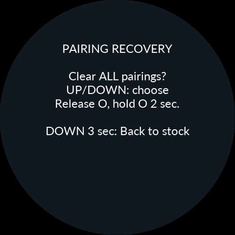
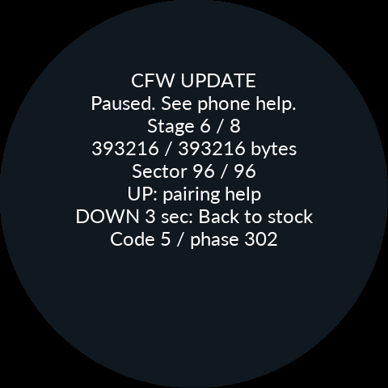
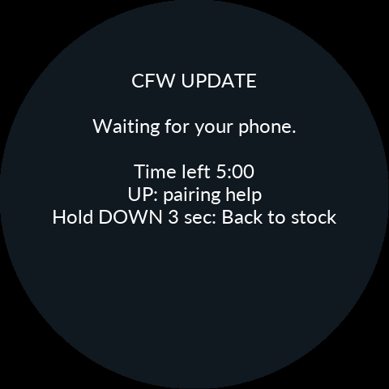

# 0.9.34 — 설치 연결 수명·페어링 복구·물리 재시작

## 현장 로그와 확인된 범위

사용자는 CFW 간 업데이트에서 파일 전송 완료 후 Stage 3/8 Connection recovery에
멈췄고, O 취소가 반응하지 않았으며 롤백한 뒤에도 Couldn't Pair가 이어졌다고
보고했다. 고속 Bluetooth 도입 이후 빈도가 늘었다는 관찰도 함께 검토했다.

비공개 진단 ZIP의 246개 로그 파일에서 CRC가 유효한 레코드 16,753개를 읽었다.
문제가 된 작업에서는 393,216B 검증 후 FINISH·COMMIT·RESET 모두 성공 응답이
기록됐다. 이후 약 2분 동안 보안 SPP 소켓 열기가 8번 성공했으나 짧은 조회 뒤
앱이 연결을 닫고 다시 시도했다. 따라서 이 구간 전체를 “Bluetooth가 연결되지
않음”으로 설명할 수는 없다.

각 연결의 수신량은 624B였다. 이전 Product의 식별·상태 조회 조합과 맞지만,
로그에는 해당 응답 원문이 없어 실제 실행 이미지가 무엇이었는지 확정할 수 없다.
이 자료에는 기기의 UART 속도·HCI 상세 진단도 없었다. 고속 프로빙 성공 여부나
모든 0x05 인증 오류의 원인을 이 로그만으로 판정하지 않는다. 원본 로그·주소·
폰 정보·백업은 공개하지 않는다.

## 재부팅 인계에서 재현한 결함

기존 본체 제어 루프는 링크 단절을 먼저 처리해 송신 세션을 버린 뒤 응답 전송
완료를 확인했다. 앱이 RESET 응답을 읽자마자 소켓을 닫으면 본체가 그 응답의
완료를 놓치고 이미 확정한 이미지 앞에서 재부팅을 기다릴 수 있었다.

이제 성공적으로 RFCOMM 송신에 들어간 바이트 카운터와 연결 세대를 먼저 확인한다.
단절이 송신 큐를 비워도 “보냈다”로 간주하지 않는다. 실제 제어 코드를 실행해
응답 전송 직후 닫기와 전송 중 큐 폐기를 각각 시험했다. 전자는 RESET 인계를
유지하고 후자는 승인하지 않는다. 이는 재현한 코드 결함이며, 실차에서 신고한
모든 정지의 단일 원인이라고 주장하지 않는다.

RESET 대기·키 저장·응답 대기를 구분하고, 단절이나 오류가 나도 진행 단계를
3단계로 되돌리지 않는다. 이미 COMMIT된 설치에서는 불가능한 O 취소를 안내하지
않고 연결 복구와 데이터 유지 순정 복귀를 표시한다. 확정 전 취소는 먼저 IDLE을
게시하고 저장 권한을 반납해 설치 화면과 NOR 작업 소유권이 계속 남지 않게 했다.

## 앱 자동 이어하기

- 실제 통신 단절만 최대 8회, 2→5→10초 간격과 5분 복구 한도 안에서 재시도한다.
- 새 소켓마다 같은 기기·패키지·트랜잭션과 저장된 위치를 확인한 뒤 이어간다.
  데이터 수신 뒤 응답만 잃은 경우도 전체 재전송이나 COMMIT 중복 없이 시험했다.
- RESET 결과가 불명확하면 부팅 결과를 조회한다. COMMIT·RESET을 자동 반복하지 않는다.
- 아직 이전 Product가 응답하면 같은 연결에서 최대 20초 동안 인계를 확인한다.
  이전 버전으로 정상 부팅 확인을 보내거나 소켓 8개를 연속으로 열고 닫지 않는다.
- 인증 거절·사용자 취소·프로토콜 오류·파일 오류는 일반 무선 단절과 구분한다.
  일시적 사유만 제한 재시도하며, 키 불일치는 연결 복구 안내로 넘어간다.

연결 진단에는 A9의 CRC 보호 재부팅 경계와 실제 UART baud, 현재/저장된 키 세대,
오류 카운터를 남긴다. 키 바이트나 개인 콘텐츠는 남기지 않는다. baud 표시가
3,686,400이어도 실제 무선 처리량을 측정한 것과 같지는 않다.

## 양쪽 페어링 초기화

앱의 연결 복구에서 Android Bluetooth 설정으로 이동해 선택한 Noodoe만 등록
해제한다. 본체 설치·시험 부팅·롤백 화면에서는 UP으로 연결 복구를 열고 저장된
폰 하나 또는 ALL을 선택한다. O를 놓았다가 새로 2초 눌러 승인한다. ALL은 본체에
저장된 모든 폰의 키를 지운다. 다른 Bluetooth 장치의 Android 등록은 건드리지 않는다.

본체는 BT 정지 → 선택 범위 삭제 → NOR 저장·세대 확인 → 새 페어링 순서를 지킨다.
자동 재연결만으로 키를 지우지 않는다. 기존 실행 중인 CFW의 Settings → Connections
→ Re-pair phone 경로도 유지한다. Android 설정에서 돌아오거나 Activity가 재생성돼도
복구 안내를 이어서 볼 수 있다. 설정·사진·정비 기록과 설치 증거는 보존한다.

롤백은 실행 코드를 되돌리며 Android 등록 키와 최신 기기 키를 과거 시점으로 함께
되돌리는 작업은 아니다. 그래서 이전 CFW로 돌아갔다는 사실만으로 페어링이 복구될
것이라 가정하지 않는다.

## 버튼과 부팅 안내

롤백 결과의 O 확인은 일반 메뉴/전원 차단 검사보다 먼저 처리한다. 설치 및 롤백
복구 입력을 일반 주행 UI가 가로채지 않도록 했으며, 설치 화면 위에 연료 경고가
끼어들어 현재 작업을 가리는 경로도 차단했다.

CFW 0.9.34 이상에서 IGN ON이고 메뉴가 반응하지 않으면, 모든 버튼을 놓은 다음
**UP+DOWN을 함께 10초 유지하고 모두 놓으면 MCU를 강제 재시작**한다. I/O 태스크가
실제 핀을 읽으므로 일반 UI 큐·PH9·Bluetooth 연결에 의존하지 않는다. 페어링 삭제나
시험 부팅 승인 동작은 아니다. 저장 전 상태를 잃을 수 있으며 I/O 태스크/CPU 자체가
멎은 경우에는 이 경로도 실행되지 않는다. 정상 Settings 재시작과 watchdog은 유지한다.
↑+O 3초의 표시부만 복구하는 조작과는 다르다. 구버전에는 APK만 바꿔 추가되지 않는다.

NOODOE INSTALLER는 기존 독립 Gate의 부팅·검사 화면 이름이다. 평소 재부팅에서도
나올 수 있으며 그 제목만으로 설치 중이라고 판단하지 않는다. 앱 도움말과 설치
설명서에 역할을 추가했고, 일반 업데이트에 Gate 교체를 요구하지 않았다.

## 검사 결과

- Android 468 tests, 6 skipped, 실패/오류 0. lint Error/Fatal 0, 기존 Warning 121.
- 실제 Java ZIP importer 322검사, APK 기존 서명 유지, APK/Product SHA 일치.
- 제어 ACK/연결 세대: O0·Os 각각 134 assertions.
- 설치 복구: O0·Os 각각 일반 23, 진입 19, 속도 선택 9, 전체 키 삭제 10 assertions.
- Product 키 저장·RESET·취소: O0·Os 각각 22 assertions. 지연 저장, 저장 실패,
  응답 유실, 응답 후 단절, 저장 중 키 변경을 검사했다.
- 실제 Gate/BootStore/Product 업데이트 ARM 시험에서 전송·재개·확정 중단·중복 RESET·
  롤백·진단·삭제 정책을 검사했다. NOR와 물리 reset은 모의 어댑터다.
- trial 20시나리오, Bootstrap UI/세션 52케이스, 기존 pairing/transport/bond 저장,
  Product UI·전원 UI·연료·시스템 재시작 회귀검사를 통과했다.
- 일반 버튼 임계값은 기존 0.8초를 유지하고, 오래된 2초 시험값을 공용 옵션 기준으로
  갱신했다. O0·O2 각각 94 assertions. Cube 스택 동기화 fixture 13검사도 통과했다.
- 실제 Product LVGL/EVE로 설치/재부팅/복구 화면 6장을 생성했다. 최대 DL 1,960B.
  라이트 옵션 ON의 product_ui 컴파일도 기존 Debug 옵션으로 확인했다.

시험 fixture에 누락된 build profile/공용 헤더/키 저장 어댑터를 보완했다. 실제 NVIC
reset은 돌아오지 않지만 시험 mock은 반환하므로, 이후 중복 RESET 검사를 하기 전에
시험의 IRQ 마스크를 명시적으로 복구했다. 이를 제품 IRQ 완화로 처리하지 않았다.

## 최종 자원과 배포

| Product | Flash 사용 | Flash 여유 | SRAM 여유 | CCM 여유 |
|---|---:|---:|---:|---:|
| Debug | 391,152B | 2,064B | 45,952B | 16,320B |
| Release | 358,304B | 34,912B | 44,968B | 16,320B |

Debug 2KiB·Release 4KiB 최소 여유를 통과했다. 새 기능 공간은 사용하지 않는 UI
설정 복사 제거와 큰 함수의 동일 순서 helper 분리로 확보했다. 컴파일 최적화 설정·
힙·스택·큐·이미지 버퍼·파티션을 줄이지 않았다. Dark 전용 빌드의 미사용 테마
입력 읽기만 제외하고 라이트 빌드 코드는 유지했다.

Bootstrap은 458,524B로 448KiB 중 228B가 남는다. 921,600 전용 정책은 그대로이며
Product의 고속 프로빙/명시적 저속 선택을 Bootstrap으로 옮기지 않았다. 이번에
고속 UART·칩 패치·인증 정책 자체를 다시 바꾸지는 않았다.

APK·Product·Bootstrap을 0.9.34 조합으로 배포한다. Gate·순정 복구본·리소스·삭제·
진단 이미지는 0.9.33과 같다. 소스는 비공개 저장소, 공개 저장소는 설명서와
APK/ZIP/시뮬레이션만 갱신한다. LGPL 라이브러리 교체 객체 묶음은 D8·zipalign·
별도 시험 서명으로 재조립을 검증했다.

실제 Galaxy S24 Ultra 페어링, Bluetooth 재접속 안정성·속도와 LCD 동작은 이번
실행에서 측정하지 않았다. 이번 결과는 소프트웨어 시험이며, 모든 폰과 기기에서
설치가 성공한다고 보증하는 결과가 아니다.

## Product EVE 소프트웨어 시뮬레이션

실제 LCD 사진이 아닙니다.

