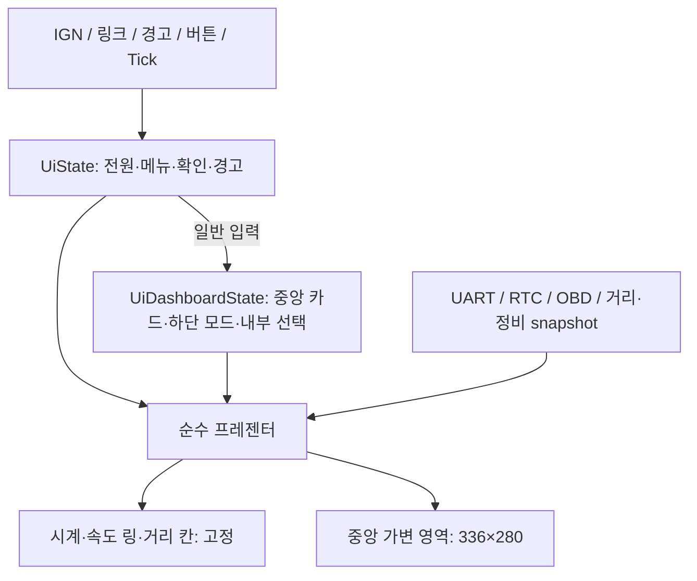
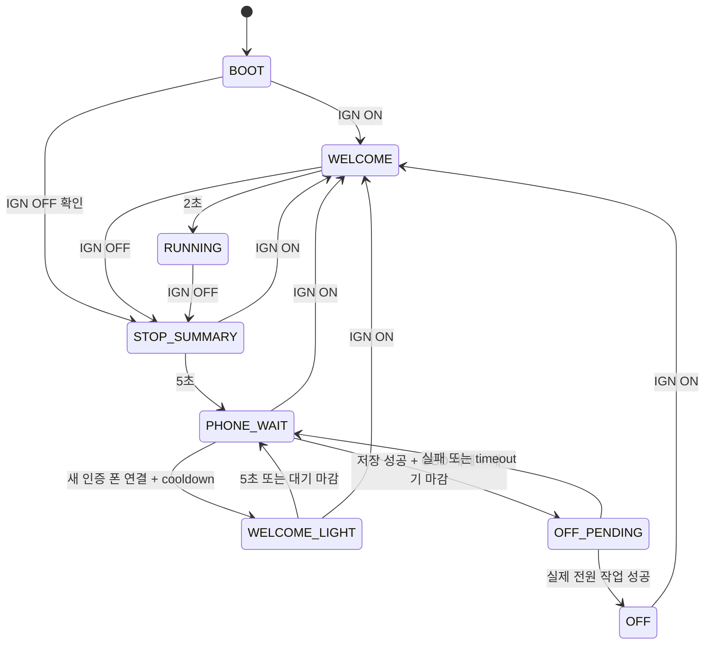

# 최신 IGN 전원 상태 계약 (2026-09-18)

[UI/POWER.md](UI/POWER.md)가 기준이다. IGN_STARTING / IGN_ON / IGN_STOPPING 뒤에
OFF_DISPLAY_HOLD / OFF_BT_HOLD / OFF_DEEP_SLEEP 세 OFF 단계가 독립적으로 존재한다.
설정 System → Power sequence에서 각 단계 사용과 앞 두 단계 시간을 정한다.
첫 단계는 화면 ON·백라이트0·BT 유지, 둘째는 화면 OFF·BT 유지, 마지막은 BT 종료·MCU STOP.
물리 IGN OFF 첫1초는 이전 프레임/밝기를 완전히 유지한다. 그 후 세션 종료 확정과
배경 fade/링 exit/Ride Summary5초를 시작한다. 종료 확정 전 ON은 같은 세션을 유지한다.
아래 과거 SAVE/POWER_CUT·즉시 종료·500ms 대기 설명은 폐기한다.

# 최신 중앙8페이지

2026-09-13 사용자 확장 계약은 [UI/PAGES.md](UI/PAGES.md)가 우선한다.1빈날짜/2트립/3폰/4음악/5OBD/6리모트/7폰GPS/8설정이며 미연결 OBD도 페이지를 유지한다. 아래의 이전 OBD 링크 gate와7카드 순회 설명은 폐기한다.

# Product UI 상태 머신 계약

2026-09-13 최신 범위: **홈은 속도계 하나**다. 외장 NMEA GPS 연결과 GPS 홈을
제품에서 제거하고 OBD를 중앙 카드로 통합한다. 폰은 **2대 동시 연결 + OBD 1대**를
현재 정적 자원 한도로 한다. 페어링 저장 개수와 동시 연결 개수는 별개다.

코드 위치: 상태·입력·프레젠터는 `App_Logic/UI`, LVGL 표시기·좌표는 `Graphics/UI`다.

## 상태 소유권

`UiState.home`, `preferred_home`, `UiConfig.home_mask`와 별도 홈 선택 메뉴는
없다. `ProductUI_Diagnostics.home=0`은 기존 144바이트 SWD 관측 형식용 예약
값이며 또 다른 상태 축이 아니다. 이 UI 구조체 자체를 저장소의 wire schema로
사용하지 않는다. 영속 설정/키 레코드 형식과 시동 시간 계측은 유지한다.

| 파일 | 소유 책임 |
| --- | --- |
| Ui_State.h / ui_state.c | 전체 이벤트·전원 상태·비동기 outbox, 카드 가용성 |
| ui_power.c | IGN·링크·전원 전이·완료 세대·타임아웃 |
| ui_navigation.c / ui_menu_catalog.c | 메뉴/편집/확인 전이와 표시 항목 |
| Ui_Dashboard.h / ui_dashboard.c | 중앙 card, footer, 카드 내부 selection |
| ui_input.c / ui_warning.c | 한 누름 한 동작, 문맥 취소, 공통 경고 단계 |
| ui_dashboard_presenter.c / ui_obd.c / ui_maintenance.c | 순수 데이터→문자열/유효성 |
| product_ui.c | 서비스 snapshot을 복사해 상태와 표시기로 연결 |
| speed_home_layout.c / speed_home_view.c | 고정 좌표와 재사용 LVGL 객체 |

`ui_*.c`는 BSP/LVGL/RTOS를 호출하지 않는다. UI 태스크 하나가 reducer와
LVGL을 소유한다. 서비스와 ISR는 UI를 직접 변경하지 않는다. Cube main의
`StartDefaultTask`는 계속 `LCDTest();`만 호출한다.

## 중앙 카드와 메뉴

- 중앙 카드: TRIP → NOTIFICATIONS → MUSIC → REMOTE → QUICK → BLANK →
  SYSTEM → OBD → 순회. **OBD 실제 연결이 없으면 OBD를 건너뛴다.**
- OBD 연결은 현재 카드를 자동으로 바꾸지 않는다. 보고 있던 OBD가 끊어지면
  중앙만 TRIP(허용되지 않았으면 BLANK)으로 돌아간다. 열린 설정/확인 창,
  시계·속도 링·거리 칸은 연결 변동 때문에 초기화하지 않는다.
- OBD에서 UP/DOWN은 RPM / 속도 / 냉각수 / 흡기 / 스로틀 / 부하 / MAP /
  MAF 선택이다. readonly Mode01 서비스의 실제 valid/stale snapshot만 쓴다.
  미지원·오래됨·미연결 값은 `--`다. 속도 링의 입력은 계속 계기판 UART다.
- Footer: ODO / TRIP1 / TRIP2 / RESV / OIL / BELT / SERV. RESV의 표시 이름은
  TRIP F이며 수동 순회/수동 초기화 대상이 아니다. 중앙 카드와 독립적으로 유지한다.
- 환경설정: 날짜/시간, Bluetooth(Phones, OBD), 언어, 차량, 표시, 전원.
  빠른 설정은 밝기/배경만 남긴다. GPS 장치/별도 홈 선택 항목은 없다.

폰 카드에는 실제 데이터가 없으면 대기/미연결 문구를 표시한다. 두 폰의 알림 병합,
미디어 및 원격 제어 대상 선택 화면은 후속 단계이며 문자열만으로 구현 완료를
주장하지 않는다. 현재 Product의 PAIR/SET/SAVE/POWER_OFF 등 미래 effect는
`UNSUPPORTED=8`로 완료한다. 메뉴의 `Action unavailable`는 실제 서비스 성공이 아니다.

## 버튼과 연결

가운데 ENTER의 기존 핀은 **PA15**이며 `product_input.c`가 BSP 이벤트를 명시적으로 변환한다. RELEASE에서 한 번만 결정하므로 직후 SHORT는 두 번째 전이가 되지 않는다.

ENTER 짧게는 중앙 카드를 순회하고, 길게(현재 2001ms)는 항목 진입/확인이다.
TRIP에서 UP/DOWN은 하단 모드, OBD에서는 PID, MUSIC에서는 동작을 고른다.
원격 상태의 ENTER 3000ms는 로컬 탈출이며 2001ms에 원격 명령을 미리 보내지 않는다.
부팅 때 눌린 버튼은 해제될 때까지 무시한다. PRESS 때의 context를 저장하므로
IGN/경고/화면 변경 뒤 RELEASE가 새 문맥을 조작하지 않는다. 폰 집합이 바뀌면
원격 문맥도 종료하여 다른 폰에 이전 누름이 승계되지 않게 한다.

| 링크 비트 | 의미 |
| --- | --- |
| bit0 / 1 | 폰 슬롯1 실제 연결 |
| bit1 / 2 | 폐기된 GPS 비트, 무시 |
| bit2 / 4 | OBD 실제 연결 |
| bit3 / 8 | 폰 슬롯2 실제 연결 |

이는 Bluetooth role 번호와 다르다: PHONE=0, ELM=1, PHONE2=2.
pairing 기록으로 위 비트를 만들지 않는다. 두 폰의 session epoch/CID/주소,
NDCP 파서, 송수신 큐는 각각 분리한다. 현재 OTA와 폰 위치 입력은 첫 슬롯만
소유하며 두 번째 슬롯은 해당 명령에 BUSY를 받는다. 상세는 App_Logic/Control/README.md.

## 전원과 비동기 작업

IGN edge는 새 epoch다. OFF에서는 OBD 연결 차단/해제와 저장을 요청하고 폰은
유지 대상으로 둔다. 대기는 기본10분, 웰컴라이트 cooldown60초이며 웰컴라이트가
대기 마감을 연장하지 않는다. UI의 PHONE_WAIT가 MCU STOP이나 BT 저전력 성공을
뜻하지 않는다. 실제 절전/저장 effect 연결은 아직 후속 작업이다.

Outbox16개, 동일 uint32 단조 ms, `kind,arg,value,id,epoch`로 작업을 추적한다.
설정/페어링/미디어/초기화5초, 저장·전원10초 타임아웃이다. 늦은/중복 완료와
이전 epoch는 현재 작업을 성공시키지 못한다. overflow는 FAULT이며 자동으로
저장/전원 요청을 잃어버리지 않는다. FAULT는 실제 IGN edge로만 새 세션을 시작한다.
어댑터는 FAULT/IGN → 링크/완료 → 도메인 경고 → 입력 순서로 전달한다.

## 경고와 거리

경고 단계는 점멸5초 → 축소·이동0.4초 → 문구3초, 우선순위는 연료/오일/벨트/서비스다.
RESERVE_ENTER는 거리 계측 시작을 한 번 요청하고 경고 종료 후 하단을 RESV에
잠근다. REFUEL 뒤 원래 footer로 돌아온다. 잠금은 중앙 카드·환경설정을 막지 않는다.
현재 실제 연료 매핑 검증은0/1칸뿐이며, 미래2칸 이상 주유 해제를 임의로 확정하지 않는다.
자동 저연료 의미 이벤트, 완성된 경고 아이콘 애니메이션, 영속 트립은 아직 후속이다.

시각·ODO는 유효한 RTC/UART snapshot만 쓰며 미확인에는 `--:--`/`------`를 표시한다.
leading zero는 시계HH:MM만 허용한다. 숫자는 D-DIN, 일반 글자는 Lato이고
고정 폭은 영역/정렬 기준이다. 본문 공백에 monospace를 강제하지 않는다.
정비 계산·실제 IGN 시간·날짜 로직은 유지한다. OIL의 HOURS는 내부에만 두고
ODO/TRIP/RESV/OIL 아래에는 잔량선을, BELT/SERV에는 기존 DAYS를 표시한다.

## 확정된 화면 뼈대와 중앙 가변 영역

- 원 중심(239.5,239.5), 반경240, 속도 링480×480/18px 유지.
- 시계 D-DIN48, x144/폭192/**baseline71**. 승인된 화면에서6px 위로 이동.
- 위 구분선: (127,51)→(172,87)→(308,87)→(353,51). 기존24:19 사선을 위로 연장해 속도 링 안쪽에서 끝낸다.
- 중앙: **x72..407, y105..384, 336×280**. 중앙 자식의 로컬 좌표는
  **x0..335, y0..279**. 원/호를 침범하지 않는 완전포함 사각형이다.
- 거리 위: (87,424)→(116,401)→(364,401)→(392,424). 기존 사선을 아래로 연장해 호가 없는 하단 원 경계까지 잇는다.
- 거리 아래: (144,448)→(336,448) 직선 유지. 세 구분선은 모두3px.
- 하단 글자/숫자/단위는 기존 위치·크기 유지. 잔량선x160/y454/160×6 유지.

모든 주행 중 카드/메뉴/경고는 `SpeedHome_GetContentRoot()`의 자식으로 만든다.
`SpeedHome_GetContentArea()`는 위의 절대 경계를 반환한다. 좌표/크기/overflow를
상위가 바꾸거나 별도 top layer로 경계를 우회하지 않는다. LVGL child clipping을
EVE scissor로 처리하므로 중앙 교체가 고정 뼈대를 덮을 수 없다. 화면 객체는
초기화 때만 만들고 이후 텍스트/가시성을 갱신한다. 부모 포인터는 Destroy 후 다시 받는다.

개발 UART/FPS/CPU는 기존 shell 진단 overlay(y309..344 부근)다. 현재 개발
화면에서는 중앙 내용이 그 행을 가리지 않도록 한다. 원 밖은 개발용 녹회색0x4A5952다.
EVE의 기존 수평 RECTS 폭 문제 때문에 구분선은 각각 두 점의 rounded line을
사용한다. vendor 변경이나 전체 framebuffer를 추가하지 않는다.

## 재현

`tools/tests/product_ui/run.py`는 실제 ARM C를 O0/Os로 실행해 전원/경고/입력,
OBD 가용성·stale 표시, 두 폰 링크, 메뉴 독립성과30,000개 임의 이벤트를 검사한다.
`check_assets.py`는 실제 font hash·최대 문자열·잉크 baseline·영역·구분선 충돌을 검사한다.
`tools/tests/bt_transport_host/run.py`는 두 폰 수락/세 번째 거부/세션별 큐를,
`control_host/run.py`는 독립 NDCP 응답과 OTA 소유권 보존을 모의 검증한다.
실물 증거는 `Reversing/analysis/2026-09-13-central-dashboard-multiphone`에 둔다.
EVE 캡처는 표시 데이터의 출력 증거이며 LCD 사진이나 손상된 BT의 무선 검증이 아니다.

최신 정정: 두 구분선 모두 수평 덧붙임 없이 기존 사선을 연장한다. 시계는 속도 링 안쪽 경계, 하단은 호 개방부의 표시 원 경계에서 끝난다. 중앙336×280·거리 아래 직선·오일 잔량선은 유지한다.
