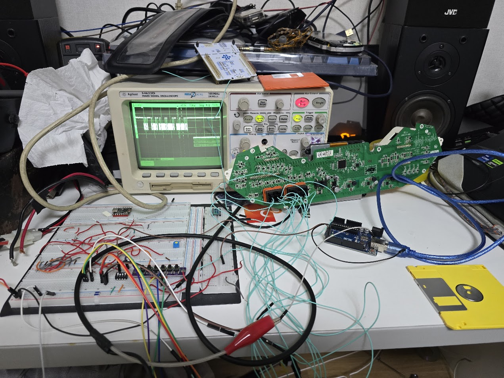
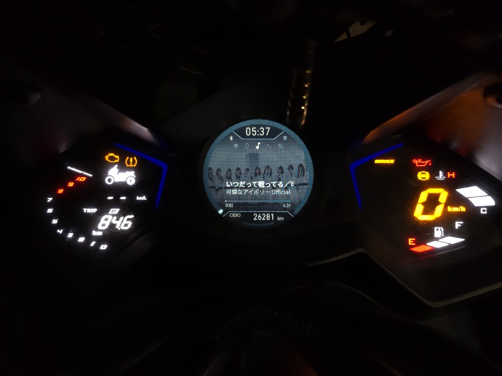
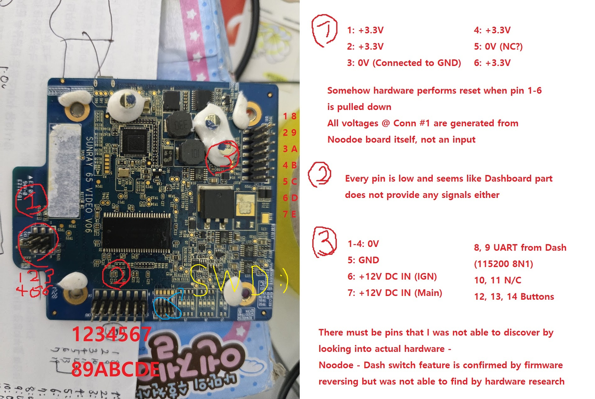
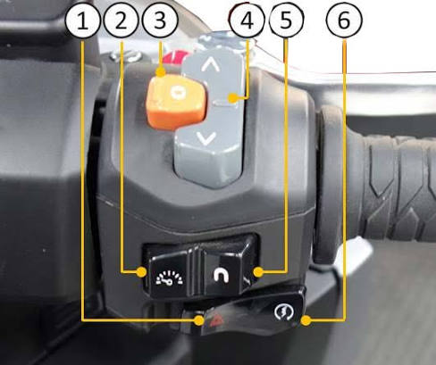

# Hardware: what's actually inside Noodoe?

This is the AK 550 / SR1.5-family module I took apart. Yes, my bench unit has physical damage in its Bluetooth and ambient-light paths. I did that myself. It still gives me a headache. Read the [CubeIDE configuration](../STM32/FuckNudo_Noodoe_CFW_Project.ioc), stock-code findings and measurements as distinct kinds of evidence. [한국어](hardware.ko.md)

The cluster and Noodoe are separate hardware, separate software, separate things the rider sees. Look at the photo: the left and right gauges are the cluster; the center display is Noodoe, running my firmware here. If that distinction still sounds odd, take another look. :)

The annotations record my bench probing; they are not a substitute for checking your own board before wiring power or SWD.

## The little pins, and one expensive mistake

I used an oscilloscope and a bench harness to make the module behave roughly as it would on the bike. One of the tiny board contacts exposes STM32 SWDIO/SWCLK. At 1.27 mm pitch, ordinary Arduino jumpers weren't going to cut it, so I rode to Seoul for a connector. An aside: Seoul to Incheon took me 35 minutes. That's one reason I ride.

With SWD wired up I could dump firmware, inspect registers and RAM, and actually work on the hardware instead of guessing in the dark. Cruise control for firmware development—or so I thought. While probing for SWD continuity, I knocked off what looked like a 0402 part near those pins. I prayed it was merely a decoupling capacitor. Boot then seemed slower. “Still boots, so it's fine,” I told myself. Famous last words.

The missing part sat near a pin associated with Bluetooth control; a resistor or divider is plausible, but I haven't proved the component's identity. The boot delay may be Bluetooth initialization timing out. Again: hypothesis, not a schematic. Please don't drag a probe across this board like I did. That mistake bought me a second bill and extra delivery shifts to keep the rent paid. Lone-developer rules are easy to preach and annoyingly hard to follow.

The MCU pin names and measured harness signals are listed below. I no longer have the full bench set up as of 26 September 2026, so I'm not pretending to have a complete connector-cavity diagram.

## Main data paths

| Part | What it does | What I found |
|---|---|---|
| STM32F429IE-class Cortex-M4F | Vehicle input, buttons and power state, Bluetooth host, graphics commands | Cube targets STM32F429IET6; vectors and the 512 KiB internal flash map match. |
| FT81x EVE | Renders display lists and textures from SPI to a 480×480 LCD | This is not an STM32 LTDC framebuffer. I brought the FT81x-family path up; the exact variant can wait. |
| LCD and backlight | Circular visible screen and separate brightness control | Panel control and TIM5 PWM are separate. The panel's vendor part number hasn't stopped the screen working. |
| External NOR | Stock FAT files, photos, CFW assets and update staging | 128 MiB on this board, with 4 KiB erase sectors. |
| External SDRAM | Decode and asset buffers, capture and working memory | 64 MiB of volatile RAM, not persistent storage. |
| TI CC256x | Classic Bluetooth controller | STM32 runs HCI UART and hosts SPP, just as the stock firmware did. |
| OPT3001 | Ambient-light readings for automatic brightness | Registers and stock call path identify it. The original bench chip failed around my birthday; a later matching module let me continue testing. Some birthday present. |

Cluster data, ignition and button signals reach the STM32. The rest fans out through **SPI1 → EVE → LCD**, **SPI5 → NOR**, **FMC → SDRAM**, **USART1 → CC256x**, **I2C3 → OPT3001**, and **TIM5 → backlight PWM**. The EVE display list and RAM_G do the real rendering.

Ordinary SRAM is 192 KiB; CCM is 64 KiB. CCM is precious CPU-addressable memory but unsuitable for these DMA buffers, so the LVGL pool lives there while UART/SPI DMA buffers and task stacks stay in ordinary SRAM. The exact addresses are in the [memory map](memory-map.md). There: one memory problem solved without sacrificing a button. Ha.

## Buttons, ignition and the bike

The handlebar has three buttons and a selector for **cluster control** versus **Noodoe control**. Flip it to the cluster and the buttons operate the cluster; flip it to Noodoe and they operate Noodoe. The three inputs are **UP PD12**, **DOWN PI6**, and **O/ENTER PA15**, all active low at the MCU. **PH9** reports the selector position. **PG13** is the ignition input on the board I examined: LOW means IGN ON, HIGH means IGN OFF. Those are MCU pins, not numbered cavities in the harness. Mixing the two up is a good way to invent a wiring diagram that doesn't exist.

Harness measurements found two 12 V supply lines, three active-low button-related signals and vehicle UART signals at roughly 5 V level. I didn't establish a full cavity-to-MCU map. Turning the key off removes the IGN state; it does not necessarily remove the module's always-on supply. I suspect Noodoe contributes to the parked bike's battery drain. Or maybe I'm blaming the wrong suspect; testing that is another afternoon.

For the evidence trail, see the [button BSP](../STM32/Drivers/BSP/inc/BSP_Buttons.h), [peripheral notes](research-notes/ak550-sr15-mcu-peripheral-settings.md), [harness measurements](research-notes/2026-09-10-noodoe-dash-interconnect.md) and [NOR/USB acquisition](research-notes/2026-09-09-noodoe-usb-acquisition.md). The silicon references are [STM32F429IE](https://www.st.com/en/microcontrollers-microprocessors/stm32f429ie.html), [FT81x](https://www.brtchip.com/wp-content/uploads/Support/Documentation/Datasheets/ICs/EVE/DS_FT81x.pdf), [CC2564C](https://www.ti.com/product/CC2564C) and [OPT3001](https://www.ti.com/product/OPT3001).
