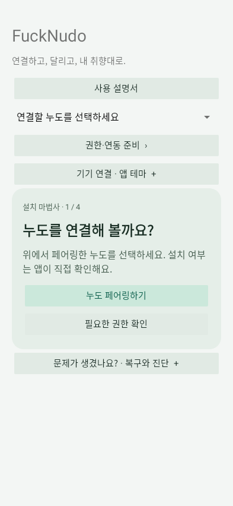

# 2. Android 앱 준비와 연결

[목차](README.md) · [주행 화면](03-Home-Trip.md)

## 설치와 기기 선택

최신 릴리스의 APK를 설치합니다. Android가 외부 APK 설치 허용을 요구하면 사용한 브라우저/파일 앱에 해당 허용을 부여합니다. 기존 앱을 삭제하지 않고 동일 서명의 APK로 업데이트하면 설치 증거와 로그를 보존할 수 있습니다.

홈에서 연결할 Noodoe를 고릅니다. 순정은 `KYMCO Noodoe ...`, CFW는 **`FuckNudo CFW XXXXXX`** 형식이며 뒤 6자리는 Bluetooth 주소 끝 세 바이트입니다. 다른 기기의 작업 기록을 현재 기기에 재사용하지 않습니다.

`권한·연동 준비`에서 필요한 항목을 켭니다. 권한 창은 Android가 제공하므로 앱이 사용자를 대신해 자동 승인하지 않습니다.

| 항목 | 필요한 기능 |
|---|---|
| Bluetooth/주변 기기 | 페어링, SPP 연결, 업데이트 |
| 알림 접근 | 휴대전화 알림과 활성 미디어 세션 확인 |
| 정밀 위치, 필요한 백그라운드 위치 | 화면 꺼짐 상태의 폰 GPS 전송 |
| 동반 기기 등록 | 등록된 기기의 자동 연결과 백그라운드 연동 |
| 연락처 | 전화 즐겨찾기와 이름 표시 |
| 최근 통화 기록 | 최근 통화 10개 |
| 발신·전화 상태·동반 통화 제어 | 발신, 수신 상태, 받기·종료 |
| 앱 알림 허용 | 서비스 상태 알림과 테스트 알림 |

권한을 거절하면 해당 기능만 사용할 수 없거나 `Permission Denied!`로 표시됩니다. Android 버전과 제조사에 따라 통화 제어 승인 경로가 다릅니다. 기존 기본 전화 앱과 헤드셋을 그대로 사용합니다.

## 자동 주행과 수동 중지

Product CFW로 확인된 등록 기기에 연결하면 기본적으로 **주행 연동**을 시작합니다. GPS·음악·알림 전송은 주행 기록 파일 저장 여부와 독립적입니다. 업데이트하려면 먼저 주행 연동을 수동으로 중지합니다. 업데이트 도중 자동 주행 연결로 끼어들지 않습니다.

휴대전화 화면이 꺼져도 서비스가 실행 중이고 권한이 유지되면 GPS와 음악 정보를 전송합니다. 앱을 최근 앱에서 숨기는 것과 Android 설정의 **강제 종료**는 다릅니다. 강제 종료·권한 철회·OS 중단 뒤에는 앱을 다시 열고 안내에 따라 재개해야 할 수 있습니다. Galaxy에서는 앱의 배터리 제한 및 절전 예외도 확인하세요.

## 앱 설정과 기록

- 앱 테마: 시스템 / 라이트 / 다크. 누도 본체 테마와 별개입니다.
- 앱 언어: 시스템, 영어, 한국어, 일본어, 중국어 간체, **대만용 중국어 번체**, 스페인어. 본체 고정 UI는 영어입니다.
- 주행 기록 저장: **기본 OFF**. 필요할 때 `주행 기록 시작`, 끝나면 종료합니다. 기존 기록 조회·내보내기는 유지됩니다.
- `사용 설명서`: 이 GitHub 설명서를 브라우저로 엽니다. 설치·연결 상태를 초기화하지 않습니다.
- 설정/사진 작업과 업데이트는 서로 다릅니다. 폰에서 선택만 했다고 기기에 영구 저장된 것이 아니므로 결과를 확인하세요.
