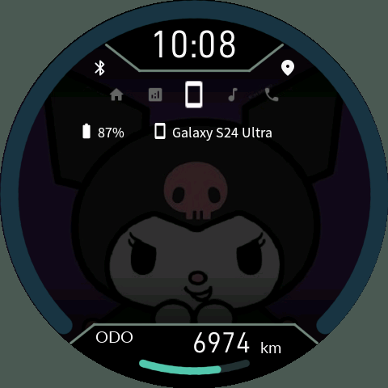
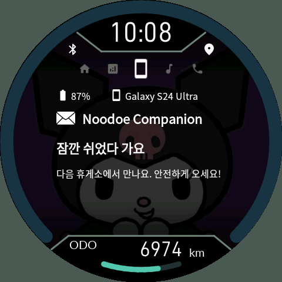
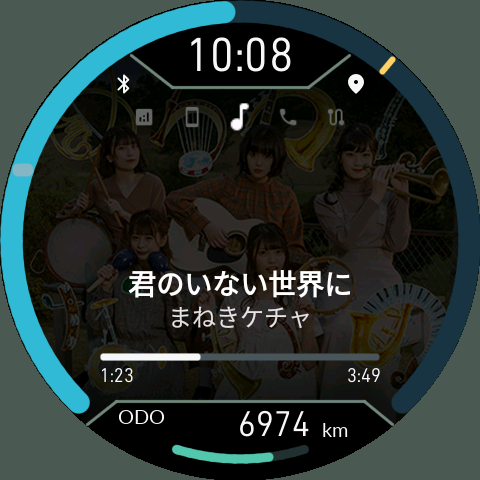
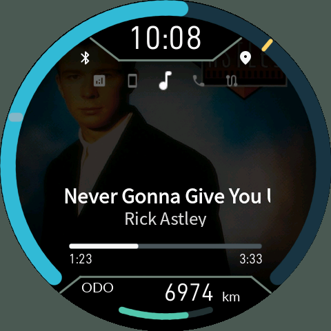
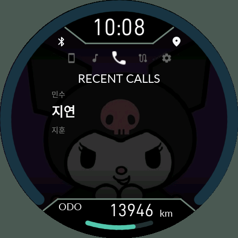
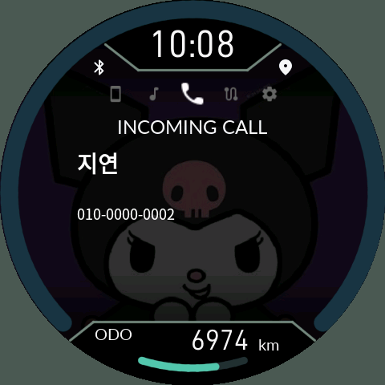

# 4. 휴대전화 알림, 음악과 전화

[목차](README.md)

## 휴대전화 페이지

| 대기 | 알림 열기 |
|---|---|
|  |  |

맨 위 한 줄에는 휴대전화 아이콘·이름·배터리 %가 표시됩니다. 알림이 없으면 `No notification`을 표시하고, 알림이 있으면 첫 화면부터 최신 알림을 표시합니다. UP/DOWN으로 최근 알림 1~10개를 순환합니다. 앱 아이콘과 앱 이름, 도착 시각(`HH:mm`), 제목, 본문 순서입니다. 6.11.2부터 알림 카드는 더 큰 원본 글자로 표시하고, 긴 문구는 영역에 맞춰 말줄임합니다. **최대 10개**를 보관하며 동일 알림의 수정/삭제를 반영합니다.

폰 앱에서 전달할 앱을 허용하고 Android의 알림 접근을 켜야 합니다. 삭제된 알림은 읽을 수 있어도 답장은 불가능할 수 있습니다. **50km/h 초과에서는 최신 알림만 표시하고 조작을 제한**합니다. 속도 미확인도 조작 제한에 영향을 줍니다.

### 알림 활성화와 연속 수신

6.11.1부터 알림 접근이나 해당 앱의 전달을 켠 **이후 새로 도착한 알림만** 받습니다. 알림창에 이미 쌓여 있던 메시지는 가져오지 않습니다. 같은 내용의 반복 갱신이나 묶음 요약·상시 서비스 알림을 새 메시지로 계속 세지 않습니다.

글자·앱 아이콘 전송과 기기의 검증이 끝난 내용부터 표시합니다. 그동안 이전 완성 화면을 유지하며, 알림 개수도 실제로 볼 수 있는 내용 기준입니다. 연속 수신 중에는 대기 중인 같은 알림의 수정을 합치고, 이미 전송 중인 한 건은 완료합니다. 최대 10건을 넘는 폭주에서는 중간 알림이 생략될 수 있습니다. 폰 배터리 갱신 때문에 알림 전체를 다시 전송하지 않습니다.

알림의 CJK 글자는 폰에서 렌더링해 전송합니다. 현재 확보된 순정 NOR 자료에는 재사용을 검증한 정상 글꼴 파일이 없어 순정 글꼴을 사용하는 방식으로 바꾸지 않았습니다.

### 새 알림 잠깐 보기 (6.11.2)

누도의 Connections 설정이나 폰의 기기 설정에서 **Notification preview**를 켤 수 있습니다. 기본값은 OFF입니다. **Preview seconds**는 기본 5초, 3~30초 범위입니다. 새 알림이 수신되면 잠시 휴대전화 페이지를 보여주고 이전 페이지와 선택 항목으로 돌아갑니다. 연속 알림은 마지막 알림부터 시간을 다시 셉니다.

직접 버튼을 조작하면 자동 복귀를 취소합니다. 이미 휴대전화 페이지를 읽는 중이거나, 통화·설정·시동 종료 등 우선 화면이 실행 중이면 강제로 이동하지 않습니다. 활성화하기 전 알림을 다시 재생하지 않습니다.

폰에서 전달 앱을 고르는 목록은 실제 앱 아이콘·앱 이름·패키지명을 함께 표시합니다.

### 빠른 답장과 테스트

답장 가능한 알림에서 O를 길게 눌러 답장 목록을 엽니다. UP/DOWN으로 선택하고 O 짧게 보내기를 확정합니다. 폰에서 문구를 **최대 5개** 설정합니다. 기본 서명은 `Sent from my Noodoe dashboard.`이며 수정하거나 비울 수 있습니다. 일반 알림 또는 웨어러블 확장의 자유 입력 답장 액션을 지원합니다. 폰에서 빠른 답장 문구를 먼저 등록해야 합니다. `No reply action from app`은 해당 알림이 직접 답장을 제공하지 않는 경우, `Set quick replies in phone app`은 문구 미등록, `Replies loading`은 목록 전송 대기입니다. 삭제되거나 내용·대상이 바뀐 오래된 알림에는 전송하지 않습니다. Android 알림이 직접 답장 액션을 제공해야 하며, 성공 결과는 해당 메시지 앱에 인계했다는 뜻입니다. 상대방 수신 확인은 아닙니다.

앱의 알림 테스트를 사용하면 허용·전송·표시 경로를 점검할 수 있습니다. 테스트 알림에도 시스템 알림 권한과 연결이 필요합니다.

## 음악 페이지

| 일본어·컬러 표시 | 영어 표시 |
|---|---|
|  |  |

제목은 굵게, 아티스트는 그 아래에 표시됩니다. 긴 제목은 글자를 계속 줄이지 않고 잠시 대기한 뒤 스크롤합니다. 한자·가나·한글은 폰에서 렌더링해 보내므로 누도 내부에 전체 CJK 글꼴을 설치할 필요가 없습니다. 음악 정보는 Android MediaSession을 제공하는 플레이어가 기준입니다.

- UP 짧게: 재생/일시정지.
- UP 길게: 이전 곡.
- DOWN 짧게: 다음 곡.
- O 짧게: 다음 주 메뉴.
- 아래 재생바와 좌우 시간: 현재 위치 / 전체 길이.

앨범아트가 있으면 **음악 페이지에서만** 일반 사진보다 우선합니다. 다른 페이지로 이동하면 지정 배경으로 돌아옵니다. 앨범아트는 폰에서 480×480으로 축소·압축하고 메모리에서 사용합니다. 사진 슬롯을 덮어쓰지 않습니다. 곡명·아티스트와 제어 응답은 큰 그림 전송보다 우선하지만, 플레이어가 늦게 메타데이터를 제공하면 즉시 표시할 수는 없습니다.

예시 곡은 **まねきケチャ — 君のいない世界に**와 **Rick Astley — Never Gonna Give You Up**입니다. 첫 곡은 한자·가나와 다섯 멤버가 나온 컬러 앨범아트, 두 번째는 영어 제목 표시의 예시입니다. 긴 영어 제목은 한 프레임에 전부 들어가지 않고 스크롤합니다. 재생 위치는 설명서용 시험값입니다. [출처](12-Capture-Notes.md)

## 전화 페이지

| 연락처 선택 | 수신 전화 |
|---|---|
|  |  |

음악과 GPS 사이에 있습니다. 폰에서 즐겨찾기 **10개**를 선정·정렬할 수 있고 최근 통화 **10개**도 표시합니다. UP/DOWN으로 항목을 고른 뒤 O를 길게 누르면 발신합니다. 목록 제목은 고정되고 안쪽 항목이 이동합니다. 6.11.0부터 한 화면에 한 기록의 큰 이름·전화번호·통화 시각을 표시하며, 수신은 초록색 화살표, 발신은 파란색 화살표, 부재중은 빨간색 표시로 구분합니다. 기존 표의 캡처는 이전 목록 배치입니다.

수신하면 전화 페이지로 이동해 발신자를 표시합니다. **O 길게 받기 / DOWN 길게 거절·종료**입니다. 통화 상태·경과 시간을 표시하고 위 Bluetooth 아이콘은 초록색 전화기로 바뀝니다. 종료하면 이전 페이지로 돌아갑니다. 설치·복구·시동 종료 화면은 통화 화면보다 우선합니다.

전화 권한은 연락처, 최근 기록, 발신, 통화 제어가 별개입니다. 목록이 보인다고 받기·종료 권한까지 확보된 것은 아닙니다. 6.11.0부터 통화 제어 권한이 없다는 이유로 조회 가능한 목록 전체를 가리지 않습니다. 실제로 필요한 권한이 없어 `Permission Denied!`가 남으면 앱의 권한 센터에서 해당 동작의 승인을 확인하고 다시 연결합니다. 계기판 조작 스위치가 차단 상태이면 전화 버튼도 작동하지 않습니다. 음성은 기존 폰/헤드셋으로 연결되며 누도는 통화 스피커가 아닙니다.
