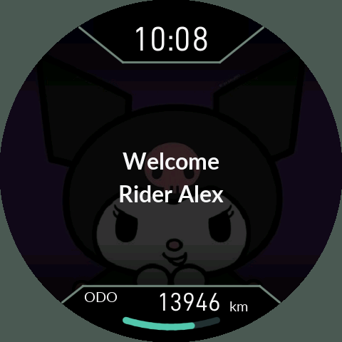
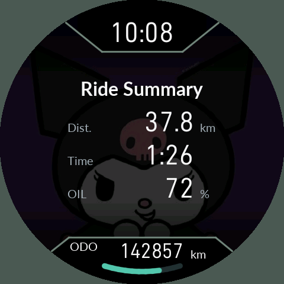
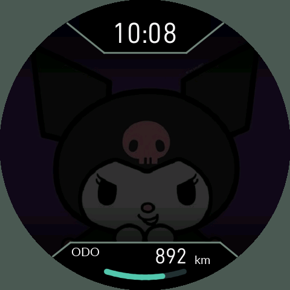
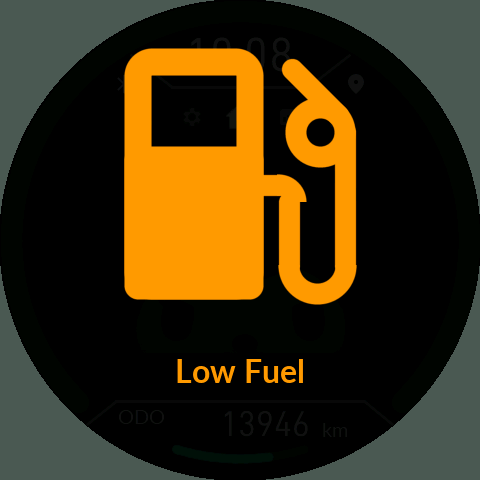
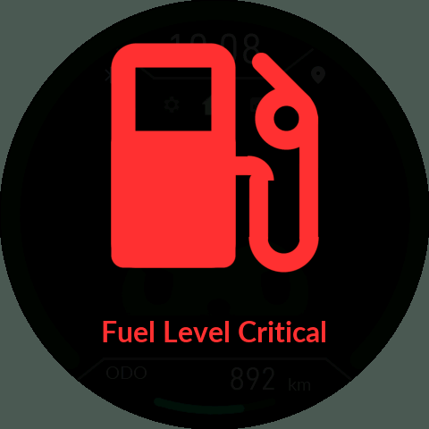

# 7. 시동, 절전과 공통 경고

[목차](README.md)

## 키 ON과 OFF

| Welcome | Ride Summary |
|---|---|
|  |  |

패널이 실제로 꺼졌던 상태에서 IGN ON이면 `Welcome / Rider 이름`을 표시합니다. 이전 주행 페이지로 돌아가고 속도 링 시작 애니메이션을 진행합니다. 단순히 화면 유지 상태에서 돌아오는 경우와 구분합니다. 이름은 폰의 기기 설정에서 바꿉니다.

키 OFF 직후에는 **1초간 직전 화면·이미지·밝기를 유지**합니다. 이 안에 다시 켜면 주행 세션을 끝내거나 초기화하지 않습니다. 종료가 확정되면 링과 주행 내용을 전환하고 일반 배경 사진을 20% 밝기로 표시하며 `Ride Summary`가 올라옵니다. 음악 앨범아트나 설정 화면에서 꺼도 같은 종료 흐름입니다.

Summary에는 이번 주행의 **Dist. / Time / OIL %**를 고정 위치로 표시합니다. 약 5초 후 설정된 절전 순서로 넘어갑니다. 거리와 시간의 앞자리 0을 불필요하게 채우지 않습니다.

## 절전 단계

위 캡처는 GPU에 남아 있는 화면 내용이며 **백라이트가 켜져 있다는 뜻이 아닙니다.** 실제 단계에서는 백라이트가 꺼집니다.

| 단계 | 화면/백라이트 | Bluetooth | 다음 단계 |
|---|---|---|---|
| Screen hold | 패널 내용 유지, 백라이트 OFF, 시계 분 단위 갱신 | 유지 | Screen duration 경과 |
| BT only | 패널 OFF | 유지 | BT-only duration 경과 |
| All off (STOP) | 패널·백라이트 OFF | 중지 | IGN ON으로 복귀 |

`System → Power sequence`에서 각 단계를 켜고 끄고 시간을 분 단위로 정합니다. OFF 단계 전환 시간과 1초 종료 유예/5초 Summary는 별개입니다. 비활성 단계는 건너뜁니다. 마지막으로 남은 활성 단계는 다음 단계가 없으면 IGN까지 유지될 수 있으므로, 시간을 0으로 설정했다고 전원을 물리적으로 분리하는 것은 아닙니다.

BT 유지 단계는 수신을 유지할 수 있는 절전 방식을 사용하고, 마지막 단계는 MCU STOP과 주변장치 절전을 사용합니다. 차량 상시전원의 물리적 차단과 같지 않습니다. 설치·복구 진행 중에는 작업 보호를 위해 일반 IGN 절전 정책이 적용되지 않습니다.

## 키 OFF 전용 배경

`Display → Key OFF photo`: Same as riding / Photo 0 / Photo 1 / Photo 2. 기본은 설정의 일반 배경이며 음악 앨범아트가 아닙니다. **Summary까지는 일반 배경**, Summary 이후 Screen hold 진입 때 선택한 키 OFF 사진으로 전환합니다. 준비 전에는 이전 그림을 유지합니다. 사진이 없거나 손상되면 일반 배경, 그것도 없으면 테마 기본 배경으로 대체합니다. 전환 때문에 백라이트를 켜거나 절전 시간을 다시 세지 않습니다.

## 연료 경고

| Low Fuel | Fuel Level Critical |
|---|---|
|  |  |

첫 시동의 안정된 저연료 표본이나 주행 중 저연료 진입 때 연료 아이콘을 표시합니다. 1칸은 주황색 `Low Fuel`, 0칸은 빨간색 `Fuel Level Critical`입니다. 큰 아이콘이 약 3초간 1Hz로 점멸한 뒤 조금 작아져 위로 이동하고 문구를 약 3초 표시합니다. 입력 허용 상태의 버튼으로 닫을 수 있습니다. 통신 오류/센서 오류는 정상 0칸과 다릅니다.

0칸이 확인되면 하단을 Reserve로 고정하고 그 시점 이후 주행거리를 셉니다. 연료 2칸 이상이 3초 유지되어야 해제됩니다. [Reserve의 노란 숫자 기준](03-Home-Trip.md)을 함께 확인하세요.
