# 8. 순정에서 최초 설치

[목차](README.md) · [이미 CFW라면 업데이트](09-Update.md)

## 주의사항

**설치 도중에는 반드시 휴대전화의 전원을 20% 이상 유지하고, 휴대전화의 모든 프로세스를 종료하십시오!**

**설치 도중 차량의 전압을 일정하게 유지하고, 차량의 엔진을 켜 놓은 상태로 두거나 충분한 전압이 있는 채로 KEY ON 상태로 두십시오.**

**설치 도중 절대로 휴대전화의 앱을 종료하거나, 차량의 스타트 버튼을 조작하지 마십시오!! 경고했습니다.**

## 준비

최신 APK와 **그 릴리스에 함께 제공된 설치 ZIP**을 받습니다. ZIP을 임의로 풀어 BIN 하나를 골라 보내지 않습니다. 앱에서 기기를 선택하고 ZIP을 선택한 뒤 설치 마법사를 진행합니다. 실제 기기 정보와 패키지 호환 검사를 통과해야 합니다. 오류를 없애려고 다른 기기의 기록을 가져오거나 기기 정보를 바꾸지 마세요.

키 신호와 상시 12V는 다릅니다. 설치 화면이 키 OFF 후에도 유지될 수 있습니다. 충분한 전원과 폰 배터리를 준비하고 설치 중 차량 배터리를 분리하지 마세요. 완료 시간을 보장된 고정 분수로 보지 마세요. 아래 캡처는 단계별 안내용 상태 주입이며 실측 전송 시간표가 아닙니다.

## 1. 순정 → Bootstrap 전송

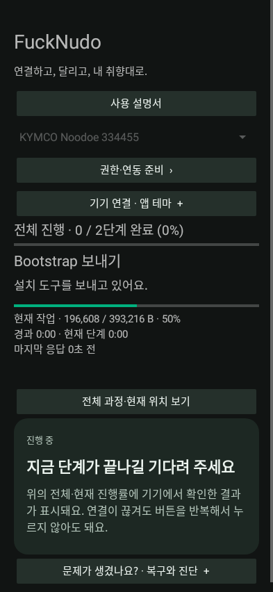

앱은 순정 프로토콜로 설치 도구를 보냅니다. 사용자 기기의 순정 정보와 주소를 확인합니다. 이 단계는 이미 설치된 CFW의 업데이트와 다릅니다.

## 2. 순정 설치 완료·Bootstrap 부팅

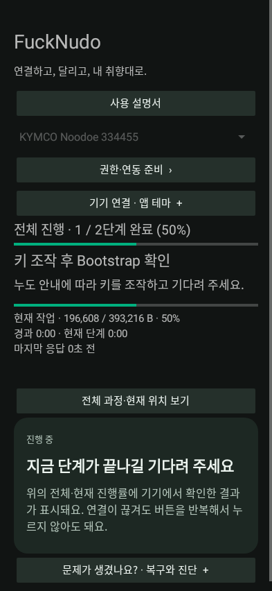

기기 안내에 따라 필요한 키 조작을 수행하고 기다립니다. `NOODOE INSTALLER`가 보이면 **아직 순정 설치기가 기록 중**입니다. Bluetooth가 잠시 끊기는 것은 재시작 때 발생할 수 있으며 앱이 새 역할을 확인해 재접속합니다.

## 3. Bootstrap 식별

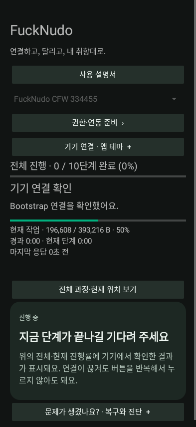

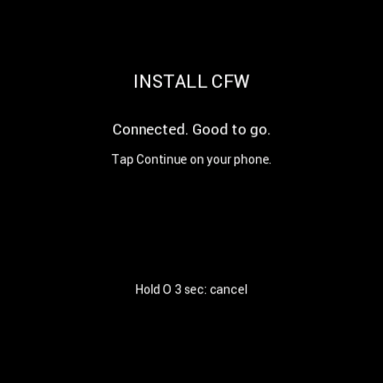

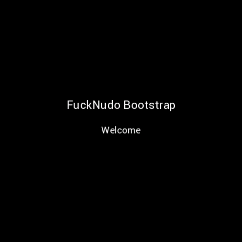

Bootstrap은 `FuckNudo Bootstrap / Welcome`과 설치 메뉴를 표시합니다. 앱은 실제 Bootstrap 역할·이미지·기기 ID를 확인합니다. Android가 페어링 확인을 요구하면 **직접 승인**하세요. 연결 확인은 파일 설치 완료가 아닙니다. Bluetooth test는 진단 메뉴이며 설치를 대신하지 않습니다.

## 4. 저장소 검사

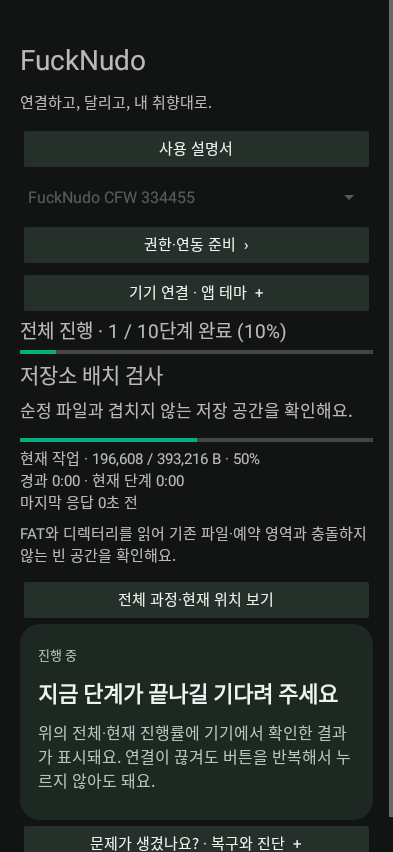

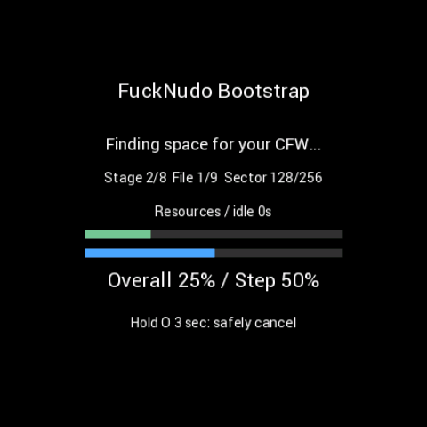

이 단계에서부터는 차량의 KEY OFF를 해도 설치가 계속 진행될 것입니다. 차량 내부의 전지 전압을 절약하기 위해 이 선택을 하는 것을 권장합니다.

FAT와 파일 할당을 읽어 순정 파일·예약 영역과 겹치지 않는 위치를 찾습니다. 손상·교차 연결·출처 불명 파일을 무조건 덮어쓰지 않습니다.

## 5. 변경 메타데이터 보관

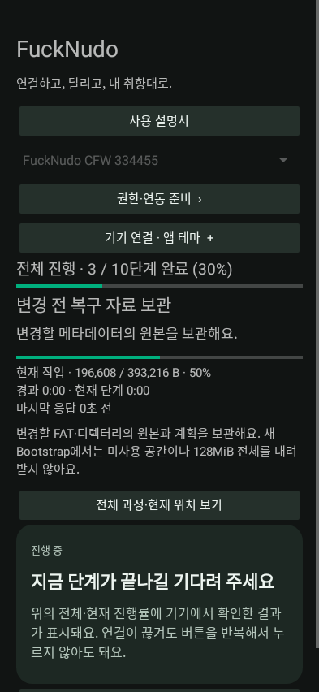

변경할 FAT/디렉터리 원본과 계획을 폰에 보관합니다. 최신 일반 경로는 전체 128MiB를 반복 다운로드하지 않습니다. 전체 NOR 백업은 별도 정밀 진단입니다.

## 6. CFW 파일 준비·기록·검증

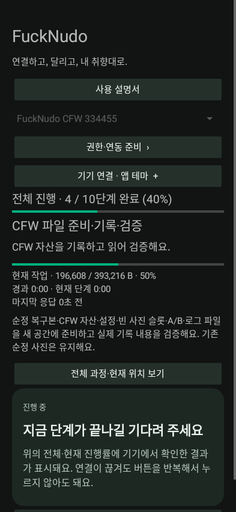

순정 복구본, 글꼴/BT 자산, 설정·사진·로그 파일, 업데이트 A/B를 준비합니다. 실제로 기록한 내용을 읽어 검증합니다. 기존 순정 사진은 보존하며 기본 새 설치의 CFW 설정·사진 슬롯은 초기화합니다.

**A/B는 사진 두 장이 아닙니다.** 업데이트 후보와 이전 정상 펌웨어를 보존하기 위한 두 슬롯입니다. 성공 확인 전까지 이전 정상본을 지키는 목적입니다.

## 7. 최종 대조

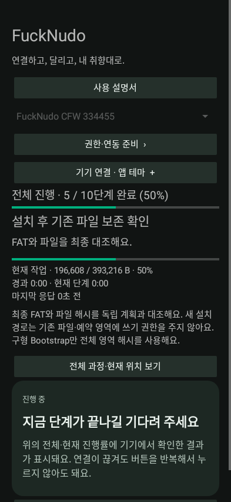

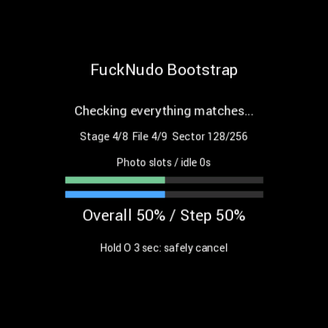

FAT, 파일 범위, 필요한 이미지와 자산을 다시 대조합니다. 검증 실패를 단순한 느린 전송으로 취급하지 마세요. 앱의 상세 오류와 기기의 Help code를 보관합니다.

## 8. 설치 이미지 준비

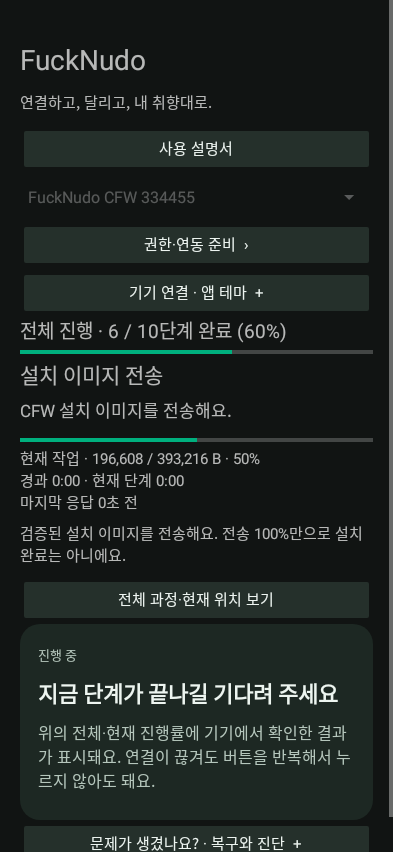

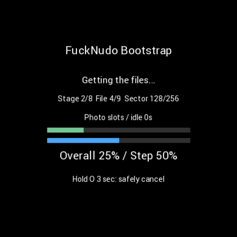

현재 진행률은 해당 전송/검증 작업의 바이트입니다. 전체 진행률은 단계 완료 비율이며 남은 시간 비율이 아닙니다. 파일 순서·섹터·검증 위치가 표시되는 구간에서는 그 값도 함께 보세요.

## 9. 누도에서 Install CFW? 승인

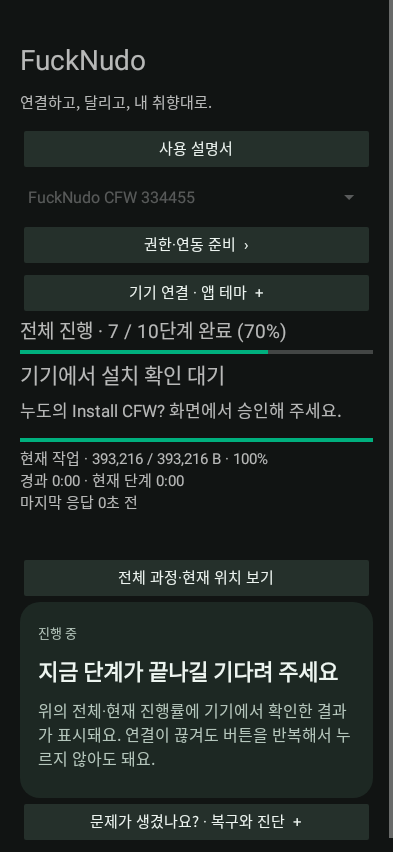

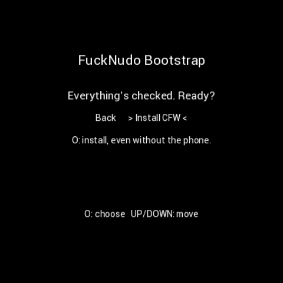

누도의 `Install CFW?` 안내에서 승인합니다. O를 누르고 있었다면 먼저 놓으십시오. 위 아래 키로 Install CFW를 선택한 뒤 OK를 누르십시오. 반드시 화면에 표시된 조작을 따릅니다. 전송이 끝난 뒤 승인된 설치는 폰 연결이 끊겨도 기기에서 진행될 수 있습니다. 폰의 실패 팝업만 보고 곧바로 파일을 처음부터 다시 보내지 마십시오.

## 10. 설치와 재시작

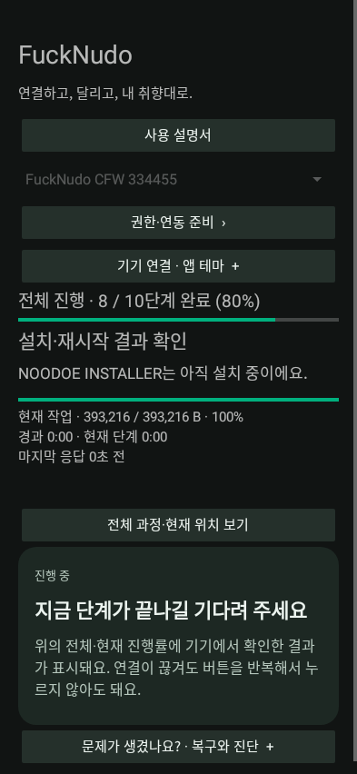

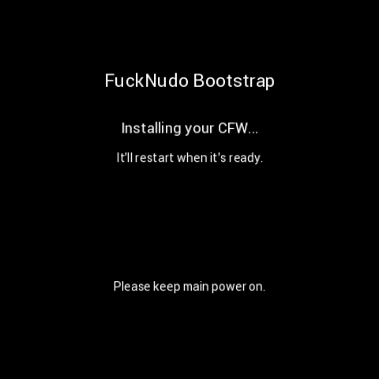

기기 화면이 순정 설치기로 전환되고 연결이 끊겼다가 돌아올 수 있습니다. 앱은 마지막 확인 상태와 재연결 대기를 표시합니다. `NOODOE INSTALLER`에서는 완료 확인을 누르지 않습니다.

## 11. 새 CFW 화면 확인과 Bluetooth 시험

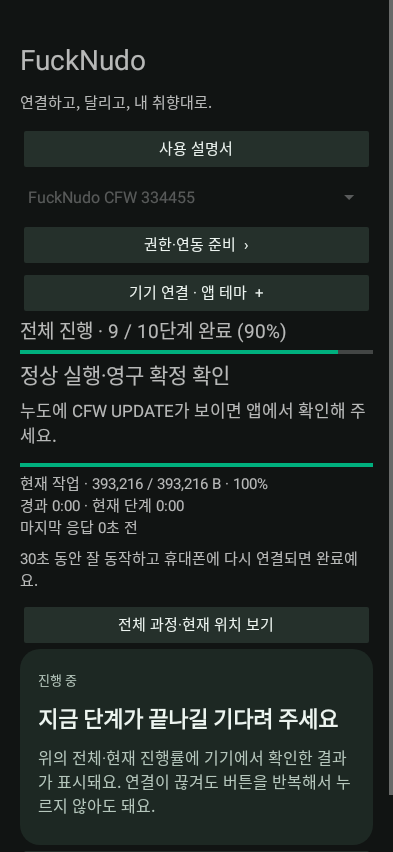

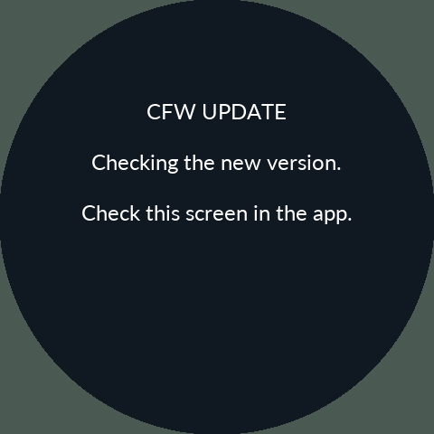

**누도에 새 CFW의 `CFW UPDATE` 화면이 실제로 보일 때** 앱의 해당 화면 확인 버튼을 누릅니다. 앱은 연결된 기기·후보 버전을 재확인한 뒤 Bluetooth 확인을 진행합니다. 정상 태스크 실행 최소 30초와 BT 초기화/앱 재연결 확인이 모두 필요합니다.

후보 부팅 후 확인 기한은 **180초**이며, 화면 확인을 눌러도 무한히 연장되지 않습니다. Bluetooth를 못 붙였다고 정상 확인을 수동으로 건너뛰지 않습니다. 실패하면 이전 정상 CFW로 롤백하거나, 첫 설치처럼 이전 정상본이 없으면 독립 복구 화면으로 갑니다.

## 12. 완료

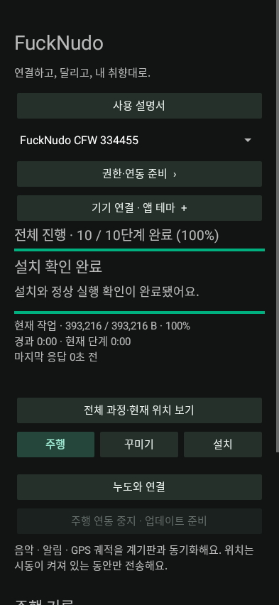

앱이 정상 실행과 영구 확정을 확인하면 완료입니다. 기본 업데이트 정책에 따라 환경설정과 CFW 사진 슬롯을 한 번 초기화합니다. 주행 누계·정비 기준·페어링 키·설치 기록은 별도 보존 대상입니다. 데이터 유지 후 재설치에서 `보관 데이터 복원`을 명시적으로 선택한 경우에는 호환 기록을 복원합니다.

## 취소·오류

Bootstrap의 설치 세션 중 **O를 놓았다가 새로 3초 유지**하면 안전 취소를 요청합니다. 기록 중이면 안전한 경계까지 기다리고 이미 확정된 설치를 억지로 끊지 않습니다. IGN OFF만으로 설치 메뉴에서 나가지 않습니다. 취소 완료와 결과 미확인은 다릅니다. 오류는 [문제 해결](11-Troubleshooting.md)을 따르세요.

## Bootstrap의 다른 메뉴

| 메인 메뉴 | 도움말 |
|---|---|
| 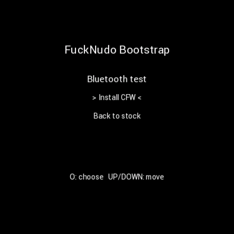 | 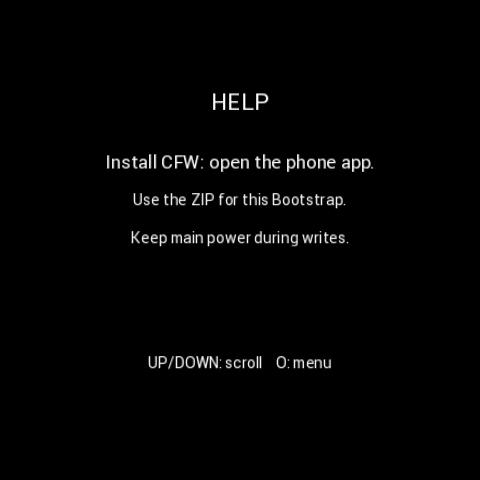 |

UP/DOWN으로 선택하고 O로 들어갑니다. 조도 센서 메뉴는 RAW·lux·밝기 상태, Bluetooth test는 초기화·접속·요청/응답 상태를 표시합니다. 시험용 정상 값을 넣은 아래 그림은 이 벤치의 센서·무선 하드웨어 성공 판정이 아닙니다.

| 조도 상태 | Bluetooth 진단 |
|---|---|
| 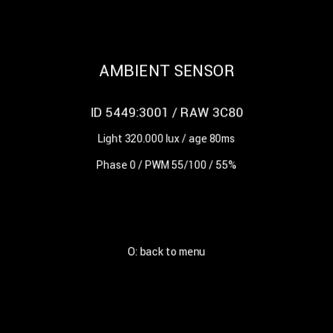 | 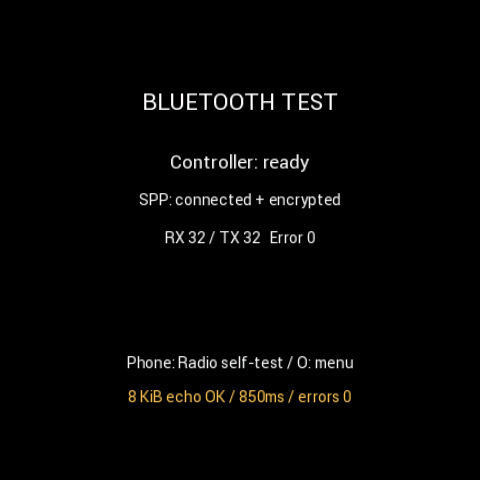 |

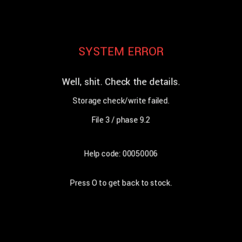

Help code와 실패 단계는 폰 로그와 함께 확인합니다. 오류 화면을 닫거나 앱 연결 상태를 초기화했다고 기기의 미확인 작업이 성공한 것은 아닙니다.
