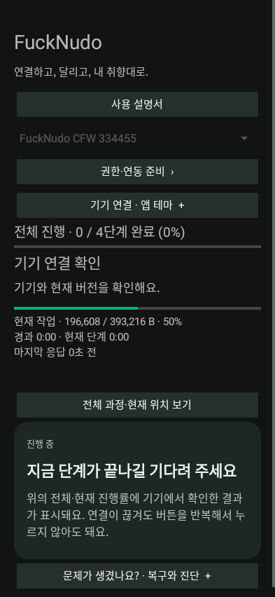
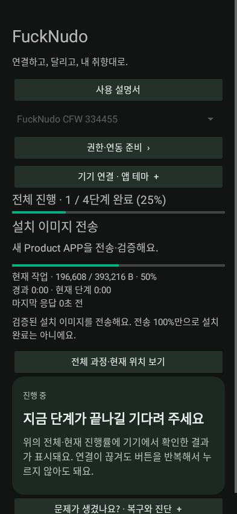
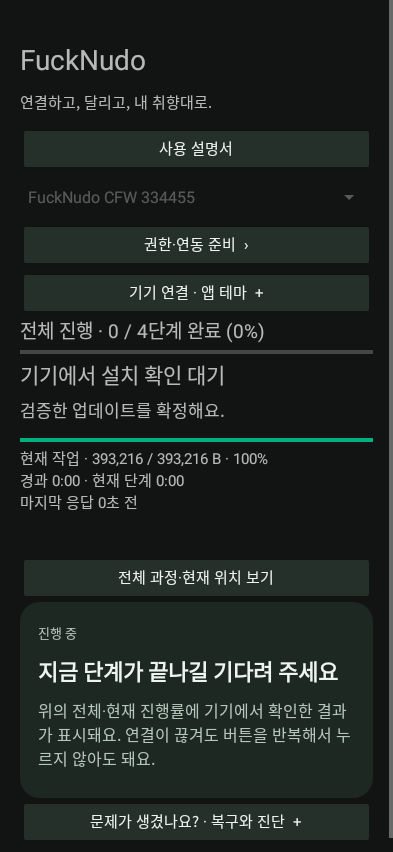
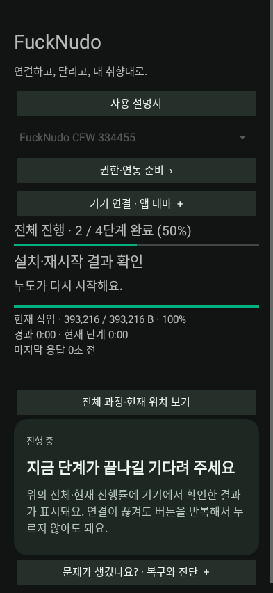
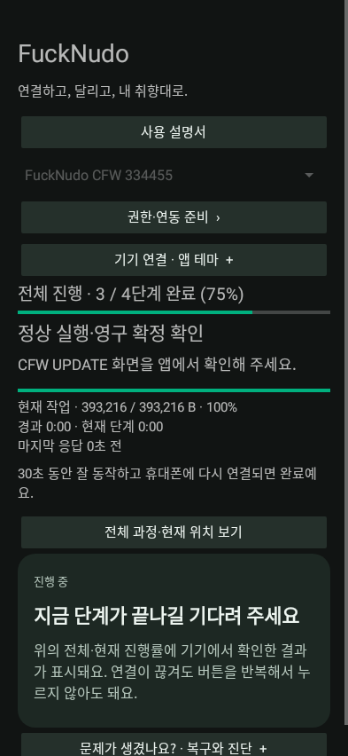
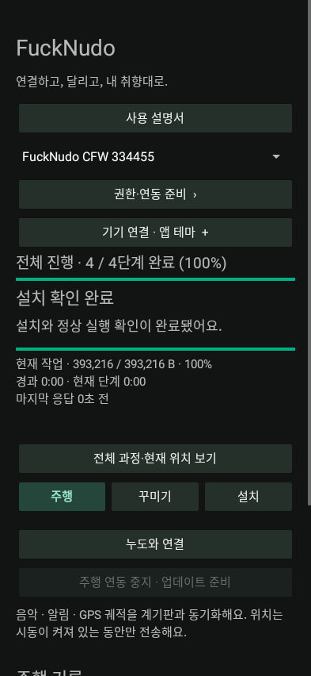

# 9. 이미 설치된 CFW 업데이트

[목차](README.md)

1. 최신 APK를 먼저 설치합니다. 기존 앱 데이터와 설치 로그를 유지합니다.
2. 올바른 기기를 선택하고 연결합니다. 실행 중인 CFW가 새 ZIP과 버전이 다르다는 이유만으로 최신 업데이트 경로가 막혀서는 안 됩니다.
3. **주행 연동을 수동 중지**합니다.
4. 최신 대응 ZIP을 선택하고 버전·안내를 확인합니다.
5. 업데이트를 시작합니다. 같은 Gate·자산이면 기본 대상은 **384KiB Product APP**입니다.
6. 기기 승인·설치·재시작 안내를 따릅니다.
7. 실제 `CFW UPDATE` 화면을 앱에서 확인하고 정상 실행·Bluetooth 재연결·영구 확정까지 기다립니다.

| 연결·현재 버전 | APP 전송·검증 | 설치 확정 |
|---|---|---|
|  |  |  |
| 재시작 | 새 버전 확인 | 완료 |
|  |  |  |

위 그림은 일반 업데이트의 상태별 화면 예시입니다. 전체 NOR 백업, FAT 파일 재생성, 순정 복구본 재전송을 매번 하지 않습니다. 자산이 바뀌면 필요한 자산을 추가로 보낼 수 있습니다. Gate가 호환되지 않으면 **순정 복귀 → 새 Bootstrap → Gate+CFW** 이관이 필요하며 Product BIN만 강제로 쓰면 안 됩니다.

## 중단 후 이어가기

앱을 다시 열고 올바른 기기와 기존 ZIP을 선택해 **현재 기기 확인 → 마지막 작업 확인 → 이어가기**를 따릅니다. 기기의 실제 상태·파일 해시·검증된 위치를 대조합니다. 연결이 끊겨도 완전히 받은 이미지가 남아 있으면 무결성 재검사로 재사용할 수 있습니다. 재접속과 MCU 재부팅은 다르므로 어떤 중단에서도 같은 위치부터 이어간다고 보장하지 않습니다.

COMMIT/RESET 결과가 불명확하면 먼저 상태를 조회합니다. 버튼을 반복 눌러 변경 명령을 재실행하지 않습니다. 동일 이미지가 이미 실행 중이면 확정 상태를 먼저 확인합니다.

## 실패 롤백과 초기화

후보가 폴트·워치독·필수 초기화 실패·앱 확인 기한 초과로 실패하면 이전 정상본으로 한 번 복귀를 시도합니다. 이전 버전까지 실패하면 반복 재부팅 대신 Gate에서 대기합니다. 최초 설치에는 이전 정상 CFW가 없으므로 가짜 정상본을 만들지 않습니다.

후보 시험 중 기본 환경은 RAM에 적용하며 이전 영구 환경을 보존합니다. 정상 확정 후 설정·CFW 사진을 한 번 초기화하고, 실패 롤백은 이전 상태를 보존합니다. 라이더 이름은 환경설정이므로 초기화 대상입니다. 사용자 화면 확인은 잘못된 후보나 다른 기기 검사를 우회하는 버튼이 아닙니다.
