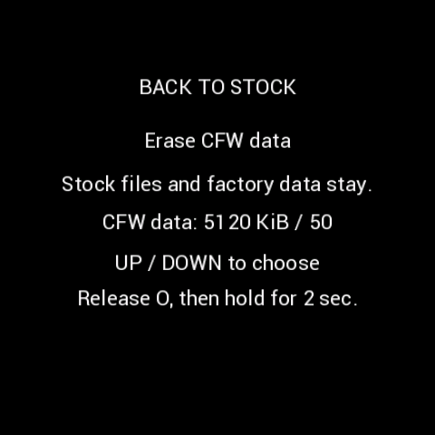
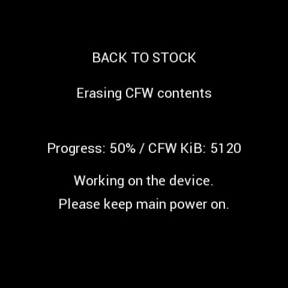
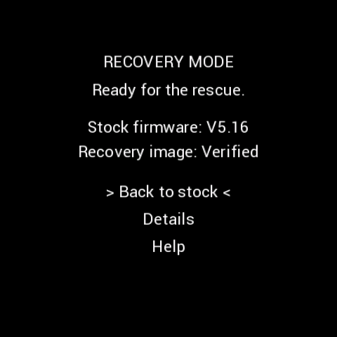
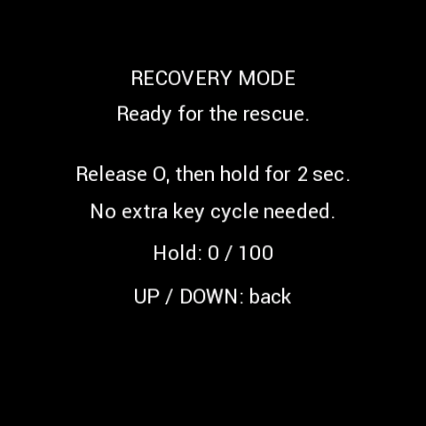
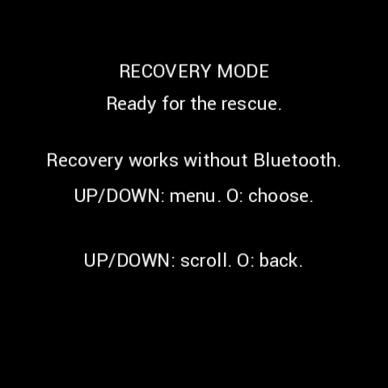
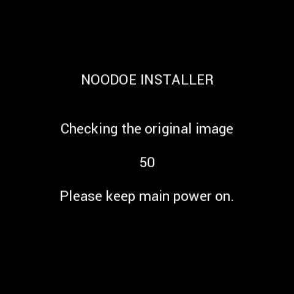
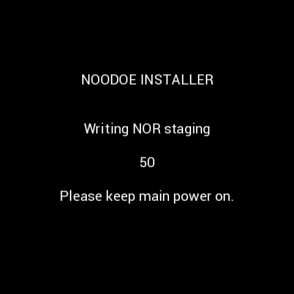
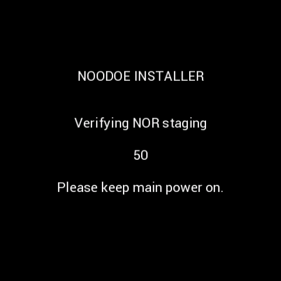
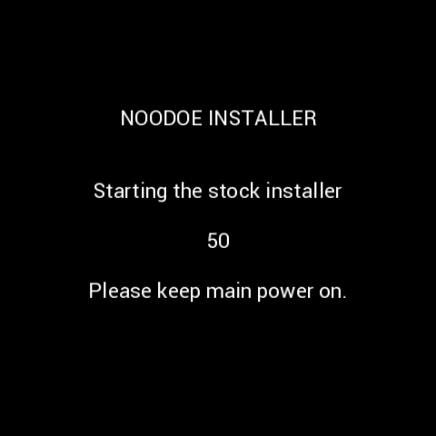

# 10. 순정 복귀, 완전 삭제와 진단

[목차](README.md)

## 폰 앱에서 순정으로 돌아가기

문제 해결/복구 메뉴에서 두 방법을 고릅니다.

| 선택 | 동작 | 남는 것 |
|---|---|---|
| **CFW 데이터 유지** — 기본 | 현재 CFW → 독립 Gate → 순정 APP | CFW 설정·사진·주행 데이터 파일, 순정 파일 |
| **CFW 데이터까지 완전 삭제** | 삭제 전용 펌웨어 전송 → 로컬 승인 → 확인된 CFW 내용 소거·파일 해제 → 순정 APP | 순정 사진·공장 정보·순정 파일, 폰 로그 |

일반 복귀는 NOR 전체를 공장 출하 바이트로 되돌리는 것이 아닙니다. 순정 APP으로 돌아가도 CFW 파일이 남습니다. 완전 삭제는 소유권·기기 식별이 확인된 CFW 파일만 제거합니다. 출처 불명의 WALL 파일 등을 이름만 보고 지우지 않습니다. 순정 사진과 CFW 사진 슬롯은 별도입니다.

삭제 전용 펌웨어가 실행된 뒤에는 **Bluetooth가 없는 로컬 작업**입니다. 폰이 실제 진행률을 받지 못한다고 임의의 퍼센트를 올리지 않습니다. 삭제를 승인했다면 IGN OFF나 폰 종료로 중간에 강제 취소하지 않습니다. 내장 순정 복구본과 작업 기록으로 정리·복귀를 진행합니다.

| 삭제 확인 | 내용 소거 | 파일 해제 |
|---|---|---|
|  |  |  |

## 폰 없이 Gate로 복구

긴급 진입은 **키 OFF → 가운데 O를 먼저 누르고 유지 → 누른 채 키 ON → 계속 유지**입니다. OFF에서 1초, ON 뒤 약 3초 유지하면 지정된 유지 조건을 충족할 수 있습니다. 복구 화면이 나올 때까지 키를 반복해서 흔들지 마세요. 상시 12V가 연결된 차량에서 IGN은 MCU 전원 차단 스위치가 아닙니다.

Gate 화면은 `RECOVERY MODE / Ready for the rescue.`입니다. Details에는 진입 이유·오류 코드·복구 이미지·로그 상태가 나옵니다. Help는 UP/DOWN으로 넘깁니다. `Back to stock`에서 **O를 놓았다가 새로 2초 유지**해 승인하며 추가 IGN 조작은 필요 없습니다. 이미 긴급 제스처로 승인된 경로에서는 확인을 중복 요구하지 않을 수 있습니다.

| 복구 메뉴 | 순정 복귀 승인 | 도움말 |
|---|---|---|
|  |  |  |

| 순정 이미지 검사 | NOR staging | 기록 검증 | 순정 설치기로 재시작 |
|---|---|---|---|
|  |  |  |  |

Gate에는 Bluetooth가 없습니다. 폰 연결을 기다리는 화면이 아닙니다. 버튼 긴급 복구는 항상 **데이터 유지**이며 완전 삭제를 자동으로 실행하지 않습니다. 복원은 원본 검사 → NOR staging → 검증 → 순정 설치기 순서입니다. 검증 실패한 복구본을 정상이라고 표시하지 않습니다.

## 멈춘 것 같을 때

CPU가 살아 있으면 긴급 제스처 경로를 사용할 수 있습니다. CPU/필수 태스크가 정체되면 워치독 경로가 복구를 돕습니다. “키 OFF이면 즉시 전원 OFF”나 “모든 하드웨어 고장에서 절대 분해 불필요”를 보장하지는 않습니다. 화면 문구·Help code·폰 로그를 보관하고 [문제 해결](11-Troubleshooting.md)을 따르세요.

순정 복귀 후 앱에서 `본체에서 순정으로 돌아왔어요 · 확인` 또는 순정 복귀 확인을 실행합니다. 실제 순정 버전·Bluetooth 주소·차량 정보를 읽어야 완료입니다. 폰 저널만 초기화했다고 본체 복귀가 끝난 것은 아닙니다. CFW 사용 중 인증키가 바뀌면 순정 복귀 후 재페어링이 필요할 수 있습니다.

## 재설치와 진단

데이터 유지 복귀 후 재설치에서는 `보관 데이터 복원 / 새로 시작`을 구분합니다. 복원은 호환되는 기록만 사용하고, 새로 시작은 기본 초기화 정책을 따릅니다.

Diagnostic은 주행 CFW와 분리된 진단용 이미지입니다. 앱의 세부 진단 도구에서 지원 Gate와 패키지를 확인해 설치합니다. 심층 HCI·센서 상태 등을 확인한 뒤 로그를 회수하고 안내에 따라 순정으로 돌아갑니다. 일반 Product 시험 부팅이나 설정 초기화로 위장하지 않습니다. BT가 안 되어도 Gate의 버튼 순정 복구를 사용할 수 있습니다.
