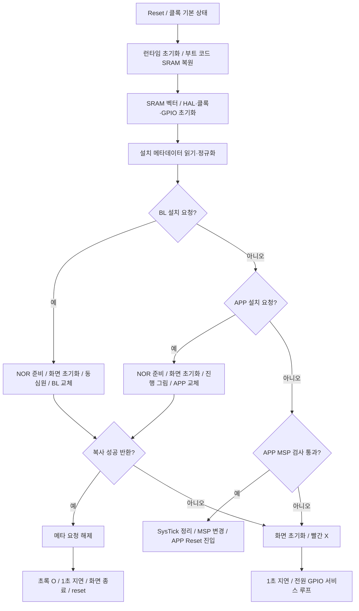

# Noodoe 순정 부트로더 동작·화면 출력 분석

분석일: 2026-09-22. 대상은 AK550 Noodoe의 내부 FLASH 전체 A/B 덤프와 그 안의 resident bootloader 0.14이다. 함수 이름은 심볼이 없는 바이너리에 분석자가 붙인 설명용 이름이며, 주소는 실제 실행 주소다.

## 1. 결론

**부트로더가 직접 화면을 그린다.** 압축을 해제한 부트 코드 안에 EVE 초기화, LCD 초기화/종료, 백라이트 제어, 원·선으로 만드는 설치 화면과 결과 화면이 모두 있다. 기존 문서의 “상태 화면”이라는 표현을 이번에 실제 명령·색상·좌표까지 확인했다.

다만 **정상 앱으로 넘어가는 일반 부팅 경로에서는 이 그래픽 함수들을 호출하지 않는다.** 현재 A/B 덤프는 설치 요청이 없고 APP 벡터의 스택 검사가 통과하므로 이 경로다. 따라서 “부트로더에 그리기 기능이 있다”와 “일반 부팅 때 보는 로고/사용자 그림을 이 부트로더가 그린다”는 구별해야 한다. 후자는 이 분석으로 확인되지 않았다.

| 상황 | 부트로더의 화면 처리 | 다음 동작 |
|---|---|---|
| 설치 요청 없음 + APP 초기 MSP 검사 통과 | 그리기·EVE/LCD 초기화 함수 호출 없음. 공통 GPIO 초기화는 수행 | APP Reset으로 진입 |
| APP 설치 | 흰 원 바탕에 자홍 점으로 시작, 노랑·빨강·청보라·초록 동심원 반복 | 복사 후 결과 표시 |
| 부트로더 자체 설치 | 여러 색의 동심원 | 복사 후 결과 표시 |
| 설치 성공으로 판정 | 흰 바탕의 초록 O | 1초 지연 → 화면 종료 → MCU reset |
| 설치 실패, 또는 APP 초기 MSP 검사 실패 | 흰 바탕의 빨간 X | 1초 지연 → 전원 GPIO 서비스 루프 |
| MSP만 정상이고 Reset 주소/앱 코드가 잘못됨 | 진입 전에는 이를 검사하지 않음 | fault/정지 가능. 반드시 X가 뜨는 것은 아님 |


[큰 그림](screens.png) · [화면별 SVG와 주소를 보는 HTML](screens.html) · [추출한 원시 명령과 해석](graphics-traces.json)

그림은 원본 Thumb 루틴을 PC에서 실행하여 얻은 명령을 시각화한 것이다. 실물 사진이 아니며 패널 마스크·색 재현·안티앨리어싱은 실물과 차이가 있을 수 있다.

## 2. 원본 식별과 검증

원본:

- [noodoe_full_flash_dump_A.bin](../../VERY_IMPORTANT_ORIGINAL_NOODOE_BOOTLOARDER/noodoe_full_flash_dump_A.bin)
- [noodoe_full_flash_dump_B.bin](../../VERY_IMPORTANT_ORIGINAL_NOODOE_BOOTLOARDER/noodoe_full_flash_dump_B.bin)

둘 다 524,288바이트이며 이번에도 전체 바이트 일치와 SHA-256을 확인했다.

```text
38207bed741a8fef9e6d2ed24b86c8cb8b376ba5e4c957163f5edd83fbeb8037
```

덤프의 `0x08010000–0x0807FFFB`는 보관된 `1657088080998-s1-SR1.5_ota_V516.bin`과 458,748바이트 전부 같다. 마지막 4바이트는 FF다. 따라서 부트와 APP 5.16이 함께 들어 있는 실물 이미지가 맞다. [이번 검증값](manifest.json)

| MCU 주소 | 크기 | 의미 |
|---|---:|---|
| `08000000–08007FFF` | 32 KiB | 부트 벡터, 초기화, 압축 코드, 여유 공간 |
| `08008000–0800BFFF` | 16 KiB | 섹터 2. 첫 20바이트가 부트 버전·설치 요청 |
| `0800C000–0800FFFF` | 16 KiB | 별도 보존 데이터. APP installer의 지우기 대상 아님 |
| `08010000–0807FFFF` | 448 KiB | APP |

512 KiB는 **내부 FLASH 전체**라는 의미다. 외부 128 MiB NOR, MCU ROM·OTP·option bytes까지 들어 있는 것은 아니다. 최초 64 KiB 전부를 순수 부트 코드라고 부를 수도 없다.

## 3. 압축된 부트 코드와 시작 순서

부트 핵심이 FLASH 주소에 그대로 존재하지 않는 것이 분석상의 핵심이다.

| 단계 | 주소 / 값 |
|---|---|
| 초기 MSP | `0x2000FA08` |
| Reset vector / 명령 시작 | `0x080004C5` / `0x080004C4` |
| SystemInit | `0x080003C0` |
| C runtime 초기화 테이블 처리 | `0x0800041C` |
| IAR 압축 해제 | `0x0800020E`, descriptor `0x0800047C` |
| 압축 입력 | `0x0800063C`, `0x42B1` = 17,073바이트 |
| RAM 복원 | `0x20000200`, `0x6536` = 25,910바이트 |
| 부트 main | `0x200044FC` |

이번에는 Python 복원 결과끼리 비교하는 데 더해 **덤프 속 `0x0800020E` 명령 자체를 Unicorn으로 실행**했다. 실제 decompressor가 생성한 25,910바이트와 Python 결과, 기존 독립 복원 파일이 전부 같다.

```text
복원 RAM SHA-256:
a5d037b3e3e8da1b11a9492e52807701278259fbf535c1f4fc0e3c352b9c3636
```

SystemInit은 HSI를 켜고 RCC 클록 설정을 초기 상태로 정리하며 VTOR를 FLASH 시작으로 지정한다. 런타임은 초기화 데이터를 복원하고 zero-init 영역을 준비한다. main 첫 함수 `0x200044C8`은 IRQ를 잠시 막고 FLASH의 벡터 428바이트(`0x1AC`)를 SRAM `0x20000000`으로 복사한 뒤 VTOR를 그쪽으로 옮긴다. 기존 PRIMASK 상태를 복원한다.

이는 부트로더 자체 FLASH를 지워도 RAM 코드와 벡터로 계속 실행하기 위한 구성과 부합한다. 선형 디스어셈블에는 상수·테이블을 명령으로 잘못 읽은 줄도 포함되므로, 실제 분기·리터럴·테이블을 함께 확인했다.

## 4. 모든 주 경로의 상태 흐름



main `0x200044FC`의 원본 명령을 정상 부팅, 잘못된 MSP, APP·BL 설치 성공/실패, erased 메타, 잘못된 슬롯의 8개 조건으로 실행했다. 설치·HAL·표시 호출은 이 실험에서 반환값을 지정한 mock이며 **분기 선택을 검증하는 실험**이다. 그리기와 APP 복사 함수 자체는 별도 실험에서 실제 명령으로 실행했다. [분기별 호출 기록](main-scenarios.json)

### 일반 부팅과 APP 인계

`0x200045A0`부터 검사하는 식은 다음과 같다.

```c
(*(uint32_t *)0x08010000 & 0x2FFC0000) == 0x20000000
```

통과하면 SysTick CTRL/LOAD/VAL(`E000E010/14/18`)을 0으로 쓰고 APP 첫 word로 MSP를 변경한 다음 두 번째 word로 `BLX`한다. 현재 Reset 명령 주소는 `0x08076718`이다.

이 인계 구간에는 APP 전체 CRC, Reset 주소 범위·Thumb bit 검사, 모든 NVIC pending/enable 정리, APP VTOR 설정이 없다. APP는 자기 런타임과 벡터를 초기화해야 한다. 유효해 보이는 MSP만 가진 손상 APP도 진입할 수 있다.

### 실패 서비스 루프

`0x200045F6`은 PG13 입력을 읽는다. HIGH이면 PD13 LOW, PG14 HIGH를 쓰고 보드 revision이 3 이상이면 PI9 HIGH도 쓴다. 이후 반환하고 main이 이를 반복한다. 이 루프 자체에 BT 파일 수신·UART 복구·NOR 재설치 재시도는 없다. X는 루프 진입 전에 한 번 그려지며 루프에서 계속 다시 그리는 구조가 아니다.

## 5. 공통 하드웨어 초기화 — 정상 부팅도 수행

`0x20001FA8 → 0x20000A7A → 0x20000200 / 0x200002B0` 경로다.

- FLASH prefetch 및 instruction/data cache 설정, NVIC 우선순위 그룹과 SysTick tick 준비.
- 클록 함수의 인자 1은 PLLM=25, PLLN=336, PLLP=2, PLLQ=7 설정을 선택한다. HSE가 25 MHz인 보드 조건에서는 SYSCLK 168 MHz에 해당한다. 별도 인자 0용 360 설정도 코드에 있으나 main은 1을 쓴다.
- GPIO A–I 클록 활성화와 많은 핀의 analog/입출력 초기화.
- revision strap PA3, PH3, PH2, PB10을 bit 0–3으로 읽어 `0x20006A01`에 저장. revision 3 경계에 따라 전원/LCD 제어가 달라진다.
- PG13 입력, PG14·PD13 출력, revision≥3에서 PI9 출력 등 전원 관련 핀 준비.
- SPI 칩선택과 LCD/EVE/백라이트 제어 핀들의 기본 출력 상태 설정.

원본 `0x200002B0`을 revision 0과 3으로 실행하며 GPIO HAL 호출 인자를 모두 기록했다. 입력값과 HAL은 mock이다. [모든 GPIO 설정·출력](board-gpio.json)

화면과 관계 있는 주요 출력은 PB1 HIGH(EVE 제어), PI11 HIGH, PC13 LOW(LCD 제어), PE4 HIGH(SPI4 CS), PA4 HIGH(SPI1 CS), PI8 LOW·PC8 HIGH(백라이트 관련)다. 연결 신호의 역할은 아래 별도 드라이버 사용과 교차 확인했다.

**정상 부팅에도 이 GPIO 조작은 있다.** 따라서 화면이 잠깐 꺼지거나 전원·리셋 상태가 변하는 현상과, 부트가 새 그래픽 명령을 보내 그림을 그리는 동작은 별도로 봐야 한다. 실물에서 관찰한 특정 순간의 화면 원인을 이 정적 자료만으로 단정할 수는 없다.

## 6. EVE·LCD·백라이트를 직접 제어하는 근거

### 그래픽 엔진 초기화

`0x20005052 → 0x20004DCC`가 EVE를 초기화한다.

1. PB1을 LOW/HIGH로 전환하며 각각 20 ms 지연.
2. SPI1 속도 설정 후 host command `44`, `62`, `00` 전송.
3. 300 ms 지연 후 `REG_ID 0x302000`이 `0x7C`인지 확인. 다르면 2 반환.
4. 디스플레이 타이밍 및 480×480 크기를 설정.
5. EVE `RAM_DL 0x300000`에 검정 clear-color / clear / display 목록을 직접 쓰고 swap.
6. PCLK 설정 후 빠른 SPI 설정으로 변경, command FIFO write pointer를 읽음.
7. LCD 드라이버 `0x20006144` 호출 후 준비 플래그 `0x200069FB=1`.

핵심 레지스터 값:

| 항목 | 주소 | 값 |
|---|---|---:|
| HCYCLE / HOFFSET | `30202C` / `302030` | 550 / 37 |
| HSIZE | `302034` | 480 |
| HSYNC0 / HSYNC1 | `302038` / `30203C` | 0 / 4 |
| VCYCLE / VOFFSET | `302040` / `302044` | 505 / 18 |
| VSIZE | `302048` | 480 |
| VSYNC0 / VSYNC1 | `30204C` / `302050` | 0 / 2 |
| CSPREAD / SWIZZLE | `302068` / `302064` | 0 / 0 |
| PCLK_POL / PCLK | `30206C` / `302070` | 0 / 4 |
| DITHER | `302060` | 1 |

주소·graphics opcode의 의미는 [Bridgetek FT81X 공식 Programmer Guide](https://brtchip.com/wp-content/uploads/Support/Documentation/Programming_Guides/ICs/EVE/FT81X_Series_Programmer_Guide.pdf)의 레지스터·display-list 규격과 대조했다. 이것만으로 FT810/811/812/813 중 정확한 실장 모델까지 구분하지는 않는다.

### LCD 제어

콜백 테이블 `0x200066FC`는 init=`0x20006145`, shutdown=`0x2000622D`를 가리킨다. 실제 명령 주소는 마지막 Thumb bit를 뺀 값이다.

- 초기화: PI11 LOW. revision<3은 EVE GPIO `0x302094` bit 7을 전환하며, revision≥3은 PC13을 HIGH→LOW→HIGH로 전환한다. 이 구간의 지연은 10/20/50 ms다.
- SPI4를 설정하고 `0x1100`을 command helper에 전달, 120 ms 지연, `0x2900` 전달. DCS 계열의 sleep-out / display-on 값과 부합한다.
- 종료: `0x1000`, 120 ms, `0x2800`, 10 ms, revision에 맞는 제어 출력을 변경하고 PI11 HIGH, SPI4 종료.
- helper `0x200062D4`는 command마다 세 word를 만든다. 예: `0x1100 → 2011, 0000, 4000`; `0x2900 → 2029, 0000, 4000`. 단순 SPI 바이트 `11 29` 전송으로 오해하면 안 된다.
- 최종 display shutdown `0x200050AE`는 LCD 종료 후 EVE PB1을 내려 reset/power-down 상태로 두고 SPI1을 정리한다.

revision 0/3 각각에서 원본 초기화·종료 루틴을 실행하고 GPIO·EVE register write·LCD word를 캡처했다. chip ID=0의 오류 분기도 확인했다. [전체 trace](display-init-traces.json)

### 백라이트

설치와 실패 표시 준비는 `0x2000516E(50)`을 호출한다. 고정 밝기 상태를 선택하여 테이블 `0x200066D4`의 init/set 콜백(`0x200035C4`, `0x200036D4`)을 사용한다.

저수준 드라이버는 TIM5(`0x40000C00`), channel 값 `0x0C`(CH4)를 사용한다. 50 kHz로 나누는 prescaler와 ARR=99를 설정하므로 명목 PWM은 500 Hz다. 밝기 50을 compare 값으로 넘기며 100 이상은 99로 제한한다. PI8·PC8 출력도 제어한다. wrapper에는 0, 1–100, `0xFF`, `0xFD`에 따른 off/고정/특수 모드 분기도 있지만, 이번 설치 주 경로가 실제 쓰는 값은 50이다.

## 7. 그림을 만드는 실제 함수와 명령

### 원 그리기 `0x20004B0A(r,g,b,k)`

이 함수는 아래 네 EVE word를 전송한다.

```c
emit(0x04000000 | (r << 16) | (g << 8) | b); // COLOR_RGB
emit(0x1F000002);                            // BEGIN(POINTS)
emit(0x0D000000 | ((240 * k) & 0x1FFF));      // POINT_SIZE
emit(0x47800F00);                            // VERTEX2F(240*16,240*16)
```

POINT_SIZE는 반지름을 1/16픽셀 단위로 받으므로 실제 반지름은 `15*k`픽셀이다. 모든 원의 중심은 (240,240)이다. `k=16`은 반지름 240, 화면 전체 크기의 흰 원이다.

### APP 설치 표시 `0x20004B9A(phase)`

| phase | 흰 원 위에 겹치는 원: 바깥→안쪽, RGB / 반지름 |
|---:|---|
| 0 | 자홍 `(250,0,250)` / 30 |
| 1 | 노랑 `(250,250,0)` / 60 |
| 2 | 빨강 `(250,0,0)` / 105 → 노랑 / 60 |
| 3 | 청보라 `(100,100,200)` / 150 → 빨강 / 105 → 노랑 / 60 |
| 4 | 초록 `(0,250,0)` / 195 → 청보라 / 150 → 빨강 / 105 → 노랑 / 60 |

처음 0을 그리고, 성공적으로 32,000바이트(`0x7D00`)를 기록할 때마다 다시 그린다. 최초 갱신에도 0을 쓰고 그 뒤 1→2→3→4→1…로 순환한다. **설치 퍼센트도, BT 수신 퍼센트도 아니다.** V5.16 길이의 실제 installer 코드 실행에서 얻은 phase는 다음과 같다.

```text
0, 0, 1, 2, 3, 4, 1, 2, 3, 4, 1, 2, 3, 4, 1
```

### BL 자체 설치 표시 `0x20004B4A()`

빈 clear frame을 제출한 다음 phase 4와 같은 다색 동심원을 그린다. APP의 32,000바이트 주기 갱신과 달리 자체 설치 루프에 이 phase 순환은 없다.

### 결과 표시 `0x20004C82(success)`

- 성공: 흰 원 r=240, 초록 원 r=195, 흰 원 r=135를 차례로 겹쳐 초록 O를 만든다.
- 실패: 흰 원 위에 RGB `(250,0,0)`의 선 2개를 그려 X를 만든다. 끝점은 `(128,128)→(340,340)`, `(340,128)→(128,340)`. LINE_WIDTH=`0x140`은 반폭 20픽셀, 전체 두께 약 40픽셀에 해당한다.

준비 여부 getter `0x200050F2`가 미준비를 반환하면 먼저 display init과 밝기 50을 호출한다. 그러나 호출자는 모든 display 초기화 오류를 엄격히 처리하지 않는다. EVE ID 불일치 등에서 코드가 표시를 시도해도 실제 화면 출력이 보장되는 것은 아니다.

### MCU에서 화면까지의 전송

```text
상태/설치 함수
 → 20004B0A 또는 직접 word 생성
 → 20005154
 → 20005A98
 → EVE RAM_CMD 0x308000 + write_pointer
 → SPI1 송신
```

프레임 시작은 `CMD_DLSTART=FFFFFF00`, 끝은 `DISPLAY=0` 후 `CMD_SWAP=FFFFFF01`이다. command write/read register(`3020FC/3020F8`)로 FIFO 여유와 완료를 기다린다. 이 대기 루프에는 자체 timeout이 없는 부분이 있다. 이 표시에는 PNG/JPEG/사용자 테마/폰트 파일을 불러오는 과정이 없다. 원·선을 계산해서 만드는 도형이다.

## 8. 설치 요청과 FLASH 변경

부트는 `0x20004678`에서 아래 레코드를 읽어 RAM `0x2000699C`에 둔다.

| FLASH 주소 | 의미 | 현재 값 |
|---|---|---|
| `08008000` | resident 버전 | `000E0000` = u16 `(0,14)` |
| `08008004` | 요청 버전 | 0 |
| `08008008` | NOR 시작 블록 | 0 |
| `0800800C` | 길이 | 0 |
| `08008010` | APP가 기록한 CRC/요청 word | 0 |

정규화는 erased 버전, 허용되지 않은 슬롯, 448 KiB 초과 길이, erased CRC, 0 길이 등을 처리한다. resident 버전 word가 코드의 `000E0000`과 다르면 메타 writer를 호출하여 버전을 갱신하고 요청 CRC를 해제하는 동작도 있다. 따라서 모든 부팅에서 항상 FLASH가 불변인 것은 아니다.

BL gate `0x2000474E`는 CRC≠0, 길이≠0, 슬롯=`7F80`, 요청 버전≠resident 상수를 확인한다. APP gate `0x20004782`는 CRC≠0, 길이≠0, 슬롯=`7F90`을 확인한다. **이 CRC word의 nonzero 검사는 실제 CRC 계산과 다르다.**

### 외부 저장소

NOR geometry는 128 MiB, block 4096바이트, page 256바이트다. ID 함수는 `C2 20 1B`를 비교한다. 주소가 큰 업데이트 슬롯은 4바이트 address-read 명령 `0x13`으로 읽는다.

| 이미지 | 외부 NOR 위치 | 내부 FLASH 목적지 |
|---|---|---|
| BL | block `7F80` = `07F80000` | `08000000` |
| APP | block `7F90` = `07F90000` | `08010000` |

### APP installer `0x200047D6`

NOR를 준비하고 display init·밝기 50·시작 그림을 호출한 다음 FLASH unlock, status flag 정리, 블록 읽기와 byte program을 반복한다. 내부 섹터 4,5,6,7은 각각 `08010000`, `08020000`, `08040000`, `08060000`에 도달할 때 지운다.

마지막 블록도 4096바이트 전부 기록한다. 원본 installer를 실행하고 NOR/FLASH HAL만 mock한 결과:

| 요청 길이 | 실제 program 바이트 | 결과 |
|---:|---:|---|
| 1 | 4096 | 성공 반환 |
| 4097 | 8192 | 성공 반환 |
| 458748 (`6FFFC`) | 458752 (`70000`) | 섹터 4–7, 성공 반환 |
| 458748, 32002번째 program 호출에 실패 주입 | 32001 | 실패 반환 |

[installer 원본 코드 실행 기록](app-install-traces.json). 이는 PC 메모리에 가상 payload를 복사한 결과이며 실물 erase/program 검증은 아니다.

### BL installer `0x20004972`

길이 1–32768을 허용한다. 32 KiB stack buffer에 먼저 NOR 이미지를 읽고, 섹터 0과 필요시 1을 지워 byte program한다. SRAM 실행 때문에 자신의 FLASH 교체가 가능하다.

preload의 block 수는 `length/4096+1`이므로 정확히 32768바이트 요청에서 36864바이트를 32768바이트 버퍼에 읽는 경계 결함 후보가 있다. 이 경계는 실물에서 시험하지 않았다. [기존 opcode별 상세](../2026-09-11-bootloader-re/full-flash-update/README.md)

### 완료 및 검증의 한계

`0x20004AA4(slot,success)`는 success일 때 RAM의 요청 CRC를 0으로 하고 섹터 2를 지운 뒤 20바이트 메타를 다시 쓴다. failure일 때는 요청을 유지한다. 성공 반환 후 O를 그리고, 1초 지연·display shutdown·system reset 순서다.

검사한 설치 경로는 평문 복사다. 이미지 전체 CRC/해시/서명 검사, 전체 기록 후 readback 비교, A/B APP나 rollback 기능은 보이지 않는다. APP 측 BT 수신 CRC 검증과는 별개다.

기존 분석의 오류 처리도 재확인했다. APP의 sector erase 반환을 즉시 검사하지 않고, 메타 writer는 중간 실패에도 1을 반환할 수 있다. FLASH status 함수의 오류 마스크 비교 역시 일반적인 any-error 검사와 다르다. 따라서 **초록 O는 이 코드의 성공 판정이며, 독립적인 전체 이미지 검증 완료 표시가 아니다.**

## 9. 나머지 포함 기능과 인터럽트

부트 RAM에는 main에 필요한 기능 외에도 공통 보드 API와 HAL 코드가 포함된다. 함수가 있다는 사실과 주 경로가 실제 호출한다는 사실을 구별했다.

| 코드 영역/대표 주소 | 기능 | 주 경로와의 관계 |
|---|---|---|
| `20000200`, `200002B0` | 클록, GPIO, revision strap | 모든 부팅 |
| `20000A88` 이후 | SPI 핀·클록 MSP 초기화, DMA/타이머 준비 | 해당 드라이버 사용 시 |
| `20000F50–200016xx` | RCC, clock, power HAL | 초기화 |
| `20001638`, `200019A8`, `200019C0` | GPIO 설정·읽기·쓰기 | 초기화/드라이버/실패 루프 |
| `20001F74`, `20001F80`, `20001F8C` | tick 증가·조회·busy delay | 지연·timeout |
| `20002124–20002CE8` | SPI HAL, polling/DMA 전송, 상태·timeout | EVE/NOR/LCD 드라이버 |
| `20002D54–20002FEC` | 보드 등록, revision/입력 조회, 저전력·전원, metadata 보조 API | 콜백 테이블 포함. 전부가 main에서 실행되는 것은 아님 |
| `20002DF0 → 2000386C` | 저전력 진입, WFI/WFE 코드 | 존재하지만 실패 main 루프의 호출 대상 아님 |
| `20002FEE–200031E8` | SPI4 LCD 버스, 제어핀, word 전송 | 화면 사용 시 |
| `200031F8–200035BC` | SPI5 NOR 버스, DMA 전송·완료 상태 | 설치 시 |
| `200035C4–2000375C` | TIM5 백라이트 | 화면 사용 시 |
| `2000375E–20003816` | tick 기반 timeout/지연 API | 주변장치 API |
| `200038AC` 등 | memcpy/memset·런타임 보조 | 일반 보조 |
| `20003A54–20003Fxx` | FLASH unlock/program/erase/status/lock | 설치·메타 갱신 |
| `20003F70–2000449A` | timer/PWM HAL | 백라이트 등 |
| `200044C8–20004B08` | 벡터 relocation, main, 설치, metadata commit | 부트 중심 |
| `20004B0A–20004CFC` | 도형, 설치·성공·실패 화면 | 설치/실패 |
| `20004D74–200053E6` | EVE·화면·밝기 상위 제어 | 화면 사용 시 |
| `200054B0–2000564E` | NOR block 계층과 ops dispatch | 설치 |
| `20005650–20005BD0` | EVE SPI1, register·FIFO transport | 화면 사용 시 |
| `20005BF4–20006126` | NOR init/read/program/erase/ID/geometry | 업데이트에는 주로 read 사용 |
| `20006144–2000633C` | LCD init/shutdown/command | 화면 사용 시 |
| `20006354–200064D4` | timer IRQ 및 기본 콜백 | IRQ 경로 |
| `20006598–200065D0` | Cortex 예외, SysTick, TIM/DMA IRQ wrapper | 벡터 경로 |

NMI/SVC/DebugMon/PendSV 일부는 즉시 반환한다. HardFault/MemManage/BusFault/UsageFault는 각자 무한 루프다. SysTick은 tick만 증가시키며 APP의 FreeRTOS처럼 스케줄링하지 않는다. peripheral default vector 중 다수도 FLASH의 자기 분기 루프를 가리킨다. 이 부트 흐름에서 BT stack, 차량 UART 프로토콜, USB mass-storage/DFU 서비스, 테마 파일시스템·이미지 디코더는 확인되지 않았다. 공장 ROM bootloader와 이 resident bootloader도 별개다.

## 10. 검증 범위와 재현 방법

이번 실행은 원본 BIN 읽기, 파생 파일 생성, PC의 Unicorn 가상 메모리만 사용했다. 실제 장치 연결·플래시·설정 변경은 하지 않았다.

완료한 검증:

- A/B 512 KiB 전체 일치, 보관 OTA와 APP 바이트 일치.
- 원본 IAR decompressor 명령 실행 결과와 Python/기존 복원 결과 일치.
- 부트 main 8조건의 실제 분기 실행.
- 도형 함수 8조건에서 원시 EVE 명령 추출, 좌표·색·반지름 해석.
- revision 0/3 GPIO 초기화 및 display 초기화·종료 trace, 잘못된 EVE ID 분기.
- APP installer 원본 루프 4조건: 경계 길이·전체 길이·program 실패, 가상 payload 복사 일치.
- 재귀 분기 추적과 callback table seed로 명령/함수 후보 목록 저장.

**“모든 동작”의 범위:** 위 보고서는 정상 진입·APP/BL 설치·실패·종료의 모든 main 분기와 각 기능 계층을 다룬다. 이름 없는 모든 HAL 함수의 모든 오류 조합이나 실제 하드웨어 타이밍까지 완전 증명한 것은 아니다. `control-flow.json`에는 자동 추적이 해결하지 못한 간접 분기도 그대로 남겼다. 선형 디스어셈블·함수 후보 개수를 100% 의미 복원 또는 실물 검증으로 표현하지 않는다. 실제 보드 revision과 특정 관찰 화면의 발생 시점도 이 내부 덤프만으로 결정할 수 없다.

PowerShell, 작업 위치 `<workspace>`:

```powershell
& '<local-user>\.cache\codex-runtimes\codex-primary-runtime\dependencies\python\python.exe' `
  Reversing/analysis/2026-09-22-bootloader-display/analyze.py
```

필요 라이브러리는 기존 `Reversing/.tools/analysis-python`의 Capstone/Unicorn 및 Python Pillow다. 이 환경에서는 해당 라이브러리 폴더의 접근 권한 때문에 sandbox 밖 실행 승인이 필요했다. 분석 스크립트는 이 분석 디렉터리에만 파생 자료를 쓴다.

주요 자료:

- [재현 스크립트](analyze.py)
- [원본 검증값](manifest.json), [복원 RAM](boot-ram-expanded.bin)
- [FLASH startup](flash-startup.asm.txt), [main·설치](main-and-update.asm.txt)
- [화면 어셈블리](graphics.asm.txt), [EVE·백라이트](display-and-backlight.asm.txt), [LCD](lcd-driver.asm.txt), [SPI/FIFO](eve-transport.asm.txt)
- [보드 GPIO 초기화](board-init.asm.txt), [보드 API](board-api.asm.txt), [NOR](nor-driver.asm.txt), [인터럽트](interrupts.asm.txt)
- [선형 전체 참고 ASM](ram-linear-reference.asm.txt), [재귀 추적 ASM](recursive-code.asm.txt), [분기·함수 후보·미해결 간접 호출](control-flow.json)

기존 문맥은 [9월 11일 부트·BT 연구노트](../../docs/2026-09-11-noodoe-bootloader-and-bluetooth-update.md), [설치 오류 처리](../../docs/2026-09-11-noodoe-update-failure-and-app-contract.md), [A/B 원본 검증](../2026-09-11-full-flash-ab-verification/README.md)을 참고했다. 이번 작업의 새 핵심은 **원본 decompressor 실행 검증, 실제 부트 도형 명령 추출과 시각화, 정상 부팅과 표시 경로 분리, display 초기화·설치 루프의 실행 trace**다.
