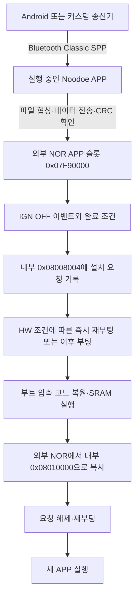

# Noodoe 실물 부트로더와 Bluetooth 업데이트 구조

> 실패·취소·타임아웃 및 커펌 초기화 계약은 [후속 실패 처리 연구노트](2026-09-11-noodoe-update-failure-and-app-contract.md)를 참조한다. 특히 CONTINUE 성공 응답은 MCU의 활동 타이머 갱신을 의미하지 않으며, 순정 수신기 정책과 resident의 최소 계약은 구별해야 한다.

분석일: 2026-09-11. 대상: AK550용 실물 Noodoe에서 읽은 내부 플래시 A/B와 순정 Android APK. 분석은 로컬 파일에서만 수행했다. 이 문서의 흐름은 정적 분석 결과이며, 새 이미지의 BT 전송·설치는 아직 실행하지 않았다.

## 1. 결론

**기존 부트로더를 유지하면서 APP를 Bluetooth로 교체하는 경로가 이미 있다.** 역할은 다음과 같다.

- Android 송신기: Bluetooth Classic SPP로 파일 전송 프로토콜을 수행한다.
- 실행 중인 Noodoe APP: 전송을 받아 외부 NOR에 저장하고, 다시 읽은 데이터의 전송 CRC를 확인한다.
- APP의 IGN OFF 처리: 수신 상태와 resource 완료 조건이 맞으면 내부 플래시에 설치 요청을 남긴다. 즉시 재부팅 호출에는 보드 HW revision 조건이 더 있다.
- SRAM에서 실행되는 부트로더: 외부 NOR의 APP 이미지를 내부 플래시 `0x08010000`에 복사한다. 성공 처리 후 요청을 지우고 다시 재부팅한다.

따라서 **BT 전송 완료와 실제 설치 시작은 별개의 사건**이다. 이 버전의 설치 요청 작성은 IGN ON→OFF 이벤트에 연결되어 있고, 설치는 다음 부트에서 일어난다. 상시 12V 전원을 유지하고 IGN 입력만 OFF로 만드는 실제 보드 동작과 맞는다. 장치 전체 전원을 끊는 것은 이 소프트웨어 이벤트를 정상 처리시키는 것과 다르다.

부트로더 자체를 교체하는 별도 코드도 존재하지만, 현재 순정 APK에서 그 경로를 선택하는 API는 확인되지 않았다. APP용 BT 업데이트를 구현하기 위해 BL부터 교체할 필요는 없다.



## 2. 이번 분석이 기존 추정보다 강한 이유

실물의 A/B는 각각 524,288바이트이며 전체 바이트가 일치한다. 공통 SHA-256:

```text
38207bed741a8fef9e6d2ed24b86c8cb8b376ba5e4c957163f5edd83fbeb8037
```

실물 덤프의 `0x08010000–0x0807FFFB`는 기존 분석 대상인 `1657088080998-s1-SR1.5_ota_V516.bin`과 458,748바이트 전체가 일치한다. 마지막 네 바이트 `0x0807FFFC–0x0807FFFF`는 `FF FF FF FF`다. 따라서 기존 APP 분석과 이번 부트 분석을 **동일 실물 펌웨어의 연속된 경로**로 대조할 수 있다.

원본과 영역별 비교는 [A/B 검증](../analysis/2026-09-11-full-flash-ab-verification/README.md)에 있다.

## 3. 메모리 배치

### 내부 플래시

| 내부 MCU 주소 | 크기 | 용도와 확인 범위 |
|---|---:|---|
| `0x08000000–0x08007FFF` | 32 KiB | 부트 벡터·초기화·압축 코드 및 여유 공간. BL 자체 갱신 대상은 섹터 0·1 |
| `0x08008000–0x0800BFFF` | 16 KiB | 섹터 2. 시작 20바이트가 부트 버전·설치 요청 메타데이터 |
| `0x0800C000–0x0800FFFF` | 16 KiB | APP 앞 별도 데이터 영역. APP 복사 경로는 이 섹터를 지우지 않음. 각 데이터의 의미는 별도 분석 대상 |
| `0x08010000–0x0807FFFF` | 448 KiB | APP 영역. 순정 OTA 길이는 `0x6FFFC`, 마지막 4바이트 제외 |

**최초 64 KiB 전체가 순수 부트 코드인 것은 아니다.** 이번 백업은 코드뿐 아니라 요청 상태와 다른 보존 데이터까지 포함한다.

### 외부 NOR

부트 코드의 geometry 제공 함수 `0x20005FF0`은 전체 `0x08000000`바이트, 블록 `0x1000`바이트, 블록 수 `0x8000`, 페이지 `0x100`바이트를 반환한다.

| 외부 NOR 물리 오프셋 | 용도 |
|---|---|
| `0x00000000–0x07F7FFFF` | USB에서 노출한 127.5 MiB. 기존 USB 이미지 백업 범위 |
| `0x07F80000`부터 | BL 임시 저장 위치. 블록 번호 `0x7F80`, 설치 허용 길이 최대 32 KiB |
| `0x07F90000–0x07FFFFFF` | APP 임시 저장 위치. 블록 번호 `0x7F90`, 448 KiB |

이로써 USB에서 제외된 마지막 512 KiB에 업데이트 임시 저장 공간이 있다는 것이 확인됐다. BL 시작점과 APP 시작점 사이의 64 KiB 전부가 BL 코드라는 뜻은 아니다. BL installer가 허용하는 길이는 32 KiB이고, 나머지 간격의 전체 용도는 아직 확정하지 않았다.

이 표의 NOR 오프셋, 내부 MCU 주소, BT의 논리 location `0x0800`은 서로 다른 주소 공간이다.

## 4. 부트 코드 복원과 정상 부팅

부트의 많은 예외 벡터가 `0x2000xxxx`를 가리킨 이유는 코드가 실제로 SRAM에서 실행되기 때문이다.

| 단계 | 코드·데이터 주소 |
|---|---|
| Reset 진입 | Thumb 벡터 `0x080004C5`, 명령 시작 `0x080004C4` |
| SystemInit | `0x080003C0` |
| 런타임 초기화 테이블 처리 | `0x0800041C` |
| IAR 초기화 압축 해제 | `0x0800020E` |
| 압축 입력 | `0x0800063C`, 17,073바이트 (`0x42B1`) |
| 복원 출력 | `0x20000200`, 25,910바이트 (`0x6536`) |
| 부트 main | `0x200044FC` |

서로 독립적으로 작성한 두 복원기가 동일한 바이트를 생성했다. 복원 RAM 이미지 SHA-256:

```text
a5d037b3e3e8da1b11a9492e52807701278259fbf535c1f4fc0e3c352b9c3636
```

`0x200044C8`은 플래시 시작의 벡터 0x1AC바이트를 `0x20000000`으로 복사하고 VTOR를 그 주소로 설정한다. 부트 자신을 담은 플래시 섹터를 다시 쓰는 동안에도 RAM 코드·벡터를 사용할 수 있는 구성이다.

설치 요청이 없으면 main은 APP 초기 스택 값에 대해 `(*0x08010000 & 0x2FFC0000) == 0x20000000`을 검사한다. 통과하면 SysTick 관련 레지스터를 정리하고 APP의 초기 MSP와 Reset 벡터를 사용해 진입한다. 이 경로에서 APP 전체 CRC를 계산하는 동작은 확인되지 않았다.

현재 APP 벡터는 MSP `0x20025318`, Reset `0x08076719`다. 커스텀 APP는 `0x08010000`을 기준으로 빌드하고, 자신의 벡터·런타임·인터럽트 초기화를 갖춰야 한다.

## 5. 설치 요청 20바이트

부트 `0x20004678`은 내부 `0x08008000`의 20바이트를 RAM `0x2000699C`로 읽는다.

| 내부 주소 | 의미 | 현재 덤프 값 |
|---|---|---|
| `0x08008000` | resident 부트 버전 워드. APP는 u16 두 개로 조회 | `0x000E0000` |
| `0x08008004` | 설치할 이미지의 버전 정보 | `0` |
| `0x08008008` | NOR 시작 블록: BL=`0x7F80`, APP=`0x7F90` | `0` |
| `0x0800800C` | 이미지 바이트 길이 | `0` |
| `0x08008010` | APP가 남기는 전송 CRC. 부트에서는 비영 값이 설치 요청 조건으로 사용됨 | `0` |

첫 워드는 little-endian u16로 읽으면 `(0, 14)`다. 부트 main은 이를 자신의 상수 `0x000E0000`과 비교한다. CubeProgrammer의 ST 공장 ROM `Bootloader Version 0x91`과 같은 버전 항목으로 취급하면 안 된다.

**현재 덤프에는 미처리 설치 요청이 없다.** 정상화 과정은 잘못된 슬롯, 범위를 넘는 길이, erased 값 등을 걸러낸다. BL 요청은 슬롯 외에 요청 버전이 resident 상수와 다른지도 검사한다. APP 요청 분기에는 부트 자체의 버전 상승 검사가 없다. 그 조건은 앞단 APP가 수행한다.

이 레코드는 포맷 설명이지 수동 기록 절차가 아니다. 정상 경로에서는 파일 수신·검증이 끝난 뒤 APP가 기록한다.

## 6. APP의 BT 수신·검증·설치 인계

### 수신 조건

실제 APP `0x08022756` 부근은 firmware task를 받아들일 때 다음을 검사한다.

- IGN/power API `0x08031C4A()`가 1인 상태.
- 파일 길이가 최대 `0x70000` 이하.
- 제안된 APP 버전이 현재 5.16보다 높음. 비교 함수 `0x080241FE`.

추가로 실제 설치 요청을 생성하는 `0x080241A4`는 **길이 `0x50001–0x70000`**, 즉 327,681–458,752바이트를 요구한다. unsigned `(length - 0x50001) < 0x20000` 비교다. 작은 테스트 APP를 그대로 보내면 협상 단계와 별개로 설치 인계가 되지 않을 수 있다. 후속 이미지 제작에서는 이 길이 조건과 알려진 순정 이미지 형식을 함께 맞춰야 한다.

### NOR 기록과 전송 CRC

수신 데이터는 먼저 파일의 RAM 버퍼에 모인다. FILE TERMINATE가 수신 길이와 예상 길이의 일치를 확인한 뒤 실제 NOR 저장을 수행한다. FIRMWARE는 내부 파일 분류 index 6이며, `0x0802369E` 부근에서 슬롯 `0x7F90`을 선택하고 `0x08024956`으로 저장한다. NOR 기록은 4 KiB 단위이고 마지막 블록의 남는 부분은 `FF`로 채운다. 기록한 데이터를 유효 파일 길이만큼 다시 읽어 CRC를 계산하고, 파일 전송 제어 구조의 기대 CRC와 비교한다.

**세 종류의 패딩·검사값을 혼동하면 안 된다.**

1. 파일 전송 CRC: 순정 APK가 계산하는 CRC32. 4바이트 경계의 끝 부족분은 zero padding으로 계산한다. 실제 wire 파일 길이는 원본 길이다.
2. NOR 저장 패딩: 4 KiB 블록의 남는 부분은 `FF`다. 전송 CRC의 zero padding과 별개다.
3. SR1 이미지 자체의 마지막 word CRC: 기존 이미지 분석으로 확인한 STM32 방식 CRC다. 순정 송신기의 전송 CRC와 다르다. 부트 복사 경로는 이 trailer를 별도로 검사하지 않는다.

현재 V5.16 파일은 이미 4바이트 정렬되어 있으므로 CRC32의 zero padding이 필요 없다. 전송 CRC32는 `0xAF819880`, 파일 마지막 STM32 CRC word는 `0x70067874`다. 이 둘을 바꾸어 쓰면 안 된다.

### 설치는 IGN OFF 경로

추적된 이벤트 경로는 다음과 같다. 각 단계의 분기와 수신 완료 상태는 [APP 상세 분석](../analysis/2026-09-11-bootloader-re/app-bt-update/README.md)에 기록한다.

```text
PG13 / IGN ON→OFF 처리 0x08043D54
  → 0x08031DC8 → 등록된 power callback(0)
  → 0x08032608(0) → OFF 이벤트 word 0x8
  → 0x08021594 → category 1 큐
  → 0x080218D2 → 0x08021AFE
  → 0x080241A4 설치 레코드 기록
  → 0x08031C68 재시작 경로
```

`0x080241A4`는 수신 파일의 버전, 슬롯, 길이, 전송 CRC를 `0x08008004`부터 16바이트로 남긴다. 첫 resident 버전 워드는 유지한다.

reset 호출 앞의 `0x08021B38–0x08021B42`에는 RTC backup index `0x13`에 `0xA5A50002`를 쓰는 동작도 있다. 이것은 위 내부 플래시 설치 레코드와 별도 상태 기록이다. 전송 성공 여부는 file TERMINATE, task DONE, 실제 요청 작성까지 구별해서 봐야 한다. 특히 resource gate가 0이라 요청 작성을 건너뛰어도 해당 분기 자체가 오류 상태를 추가하지 않으므로 상위 성공 이벤트만으로 요청 작성까지 보장되지는 않는다.

즉시 reset은 조건부다. `0x08031C68`은 cached power가 ON이면 reset을 호출하지만, OFF이면 보드 HW revision `0x200231F2`가 3 이상일 때만 호출하고, 3 미만이면 3을 반환한다. revision은 board getter를 통해 읽은 값이다. **CubeProgrammer의 MCU silicon `Revision ID: Rev 3`과 같은 항목이 아니다.** 그러므로 IGN OFF 때 요청을 남기는 것은 확인되었지만, 해당 실물에서 곧바로 재부팅하는지까지 덤프와 화면의 Rev 3만으로 단정하지 않는다. 설치 요청을 남긴 뒤 실제로 부트 코드가 다시 실행되어야 복사가 시작된다.

reset 요청이 거절되어 반환한 뒤에도 이 경로는 설치 레코드를 지우지 않는다. 별도의 메모리 플래그를 정리하고 상위 콜백에 결과 이벤트를 전달한다. 여기서 반드시 즉시 전원 종료까지 이어진다고 단정하지 않는다. 도너 실물의 보드 HW revision 수치는 현재 자료에서 확정하지 못했다.

resource 완료 gate `0x20000E0B`의 초기값은 **1**이다. RESOURCE task BEGIN이 0으로 내리고 DONE이 1로 올린다. 따라서 resource 전송이 항상 강제되는 것이 아니라, **resource 전송을 시작했다면 그것도 완료되어야 하는 구조**다. 순정 APK가 요구 resource 버전이 이미 설치돼 있을 때 resource task를 생략하는 동작과 맞는다.

`ACTION_INSTALL_COMPLETE`라는 Android 로컬 broadcast나 FIRMWARE task DONE 자체를 MCU의 전용 reboot/commit 명령으로 해석하면 안 된다.

## 7. 재부팅 이후 실제 쓰기

### APP 설치

부트의 APP gate `0x20004782`가 정상 요청을 확인하면 `0x200047D6`이 외부 NOR `0x07F90000`부터 읽어 내부 `0x08010000`부터 쓴다.

- 내부 섹터 4·5·6·7을 각 경계에서 지운다.
- 한 번에 NOR 4 KiB를 RAM 버퍼에 읽고 내부 플래시에 byte program을 수행한다.
- 마지막 쓰기는 이미지 길이에서 자르지 않고 4 KiB 전체를 쓴다. 실제 길이는 `ceil(length / 4096) * 4096`이다.
- V5.16의 `0x6FFFC` 파일이면 내부에 `0x70000`바이트를 쓴다. 덤프 마지막 네 바이트가 FF인 사실과 일치한다.
- 성공 처리 시 `0x20004AA4`가 요청 CRC 필드를 0으로 만들고, 섹터 2를 지운 뒤 메타 20바이트를 다시 기록한다. 이후 상태 표시·지연·재부팅한다.

이것은 현재 APP를 지우고 대체하는 **제자리 설치**다. 검사한 경로에는 A/B APP 슬롯이나 이전 버전 자동 롤백이 없다. 실패하면 요청을 남긴 채 실패 화면의 서비스 루프에 들어가는 경로가 있으며, 다음 전원 재시작에서 재시도할 여지는 있지만 이전 APP 복원과는 다르다.

### BL 자체 설치

`0x2000474E`의 BL gate → `0x20004972` 경로도 있다. 외부 NOR `0x07F80000`의 이미지를 최대 32 KiB RAM 버퍼에 먼저 읽고, 내부 섹터 0·1을 교체한다. RAM 실행 구조라 자기 플래시를 지워도 복사 루틴은 계속 실행될 수 있다.

다만 이 기능이 있다는 것만으로 현재 APK에 BL 업로드 기능이 있다는 결론은 나오지 않는다. 순정 APK의 modern sender에는 BL 전용 location이 없고, 이름만 남은 `BASIC_FIRMWARE_UPGRADE=0x10`은 출력 switch에서 invalid 처리된다.

BL preload의 `length / 4096 + 1` 계산은 길이가 정확히 `0x8000`일 때 32 KiB 버퍼에 36 KiB를 읽는 정적 결함 후보도 있다. 실제 실행은 하지 않았다. 자세한 opcode·분기는 [플래시 설치 분석](../analysis/2026-09-11-bootloader-re/full-flash-update/README.md)에 있다.

## 8. 서명과 성공 판정의 범위

검사한 부트 main→NOR read→FLASH program 경로에서는 **암호화 해제, 이미지 서명·해시·CRC 검증, 기록 후 전체 비교를 찾지 못했다.** 요청의 CRC 필드는 부트에서는 0인지 아닌지를 검사하는 상태값으로 쓰인다. 반면 APP의 BT 수신 단계는 실제 파일 전송 CRC를 검사한다.

그러므로 현재 근거는 “정상 프로토콜과 APP의 조건을 충족하면 기존 설치 경로를 사용할 수 있다”는 쪽을 지지한다. 서명키가 필요하다는 근거는 이 경로에서 나오지 않았다. 그러나 이는 **임의 이미지가 실물에서 설치·부팅되었다는 검증 결과는 아니다.**

상태 반환에도 한계가 있다. 부트 APP 설치 경로는 섹터 erase 반환을 즉시 확인하지 않으며, 메타 writer는 중간 실패가 있어도 성공을 반환할 수 있다. FLASH status 처리의 오류 비트 비교도 재검토가 필요한 형태다. 향후 실물 검증에서는 UI 성공 표시만 보지 말고, 현재 확보한 SWD 연결로 설치 결과를 다시 읽어 준비한 이미지와 비교해야 한다.

## 9. BT updater 구현에 바로 쓸 수 있는 규격

검토한 순정 APK의 APP 파일 전송 순서:

```text
0x0A BEGIN
  → 0x0B UPDATE
  → 0x0D 파일 데이터 반복
  → 0x0B UPDATE_TERMINATE
  → 0x0A DONE
  → 필요한 나머지 resource task 완료
  → IGN OFF 이벤트에서 APP가 설치 요청
  → HW 조건에 따른 즉시 재부팅 또는 이후 부팅에서 설치
```

| 항목 | 확인값 |
|---|---|
| 링크 | Bluetooth Classic SPP |
| task type | FILE = `2` |
| firmware location | `0x0800` — 논리 식별자 |
| firmware file ID | `1` |
| version content ID | major u16 LE + minor u16 LE + 12 zero bytes |
| full data chunk | 11,816바이트 |
| V5.16 예시 | 38개 full chunk + 마지막 9,740바이트, 총 39개 |
| 순정 APK의 CONTINUE 예약 | 10초. V5.16 수신기는 성공 no-op이며 활동 타이머 연장과는 별개 |
| outer ACK timeout / 재전송 | 3초 / 1회 |

payload 바이트 오프셋, outer framing, ACK, 협상 응답, checksum과 오프라인 예시는 [APK 상세 분석](../analysis/2026-09-11-bootloader-re/apk-bt-protocol/README.md)에 있다. 이번 분석에서는 기존 OpenNoodoe 송신기를 수정하거나 구동하지 않았다.

기존 기록 중 두 부분은 수정해서 이해해야 한다. `0x0C`는 OTA state/query가 아니라 **RIDING_STATUS**이고, 순정 APK는 매 `0x0D` chunk의 자체 응답 offset을 진행 조건으로 쓰는 것이 아니라 **outer 송신 ACK 성공 콜백**으로 다음 chunk를 보낸다.

## 10. 다음 구현의 범위

다음 작업은 기존 BL을 보존한 상태에서 **OpenNoodoe의 BT 송신기를 이번 규격과 대조·보완하고 APP 이미지 제작·검증 절차를 갖추는 것**이다. 먼저 로컬 파일로 프레이밍, CRC, 길이, chunk 분할, ACK 상태 머신을 검증하고 실제 장치의 정상 협상 응답과 대조할 수 있다. 설치 시험에서는 resource 완료 상태와 IGN OFF 인계까지 포함해서 봐야 한다. 기존 송신기 구현의 현재 상태 전체를 이번에 다시 감사한 것은 아니다.

512 KiB 전체 SWD 덤프는 복구 백업이다. BT FIRMWARE task에 보내는 APP 전용 이미지와 바꾸어 쓰지 않는다. 현재 APP가 요구하는 더 높은 제안 버전, 설치 길이 범위, `0x08010000` 벡터 배치와 파일 형식도 충족해야 한다.

**계속 BT로 업데이트하려면 커스텀 APP에도 BT 수신·저장·설치 인계 기능이 있어야 한다.** 이번 부트 코드의 주 경로나 오류 대기 루프에서는 BT 파일 수신 서비스가 확인되지 않았다. 따라서 BT 기능을 없앤 APP로 교체하면 다음 업데이트를 기존 부트로더가 대신 무선으로 받아 주지는 않는다.

남은 실물 확인 사항은 전송·검증 상태 응답, IGN OFF 설치 인계, 설치 후 SWD readback와 부팅이다. 서명 우회나 BL 교체를 먼저 해야 한다는 근거는 현재 확인되지 않았다.

## 증거와 재현 파일

- [전체 분석 인덱스](../analysis/2026-09-11-bootloader-re/README.md)
- [부트 시작·압축 복원](../analysis/2026-09-11-bootloader-re/startup/README.md): 독립 복원 일치, 13개 opcode/literal anchor, 현재 메타데이터.
- [부트 플래시 복사](../analysis/2026-09-11-bootloader-re/full-flash-update/README.md): APP·BL installer와 HAL, 실패 분기.
- [APP 수신·설치 인계](../analysis/2026-09-11-bootloader-re/app-bt-update/README.md): 버전·길이·CRC·resource·IGN 이벤트.
- [APK 프로토콜](../analysis/2026-09-11-bootloader-re/apk-bt-protocol/README.md): 파일별 소스 줄번호, 해시, 오프라인 패킷 예시.

원본 BIN·APK·USB 이미지를 수정하지 않았다. 생성한 압축 해제 BIN과 ASM은 분석용 파생 파일이며 원본 백업을 대체하지 않는다.
