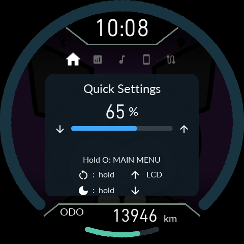
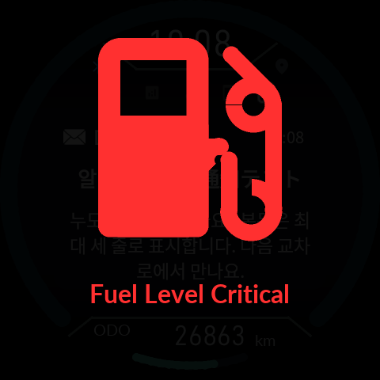
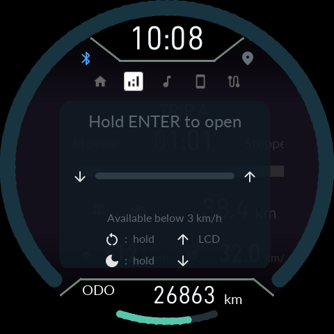

# 0.9.41 validation — state and work ownership

Built from the 0.9.40 source snapshot. This is a software-validated regular
release. It is not a claim that the reported physical lockup was reproduced
and eliminated on the owner's motorcycle.

## What changed

- StorageTask now selects from eleven fixed work slots. Acquired physical work
  drains before an exclusive request can proceed; pending work cannot suspend
  the very dependency it is waiting for.
- RAM log messages and physical NOR writes are distinct. Freeze acknowledgement
  waits for accepted configuration, ride and photo work, including decoding a
  newly stored JPEG generation after its durable acknowledgement.
- General UI press classification belongs to InputRoute. Settings, warnings,
  notification popups and menus consume normalized actions. Owner/context changes
  cancel held presses; overflow resynchronizes without inventing a confirmation.
- A rollback result closes in RAM, independently of acknowledgement persistence.
  A fuel warning takes input priority over historical rollback information.
- Android's service owns the active job and connection epoch. SetupWorkflow
  derives unresolved evidence from installation journals instead of writing a
  second pending flag. Corrupt/unknown and legacy evidence remains protected.
- A negotiated RAM-only operation snapshot gives owner, request identity, phase,
  progress, blocker, observation age and progress age. Legacy STATUS length
  stays unchanged. Snapshots never grant permission to write.

## Ownership and termination

| Owner | Completion / cancellation |
|---|---|
| StorageWork | Physical owner releases at its real safe boundary; timeout never fabricates completion |
| UpdateService | Existing receive, physical verification, commit and reset barriers |
| Gate / BootStore | Existing durable boot journal and confirmation |
| Read audit | 5 s queued / 60 s total; old connection request cannot publish into a new one |
| ProductUI / InputRoute | One input owner and context; closing press cannot reach the lower screen |
| UiState / PowerService / DisplayPower | Desired power, owner ACKs and actual hardware completion stay distinct |
| Android MaintenanceService | One active operation; stale connection completion is rejected |
| InstallJournal | Verified rollback is terminal history; uncertain commit remains unresolved |

Domain hardware/protocol timeouts remain in their existing engines. In operation
detail, a zero common deadline denotes that domain-managed policy. The common
scheduler does not impose an unsafe generic deadline on physical writes.

## Regression evidence

| Test | Result |
|---|---|
| Actual ARM ProductUI → InputRoute → SettingsUI / UiState | 10,000 deterministic sequences, including held key, popup, PH9, overflow and tick wrap |
| Actual StorageWork + StorageJobs, mocked physical owners | 10,000 sequences at O0 and Os; 240,000 assertions per build |
| Android journal/service/install/reconnect tests | 116 passed |
| Android lint | 0 errors / 0 fatal; 133 warnings |
| Product high-speed transport regression | 34 cases / 1,576 assertions |
| Bootstrap standard-speed regression | 6 cases / 58 assertions |
| Gate handoff | 7 cases; journal format unchanged |
| Product install/rollback/journal | 102 scenarios at O0 and Os |
| CFW store | Full optimized persistence suite plus O0/Os save, settings, failure/backpressure and photo mailbox cases |
| Other compiled ARM suites | Buttons, Graphics input, settings UI, ODO, power, display recovery, emergency reset, trial boot, pairing, NOR backup, EVE transport |
| Actual firmware/LVGL/EVE replay | 1203 frames; peak 4756 / 8192 B; 0 active GPU / shade overwrites |
| Pixel comparison | Quick settings: 0 changed pixels; display list 3168 B before and after |

The input and Storage runners execute production C with mocked hardware
boundaries. Android tests execute the Java service/journal paths separately.
This is not one full physical-device end-to-end test. The old eve_state_host
extractor refers to a bitmap-seeding block removed before this release; it did
not pass and is not counted. Current EVE transport and full-frame replay were
used instead. The graphics-input fixture was migrated from removed UI press
fields to the common classifier.

## Resource and performance comparison

| Product | 0.9.40 flash used | 0.9.41 flash used | Free flash | Free SRAM |
|---|---:|---:|---:|---:|
| Debug | 391160 B | 391064 B | 2152 B | 45048 B |
| Release | 357720 B | 358900 B | 34316 B | 44080 B |

Both retain 16,320 B free CCM, the existing heap/stack reservations and compiler
policy. Hard minimums are Debug 2,048 B / Release 4,096 B. Small unaligned
little-endian word accessors now use the compiler's fixed-size memcpy lowering;
data bytes and endianness are unchanged. No asset compression or font/UI quality
reduction was used.

Bootstrap is byte-identical to 0.9.40 (445,172 B; 13,580 B free), and Gate is
byte-identical (23,588 B; 41,948 B free; features 15). The resource container SHA256
remains d5c8d4d27a32df89f303cd86035c79200086306cde241326207eb3b5e332b14e.

Audit result polling changed from 50 ms to 200 ms (nominal 20/s to 5/s while
waiting); optional operation details are limited to 1/s. Idle update/config
housekeeping is bounded by 100 ms and boot housekeeping by 50 ms; ready mailbox
and already acquired work are selected without that periodic delay. Selection
itself is limited to four steps or 2 ms. These are scheduling limits, not measured
radio throughput. We did not measure real RF throughput, LCD FPS, battery drain,
or physical NOR write counts before/after on a motorcycle.

## Compatibility and remaining physical checks

Use the matching APK and ZIP. The Android signing certificate is unchanged.
Gate-compatible 0.9.40 installations use normal Product update. Older Gate
versions retain the explicit keep-data stock/Bootstrap migration path; routine
updates do not overwrite Gate. Settings, photos, maintenance records and pairing
format are unchanged.

The exact reported physical freeze has not been reproduced with an actual
device in this run. Repeat first install, CFW-to-CFW update, rollback/reconnect,
storage stalls and emergency reset on real hardware before treating field
stability as established. Installing this APK does not retrofit new reset/input
code into an old unit that cannot currently accept firmware.

## 한국어 요약

저장 작업의 실제 소유권, 일반 화면의 입력 소유권, 앱의 현재 작업과 과거
설치 기록을 분리했다. 기존 기록 작업이 끝나야 새 설치가 진행되며,
롤백 안내를 닫는 동작은 NOR 확인 기록을 기다리지 않는다. 사진 저장 ACK 뒤
디코드 작업이 빠지는 경계와, 백업 동결 중 새 로그가 저장을 다시 여는 경계도
검사했다. 폰트·지도 렌더러·주행 계산·저장 형식은 변경하지 않았다.

입력과 저장 스케줄러 각각 10,000회 모의 사건 재생, Android 116개
시험, EVE 1203프레임을 검증했다. 실기 무선·LCD·잠긴 구버전 본체의
복구 성공은 이번 소프트웨어 검증과 별개이며 아직 확인하지 못했다.

## EVE software simulation captures

