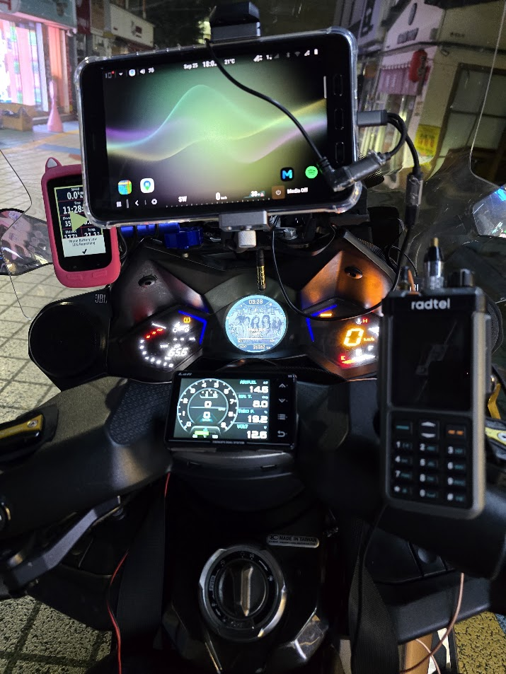
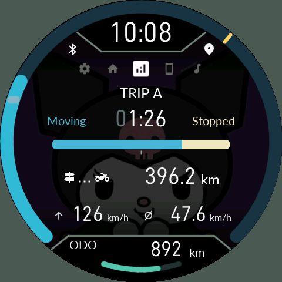

<!-- NOODOE_LATEST_DOWNLOADS_BEGIN -->
# 최신 다운로드

**FuckNudo 0.9.70 — Unshaded ignition-off photo**

- **[Android APK 다운로드](https://github.com/SerialSniffyHeck3r/noodoe_cfw/releases/download/cfw-v0.9.70-off-photo/NoodoeCompanion-0.9.70.apk)**
- **[설치 ZIP 다운로드](https://github.com/SerialSniffyHeck3r/noodoe_cfw/releases/download/cfw-v0.9.70-off-photo/NoodoeInstaller-CFW-0.9.70.zip)**
- [항상 최신 릴리스 보기](https://github.com/SerialSniffyHeck3r/noodoe_cfw/releases/latest)

현재 버전: `cfw-v0.9.70-off-photo`. 위 APK와 ZIP을 한 쌍으로 사용하세요.
Bootstrap 수정이 포함된 업데이트는 해당 릴리스의 설치 순서를 확인하세요.
검증 범위와 알려진 제한은 릴리스 설명에 기록되어 있습니다.
<!-- NOODOE_LATEST_DOWNLOADS_END -->

# FuckNudo CFW

**A custom firmware project to give KYMCO's factory-option Noodoe another life.**

Noodoe arrived in 2017 and spent six or seven years on KYMCO motorcycles. Word is KYMCO will wind down its service in 2027. What, exactly, will still work afterward? Your guess may be as good as mine. The motorcycle itself is still perfectly fine, though, and losing the screen because a service disappears sounded daft. So I started trying to use it again—and adding things I always wished the original had.

There's more inside Noodoe than I expected: an STM32, a graphics controller, a display, storage, and a phone link, all in a system separate from the instrument cluster. I studied the stock firmware, brought the hardware up piece by piece, and built both replacement firmware and an Android companion app. No iPhone app. Blame Apple, not me. lol

Want to actually use it? Start with the [user manual](Projects/Manuals/User/README.en.md), or the [installation and recovery manual](Projects/Manuals/Installation/README.en.md).

**Latest release:** [download the Android APK](https://github.com/SerialSniffyHeck3r/noodoe_cfw/releases/latest/download/NoodoeCompanion-0.9.70.apk) · [download the matching installation ZIP](https://github.com/SerialSniffyHeck3r/noodoe_cfw/releases/latest/download/NoodoeInstaller-CFW-0.9.70.zip) · [release notes](https://github.com/SerialSniffyHeck3r/noodoe_cfw/releases/latest).

## From my research notebook

These are selected notes, not the entire pile. I'll keep updating them as I go.

| Topic | Notes |
|---|---|
| The physical hardware | [Hardware](Projects/documentations/hardware.md) |
| How I picked apart the stock system | [Reverse engineering](Projects/documentations/reverse-engineering.md) |
| Finding hardware in the machine code | [Stock firmware assembly](Projects/documentations/stock-assembly.md) |
| How CFW is built | [Architecture](Projects/documentations/architecture.md) |
| Memory and assets | [Memory map](Projects/documentations/memory-map.md) |
| Installing, rolling back and recovering | [Installer architecture](Projects/documentations/installer.md) |
| Buttons and vehicle data | [Vehicle interface](Projects/documentations/vehicle-interface.md) |
| The dashboard UART, byte by byte | [Vehicle UART](Projects/documentations/vehicle-uart.md) |

[한국어](README.ko.md)

Source code is maintained in a separate private repository. This public repository contains research notes, manuals, screenshots and downloadable releases.

[Display wiring revisions from stock assembly](Projects/documentations/hardware-revisions-0.9.29.en.md)

**Installation manual 0.9.66, revision 1:** [compatible models and limits](Projects/Manuals/Installation/07-Compatibility.en.md) · [install/update/recover](Projects/Manuals/Installation/README.en.md) · [한국어](Projects/Manuals/Installation/README.md). Stock 5.14 or 5.16 is admitted without HW/bootloader-version/model/PCBA whitelists; vehicle validation is listed separately.

Latest: **APK / Product0.9.70**. [Ignition-off photo without shading](Projects/Manuals/User/32-Off-Photo.en.md).

[0.9.69 · Settings catalog update fix](Projects/documentations/settings-catalog-0.9.69.md)

[0.9.70: Ignition-off photo without shading](Projects/documentations/off-photo-0.9.70.md)
