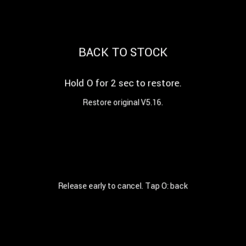

# 12. 캡처 조건, 출처와 적용 범위

[목차](README.md)

## 예시 데이터

설명서용 화면은 실제 사용자의 누적 거리·연락처·알림을 사용하지 않습니다. 시계는 **10:08**입니다. ODO는 지정된 **892 / 6974 / 13946 / 142857 km** 중 재현 가능한 난수로 선택했습니다. 상세 트립과 주행 속도는 시험값이며 정차·설정 진입·시동 종료 화면은 0km/h 조건입니다. Reserve는 **1.1km / 24.8km**로 20km 초과 색상 차이를 보여줍니다.

## 캡처 방식

- 본체: 릴리스에 대응하는 실제 CFW LVGL/EVE 렌더러에 표시 전용 샘플 모델을 입력합니다. 생성된 EVE 명령과 이미지 RAM을 벤치의 EVE에 재생하고 `CMD_SNAPSHOT2`의 480×480 RGB565 출력을 읽습니다. 문서의 값을 실제 계기판 UART·주행 누계·설정 저장소에 주입하지 않습니다.
- 앱: 실제 Android Activity와 텍스트/앨범 표시 코드를 Robolectric Native Graphics에서 실행해 촬영합니다. 설치 각 단계의 상태는 시험값이며 실제 플래시 설치를 반복한 기록이 아닙니다.
- 따라서 본체 그림은 LCD 유리와 백라이트를 카메라로 찍은 사진이 아니며, 설치 화면의 경과 시간/전송률은 실측 성능 보증이 아닙니다.
- 단계별 캡처는 정상 UI 설명을 위한 것이며 오류 주입·무선 연결·실차 전원 차단 시험을 대신하지 않습니다.

## 음악 예시

- **まねきケチャ — 君のいない世界に**, 앨범 **あるわけないの** 초회 B판. [일본 컬럼비아 공식 수록 정보·다섯 멤버의 커버](https://columbia.jp/artist-info/maneki-kecak/discography/COCP-17696.html)
- **Rick Astley — Never Gonna Give You Up**, 앨범 **Whenever You Need Somebody**. [앨범·수록곡 정보](https://music.apple.com/us/album/whenever-you-need-somebody/1559885420)

일반 배경은 사용자가 제공한 쿠로미 이미지입니다. 벤치의 **CFW 사진 슬롯 1**에 ST-LINK와 기존 PhotoStore 요청 경로로 저장했으며, 물리 읽기 대조와 JPEG 전체 디코드가 성공했습니다. 음악 두 화면만 별도 앨범아트를 사용하며 음악 촬영으로 사진 슬롯을 덮어쓰지 않았습니다.

앨범아트는 음악 표시 예시를 위한 해당 작품의 이미지이며 권리는 원권리자에게 있습니다. 오디오 파일과 가사를 배포하지 않습니다. 캡처가 가수나 레이블의 제품 보증·제휴를 뜻하지 않습니다.

## 기능 범위

- Android 1대, Classic SPP. iPhone/MFi, 외장 OBD, 외장 Bluetooth GPS, 휴대전화 임의 터치 리모트는 현재 범위가 아닙니다.
- 기기의 고정 UI는 영어이며 폰 앱은 6개 언어를 지원합니다. 대만어 옵션은 중국어 번체(대만)입니다.
- CJK 음악/알림/전화 이름은 폰에서 렌더링합니다. 이 사실이 모든 본체 고정 문자열/Welcome 이름에 같은 글리프 지원을 보장하지는 않습니다.
- 순정 복귀는 순정 APP과 보존된 공장 정보를 사용합니다. 데이터 유지 복귀는 NOR를 출하 상태로 모두 지우는 기능이 아닙니다.
- 호환되는 Gate·순정 복구본·자산이 필요합니다. 앱/패키지의 실제 검사 결과를 설명서로 우회할 수 없습니다.

설명서 변경 이력: **2026-09-24 — CFW 6.10.0 기준 첫 종합 설명서, APK 6.10.1 바로가기 추가.**

## 추가 화면 자료

